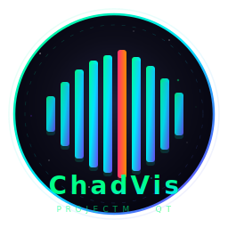

<p align="center">
  
</p>

<h1 align="center">chadvis-projectm-qt: Qt6 projectM v4 Visualizer</h1>

<p align="center">
   <a href="https://github.com/Nsomnia/chadvis-projectm-qt/actions/workflows/ci.yml"></a>
   <a href="https://github.com/Nsomnia/chadvis-projectm-qt/releases"></a>
  
  
</p>

<p align="center">
  <i>The ultimate tool for AI music creators who want to automate dope, milkdrop-style music videos without the hassle.</i>
</p>

---

## 🎵 What is chadvis-projectm-qt?

`chadvis-projectm-qt` is a modern Qt6-based visualizer for projectM v4, built with C++20. It provides a clean, efficient interface for rendering projectM presets with real-time audio visualization.

Key features:
*   **projectM v4 Integration:** Full support for the latest projectM API
*   **Qt6 Native:** Modern Qt6 widgets and OpenGL integration
*   **C++20:** Modern C++ with smart pointers, Result types, and clean architecture
*   **Video Recording:** Built-in FFmpeg-based video export
*   **Overlay Engine:** Text overlays and custom graphics
*   **Arch Linux Optimized:** Designed for the modern Linux desktop

### ✨ Key Features (Because we don't do "basic")

*   **Advanced ProjectM Integration:** Harness the full power of ProjectM for dynamic, psychedelic, and customizable visualizations.
*   **Intuitive Qt6 UI:** A user interface so clean, your grandma could probably use it.
*   **Real-time Audio Analysis:** Analyzes your audio in real-time, feeding delicious data to ProjectM.
*   **Overlay Engine:** Integrate text overlays for wisdom or memes.
*   **Built-in Video Recorder:** Capture your epic visual journeys directly within the app.
*   **Suno AI Integration:** Browse, download, and visualize your Suno AI clips.
*   **Configurable to the Max:** Tweak every knob, slide every slider.

---

## 🛠️ Get That Vibe: Building from Source

You use Arch, BTW. So building from source is practically foreplay.

### Prerequisites

*   **CMake** (>= 3.20)
*   **Qt6** (Core, Gui, Widgets, Multimedia, OpenGLWidgets, Svg, Network, Sql)
*   **spdlog**, **fmt**, **taglib**, **toml++**, **GLEW**, **GLM**, **FFmpeg**, **ProjectM-4**, **SQLite3**

On Arch Linux:
```bash
sudo pacman -S cmake qt6-base qt6-multimedia qt6-svg spdlog fmt taglib \
    tomlplusplus glew glm ffmpeg libprojectM sqlite
```

### Compilation

```bash
git clone https://github.com/Nsomnia/chadvis-projectm-qt.git
cd chadvis-projectm-qt
./build.sh build
```

---

## 📖 Documentation

*   [**Internal Architecture**](docs/ARCHITECTURE.md)
*   [**Agent Quickstart**](docs/AGENT_QUICKSTART.md)
*   [**Suno AI Integration**](docs/SUNO_INTEGRATION.md)

---

## 🧠 Configuration

ChadVis uses `toml++` for configuration. Config files are stored in `~/.config/chadvis-projectm-qt/config.toml`.

---

## Known Issues

- The package executable can sometimes take significant time to fully launch the Qt GUI. It is likely scanning song databases or scanning thousands of visualzier shader presets. It should launch eventually and performance will be tackled when time and token allowances permit.

---

## 🤝 Contributing

Think you can make ChadVis even more Chad-tier? Prove it. We welcome contributions that meet our high standards.

---

## 📜 License

This project is licensed under the MIT License.
```
┌──────────────────────────────────────────────────────────────────────┐
│:'######::'##::::'##::::'###::::'########::'##::::'##:'####::'######::│
│'##... ##: ##:::: ##:::'## ##::: ##.... ##: ##:::: ##:. ##::'##... ##:│
│ ##:::..:: ##:::: ##::'##:. ##:: ##:::: ##: ##:::: ##:: ##:: ##:::..::│
│ ##::::::: #########:'##:::. ##: ##:::: ##: ##:::: ##:: ##::. ######::│
│ ##::::::: ##.... ##: #########: ##:::: ##:. ##:: ##::: ##:::..... ##:│
│ ##::: ##: ##:::: ##: ##.... ##: ##:::: ##::. ## ##:::: ##::'##::: ##:│
│. ######:: ##:::: ##: ##:::: ##: ########::::. ###::::'####:. ######::│
│:......:::..:::::..::..:::::..::........::::::...:::::....:::......:::│
└──────────────────────────────────────────────────────────────────────┘
```