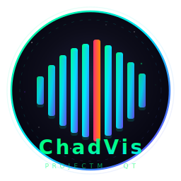

<p align="center">
  
</p>

<h1 align="center">ChadVis: The Ultimate projectM Visualizer for the Elite</h1>

<p align="center">
   <a href="https://github.com/Nsomnia/chadvis-projectm-qt/actions/workflows/ci.yml"></a>
  
  
</p>

---

> "I'm not saying this is better than sex, but I've never had sex that supported projectM v4 presets with zero-copy PBO frame capture." — *Some Senior Dev who definitely uses Arch, btw.*

## 🚀 Listen up, Chads.

If you're still using a visualizer foe you ai music video needs that doesn't utilize **C++23** with CPM and **Qt6** with suno.com integration with hidden features the devs require signing a NDA 5o use, are you even living? `chadvis-projectm-qt` is not just a visualizer; it's a statement. It's for the people who want their music to look as good as their dotfiles. Whether you're an AI music creator using Suno or just someone who enjoys staring at Milkdrop presets until you see the face of a GNU monk, we've got you covered.

### 🌟 Why this is better than whatever you're using:

| Feature | The Chad Way | The "Other" Way |
| :--- | :--- | :--- |
| **Language** | C++23 (Pure Power) | Legacy Garbage |
| **Visuals** | projectM v4 (Milkdrop) | Flat static album art |
| **Recording** | FFmpeg with HW Accel | Recording your screen with a phone |
| **AI Integration** | Native Suno AI support | Copy-pasting URLs like a peasant |
| **Flex Factor** | High (Arch BTW) | Non-existent KK&D n00bz|

---

## 🛠️ Get It Running (The "Arch BTW" Guide)

We don't do "one-click installers" here. We build from source because we respect our hardware.

### Prerequisites

You need the good stuff. If you're on Arch:

```bash
sudo pacman -S cmake qt6-base qt6-multimedia qt6-svg spdlog fmt taglib \
    tomlplusplus glew glm ffmpeg libprojectM sqlite
```

### The "Linus Tech Tips" Quick Build

1. **Clone it**: `git clone https://github.com/Nsomnia/chadvis-projectm-qt.git`
2. **Enter the Cave**: `cd chadvis-projectm-qt`
3. **Smash that Build Button, son (the the github ⭐ star button)**: `./build.sh build`

---

## 🗣️ The Council of Elders (Dev Banter)

**Linus (The Arch Chad):** "Look, the build script is Zsh-native. If you're using Bash, you're literally living in the stone age. I've optimized the PBO capture so hard it'll make your 4090 sweat... then let's distill that sweat for fun"

**Linus (LTT Version):** "Speaking of sweat, this visualizer is *smooth*! But you know what else is smooth? **Our sponsor, Glasswire!** Just kidding, but seriously, the UI is glassmorphism-tier and the Suno integration is a total game changer for my Lo-Fi beats stream."

**Richard (The GNU Monk):** *(Chanting)* "GNU is not Unix... but this software... it is MIT licensed? I sense a disturbance in the freedom. Where are the GPLv3 headers? Why are we discussing 'GPU acceleration' without mentioning the non-free drivers required to run them? We must chant for the liberation of the blobs!"

**Senior Dev:** "Shut up, Richard. We're using C++23 `std::pimp_thread` and RAII everywhere. It's clean code. It's art. Now go back to your Emacs buffers while I enjoy these 144FPS Milkdrop presets. Shut up I <3 nano for life dawg!"

---

## 📖 Knowledge is Power

Don't just poke at it. Read the manual. It's not a monolith; it's a modular masterpiece.

*   [**The Grand Index**](docs/INDEX.md) - Start here.
*   [**User Lore**](docs/user/USAGE.md) - How to actually use this thing.
*   [**Dev Chronicles**](docs/dev/ARCHITECTURE.md) - How we built this beast.
*   [**Philosophical Manifestos**](docs/lore/MANIFESTO.md) - Why we bicker.

---

## 🤝 Contributing

Think you're a 10x developer? Prove it. Send a PR. Just make sure your code is as clean as a freshly formatted NVMe drive. No exceptions, only `vc::Result<T>`.

## 📜 License

MIT. Because we're not as restrictive as Richard wants us to be, but we still love freedom.
