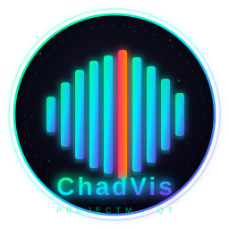

<p align="center">

</p>

<h1 align="center">ChadVis: The Suno Frontend for the Elite</h1>

<p align="center">
   <a href="https://github.com/Nsomnia/chadvis-projectm-qt/actions/workflows/ci.yml"></a>
  
  
</p>

---

> "I'm not saying this is better than sex, but I've never had sex that supported projectM v4 presets with zero-copy PBO frame capture." — *Some Senior Dev who definitely uses Arch, btw.*

## 🚀 What is this?

ChadVis is a native **C++23 / Qt6 desktop frontend for [suno.com](https://suno.com)**. It talks to the Suno remote API directly (documented in exhaustive reverse-engineered detail under [`docs/suno_api/`](docs/suno_api/README.md)) and layers local superpowers on top that the web app can only dream of: a full **projectM v4** visualizer with Milkdrop preset support, word-synced **karaoke lyrics**, hardware-accelerated **FFmpeg recording**, and an offline SQLite library cache.

| Feature | The Chad Way | The "Other" Way |
| :--- | :--- | :--- |
| **Language** | C++23 (Pure Power) | Legacy Garbage |
| **Visuals** | projectM v4 (Milkdrop) | Flat static album art |
| **Recording** | FFmpeg with HW Accel | Recording your screen with a phone |
| **AI Integration** | Native Suno API client | Copy-pasting URLs like a peasant |
| **Flex Factor** | High (Arch BTW) | Non-existent KK&D n00bz|

## 🛠️ Quick Start

We build from source because we respect our hardware. Full prerequisites and platform notes live in the **[Installation Guide](docs/user/INSTALL.md)**; the short version:

```bash
git clone https://github.com/Nsomnia/chadvis-projectm-qt.git
cd chadvis-projectm-qt
./build.sh build
```

(Arch users: `./build.sh` will nag you about missing pacman packages if you skip reading INSTALL.md. Don't skip it.)

## 📖 Documentation

The canonical table of contents is **[docs/INDEX.md](docs/INDEX.md)**. Major sections:

| Section | Start Here | Contents |
| :--- | :--- | :--- |
| **User** | [docs/user/](docs/user/INSTALL.md) | Installation, configuration, usage & hotkeys |
| **Dev** | [docs/dev/ARCHITECTURE.md](docs/dev/ARCHITECTURE.md) | Architecture, QML/UI layer, contributing standards, testing |
| **API** | [docs/suno_api/README.md](docs/suno_api/README.md) | Reverse-engineered Suno API reference (auth, generation, library, billing, B-side…) |
| **Integration** | [docs/integration/INDEX.md](docs/integration/INDEX.md) | Suno integration deep-dive, projectM v4 bridge internals |
| **Lore** | [docs/lore/MANIFESTO.md](docs/lore/MANIFESTO.md) | The manifesto, project history, and dev banter |
| **Changelog** | [CHANGELOG_CURRENT.md](CHANGELOG_CURRENT.md) | What's new and what's broken |

## 🤝 Contributing

Think you're a 10x developer? Prove it. Read [docs/dev/CONTRIBUTING.md](docs/dev/CONTRIBUTING.md), send a PR, and make sure your code is as clean as a freshly formatted NVMe drive. No exceptions, only `vc::Result<T>`.

## 📜 License

MIT. Because we're not as restrictive as Richard wants us to be, but we still love freedom.
