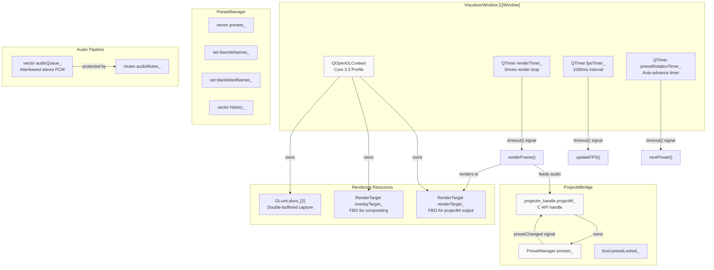
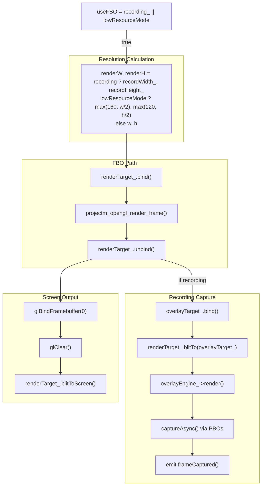
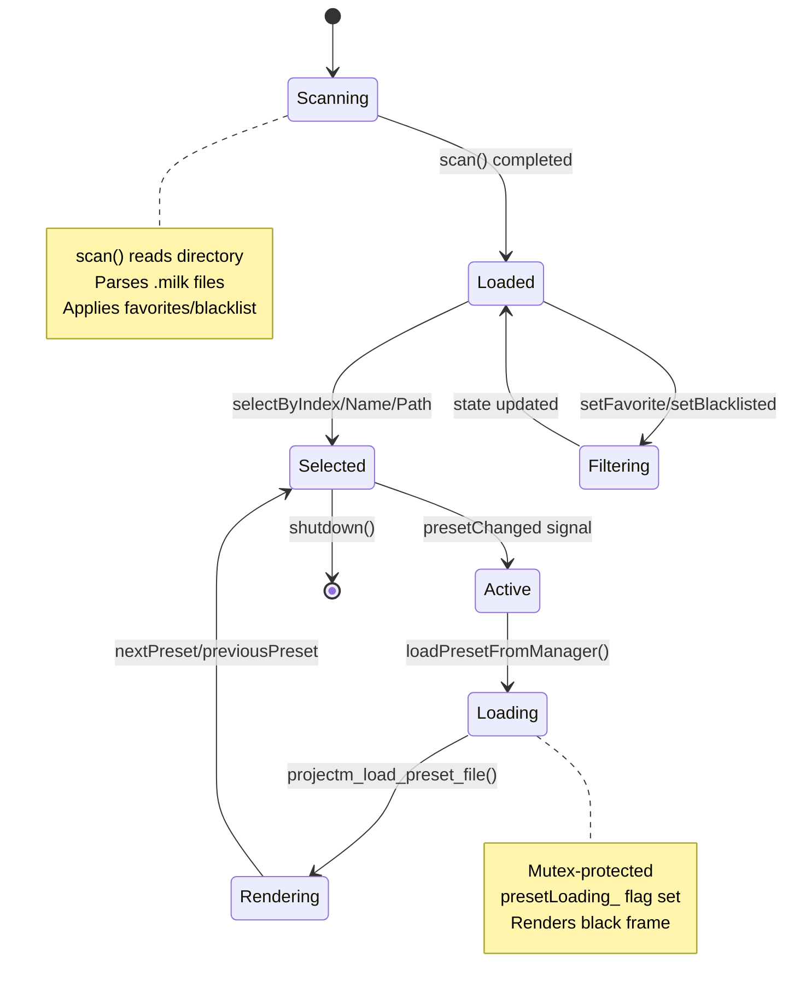
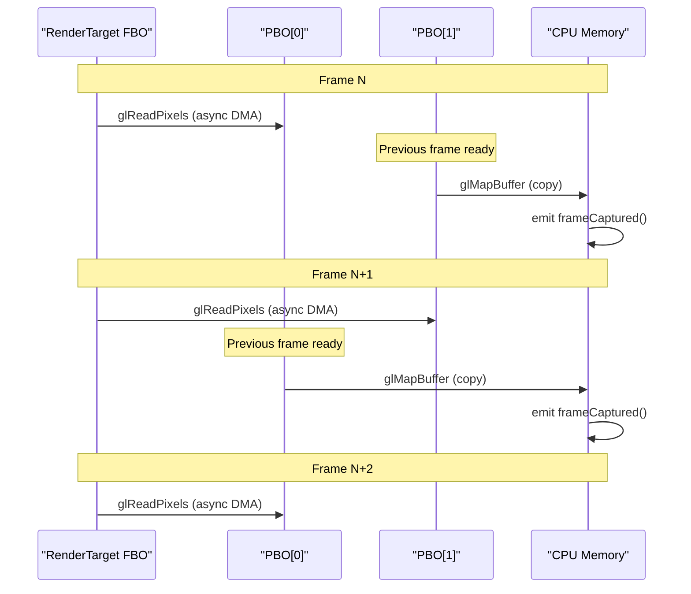

# Visualization System

<details>
<summary>Relevant source files</summary>

The following files were used as context for generating this wiki page:

- [AGENTS.md](AGENTS.md)
- [src/ui/VisualizerPanel.cpp](src/ui/VisualizerPanel.cpp)
- [src/visualizer/PresetManager.cpp](src/visualizer/PresetManager.cpp)
- [src/visualizer/PresetManager.hpp](src/visualizer/PresetManager.hpp)
- [src/visualizer/ProjectMBridge.cpp](src/visualizer/ProjectMBridge.cpp)
- [src/visualizer/VisualizerWindow.cpp](src/visualizer/VisualizerWindow.cpp)
- [src/visualizer/VisualizerWindow.hpp](src/visualizer/VisualizerWindow.hpp)

</details>


## Purpose and Scope

The Visualization System transforms audio spectrum data into real-time graphics using the projectM v4 library. It manages the OpenGL rendering pipeline, preset (.milk file) selection and loading, frame capture for video recording, and user interaction with the visualizer display.

This page covers the high-level architecture and data flow through the visualization pipeline. For details on the OpenGL rendering window and frame capture mechanics, see [VisualizerWindow](#4.1). For projectM library integration specifics, see [ProjectM Integration](#4.2). For preset file management, see [Preset Management](#4.3).

## System Architecture

The Visualization System consists of three primary components working in coordination:

| Component | Responsibility |
|-----------|---------------|
| `VisualizerWindow` | QWindow with OpenGL context, orchestrates rendering loop and frame capture |
| `ProjectMBridge` | Wraps projectM v4 C API, manages audio feeding and preset loading |
| `PresetManager` | Scans, filters, and navigates .milk preset files |

Additional supporting components include `RenderTarget` for FBO management, PBOs for asynchronous frame capture, and integration points with `OverlayEngine` for text compositing.

**System Component Relationships**



Sources: [src/visualizer/VisualizerWindow.hpp:23-122](), [src/visualizer/ProjectMBridge.cpp:1-170](), [src/visualizer/PresetManager.hpp:1-109]()

## Audio-to-Visual Data Flow

Audio spectrum data flows from `AudioEngine` to the visualizer through a queued pipeline. The `VisualizerWindow` receives PCM samples via `feedAudio()`, buffers them in a thread-safe queue, and feeds calculated frame counts to projectM's analysis engine.

**Audio Feeding Pipeline**

```mermaid
flowchart LR
    subgraph "AudioEngine"
        PCM_OUT["PCM f32 samples<br/>Interleaved stereo"]
    end
    
    subgraph "VisualizerWindow"
        FEED_AUDIO["feedAudio()<br/>line 290-300"]
        MUTEX["std::lock_guard<br/>audioMutex_"]
        QUEUE["audioQueue_<br/>vector<f32>"]
    end
    
    subgraph "Render Loop"
        RENDER_FRAME["renderFrame()<br/>line 133-237"]
        CALC_FRAMES["Calculate frames to feed<br/>(sampleRate + fps - 1) / fps"]
        FEED_PM["projectM_.addPCMDataInterleaved()<br/>line 160-162"]
    end
    
    subgraph "ProjectMBridge"
        ADD_PCM["addPCMDataInterleaved()<br/>line 90-99"]
        PM_API["projectm_pcm_add_float()<br/>C API call"]
    end
    
    subgraph "projectM v4 Library"
        SPECTRUM["Spectrum Analysis<br/>FFT + Beat Detection"]
        PRESETS["Preset Rendering<br/>Math expressions"]
    end
    
    PCM_OUT --> FEED_AUDIO
    FEED_AUDIO --> MUTEX
    MUTEX --> QUEUE
    
    RENDER_FRAME -->|"lock audioMutex_"| QUEUE
    QUEUE --> CALC_FRAMES
    CALC_FRAMES --> FEED_PM
    FEED_PM --> ADD_PCM
    ADD_PCM --> PM_API
    
    PM_API --> SPECTRUM
    SPECTRUM --> PRESETS
```



Sources: [src/visualizer/VisualizerWindow.cpp:153-166](), [src/visualizer/VisualizerWindow.cpp:290-300](), [src/visualizer/ProjectMBridge.cpp:90-99]()

The frame calculation uses the formula `(audioSampleRate + targetFps - 1) / targetFps` to determine how many audio frames to feed per video frame. This ensures projectM always has sufficient audio data for smooth spectrum analysis, even when frame rates and sample rates don't divide evenly.

## Rendering Modes

`VisualizerWindow` supports two rendering paths, selected dynamically based on system state:

### Direct Rendering (Peak Performance Mode)

When not recording and `lowResourceMode` is disabled, projectM renders directly to the default framebuffer. This path eliminates FBO overhead and achieves maximum frame rates.

```cpp
// Direct rendering path
projectM_.resetViewport(w, h);
projectM_.render();
```

Sources: [src/visualizer/VisualizerWindow.cpp:215-229]()

### FBO Rendering (Recording/Low Resource Mode)

When recording or in low resource mode, projectM renders to an offscreen FBO. This enables:
- Resolution-independent recording (e.g., render at 1920x1080 regardless of window size)
- Downscaled rendering for performance (e.g., render at half resolution when CPU-bound)
- Frame capture via PBOs without stalling the GPU

The system uses two FBOs:
- `renderTarget_`: projectM output with depth buffer [src/visualizer/VisualizerWindow.cpp:96]()
- `overlayTarget_`: Compositing target without depth buffer [src/visualizer/VisualizerWindow.cpp:97]()

Sources: [src/visualizer/VisualizerWindow.cpp:139-214]()

**FBO Rendering Flow**



Sources: [src/visualizer/VisualizerWindow.cpp:168-214]()

The FBO path conditionally resizes render targets when dimensions change, ensuring projectM's internal state remains synchronized with the render resolution [src/visualizer/VisualizerWindow.cpp:170-174]().

## Preset Management

Presets are `.milk` files containing math expressions and rendering parameters that define visual styles. The `PresetManager` class handles discovery, filtering, and navigation of preset libraries.

**Preset Lifecycle**



Sources: [src/visualizer/PresetManager.cpp:12-71](), [src/visualizer/VisualizerWindow.cpp:357-382]()

### Preset Selection and History

`PresetManager` maintains a navigation history with forward/backward support. When `selectByIndex()` is called, the index is appended to history unless navigating through existing history entries [src/visualizer/PresetManager.cpp:125-155]().

```cpp
// History-aware navigation
if (!history_.empty() && historyPosition_ < history_.size() - 1) {
    historyPosition_++;
    currentIndex_ = history_[historyPosition_];
}
```

Sources: [src/visualizer/PresetManager.cpp:260-267]()

### Favorites and Blacklisting

Preset states persist to `preset_state.txt` in INI-style format:

```
[favorites]
preset_name_1
preset_name_2

[blacklist]
broken_preset_name
```

The system uses `std::set<std::string>` for O(log n) lookups when filtering active presets [src/visualizer/PresetManager.hpp:102-103]().

Sources: [src/visualizer/PresetManager.cpp:414-464]()

## Initialization Sequence

The `VisualizerWindow` initialization follows a strict ordering to ensure OpenGL resources are created in a valid context:

| Step | Function | Action |
|------|----------|--------|
| 1 | `exposeEvent()` | Triggers initialization when window becomes visible |
| 2 | `initialize()` | Creates OpenGL context and makes it current |
| 3 | GLEW init | Loads OpenGL extensions via `glewInit()` |
| 4 | `projectM_.init()` | Creates projectM handle, loads presets |
| 5 | FBO creation | `renderTarget_.create()` with depth, `overlayTarget_.create()` without |
| 6 | Timer start | `renderTimer_.start()`, `fpsTimer_.start()`, optional `presetRotationTimer_` |
| 7 | Context release | `context_->doneCurrent()` before returning to event loop |

Sources: [src/visualizer/VisualizerWindow.cpp:44-114]()

**OpenGL Context Configuration**

The context uses OpenGL 3.3 Core profile with double buffering and 4x MSAA:

```cpp
QSurfaceFormat format;
format.setVersion(3, 3);
format.setProfile(QSurfaceFormat::CoreProfile);
format.setSwapBehavior(QSurfaceFormat::DoubleBuffer);
format.setSwapInterval(1);  // VSync
format.setSamples(4);        // 4x MSAA
format.setDepthBufferSize(24);
```

Sources: [src/visualizer/VisualizerWindow.cpp:15-23]()

## Recording Integration

When recording starts, `VisualizerWindow` switches to FBO rendering mode and allocates double-buffered PBOs for asynchronous frame capture. The PBO system eliminates GPU stalls by allowing the CPU to read from one PBO while the GPU writes to the other.

**Double-Buffered PBO Capture**



Sources: [src/visualizer/VisualizerWindow.cpp:258-288]()

The `captureAsync()` function implements the ping-pong buffer pattern:

```cpp
u32 nextIndex = (pboIndex_ + 1) % 2;
glBindBuffer(GL_PIXEL_PACK_BUFFER, pbos_[pboIndex_]);
glReadPixels(0, 0, recordWidth_, recordHeight_, GL_RGBA, GL_UNSIGNED_BYTE, nullptr);

if (pboAvailable_) {
    glBindBuffer(GL_PIXEL_PACK_BUFFER, pbos_[nextIndex]);
    u8* ptr = (u8*)glMapBuffer(GL_PIXEL_PACK_BUFFER, GL_READ_ONLY);
    if (ptr) {
        std::vector<u8> buffer(ptr, ptr + size);
        glUnmapBuffer(GL_PIXEL_PACK_BUFFER);
        emit frameCaptured(std::move(buffer), recordWidth_, recordHeight_, timestamp);
    }
}
pboIndex_ = nextIndex;
pboAvailable_ = true;
```

Sources: [src/visualizer/VisualizerWindow.cpp:258-288]()

## Performance Characteristics

### Frame Rate Management

The render timer interval directly controls visualization frame rate. When `setRenderRate(fps)` is called, it configures both the `renderTimer_` period and projectM's internal FPS setting:

```cpp
renderTimer_.start(1000 / fps);
projectM_.setFPS(fps);
```

Sources: [src/visualizer/VisualizerWindow.cpp:302-309]()

The `fpsTimer_` runs independently at 1-second intervals to calculate actual achieved frame rate, which may differ from target FPS due to system load [src/visualizer/VisualizerWindow.cpp:351-355]().

### Low Resource Mode

When `CONFIG.visualizer().lowResourceMode` is enabled, render resolution is halved with a minimum floor:

```cpp
renderW = std::max(160u, w / 2);
renderH = std::max(120u, h / 2);
```

This reduces GPU fill rate requirements by approximately 75% while maintaining acceptable visual quality on lower-end hardware.

Sources: [src/visualizer/VisualizerWindow.cpp:147-150]()

## Configuration Integration

Visualization settings are read from the `CONFIG.visualizer()` section and applied during initialization and via `updateSettings()`:

| Config Field | Usage | Applied Via |
|--------------|-------|-------------|
| `fps` | Render timer interval | `setRenderRate()` |
| `beatSensitivity` | projectM beat detection threshold | `projectm_set_beat_sensitivity()` |
| `presetPath` | Directory to scan for .milk files | `PresetManager::scan()` |
| `presetDuration` | Auto-advance interval (seconds) | `presetRotationTimer_.setInterval()` |
| `smoothPresetDuration` | Transition fade time | `projectm_set_soft_cut_duration()` |
| `shufflePresets` | Random vs sequential selection | `PresetManager::selectRandom()` or `selectNext()` |
| `useDefaultPreset` | Skip preset loading, use built-in | Skips `PresetManager` operations |
| `lowResourceMode` | Enable half-resolution rendering | FBO size calculation |

Sources: [src/visualizer/VisualizerWindow.cpp:75-99](), [src/visualizer/VisualizerWindow.cpp:384-396]()

## User Interaction

`VisualizerWindow` handles keyboard and mouse events for direct visualizer control:

**Keyboard Shortcuts**

| Key | Action | Implementation |
|-----|--------|----------------|
| F11 or configured key | Toggle fullscreen | `toggleFullscreen()` |
| Right arrow or configured | Next preset | `projectM_.nextPreset()` |
| Left arrow or configured | Previous preset | `projectM_.previousPreset()` |
| R | Random preset | `projectM_.randomPreset()` |
| L | Lock/unlock preset | `projectM_.lockPreset(!locked)` |
| Escape (in fullscreen) | Exit fullscreen | `toggleFullscreen()` |

**Mouse Interaction**

Double-clicking the visualizer window toggles fullscreen mode [src/visualizer/VisualizerWindow.cpp:419-423]().

Sources: [src/visualizer/VisualizerWindow.cpp:398-423]()

## Signal Emissions

`VisualizerWindow` emits several Qt signals for UI synchronization:

| Signal | Emitted When | Typical Handler |
|--------|--------------|-----------------|
| `presetNameUpdated(QString)` | Preset finishes loading | Updates `VisualizerPanel` label |
| `frameReady()` | Frame render completes during recording | Signals recording system |
| `frameCaptured(vector<u8>, u32, u32, i64)` | PBO capture completes | Queues frame to `VideoRecorder` |
| `fpsChanged(f32)` | FPS timer ticks (1 Hz) | Updates FPS display |

Additionally, `ProjectMBridge` uses custom `Signal<T>` for non-QObject communication:
- `ProjectMBridge::presetChanged`: Emitted when preset selection changes [src/visualizer/ProjectMBridge.cpp:131]()
- `PresetManager::presetChanged`: Emitted when current preset updates [src/visualizer/PresetManager.cpp:151]()
- `PresetManager::listChanged`: Emitted when preset list is modified [src/visualizer/PresetManager.cpp:68]()

Sources: [src/visualizer/VisualizerWindow.hpp:26-33](), [src/visualizer/ProjectMBridge.cpp:127-132](), [src/visualizer/PresetManager.cpp:66-71]()