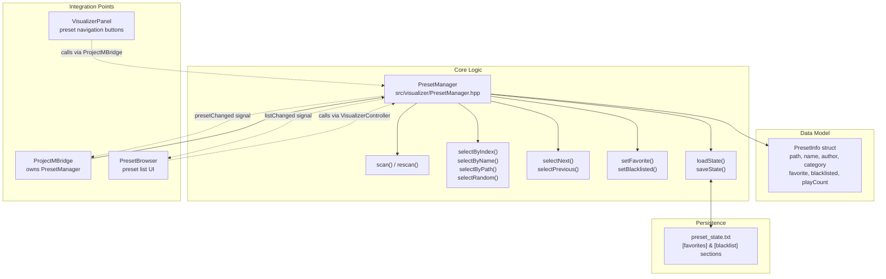
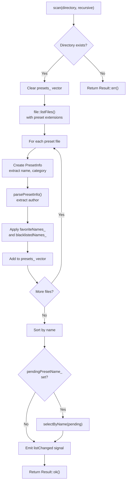
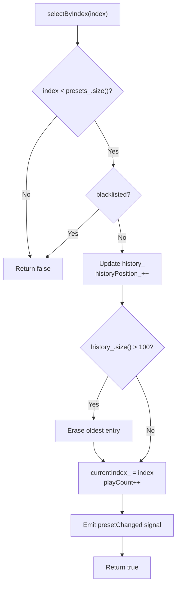
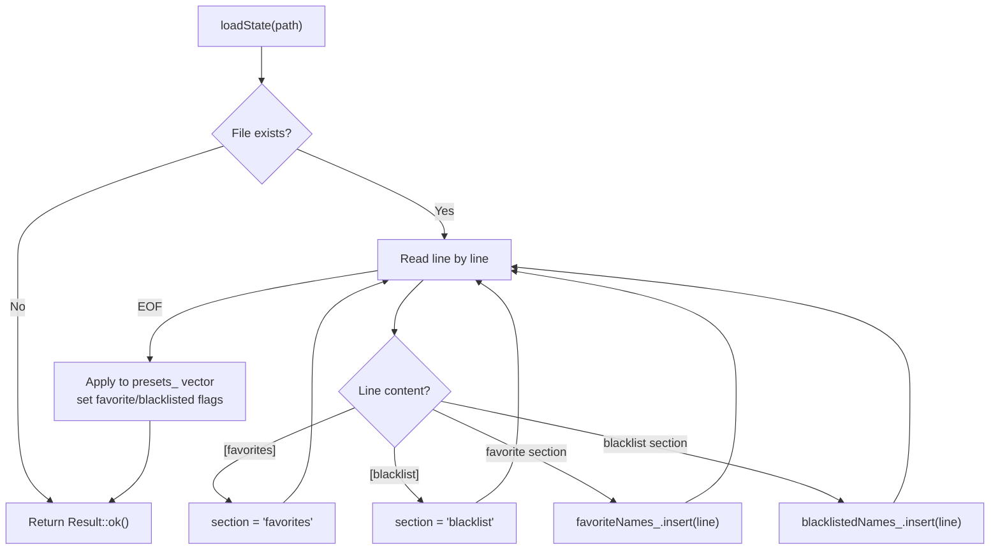

# Preset Management

<details>
<summary>Relevant source files</summary>

The following files were used as context for generating this wiki page:

- [src/ui/VisualizerPanel.cpp](src/ui/VisualizerPanel.cpp)
- [src/visualizer/PresetManager.cpp](src/visualizer/PresetManager.cpp)
- [src/visualizer/PresetManager.hpp](src/visualizer/PresetManager.hpp)
- [src/visualizer/ProjectMBridge.cpp](src/visualizer/ProjectMBridge.cpp)

</details>


## Purpose and Scope

This document describes the preset management system responsible for discovering, organizing, and selecting projectM visualization presets (`.milk` and `.prjm` files). The `PresetManager` class provides functionality for scanning preset directories, maintaining favorites and blacklists, navigating preset history, and persisting user preferences to disk.

For information about the projectM v4 integration that consumes presets, see [ProjectM Integration](#4.2). For details about the visualization window that displays presets, see [VisualizerWindow](#4.1).

---

## System Architecture

The preset management system consists of three primary components: the `PresetManager` class for business logic, the `PresetInfo` struct for metadata storage, and integration points with `ProjectMBridge` and UI widgets.

**Diagram: Preset Management Architecture**



**Sources:** [src/visualizer/PresetManager.hpp:1-109](), [src/visualizer/PresetManager.cpp:1-467](), [src/visualizer/ProjectMBridge.cpp:1-171]()

---

## PresetInfo Data Structure

The `PresetInfo` struct encapsulates metadata for a single preset file. Each preset is represented by an instance of this struct within the `PresetManager`.

| Field | Type | Description |
|-------|------|-------------|
| `path` | `fs::path` | Absolute filesystem path to the preset file |
| `name` | `std::string` | Display name (extracted from filename stem) |
| `author` | `std::string` | Author name (parsed from filename pattern "Author - Name") |
| `category` | `std::string` | Category name (parent directory relative to scan root) |
| `favorite` | `bool` | Whether the preset is marked as favorite |
| `blacklisted` | `bool` | Whether the preset is blacklisted (excluded from selection) |
| `playCount` | `u32` | Number of times the preset has been selected |

The `parsePresetInfo()` method attempts to extract author information from filenames matching the pattern `^(.+?)\s*-\s*(.+)$`. Categories are automatically assigned based on the preset file's parent directory relative to the scan root, with uncategorized files assigned to "Uncategorized".

**Sources:** [src/visualizer/PresetManager.hpp:14-22](), [src/visualizer/PresetManager.cpp:400-412]()

---

## Preset Scanning and Discovery

### Scanning Process

The `PresetManager::scan()` method recursively discovers preset files within a specified directory. The scanning process follows this workflow:

**Diagram: Preset Scanning Workflow**



**Sources:** [src/visualizer/PresetManager.cpp:12-71]()

### File Discovery

Preset files are discovered using `file::listFiles()` from the utility layer, which supports multiple preset extensions defined in `file::presetExtensions`. The scan can be performed recursively or non-recursively based on the `recursive` parameter.

**Sources:** [src/visualizer/PresetManager.cpp:21]()

### Category Assignment

Categories are derived from the directory structure. For a preset at path `/presets/Ambient/Calm Waves.milk` with scan directory `/presets`, the category would be `Ambient`. Files directly in the scan directory receive the category `Uncategorized`.

**Sources:** [src/visualizer/PresetManager.cpp:28-32]()

### Integration with ProjectMBridge

The `ProjectMBridge` initializes the `PresetManager` during its own initialization:

```cpp
// From ProjectMBridge::init()
if (!config.presetPath.empty() && fs::exists(config.presetPath)) {
    presets_.scan(config.presetPath);
    presets_.loadState(file::configDir() / "preset_state.txt");
}
```

After scanning, if a forced preset name is specified via configuration, the manager attempts to select it. Otherwise, it selects a random preset (if shuffle is enabled) or the first preset in the sorted list.

**Sources:** [src/visualizer/ProjectMBridge.cpp:36-51]()

---

## Preset Selection Mechanisms

The `PresetManager` provides multiple selection methods to accommodate different use cases:

### Selection Methods

| Method | Purpose | Behavior |
|--------|---------|----------|
| `selectByIndex(usize)` | Direct index selection | Selects preset at specified index if not blacklisted, updates history |
| `selectByName(string)` | Name-based selection | Searches by exact match, then partial match, then case-insensitive match |
| `selectByPath(fs::path)` | Path-based selection | Finds preset matching exact filesystem path |
| `selectRandom()` | Random selection | Randomly selects from active (non-blacklisted) presets |
| `selectNext()` | Forward navigation | Advances to next non-blacklisted preset, uses history if available |
| `selectPrevious()` | Backward navigation | Returns to previous preset in history or cycles backward |

**Diagram: Selection Method Flow**



**Sources:** [src/visualizer/PresetManager.cpp:125-155]()

### Name-Based Selection Strategy

The `selectByName()` method implements a fallback search strategy to maximize the chance of finding a preset:

1. **Exact match**: Compare against `PresetInfo::name` exactly
2. **Partial match**: Check if preset name contains the search string
3. **Case-insensitive match**: Convert both strings to lowercase and check containment

If no presets are loaded when `selectByName()` is called, the name is stored in `pendingPresetName_` and applied automatically after the next `scan()` operation.

**Sources:** [src/visualizer/PresetManager.cpp:157-218]()

### Random Selection

Random selection uses `std::mt19937` with `std::uniform_int_distribution` to select from the active preset pool (excluding blacklisted presets). The random number generator is seeded from `std::random_device` at construction.

**Sources:** [src/visualizer/PresetManager.hpp:106](), [src/visualizer/PresetManager.cpp:235-250]()

---

## History Navigation

The `PresetManager` maintains a navigation history to support browser-like forward/back behavior. History is implemented as a vector of indices with a position cursor.

### History Data Structures

```cpp
// From PresetManager class
std::vector<usize> history_;      // Stack of selected preset indices
usize historyPosition_{0};         // Current position in history
```

### History Management Rules

1. **Adding to history**: When `selectByIndex()` is called and the selected index differs from the current history position, the new index is appended
2. **Clearing forward history**: If the user selects a new preset while positioned in the middle of history, all forward entries are discarded
3. **History limit**: The history is capped at 100 entries; the oldest entry is removed when this limit is exceeded
4. **Navigation behavior**: 
   - `selectNext()` advances `historyPosition_` if forward history exists
   - `selectPrevious()` decrements `historyPosition_` if backward history exists
   - If no history is available, these methods fall back to linear iteration

**Sources:** [src/visualizer/PresetManager.hpp:99-100](), [src/visualizer/PresetManager.cpp:131-147](), [src/visualizer/PresetManager.cpp:260-267](), [src/visualizer/PresetManager.cpp:297-304]()

---

## Favorites and Blacklist System

The preset management system supports user curation through favorites and blacklists. These features are implemented using string sets that store preset names rather than indices, ensuring persistence across rescans.

### Data Structures

```cpp
std::set<std::string> favoriteNames_;     // Preset names marked as favorite
std::set<std::string> blacklistedNames_;  // Preset names excluded from selection
```

### Modification Methods

| Method | Description |
|--------|-------------|
| `setFavorite(index, bool)` | Marks preset as favorite or removes favorite status |
| `setBlacklisted(index, bool)` | Marks preset as blacklisted or removes blacklist status |
| `toggleFavorite(index)` | Toggles favorite status for preset at index |
| `toggleBlacklisted(index)` | Toggles blacklist status for preset at index |

All modification methods emit the `listChanged` signal to notify observers (typically UI widgets) that the preset list has been updated.

### Filtered Access Methods

```cpp
std::vector<const PresetInfo*> activePresets() const;    // Non-blacklisted only
std::vector<const PresetInfo*> favoritePresets() const;  // Favorites that aren't blacklisted
usize activeCount() const;                               // Count excluding blacklisted
```

**Sources:** [src/visualizer/PresetManager.hpp:102-103](), [src/visualizer/PresetManager.cpp:326-362](), [src/visualizer/PresetManager.cpp:85-109]()

---

## State Persistence

User preferences (favorites and blacklists) are persisted to `preset_state.txt` in the configuration directory. The file format is a simple INI-style format with two sections.

### File Format

```
[favorites]
preset_name_1
preset_name_2

[blacklist]
preset_name_3
preset_name_4
```

### Loading State

The `loadState()` method reads the state file and populates the `favoriteNames_` and `blacklistedNames_` sets. After loading, it iterates through all loaded presets and applies the saved state by setting the `favorite` and `blacklisted` fields.

**Diagram: State Loading Process**



**Sources:** [src/visualizer/PresetManager.cpp:414-445]()

### Saving State

The `saveState()` method writes the current `favoriteNames_` and `blacklistedNames_` sets to disk in the same INI-style format. This method is called automatically during `ProjectMBridge::shutdown()`.

**Sources:** [src/visualizer/PresetManager.cpp:447-464](), [src/visualizer/ProjectMBridge.cpp:56-62]()

### Integration with Configuration System

The state file path is constructed using the utility function `file::configDir()`, which returns the application's configuration directory (typically `~/.config/chadvis-projectm-qt/` on Linux). The filename is hardcoded as `preset_state.txt`.

**Sources:** [src/visualizer/ProjectMBridge.cpp:38](), [src/visualizer/ProjectMBridge.cpp:58]()

---

## Search and Filtering

The `PresetManager` provides search and filtering capabilities to help users find specific presets.

### Search Methods

| Method | Parameters | Return Type | Description |
|--------|-----------|-------------|-------------|
| `search(query)` | `const std::string&` | `vector<const PresetInfo*>` | Case-insensitive substring search in preset names |
| `byCategory(category)` | `const std::string&` | `vector<const PresetInfo*>` | Returns all non-blacklisted presets in specified category |
| `categories()` | None | `vector<std::string>` | Returns list of all unique categories |

All search methods return pointers to `PresetInfo` objects rather than copies, allowing efficient iteration and access without duplication.

**Sources:** [src/visualizer/PresetManager.cpp:364-398](), [src/visualizer/PresetManager.cpp:111-117]()

---

## Signal-Based Communication

The `PresetManager` uses the application's custom signal system to notify observers of state changes.

### Signals

```cpp
Signal<const PresetInfo*> presetChanged;  // Emitted when selection changes
Signal<> listChanged;                     // Emitted when list is modified
```

### presetChanged Signal

Emitted by `selectByIndex()` when a preset is successfully selected. The signal carries a pointer to the selected `PresetInfo`. The `ProjectMBridge` connects to this signal to load the preset into projectM:

```cpp
// From ProjectMBridge::init()
presets_.presetChanged.connect(
    [this](const PresetInfo* p) { onPresetManagerChanged(p); });
```

The handler calls `projectm_load_preset_file()` and emits its own `presetChanged` signal for UI consumption.

**Sources:** [src/visualizer/PresetManager.cpp:151](), [src/visualizer/ProjectMBridge.cpp:33-34](), [src/visualizer/ProjectMBridge.cpp:164-168]()

### listChanged Signal

Emitted when the preset list is modified through:
- `scan()` completing
- `clear()` being called
- `setFavorite()` or `setBlacklisted()` changing a preset's state

UI widgets typically connect to this signal to refresh their display.

**Sources:** [src/visualizer/PresetManager.cpp:68](), [src/visualizer/PresetManager.cpp:82](), [src/visualizer/PresetManager.cpp:336](), [src/visualizer/PresetManager.cpp:349]()

---

## UI Integration

### VisualizerPanel Integration

The `VisualizerPanel` provides basic preset navigation controls that interact with the `PresetManager` through the `ProjectMBridge`:

```cpp
// Previous preset button
connect(prevPresetButton_, &QPushButton::clicked, this, [this] {
    visualizerWindow_->projectM().previousPreset();
});

// Next preset button
connect(nextPresetButton_, &QPushButton::clicked, this, [this] {
    visualizerWindow_->projectM().nextPreset();
});
```

The panel also displays the current preset name in a `MarqueeLabel`, updating via the `presetNameUpdated` signal from `VisualizerWindow`.

**Sources:** [src/ui/VisualizerPanel.cpp:52-82](), [src/ui/VisualizerPanel.cpp:128-137]()

### PresetBrowser Widget

The `PresetBrowser` widget (referenced in the table of contents but not included in provided files) likely provides a more comprehensive interface including:
- Full preset list display
- Category filtering
- Search functionality
- Favorite/blacklist management
- Direct preset selection

This widget would connect to both `presetChanged` and `listChanged` signals to maintain synchronization with the `PresetManager` state.

---

## Pending Preset System

The pending preset system handles the edge case where preset selection is requested before the scan operation has completed. This is particularly useful for command-line arguments that specify a startup preset.

### Workflow

1. If `selectByName()` is called when `presets_.empty()`, the name is stored in `pendingPresetName_`
2. After `scan()` completes, if `pendingPresetName_` is not empty, `selectByName()` is called again
3. Whether successful or not, `pendingPresetName_` is cleared

### API

```cpp
void setPendingPreset(const std::string& name);
const std::string& pendingPreset() const;
void clearPendingPreset();
```

**Sources:** [src/visualizer/PresetManager.hpp:62-71](), [src/visualizer/PresetManager.cpp:56-66](), [src/visualizer/PresetManager.cpp:162-166]()

---

## Threading Considerations

The `PresetManager` is **not thread-safe**. It is designed to be accessed exclusively from the main UI thread. Signal emission and preset selection operations should not be called from worker threads. The `ProjectMBridge` (which owns the `PresetManager`) operates on the main thread, as does all UI interaction, ensuring thread safety through single-threaded access rather than synchronization primitives.

**Sources:** [src/visualizer/PresetManager.hpp:1-109]()