# Recording System

<details>
<summary>Relevant source files</summary>

The following files were used as context for generating this wiki page:

- [src/core/Config.cpp](src/core/Config.cpp)
- [src/recorder/VideoRecorder.cpp](src/recorder/VideoRecorder.cpp)
- [src/visualizer/VisualizerWindow.cpp](src/visualizer/VisualizerWindow.cpp)
- [src/visualizer/VisualizerWindow.hpp](src/visualizer/VisualizerWindow.hpp)

</details>


## Purpose and Scope

The Recording System provides FFmpeg-based video recording capabilities, capturing both the rendered visualization frames and audio playback data. This system operates asynchronously to minimize performance impact on real-time rendering. It uses double-buffered Pixel Buffer Objects (PBOs) for zero-copy frame capture from OpenGL, queues frames in a background thread, and encodes them using FFmpeg's libavcodec/libavformat libraries.

For detailed information about the `VideoRecorder` class and FFmpeg pipeline, see [VideoRecorder](#5.1). For frame capture mechanics and PBO implementation, see [Frame Capture & PBOs](#5.2).

**Sources:** [src/visualizer/VisualizerWindow.cpp:1-426](), [src/recorder/VideoRecorder.cpp:1-640]()

---

## System Architecture

The recording system consists of three primary components that work together to capture and encode audio-visual data:

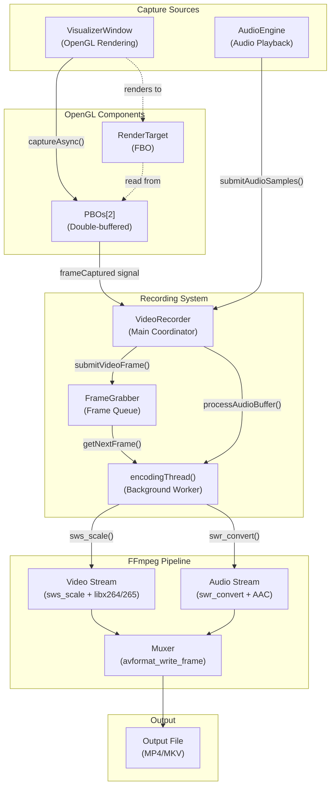

**Diagram: Recording System Component Architecture**

The system follows a producer-consumer pattern where `VisualizerWindow` and `AudioEngine` produce data, `FrameGrabber` queues it, and the encoding thread consumes and processes it asynchronously.

**Sources:** [src/visualizer/VisualizerWindow.cpp:258-288](), [src/recorder/VideoRecorder.cpp:113-170](), [src/recorder/VideoRecorder.cpp:172-211]()

---

## Recording States and Control Flow

The recording system uses a state machine to manage the recording lifecycle:

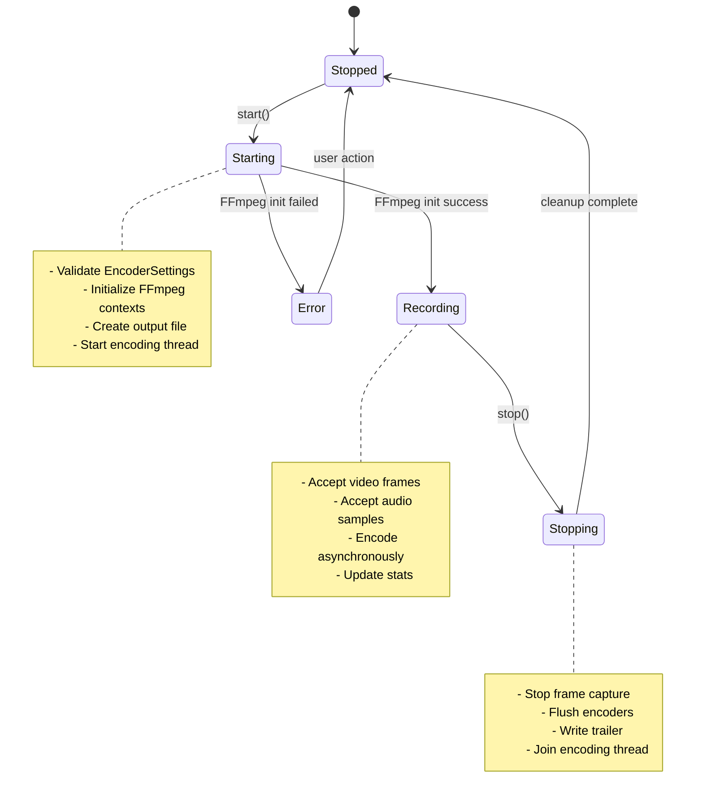

**Diagram: RecordingState State Machine**

| State | Description | Valid Transitions |
|-------|-------------|-------------------|
| `Stopped` | Not recording, resources released | → `Starting` |
| `Starting` | Initializing FFmpeg pipeline | → `Recording`, `Error` |
| `Recording` | Actively capturing and encoding | → `Stopping` |
| `Stopping` | Flushing and finalizing output | → `Stopped` |
| `Error` | Initialization or encoding error | → `Stopped` |

**Sources:** [src/recorder/VideoRecorder.cpp:18-111]()

---

## Frame Capture Pipeline

Frame capture uses double-buffered Pixel Buffer Objects (PBOs) for efficient, zero-copy transfers from GPU to CPU memory:

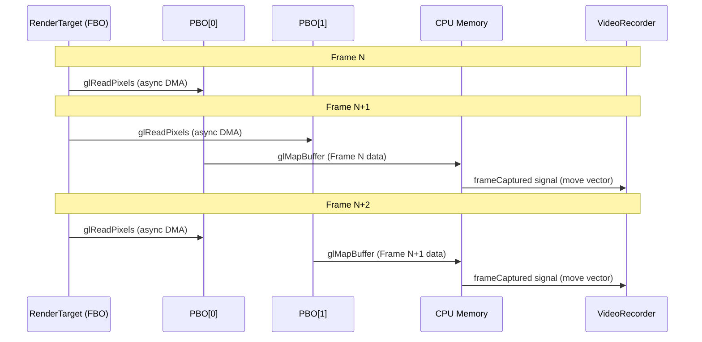

**Diagram: Double-Buffered PBO Frame Capture Flow**

The double-buffering strategy ensures that:
1. **Frame N** is read into `PBO[pboIndex]` via `glReadPixels` (non-blocking)
2. **Frame N-1** in `PBO[nextIndex]` is mapped to CPU memory (blocking)
3. Mapped data is copied once and moved (zero-copy semantics) via Qt signal
4. Indices swap for next frame

This approach eliminates pipeline stalls by overlapping DMA transfers with CPU processing.

**Sources:** [src/visualizer/VisualizerWindow.cpp:239-288](), [src/visualizer/VisualizerWindow.hpp:99-107]()

---

## Frame Processing Flow

```mermaid
flowchart LR
    subgraph "VisualizerWindow (OpenGL Thread)"
        RENDER["renderFrame()"]
        OVERLAY["overlayTarget_<br/>(with text)"]
        CAPTURE["captureAsync()"]
        PBO["PBOs[pboIndex_]"]
    end
    
    subgraph "Signal/Slot Bridge"
        SIG["frameCaptured signal<br/>(data, w, h, timestamp)"]
    end
    
    subgraph "VideoRecorder (Main Thread)"
        SUBMIT["submitVideoFrame()"]
        FG["FrameGrabber<br/>queue_<br/>(lock-free)"]
    end
    
    subgraph "Encoding Thread"
        GET["getNextFrame()"]
        PROCESS["processVideoFrame()"]
        SWS["sws_scale()<br/>(RGBA→YUV420P)"]
        ENCODE["encodeVideoFrame()"]
        WRITE["writePacket()"]
    end
    
    RENDER --> OVERLAY
    OVERLAY --> CAPTURE
    CAPTURE --> PBO
    PBO -.->|"frame N-1 ready"| SIG
    SIG --> SUBMIT
    SUBMIT -->|"move vector"| FG
    
    FG --> GET
    GET --> PROCESS
    PROCESS --> SWS
    SWS --> ENCODE
    ENCODE --> WRITE
```

**Diagram: End-to-End Frame Processing Pipeline**

**Key optimizations:**
- **Zero-copy transfer:** Frame data is moved (not copied) from `VisualizerWindow` to `FrameGrabber` [src/visualizer/VisualizerWindow.cpp:276-282]()
- **Lock-free queue:** `FrameGrabber` uses a concurrent queue for minimal contention
- **Async encoding:** FFmpeg operations run in a dedicated thread [src/recorder/VideoRecorder.cpp:172-211]()
- **Color space conversion:** `sws_scale` converts RGBA to YUV420P efficiently [src/recorder/VideoRecorder.cpp:226-232]()

**Sources:** [src/visualizer/VisualizerWindow.cpp:133-237](), [src/recorder/VideoRecorder.cpp:113-148](), [src/recorder/VideoRecorder.cpp:213-239]()

---

## Audio Capture and Encoding

Audio samples flow from `AudioEngine` to `VideoRecorder` and are buffered until enough data is available for encoding:

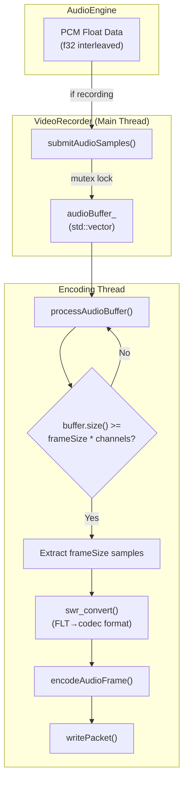

**Diagram: Audio Capture and Encoding Flow**

**Audio processing details:**
- Samples are accumulated in `audioBuffer_` until at least `audioCodecCtx_->frame_size` samples are available [src/recorder/VideoRecorder.cpp:253-257]()
- `swr_convert()` handles sample format conversion (e.g., FLT to FLTP) and resampling [src/recorder/VideoRecorder.cpp:261-269]()
- Frame timestamps (`pts`) are calculated based on accumulated sample count [src/recorder/VideoRecorder.cpp:271-272]()
- Audio encoding is interleaved with video encoding in the same thread [src/recorder/VideoRecorder.cpp:184]()

**Sources:** [src/recorder/VideoRecorder.cpp:150-170](), [src/recorder/VideoRecorder.cpp:241-279]()

---

## Encoding Thread Lifecycle

The encoding thread runs continuously while recording, processing both video and audio data:

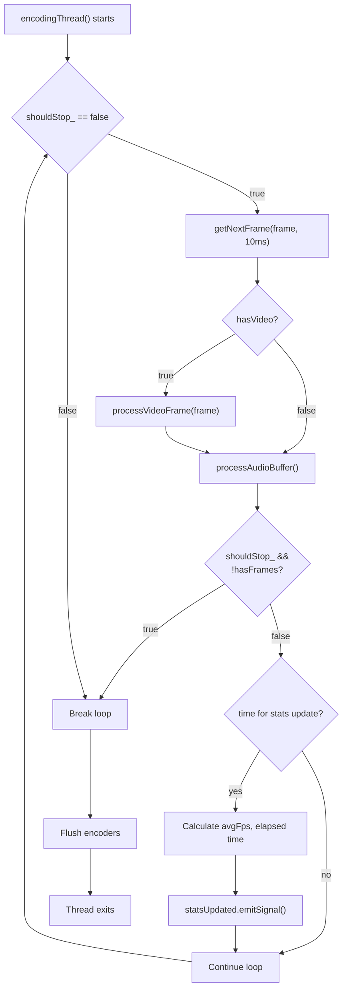

**Diagram: Encoding Thread Control Flow**

The encoding thread:
1. **Polls** for video frames with 10ms timeout [src/recorder/VideoRecorder.cpp:179]()
2. **Processes** available video frames immediately [src/recorder/VideoRecorder.cpp:180-182]()
3. **Processes** audio buffer on every iteration [src/recorder/VideoRecorder.cpp:184]()
4. **Updates statistics** every second [src/recorder/VideoRecorder.cpp:190-207]()
5. **Exits cleanly** when `shouldStop_` is set and all queued frames are processed [src/recorder/VideoRecorder.cpp:186-188]()

**Sources:** [src/recorder/VideoRecorder.cpp:172-211]()

---

## FFmpeg Pipeline Initialization

The recording system initializes FFmpeg components in a specific order:

| Component | Initialization Function | Purpose |
|-----------|-------------------------|---------|
| Output Context | `avformat_alloc_output_context2()` | Creates format context for MP4/MKV container |
| Video Stream | `initVideoStream()` | Configures H.264/H.265 encoder with CRF settings |
| Audio Stream | `initAudioStream()` | Configures AAC encoder with bitrate settings |
| Scale Context | `sws_getContext()` | Sets up RGBA→YUV420P color conversion |
| Resample Context | `swr_alloc_set_opts2()` | Sets up float→planar format conversion |
| File I/O | `avio_open()` | Opens output file for writing |
| Header | `avformat_write_header()` | Writes container header with stream metadata |

**Initialization sequence** [src/recorder/VideoRecorder.cpp:281-326]():
```cpp
// 1. Create format context
avformat_alloc_output_context2(&ctx, nullptr, nullptr, outputPath);

// 2. Initialize video stream (codec, dimensions, framerate)
initVideoStream();  // Creates videoCodecCtx_, videoFrame_, swsCtx_

// 3. Initialize audio stream (codec, sample rate, channels)
initAudioStream();  // Creates audioCodecCtx_, audioFrame_, swrCtx_

// 4. Open output file
avio_open(&formatCtx_->pb, outputPath, AVIO_FLAG_WRITE);

// 5. Write header to file
avformat_write_header(formatCtx_.get(), &opts);
```

**Sources:** [src/recorder/VideoRecorder.cpp:281-326](), [src/recorder/VideoRecorder.cpp:328-423](), [src/recorder/VideoRecorder.cpp:425-519]()

---

## Video Codec Configuration

Video encoding settings are configured through `VideoEncoderConfig` and applied during stream initialization:

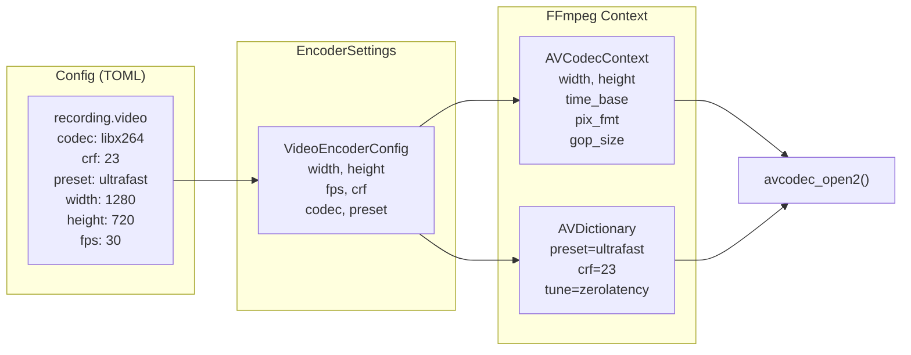

**Diagram: Video Codec Configuration Flow**

**Key configuration options** [src/recorder/VideoRecorder.cpp:346-378]():
- **Pixel format:** Always YUV420P for H.264/H.265 compatibility
- **GOP size:** `fps * 2` (e.g., 60 frames at 30fps)
- **CRF (Constant Rate Factor):** 0-51, lower = better quality, default 23
- **Preset:** Controls encoding speed vs compression (ultrafast, fast, medium, slow, veryslow)
- **Tune:** Set to "zerolatency" for real-time encoding

**Sources:** [src/recorder/VideoRecorder.cpp:328-423](), [src/core/Config.cpp:219-240]()

---

## Audio Codec Configuration

Audio encoding uses `AudioEncoderConfig` with support for various sample rates and channel layouts:

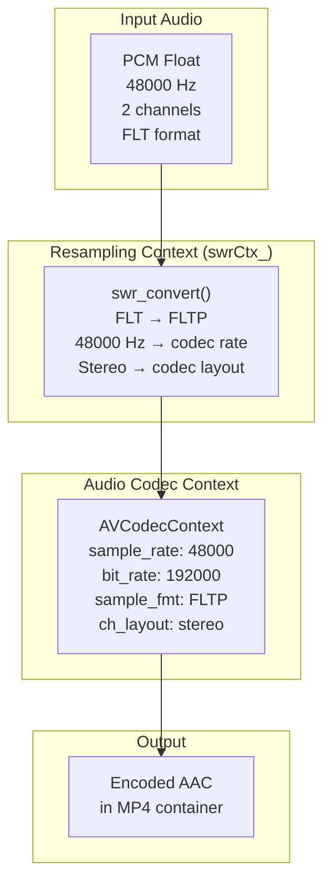

**Diagram: Audio Encoding Configuration**

**Audio stream initialization** [src/recorder/VideoRecorder.cpp:444-489]():
- **Codec:** AAC (default) or other formats supported by libavcodec
- **Sample rate:** 48000 Hz (configurable)
- **Bitrate:** 192 kbps (configurable, range: 64-640 kbps)
- **Channels:** 2 (stereo), can support mono or more channels
- **Sample format:** Automatically selected from codec's supported formats (typically FLTP)

The resampling context (`swrCtx_`) handles:
1. Format conversion (interleaved float → planar float)
2. Sample rate conversion (if needed)
3. Channel layout remapping (if needed)

**Sources:** [src/recorder/VideoRecorder.cpp:425-519](), [src/recorder/VideoRecorder.cpp:241-279]()

---

## Recording Statistics

`VideoRecorder` tracks real-time statistics and emits updates via the `statsUpdated` signal:

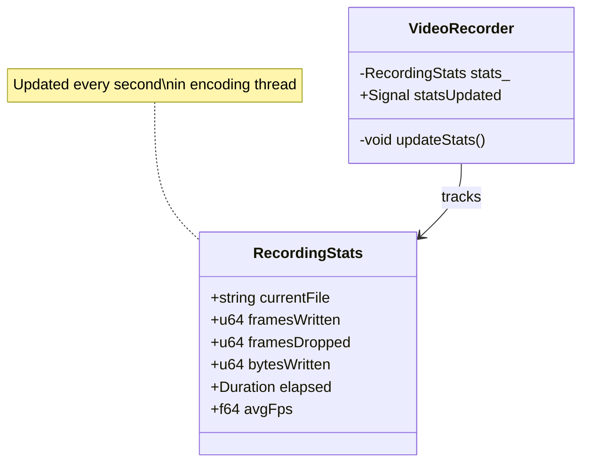

**Diagram: Recording Statistics Structure**

| Field | Type | Description | Update Frequency |
|-------|------|-------------|------------------|
| `currentFile` | `string` | Output file path | On start |
| `framesWritten` | `u64` | Successfully encoded frames | Per frame |
| `framesDropped` | `u64` | Frames dropped due to queue overflow | Per second |
| `bytesWritten` | `u64` | Total bytes written to file | Per packet |
| `elapsed` | `Duration` | Recording duration in milliseconds | Per second |
| `avgFps` | `f64` | Average encoding framerate | Per second |

Statistics are calculated in the encoding thread [src/recorder/VideoRecorder.cpp:190-207]():
```cpp
stats_.elapsed = Duration(std::chrono::duration_cast<std::chrono::milliseconds>(
    now - std::chrono::steady_clock::time_point(std::chrono::microseconds(startTime_))
).count());

if (stats_.elapsed.count() > 0) {
    stats_.avgFps = static_cast<f64>(stats_.framesWritten) * 1000.0 / stats_.elapsed.count();
}

stats_.framesDropped = frameGrabber_.droppedFrames();
statsUpdated.emitSignal(stats_);
```

**Sources:** [src/recorder/VideoRecorder.cpp:190-207]()

---

## Configuration Structure

Recording settings are organized hierarchically in the `Config` singleton:

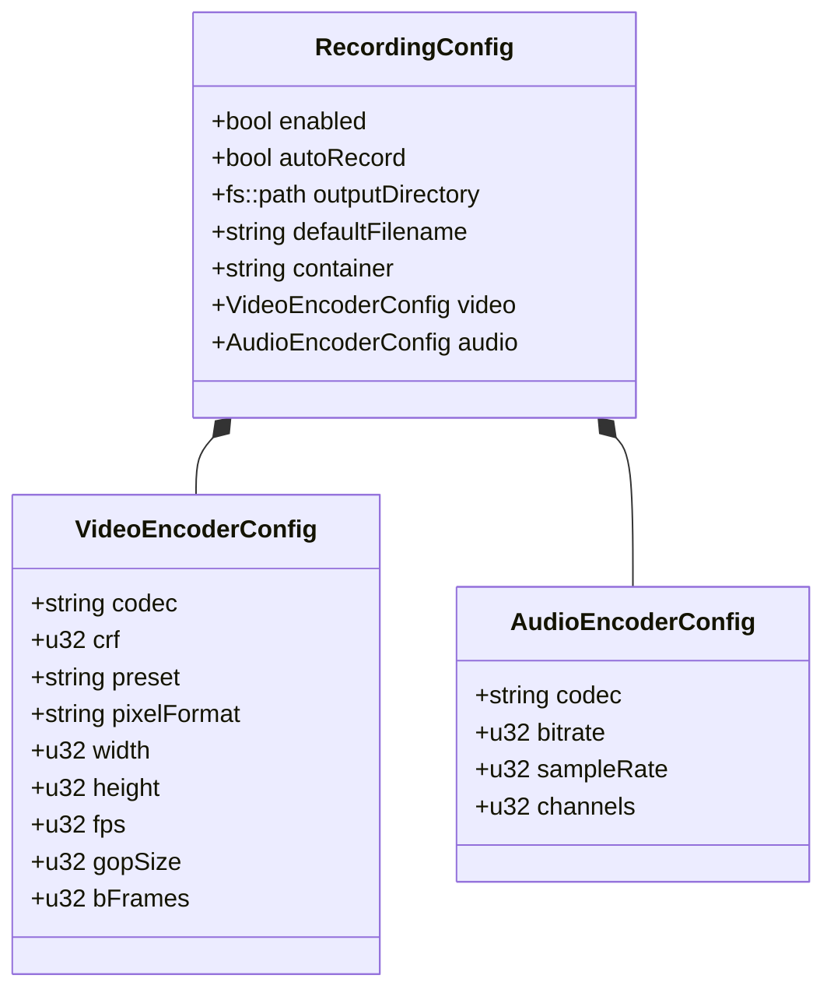

**Diagram: Recording Configuration Structure**

**Default configuration values** (from `config.toml`):

**Video settings:**
- `codec`: `"libx264"` (H.264)
- `crf`: `23` (balanced quality/size)
- `preset`: `"ultrafast"` (fastest encoding for real-time)
- `pixel_format`: `"yuv420p"` (universal compatibility)
- `width`: `1280` (must be even number)
- `height`: `720` (must be even number)
- `fps`: `30`

**Audio settings:**
- `codec`: `"aac"`
- `bitrate`: `192` (kbps)
- `sample_rate`: `48000` (Hz)
- `channels`: `2` (stereo)

**Output settings:**
- `output_directory`: `"~/Videos/ChadVis"`
- `default_filename`: `"chadvis-projectm-qt_{date}_{time}"`
- `container`: `"mp4"` (supports mkv, webm, etc.)

**Sources:** [src/core/Config.cpp:206-248](), [src/core/Config.cpp:363-383]()

---

## Integration with VisualizerWindow

`VisualizerWindow` prepares for recording by resizing render targets and setting up PBOs:

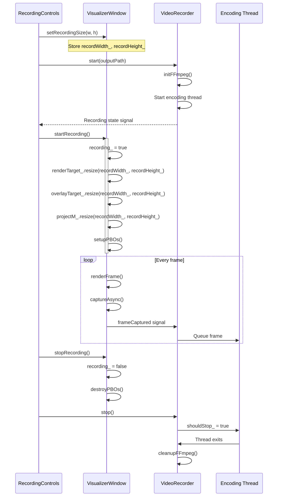

**Diagram: Recording Start/Stop Sequence**

**Key steps in recording preparation** [src/visualizer/VisualizerWindow.cpp:316-334]():

1. **Set recording resolution:** `setRecordingSize()` stores target dimensions
2. **Resize render targets:** FBOs are resized to match recording resolution
3. **Resize projectM:** Ensures visualization renders at correct size
4. **Setup PBOs:** Allocates two PBOs sized for recording resolution
5. **Enable capture:** `recording_` flag activates frame capture path
6. **Stop recording:** Destroys PBOs and cleans up resources

**Sources:** [src/visualizer/VisualizerWindow.cpp:311-334](), [src/visualizer/VisualizerWindow.cpp:133-237]()

---

## Error Handling

The recording system uses `Result<T>` types for error propagation:

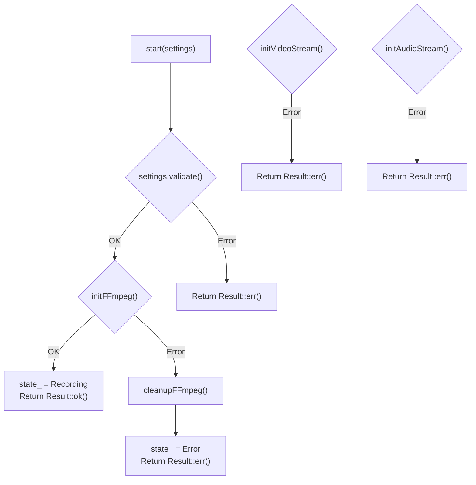

**Diagram: Recording Error Handling Flow**

**Common error scenarios:**

| Error Type | Cause | Recovery |
|------------|-------|----------|
| Codec not found | Invalid codec name in config | Fall back to default (libx264/aac) |
| File I/O error | Permission denied, disk full | User notification via `error` signal |
| Encoding error | Invalid frame data, codec issue | Drop frame, log warning, continue |
| Init failure | Missing FFmpeg libraries | Set `state_ = Error`, cleanup resources |

**Error reporting** uses signals [src/recorder/VideoRecorder.cpp:543-558]():
- `error.emitSignal(errorMessage)` - Emitted for critical errors
- `LOG_WARN()` - Used for non-fatal issues (dropped frames, packet errors)
- State transitions to `RecordingState::Error` on initialization failures

**Sources:** [src/recorder/VideoRecorder.cpp:18-111](), [src/recorder/VideoRecorder.cpp:539-637]()