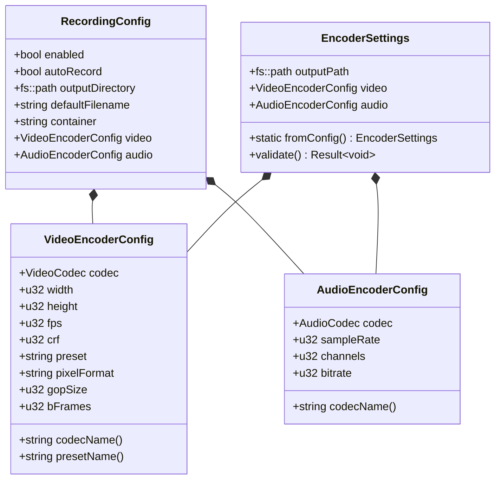

# VideoRecorder

<details>
<summary>Relevant source files</summary>

The following files were used as context for generating this wiki page:

- [src/core/Config.cpp](src/core/Config.cpp)
- [src/recorder/VideoRecorder.cpp](src/recorder/VideoRecorder.cpp)

</details>


## Purpose and Scope

The `VideoRecorder` class implements FFmpeg-based video recording for the chadvis-projectm-qt visualizer. It captures rendered visualization frames and audio playback, encoding them into video files (MP4/MKV) with configurable codecs and quality settings. The recorder operates asynchronously on a dedicated encoding thread to avoid blocking the main rendering loop.

This page documents the `VideoRecorder` class, its FFmpeg pipeline initialization, codec configuration, asynchronous encoding architecture, and integration with the configuration system. For details about frame capture using Pixel Buffer Objects, see [Frame Capture & PBOs](#5.2).

**Sources:** [src/recorder/VideoRecorder.cpp:1-639]()

---

## Class Architecture

The `VideoRecorder` class manages the complete recording pipeline from frame submission to file output. It uses FFmpeg libraries (libavcodec, libavformat, libswscale, libswresample) for encoding and muxing.

### Component Diagram


**Sources:** [src/recorder/VideoRecorder.cpp:1-639]()

---

## State Machine and Lifecycle

The recorder operates as a state machine with five states managed by the `RecordingState` enum.

### Recording State Transitions


### Lifecycle Methods

| Method | State Transition | Key Operations |
|--------|------------------|----------------|
| `start(EncoderSettings)` | Stopped → Starting → Recording | [VideoRecorder.cpp:18-65]() |
| `stop()` | Recording → Stopping → Stopped | [VideoRecorder.cpp:73-111]() |
| `cleanupFFmpeg()` | Any → Stopped | [VideoRecorder.cpp:521-537]() |

**Sources:** [src/recorder/VideoRecorder.cpp:18-111](), [src/recorder/VideoRecorder.cpp:521-537]()

---

## FFmpeg Pipeline Initialization

The initialization process creates FFmpeg contexts in a specific order to ensure proper muxing.

### Initialization Sequence


### Video Stream Initialization

The `initVideoStream()` method configures the video encoder with codec-specific options.

**Key Configuration Steps:**

1. **Codec Selection** [VideoRecorder.cpp:329-334]()
   - Uses `settings_.video.codecName()` (e.g., "libx264", "libx265")
   - Falls back to error if codec not found

2. **Codec Context Setup** [VideoRecorder.cpp:346-357]()
   ```
   videoCodecCtx_->width = settings_.video.width
   videoCodecCtx_->height = settings_.video.height
   videoCodecCtx_->time_base = {1, fps}
   videoCodecCtx_->pix_fmt = AV_PIX_FMT_YUV420P
   videoCodecCtx_->gop_size = fps * 2 (default)
   videoCodecCtx_->max_b_frames = settings_.video.bFrames
   ```

3. **H.264/H.265 Options** [VideoRecorder.cpp:362-369]()
   - `preset`: ultrafast, veryfast, etc. (encoding speed vs compression)
   - `crf`: 0-51 (quality, lower = better, 23 is default)
   - `tune`: zerolatency (for real-time encoding)

4. **SwScale Context** [VideoRecorder.cpp:401-414]()
   - Converts RGBA (from OpenGL) to YUV420P (for H.264)
   - Uses `SWS_BILINEAR` scaling algorithm

**Sources:** [src/recorder/VideoRecorder.cpp:328-423]()

### Audio Stream Initialization

The `initAudioStream()` method configures the audio encoder with channel layout and sample format conversion.

**Key Configuration Steps:**

1. **Codec Selection** [VideoRecorder.cpp:426-432]()
   - Uses `settings_.audio.codecName()` (e.g., "aac", "libmp3lame")
   - Logs warning and continues without audio if codec not found

2. **Codec Context Setup** [VideoRecorder.cpp:444-454]()
   ```
   audioCodecCtx_->sample_rate = settings_.audio.sampleRate (44100 Hz)
   audioCodecCtx_->bit_rate = settings_.audio.bitrate * 1000
   audioCodecCtx_->sample_fmt = codec->sample_fmts[0] (usually AV_SAMPLE_FMT_FLTP)
   av_channel_layout_default(&layout, settings_.audio.channels)
   ```

3. **SwResample Context** [VideoRecorder.cpp:491-511]()
   - Converts float32 PCM (from AudioEngine) to codec format (e.g., FLTP for AAC)
   - Handles sample rate conversion if needed
   - Configured with `swr_alloc_set_opts2()` and initialized with `swr_init()`

**Sources:** [src/recorder/VideoRecorder.cpp:425-519]()

---

## Encoding Thread Architecture

The encoding thread runs asynchronously to avoid blocking the render loop. It processes video frames and audio samples, encodes them, and writes packets to the output file.

### Thread Execution Flow


**Thread Safety:**
- `ffmpegMutex_` protects all FFmpeg context access during encoding
- `audioMutex_` protects `audioBuffer_` during `submitAudioSamples()` and `processAudioBuffer()`
- `shouldStop_` is an atomic flag for thread coordination

**Sources:** [src/recorder/VideoRecorder.cpp:172-211]()

---

## Video Frame Processing

Video frames are submitted from the render thread and processed asynchronously by the encoding thread.

### Frame Submission Path


### Frame Processing Implementation

**Submission Methods** [VideoRecorder.cpp:113-148]():

| Method | Signature | Data Handling |
|--------|-----------|---------------|
| `submitVideoFrame(std::vector<u8>&&, ...)` | Move semantics | Zero-copy transfer |
| `submitVideoFrame(const u8*, ...)` | Pointer + size | Copies data into vector |

**Processing Pipeline** [VideoRecorder.cpp:213-239]():

1. **Retrieve Frame** from `FrameGrabber` queue
2. **Color Conversion** using `sws_scale()`:
   ```
   Source: RGBA (4 bytes/pixel, from OpenGL)
   Destination: YUV420P (1.5 bytes/pixel, for H.264)
   Algorithm: SWS_BILINEAR
   ```
3. **Set PTS** (Presentation Timestamp):
   ```cpp
   videoFrame_->pts = videoFrameCount_++;
   ```
4. **Encode Frame** via `encodeVideoFrame()`
5. **Update Stats**: `++stats_.framesWritten`

**Sources:** [src/recorder/VideoRecorder.cpp:113-148](), [src/recorder/VideoRecorder.cpp:213-239]()

---

## Audio Sample Processing

Audio samples are buffered and processed in frame-sized chunks required by the codec.

### Audio Processing Flow


### Implementation Details

**Audio Buffering** [VideoRecorder.cpp:150-170]():
- Samples arrive asynchronously from `AudioEngine`
- Stored as float32 PCM in `audioBuffer_`
- Thread-safe via `audioMutex_`

**Frame-based Processing** [VideoRecorder.cpp:241-279]():
- Most codecs (e.g., AAC) require fixed-size frames
- `audioCodecCtx_->frame_size` determines frame size (typically 1024 samples for AAC)
- Loop continues until insufficient samples remain

**Sample Format Conversion**:
```cpp
swr_convert(swrCtx_.get(),
            audioFrame_->data,      // destination (codec format, e.g., FLTP)
            frameSize,
            srcData,                // source (float32 PCM)
            frameSize);
```

**Sources:** [src/recorder/VideoRecorder.cpp:150-170](), [src/recorder/VideoRecorder.cpp:241-279]()

---

## Configuration Integration

Recording settings are loaded from the TOML configuration file and mapped to `EncoderSettings`.

### Configuration Structure



### TOML Configuration Format

The configuration is loaded by `parseRecording()` in the `Config` class.

**Example Configuration** [Config.cpp:206-248]():
```toml
[recording]
enabled = true
auto_record = false
output_directory = "~/Videos/ChadVis"
default_filename = "chadvis-projectm-qt_{date}_{time}"
container = "mp4"

[recording.video]
codec = "libx264"
crf = 23
preset = "ultrafast"
pixel_format = "yuv420p"
width = 1280
height = 720
fps = 30

[recording.audio]
codec = "aac"
bitrate = 192
```

### Configuration Validation

The `EncoderSettings::validate()` method ensures settings are within acceptable ranges:

- **Video dimensions**: Must be even numbers (H.264 requirement)
- **FPS**: Clamped to 10-120 range
- **CRF**: Clamped to 0-51 (H.264/H.265)
- **Bitrate**: Clamped to 64-640 kbps
- **Output path**: Must have write permissions

**Sources:** [src/core/Config.cpp:206-248]()

---

## Encoding and Packet Writing

The encoding process follows FFmpeg's asynchronous encoding API, introduced in FFmpeg 3.x.

### Encoding Flow Diagram


### Encode Methods

**Video Encoding** [VideoRecorder.cpp:539-567]():
```cpp
bool encodeVideoFrame(AVFrame* frame) {
    avcodec_send_frame(videoCodecCtx_.get(), frame);
    
    while (ret >= 0) {
        ret = avcodec_receive_packet(videoCodecCtx_.get(), packet_.get());
        if (ret == AVERROR(EAGAIN) || ret == AVERROR_EOF)
            break;
        
        writePacket(packet_.get(), videoStream_);
    }
    return true;
}
```

**Audio Encoding** [VideoRecorder.cpp:569-597]():
- Identical structure to video encoding
- Uses `audioCodecCtx_` and `audioStream_`

**Packet Writing** [VideoRecorder.cpp:599-615]():
- Rescales packet timestamps from codec timebase to stream timebase
- Writes interleaved packets (maintains A/V sync)
- Updates `stats_.bytesWritten`

### Encoder Flushing

When recording stops, remaining frames must be flushed from codec buffers.

**Flush Implementation** [VideoRecorder.cpp:617-637]():
```cpp
void flushEncoders() {
    // Send NULL frame to signal end of stream
    avcodec_send_frame(videoCodecCtx_.get(), nullptr);
    
    // Receive all remaining packets
    while (avcodec_receive_packet(videoCodecCtx_.get(), packet_.get()) >= 0) {
        writePacket(packet_.get(), videoStream_);
    }
    
    // Repeat for audio
    avcodec_send_frame(audioCodecCtx_.get(), nullptr);
    while (avcodec_receive_packet(audioCodecCtx_.get(), packet_.get()) >= 0) {
        writePacket(packet_.get(), audioStream_);
    }
}
```

**Sources:** [src/recorder/VideoRecorder.cpp:539-637]()

---

## Error Handling and Statistics

The recorder provides robust error handling and real-time statistics via signal emission.

### Signal Emission System

| Signal | Type | Emitted When |
|--------|------|--------------|
| `stateChanged` | `Signal<RecordingState>` | State transitions |
| `statsUpdated` | `Signal<RecordingStats>` | Every second during recording |
| `error` | `Signal<std::string>` | Encoding errors, write failures |

### RecordingStats Structure

```cpp
struct RecordingStats {
    u64 framesWritten;      // Total frames encoded
    u64 framesDropped;      // Frames dropped by FrameGrabber
    u64 bytesWritten;       // Total file size in bytes
    Duration elapsed;       // Recording duration
    f64 avgFps;            // Average encoding FPS
    std::string currentFile; // Output file path
};
```

**Stats Update Logic** [VideoRecorder.cpp:190-207]():
- Updated every 1 second in encoding thread
- `avgFps` calculated as: `framesWritten * 1000 / elapsed.count()`
- `framesDropped` retrieved from `FrameGrabber`

### Error Handling Patterns

**Initialization Errors** [VideoRecorder.cpp:18-65]():
```cpp
if (auto result = initFFmpeg(); !result) {
    cleanupFFmpeg();
    state_ = RecordingState::Error;
    stateChanged.emitSignal(state_);
    return result;  // Return Result<void>::err()
}
```

**Encoding Errors** [VideoRecorder.cpp:541-558]():
```cpp
int ret = avcodec_send_frame(videoCodecCtx_.get(), frame);
if (ret < 0) {
    std::string errMsg = "Error sending video frame: " + ffmpegError(ret);
    LOG_WARN("{}", errMsg);
    error.emitSignal(errMsg);
    return false;
}
```

**Cleanup on Stop** [VideoRecorder.cpp:73-111]():
- Sets `state_ = RecordingState::Stopping`
- Signals thread to stop via `shouldStop_ = true`
- Waits for thread join
- Flushes encoders and writes trailer
- Calls `cleanupFFmpeg()` to release resources

**Sources:** [src/recorder/VideoRecorder.cpp:18-111](), [src/recorder/VideoRecorder.cpp:172-211](), [src/recorder/VideoRecorder.cpp:539-637]()

---

## Integration with Application

The `VideoRecorder` is owned by the `Application` singleton and controlled through the `RecordingController`.

### Ownership and Access Pattern


**Sources:** Based on architectural patterns from Diagram 1 and Diagram 3 in the high-level system overview.