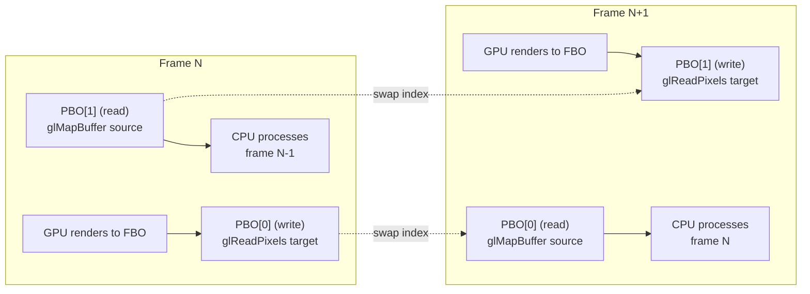
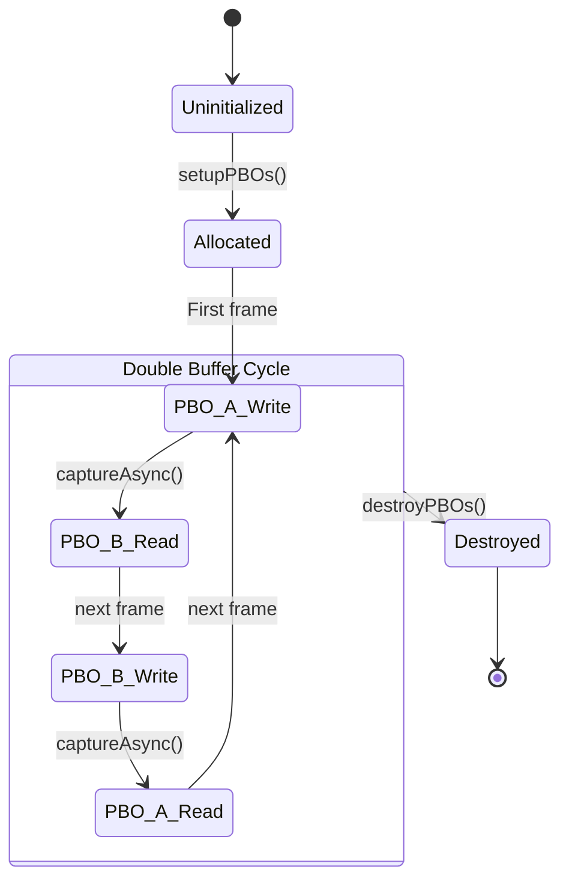
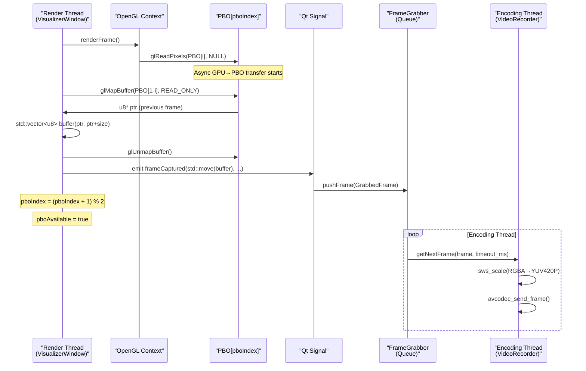
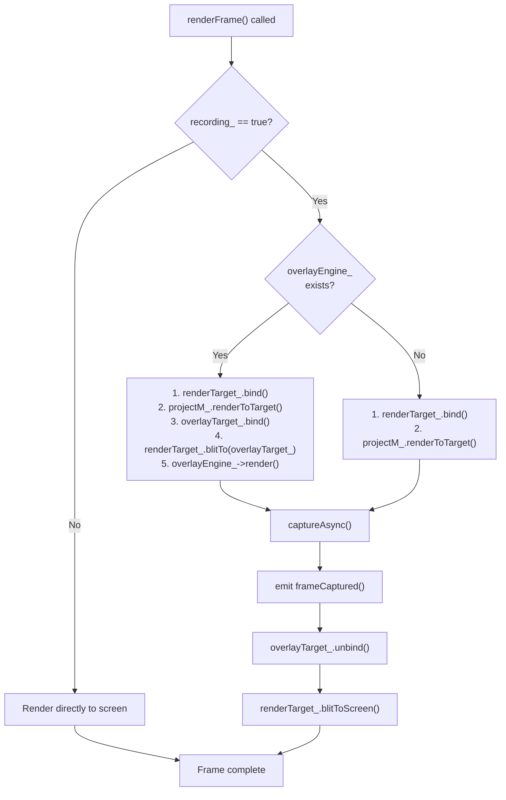
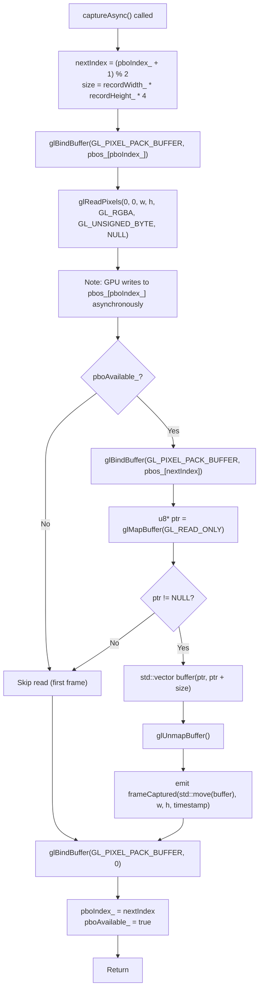
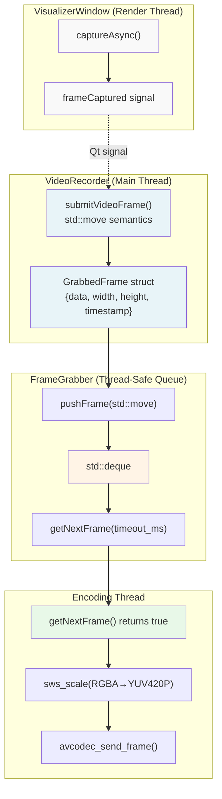
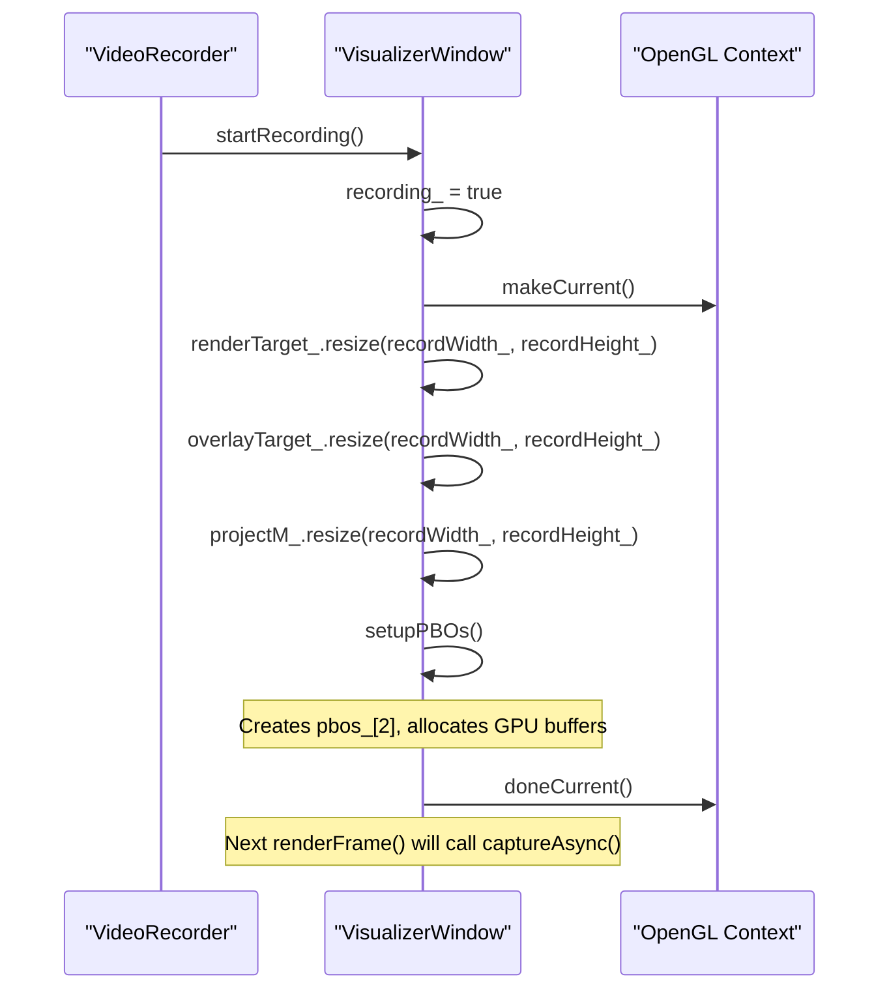
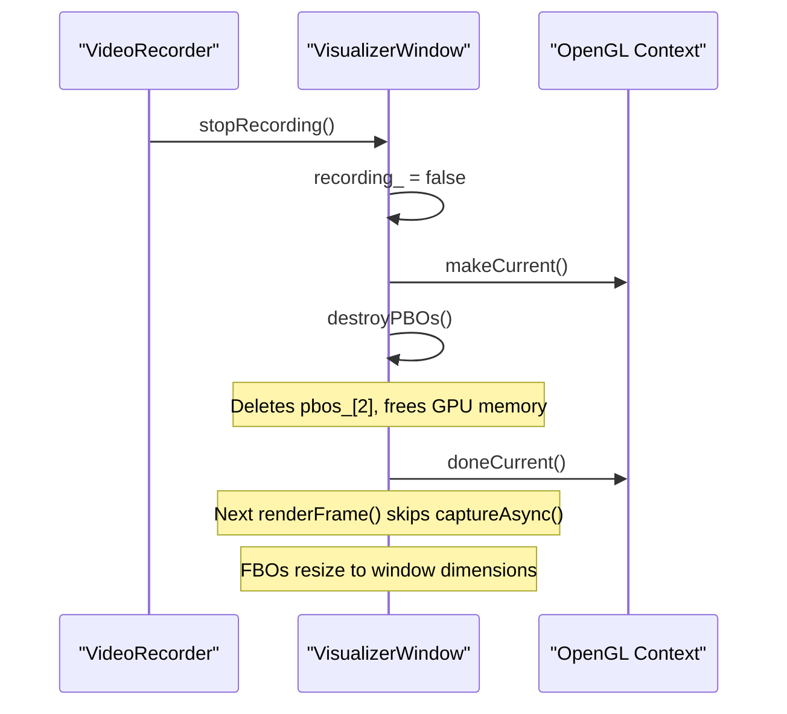

# Frame Capture & PBOs

<details>
<summary>Relevant source files</summary>

The following files were used as context for generating this wiki page:

- [src/core/Config.cpp](src/core/Config.cpp)
- [src/recorder/VideoRecorder.cpp](src/recorder/VideoRecorder.cpp)
- [src/visualizer/VisualizerWindow.cpp](src/visualizer/VisualizerWindow.cpp)
- [src/visualizer/VisualizerWindow.hpp](src/visualizer/VisualizerWindow.hpp)

</details>


## Purpose & Scope

This page documents the asynchronous frame capture mechanism used in the recording system, specifically the implementation of double-buffered Pixel Buffer Objects (PBOs) for zero-copy GPU-to-CPU frame transfer. This covers the OpenGL capture pipeline in `VisualizerWindow`, frame data handling, and integration with the encoding thread.

For information about the overall recording architecture and FFmpeg encoding pipeline, see [VideoRecorder](#5.1). For visualization rendering details, see [VisualizerWindow](#4.1).

**Sources:** [src/visualizer/VisualizerWindow.hpp:1-125](), [src/visualizer/VisualizerWindow.cpp:1-426]()

---

## Overview

The frame capture system uses OpenGL Pixel Buffer Objects (PBOs) to achieve asynchronous, non-blocking transfer of rendered frames from GPU memory to CPU memory. This approach is critical for maintaining high frame rates during recording by eliminating GPU-CPU synchronization stalls.

### Key Design Principles

| Principle | Implementation | Benefit |
|-----------|----------------|---------|
| **Double Buffering** | Two PBOs alternate roles each frame | GPU writes to one PBO while CPU reads from the other |
| **Asynchronous Transfer** | `glReadPixels` with PBO writes immediately, `glMapBuffer` reads later | No GPU pipeline stalls |
| **Zero-Copy Semantics** | Move semantics for frame data (`std::move`) | Eliminates memory copies in signal emission |
| **Frame Queue** | `FrameGrabber` manages bounded queue | Decouples rendering thread from encoding thread |

**Sources:** [src/visualizer/VisualizerWindow.cpp:239-288]()

---

## Double-Buffered PBO Architecture

The system maintains two PBOs that alternate between **write** and **read** states each frame:



**PBO State Machine:**



### Member Variables

The PBO state is tracked by three member variables in `VisualizerWindow`:

```cpp
GLuint pbos_[2]{0, 0};        // OpenGL buffer objects
u32 pboIndex_{0};              // Current write index (0 or 1)
bool pboAvailable_{false};     // True after first frame captured
```

**Sources:** [src/visualizer/VisualizerWindow.hpp:103-106]()

---

## Frame Capture Pipeline

The complete pipeline from rendering to encoded video involves multiple stages across threads:



### Rendering Path with Recording

When recording is active, the rendering path includes overlay composition and frame capture:

**Sources:** [src/visualizer/VisualizerWindow.cpp:186-207]()



**Sources:** [src/visualizer/VisualizerWindow.cpp:168-237]()

---

## PBO Lifecycle

### Setup Phase

PBOs are created when recording starts. Each PBO is allocated with size equal to `recordWidth_ * recordHeight_ * 4` (RGBA, 1 byte per channel):

```cpp
void VisualizerWindow::setupPBOs() {
    this->destroyPBOs();
    glGenBuffers(2, pbos_);
    u32 size = recordWidth_ * recordHeight_ * 4;
    for (int i = 0; i < 2; ++i) {
        glBindBuffer(GL_PIXEL_PACK_BUFFER, pbos_[i]);
        glBufferData(GL_PIXEL_PACK_BUFFER, size, nullptr, GL_STREAM_READ);
    }
    glBindBuffer(GL_PIXEL_PACK_BUFFER, 0);
    pboIndex_ = 0;
    pboAvailable_ = false;
}
```

**Usage Hint:** `GL_STREAM_READ` indicates the buffer will be written by the GPU (via `glReadPixels`) and read once by the CPU (via `glMapBuffer`).

**Sources:** [src/visualizer/VisualizerWindow.cpp:239-250]()

### Capture Phase

The `captureAsync()` method implements the core double-buffering logic:

**Algorithm:**
1. **Write to current PBO:** Call `glReadPixels` with `pbos_[pboIndex_]` bound as `GL_PIXEL_PACK_BUFFER`. The pixel pointer is `nullptr` because data writes to the bound PBO, not CPU memory.
2. **Read from previous PBO:** If `pboAvailable_` (i.e., not first frame), bind `pbos_[nextIndex]` and call `glMapBuffer` to get a CPU-accessible pointer.
3. **Copy to vector:** Copy data from mapped pointer to `std::vector<u8>`, which owns the memory.
4. **Emit signal:** Emit `frameCaptured` signal with moved vector (zero-copy).
5. **Swap indices:** Update `pboIndex_` to `nextIndex`.

**Sources:** [src/visualizer/VisualizerWindow.cpp:258-288]()



**Sources:** [src/visualizer/VisualizerWindow.cpp:258-288]()

### Destruction Phase

PBOs are destroyed when recording stops:

```cpp
void VisualizerWindow::destroyPBOs() {
    if (pbos_[0])
        glDeleteBuffers(2, pbos_);
    pbos_[0] = pbos_[1] = 0;
}
```

**Sources:** [src/visualizer/VisualizerWindow.cpp:252-256]()

---

## Integration with VideoRecorder

Captured frames flow from `VisualizerWindow` to `VideoRecorder` via Qt signals and the `FrameGrabber` queue:



### Frame Data Structure

The `GrabbedFrame` struct (defined in `FrameGrabber.hpp`) holds captured frame data:

```cpp
struct GrabbedFrame {
    std::vector<u8> data;    // Pixel data (RGBA)
    u32 width;               // Frame width
    u32 height;              // Frame height  
    i64 timestamp;           // Capture timestamp (microseconds)
};
```

### Signal-Slot Connection

The connection is established when recording starts:

```cpp
// In VideoRecorder or controller setup:
connect(visualizerWindow, &VisualizerWindow::frameCaptured,
        videoRecorder, &VideoRecorder::submitVideoFrame);
```

The `submitVideoFrame` method uses move semantics to avoid copying the frame data:

**Sources:** [src/recorder/VideoRecorder.cpp:113-128]()

---

## Recording Start/Stop Workflow

### Starting Recording

When recording starts, the system performs these steps:



**Sources:** [src/visualizer/VisualizerWindow.cpp:316-324]()

### Stopping Recording

When recording stops:



**Sources:** [src/visualizer/VisualizerWindow.cpp:327-333]()

---

## Performance Considerations

### Zero-Copy Semantics

The frame capture pipeline minimizes memory copies:

| Transfer Stage | Method | Copy? |
|----------------|--------|-------|
| GPU → PBO | `glReadPixels` with bound PBO | **No** (DMA transfer) |
| PBO → CPU vector | `std::vector` constructor from pointer | **Yes** (required for ownership) |
| Vector → Signal | `std::move(buffer)` | **No** (move semantics) |
| Signal → FrameGrabber | `pushFrame(std::move(frame))` | **No** (move semantics) |
| FrameGrabber → Encoding thread | `getNextFrame()` | **No** (returns reference) |

**Total copies per frame:** 1 (PBO to vector, unavoidable)

**Sources:** [src/visualizer/VisualizerWindow.cpp:273-277](), [src/recorder/VideoRecorder.cpp:120-127]()

### Asynchronous Overlap

The double-buffering enables overlap between GPU and CPU operations:

```
Frame N:   [GPU renders] [GPU→PBO_A transfer]
                                              [CPU reads PBO_B] [CPU process]
                                              
Frame N+1:                [GPU renders] [GPU→PBO_B transfer]
                                                               [CPU reads PBO_A] [CPU process]
```

Without PBOs, the pipeline would stall:
```
Frame N:   [GPU renders] [WAIT for GPU] [CPU reads pixels] [CPU process]
Frame N+1:                                                  [GPU renders] [WAIT]...
```

### Frame Queue Backpressure

The `FrameGrabber` implements a bounded queue with configurable capacity. When the encoding thread falls behind, `pushFrame()` will drop frames rather than block the render thread:

**Default behavior:** If queue is full, oldest frame is dropped and `droppedFrames_` counter increments.

**Sources:** Referenced in diagram from [src/recorder/VideoRecorder.cpp:51-52](), queue implementation in `FrameGrabber`

---

## Configuration

Recording resolution is set via the `RecordingConfig` section in `config.toml`:

```toml
[recording.video]
width = 1920          # Must be even (H.264 requirement)
height = 1080         # Must be even
fps = 30
```

The system enforces even dimensions during config loading:

**Sources:** [src/core/Config.cpp:228-236]()

PBO buffer size is automatically calculated as `width * height * 4` bytes (RGBA format with 1 byte per channel).

---

## Summary

The PBO-based frame capture system provides:

- **Asynchronous GPU-to-CPU transfer** via double-buffered PBOs
- **Zero-copy signal emission** via move semantics
- **Thread-safe frame queue** decoupling rendering from encoding
- **Automatic frame dropping** when encoding falls behind
- **Minimal pipeline stalls** through overlapped GPU/CPU operations

This architecture enables high-quality, high-framerate recording without impacting real-time visualization performance.

**Sources:** [src/visualizer/VisualizerWindow.cpp:239-288](), [src/visualizer/VisualizerWindow.hpp:99-106](), [src/recorder/VideoRecorder.cpp:113-128]()