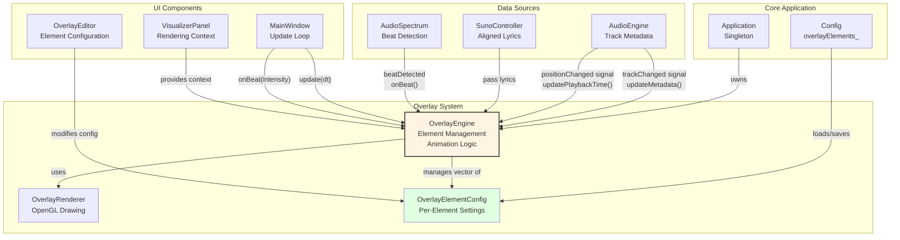
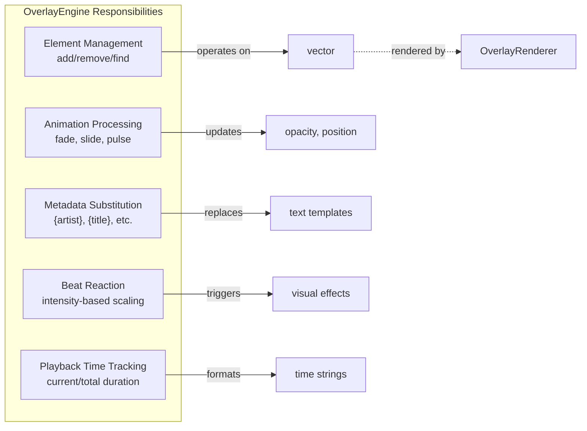
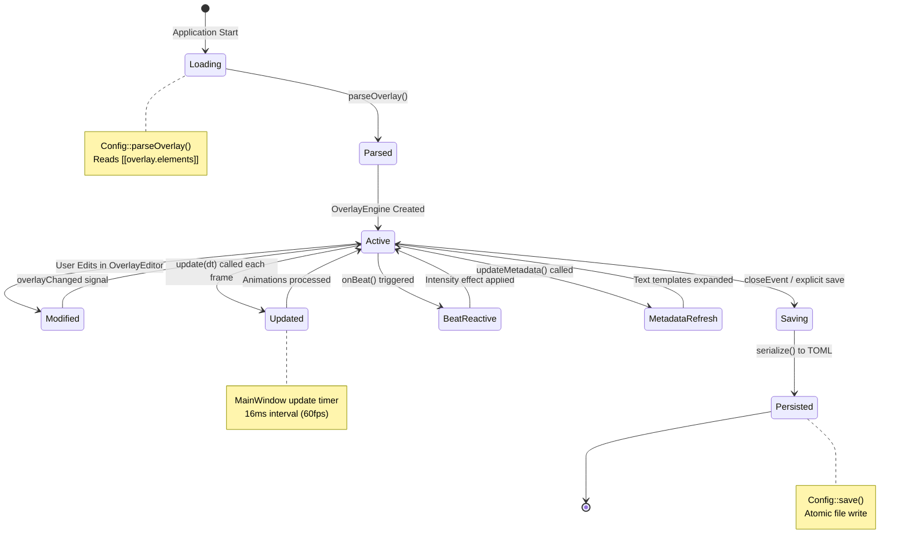
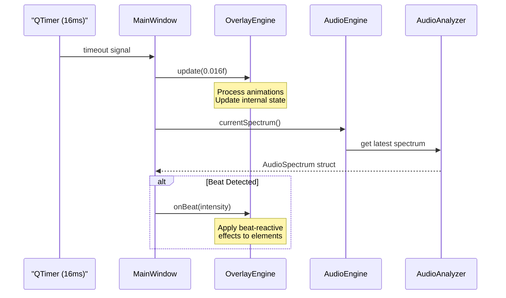
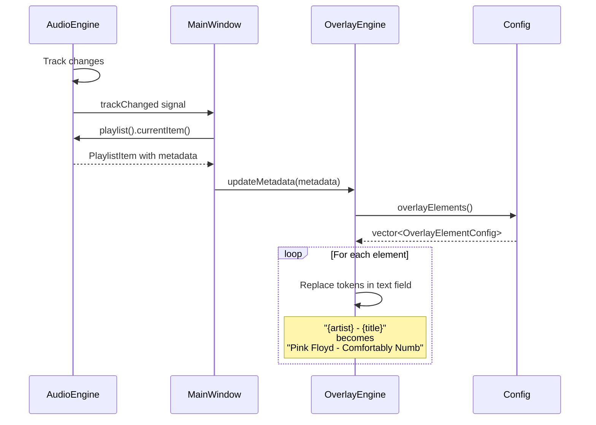
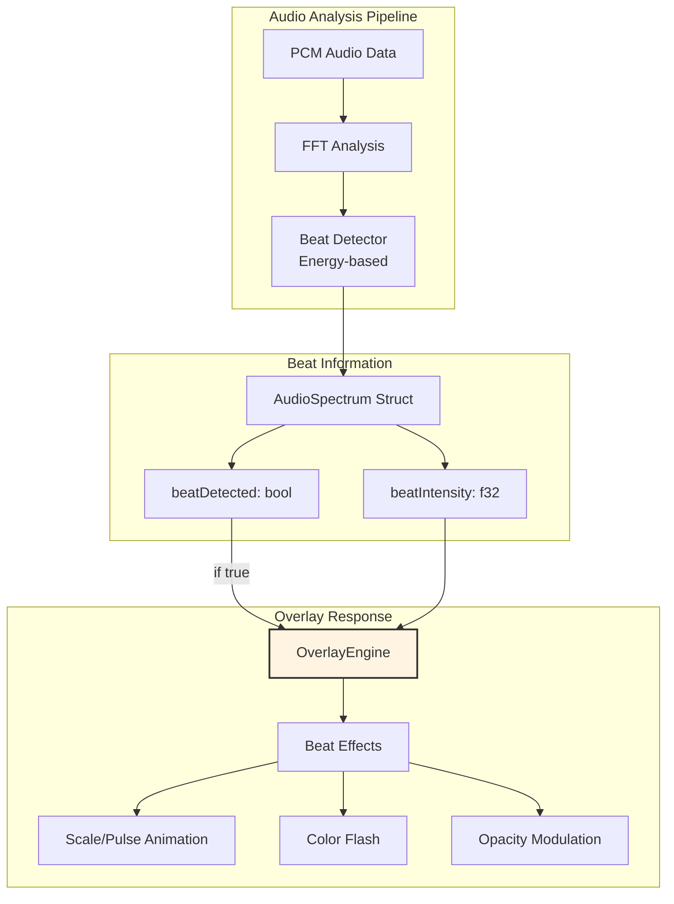
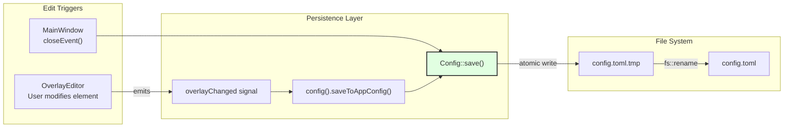
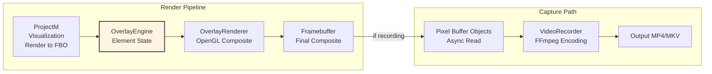

# OverlayEngine & Elements

<details>
<summary>Relevant source files</summary>

The following files were used as context for generating this wiki page:

- [src/core/Config.cpp](src/core/Config.cpp)
- [src/recorder/VideoRecorder.cpp](src/recorder/VideoRecorder.cpp)
- [src/ui/MainWindow.cpp](src/ui/MainWindow.cpp)
- [src/ui/MainWindow.hpp](src/ui/MainWindow.hpp)

</details>


This document describes the `OverlayEngine` class and the `OverlayElementConfig` structure, which together manage text overlay elements displayed on top of the visualization output. The overlay system provides dynamic text rendering for metadata display, lyrics, and animated text effects that can respond to audio beats.

For information about the OpenGL rendering implementation of overlays, see [OverlayRenderer](#6.2). For the UI widget used to edit overlay configurations, see the OverlayEditor component discussed in [MainWindow & Layout](#7.1).

---

## System Architecture

The overlay system consists of two primary components: `OverlayEngine` handles element management, animations, and business logic, while `OverlayRenderer` (documented separately) handles the OpenGL drawing. The engine is owned by the `Application` singleton and accessed by various UI and visualization components.



**Sources:** [src/ui/MainWindow.cpp:43-44](), [src/ui/MainWindow.cpp:255-273](), [src/ui/MainWindow.cpp:281-286]()

---

## OverlayElementConfig Structure

Each overlay element is configured via an `OverlayElementConfig` struct, which defines its visual properties, position, and animation behavior. These configurations are stored in the global `Config` singleton and persisted to the TOML configuration file.

### Configuration Fields

| Field | Type | Purpose | Default |
|-------|------|---------|---------|
| `id` | `std::string` | Unique identifier for the element | `"element"` |
| `text` | `std::string` | Static text or template string (e.g., `"{artist} - {title}"`) | `""` |
| `position` | `Vec2` | Normalized screen coordinates (0.0-1.0) | `{0.0, 0.0}` |
| `fontSize` | `u32` | Font size in points | `32` |
| `color` | `Color` | Text color (parsed from hex string) | `#FFFFFF` |
| `opacity` | `f32` | Alpha transparency (0.0-1.0) | `1.0` |
| `animation` | `std::string` | Animation type: `"none"`, `"fade"`, `"slide"`, etc. | `"none"` |
| `animationSpeed` | `f32` | Animation speed multiplier | `1.0` |
| `anchor` | `std::string` | Text alignment: `"left"`, `"center"`, `"right"` | `"left"` |
| `visible` | `bool` | Whether the element is currently displayed | `true` |

### TOML Configuration Format

Overlay elements are defined in the `config.toml` file under the `[[overlay.elements]]` array:

```toml
[overlay]
enabled = true

[[overlay.elements]]
id = "track_info"
text = "{artist} - {title}"
position = { x = 0.05, y = 0.95 }
font_size = 32
color = "#FFFFFF"
opacity = 0.9
animation = "fade"
animation_speed = 1.0
anchor = "left"
visible = true

[[overlay.elements]]
id = "current_time"
text = "{current_time} / {total_time}"
position = { x = 0.95, y = 0.95 }
font_size = 24
color = "#00FF88"
opacity = 0.8
animation = "none"
anchor = "right"
visible = true
```

**Sources:** [src/core/Config.cpp:250-286](), [src/core/Config.cpp:386-404]()

---

## OverlayEngine Class

The `OverlayEngine` class manages the lifecycle of overlay elements, processes template strings with metadata substitution, updates animations, and handles beat-reactive effects. It is instantiated and owned by the `Application` singleton.

### Key Responsibilities



**Sources:** [src/ui/MainWindow.cpp:258-273](), [src/ui/MainWindow.cpp:281-286]()

### Element Management Interface

The `Config` singleton provides methods for managing overlay elements that the `OverlayEngine` uses:

- **`Config::addOverlayElement(OverlayElementConfig elem)`**: Adds a new element to the configuration
- **`Config::removeOverlayElement(const std::string& id)`**: Removes an element by its unique ID
- **`Config::findOverlayElement(const std::string& id)`**: Returns a pointer to an element for modification
- **`Config::overlayElements()`**: Returns the vector of all configured elements

All methods are thread-safe, using a mutex internally, and mark the configuration as dirty for persistence.

**Sources:** [src/core/Config.cpp:438-458]()

---

## Element Lifecycle

Overlay elements follow a well-defined lifecycle from configuration loading through runtime updates to final persistence:



**Sources:** [src/core/Config.cpp:250-286](), [src/ui/MainWindow.cpp:271-273](), [src/ui/MainWindow.cpp:276-286](), [src/ui/MainWindow.cpp:439]()

---

## Update Loop Integration

The `OverlayEngine` is integrated into the main application update loop, which runs at approximately 60fps (16ms intervals). The `MainWindow` class orchestrates the updates and passes relevant state information.

### Update Flow



### Update Method Invocation

The update loop is established in `MainWindow::setupUpdateTimer()`:

```cpp
// MainWindow connects a QTimer to call onUpdateLoop every 16ms
connect(&updateTimer_, &QTimer::timeout, this, &MainWindow::onUpdateLoop);
updateTimer_.start(16);

// onUpdateLoop processes overlay updates and beat detection
void MainWindow::onUpdateLoop() {
    overlayEngine_->update(0.016f);  // Fixed timestep
    const auto& spectrum = audioEngine_->currentSpectrum();
    if (spectrum.beatDetected)
        overlayEngine_->onBeat(spectrum.beatIntensity);
}
```

**Sources:** [src/ui/MainWindow.cpp:276-286]()

---

## Metadata and Template Substitution

The `OverlayEngine` supports dynamic text rendering by substituting template tokens in the `text` field of overlay elements. When `updateMetadata()` is called with new track information, the engine replaces tokens with actual values.

### Supported Template Tokens

Common template tokens that can be used in overlay element text fields:

| Token | Description | Example Value |
|-------|-------------|---------------|
| `{artist}` | Track artist name | `"Pink Floyd"` |
| `{title}` | Track title | `"Comfortably Numb"` |
| `{album}` | Album name | `"The Wall"` |
| `{year}` | Release year | `"1979"` |
| `{genre}` | Music genre | `"Progressive Rock"` |
| `{current_time}` | Current playback position | `"2:35"` |
| `{total_time}` | Total track duration | `"6:23"` |

### Metadata Update Flow



### Playback Time Updates

Time-based tokens are updated continuously via `updatePlaybackTime()`:

```cpp
// Called on every position change from AudioEngine
audioEngine_->positionChanged.connect([this](Duration pos) {
    QMetaObject::invokeMethod(this, [this, pos] {
        overlayEngine_->updatePlaybackTime(
            static_cast<f32>(pos.count()) / 1000.0f
        );
    });
});
```

**Sources:** [src/ui/MainWindow.cpp:255-269]()

---

## Beat-Reactive Effects

The overlay system can respond to audio beats detected by the `AudioAnalyzer`. When a beat is detected, the `OverlayEngine::onBeat()` method is called with an intensity value, allowing overlay elements to react visually.

### Beat Detection Integration



### Beat Reaction Implementation

The `MainWindow` checks for beat detection in the update loop and forwards the intensity to the overlay engine:

```cpp
void MainWindow::onUpdateLoop() {
    overlayEngine_->update(0.016f);
    const auto& spectrum = audioEngine_->currentSpectrum();
    if (spectrum.beatDetected)
        overlayEngine_->onBeat(spectrum.beatIntensity);
}
```

The beat intensity value (typically 0.0-1.0, but can exceed 1.0 for strong beats) can be used to:
- Scale elements temporarily (pulse effect)
- Increase opacity momentarily (flash effect)
- Modify colors (intensity-based tinting)
- Trigger one-shot animations

**Sources:** [src/ui/MainWindow.cpp:281-286]()

---

## Animation System

Overlay elements support various animation types configured via the `animation` field in `OverlayElementConfig`. Animations are processed during the `update()` call and modify element properties over time.

### Animation Types

| Animation | Description | Modified Properties |
|-----------|-------------|-------------------|
| `"none"` | No animation, static display | None |
| `"fade"` | Gradual opacity changes | `opacity` |
| `"slide"` | Position interpolation | `position.x`, `position.y` |
| `"pulse"` | Size/opacity oscillation | `fontSize`, `opacity` |
| `"beat_reactive"` | Reacts to beat events | Multiple (beat-driven) |

### Animation Speed Control

The `animationSpeed` field acts as a multiplier for animation timing:
- `1.0` = normal speed
- `2.0` = twice as fast
- `0.5` = half speed

This allows fine-tuning of animation timing without changing the animation implementation.

**Sources:** [src/core/Config.cpp:275-277]()

---

## Configuration Persistence

Overlay element configurations are persisted through the global `Config` singleton's TOML serialization system. Changes made through the `OverlayEditor` trigger saves, and the configuration is also saved when the application closes.

### Save Trigger Flow



### Atomic Save Mechanism

The configuration system uses atomic writes to prevent corruption:

1. Serialize configuration to TOML format
2. Write to temporary file (`config.toml.tmp`)
3. Atomically rename to final path (`config.toml`)

This ensures that the configuration file is never left in a partially-written state.

**Sources:** [src/ui/MainWindow.cpp:271-273](), [src/ui/MainWindow.cpp:439](), [src/core/Config.cpp:143-171]()

---

## Integration with Recording System

When video recording is active, overlay elements are composited into the final output. The `OverlayRenderer` draws overlays after the projectM visualization is rendered, before frame capture occurs.

### Recording Pipeline Position



The overlays are rendered in the same OpenGL context as the visualization, ensuring they are captured by the PBO-based frame grabbing system without additional overhead.

**Sources:** [src/recorder/VideoRecorder.cpp:113-128](), [src/recorder/VideoRecorder.cpp:213-239]()

---

## Code Entity Reference

### Key Classes and Files

| Entity | Location | Purpose |
|--------|----------|---------|
| `OverlayEngine` | `src/overlay/OverlayEngine.hpp/cpp` | Core engine for overlay management |
| `OverlayElementConfig` | `src/core/Config.hpp` | Configuration structure for elements |
| `Config::overlayElements_` | `src/core/Config.hpp` | Storage for element configs |
| `Config::parseOverlay()` | [src/core/Config.cpp:250-286]() | TOML parsing for overlay section |
| `Config::addOverlayElement()` | [src/core/Config.cpp:438-442]() | Add element to config |
| `Config::removeOverlayElement()` | [src/core/Config.cpp:444-449]() | Remove element by ID |
| `Config::findOverlayElement()` | [src/core/Config.cpp:451-458]() | Find element by ID |
| `MainWindow::setupConnections()` | [src/ui/MainWindow.cpp:248-274]() | Wire up overlay signals |
| `MainWindow::onUpdateLoop()` | [src/ui/MainWindow.cpp:281-286]() | Update overlay state |

### Signal Connections

The overlay engine integrates via several signal connections established in `MainWindow`:

```cpp
// Track metadata changes
audioEngine_->trackChanged.connect([this] {
    if (const auto* item = audioEngine_->playlist().currentItem()) {
        overlayEngine_->updateMetadata(item->metadata);
    }
});

// Playback position updates
audioEngine_->positionChanged.connect([this](Duration pos) {
    overlayEngine_->updatePlaybackTime(
        static_cast<f32>(pos.count()) / 1000.0f
    );
});

// Configuration changes from editor
connect(overlayEditor_, &OverlayEditor::overlayChanged, this, [this] {
    overlayEngine_->config().saveToAppConfig();
});
```

**Sources:** [src/ui/MainWindow.cpp:255-273]()