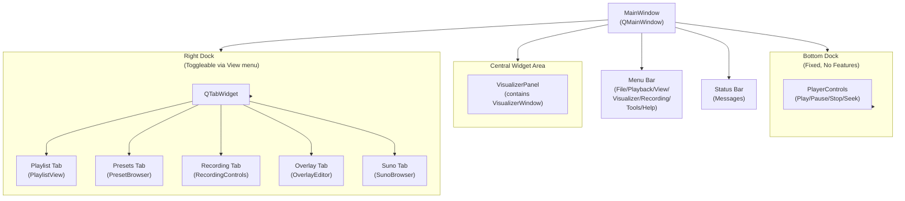
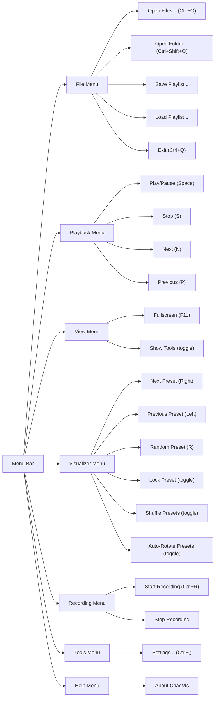
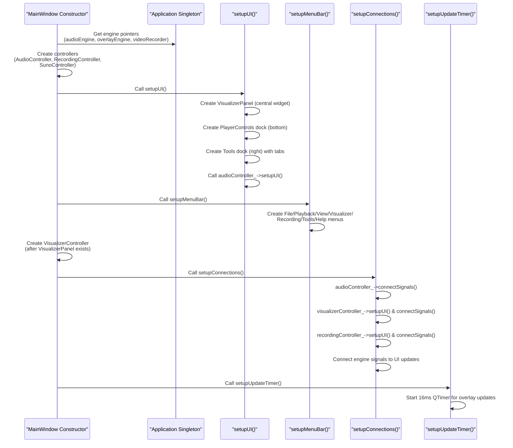
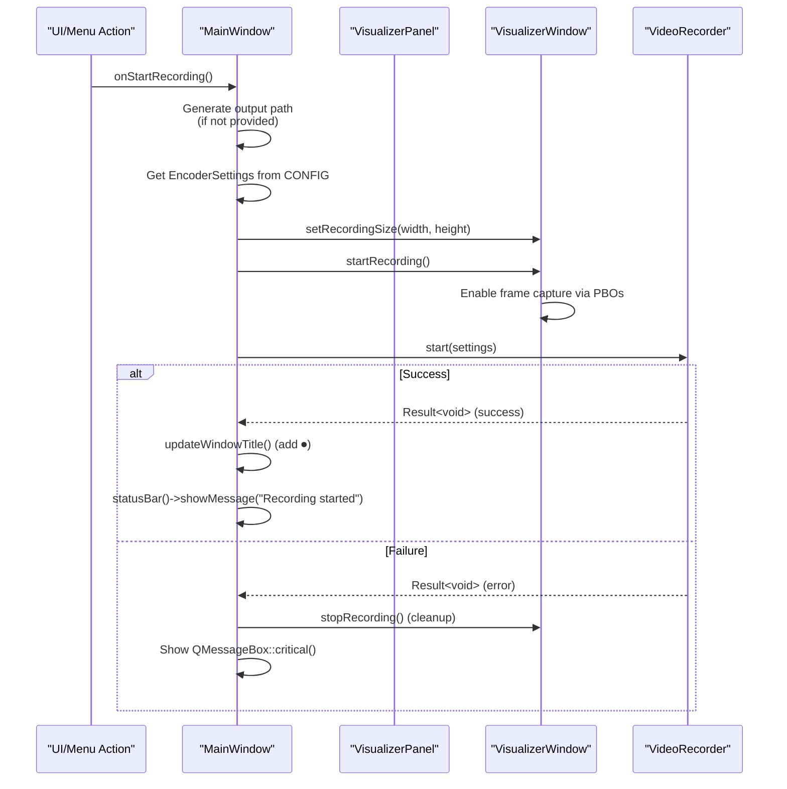

# MainWindow & Layout

<details>
<summary>Relevant source files</summary>

The following files were used as context for generating this wiki page:

- [src/ui/MainWindow.cpp](src/ui/MainWindow.cpp)
- [src/ui/MainWindow.hpp](src/ui/MainWindow.hpp)

</details>


This document describes the **MainWindow** class, which serves as the top-level application window and UI orchestrator. It manages the Qt layout hierarchy, owns controller objects, holds non-owning references to engines, and coordinates user interactions through menus, docks, and dialogs.

For information about the controller pattern and signal routing, see [Controller Layer](#7.2). For settings management, see [Settings Dialog](#7.3).

---

## Purpose and Scope

The `MainWindow` class is responsible for:

- Constructing and laying out the application's visual hierarchy
- Owning controller objects that mediate between UI widgets and engines
- Providing menu-based access to all application features
- Handling window-level events (drag-and-drop, keyboard shortcuts, close confirmation)
- Running a timer-based update loop for the overlay system
- Managing modal dialogs (settings, about)

It does **not** contain business logic—that is delegated to controllers and engines. It does **not** own engines—those are owned by the `Application` singleton.

---

## Overall Structure

**MainWindow Layout Hierarchy**



Sources: [src/ui/MainWindow.cpp:89-126]()

---

## Ownership and Reference Model

MainWindow follows a clear ownership pattern:

| Component Type | Ownership | Access Pattern |
|---------------|-----------|----------------|
| **Engines** | Owned by `Application` | Non-owning raw pointers obtained via `APP->audioEngine()`, etc. |
| **Controllers** | Owned by `MainWindow` | `std::unique_ptr<>` members |
| **UI Widgets** | Owned by `MainWindow` | Raw pointers (Qt parent-child manages lifetime) |
| **Dock Widgets** | Owned by `MainWindow` | Raw pointers (Qt parent-child manages lifetime) |

**Ownership Relationships**

```mermaid
graph TB
    APP["Application Singleton<br/>(Owns Engines)"]
    
    MW["MainWindow<br/>(std::unique_ptr controllers)"]
    
    subgraph Engines["Engines (Non-owning Pointers)"]
        AE["AudioEngine*"]
        OE["OverlayEngine*"]
        VR["VideoRecorder*"]
    end
    
    subgraph Controllers["Controllers (std::unique_ptr)"]
        AC["AudioController"]
        VC["VisualizerController"]
        RC["RecordingController"]
        SC["SunoController"]
    end
    
    subgraph Widgets["UI Widgets (Qt Parent-Child)"]
        VP_W["VisualizerPanel*"]
        PC_W["PlayerControls*"]
        PL_W["PlaylistView*"]
        PB_W["PresetBrowser*"]
        RC_W["RecordingControls*"]
        OV_W["OverlayEditor*"]
        SB_W["SunoBrowser*"]
    end
    
    APP -.->|"get via APP->"| AE
    APP -.->|"get via APP->"| OE
    APP -.->|"get via APP->"| VR
    
    MW -->|"owns (unique_ptr)"| AC
    MW -->|"owns (unique_ptr)"| VC
    MW -->|"owns (unique_ptr)"| RC
    MW -->|"owns (unique_ptr)"| SC
    
    MW -->|"holds non-owning"| AE
    MW -->|"holds non-owning"| OE
    MW -->|"holds non-owning"| VR
    
    MW -->|"Qt parent-child"| VP_W
    MW -->|"Qt parent-child"| PC_W
    MW -->|"Qt parent-child"| PL_W
    MW -->|"Qt parent-child"| PB_W
    MW -->|"Qt parent-child"| RC_W
    MW -->|"Qt parent-child"| OV_W
    MW -->|"Qt parent-child"| SB_W
    
    AC -.->|"references"| AE
    RC -.->|"references"| VR
    SC -.->|"references"| AE
    SC -.->|"references"| OE
```



Sources: [src/ui/MainWindow.hpp:91-100](), [src/ui/MainWindow.cpp:42-60]()

---

## Layout Components

### Central Widget: VisualizerPanel

The central widget is a `VisualizerPanel`, which wraps the `VisualizerWindow` (a `QWindow` with OpenGL context). This panel occupies the majority of the window space and displays the projectM visualizations.

```cpp
visualizerPanel_ = new VisualizerPanel(this);
visualizerPanel_->setOverlayEngine(overlayEngine_);
setCentralWidget(visualizerPanel_);
```

Sources: [src/ui/MainWindow.cpp:90-92]()

### Player Dock (Bottom)

The player dock is **fixed** at the bottom of the window and contains `PlayerControls`. It has no dock widget features (cannot be closed, floated, or moved):

```cpp
auto* controlsDock = new QDockWidget("Player", this);
controlsDock->setWidget(playerControls_);
controlsDock->setFeatures(QDockWidget::NoDockWidgetFeatures);
controlsDock->setTitleBarWidget(new QWidget()); // Hide title bar
addDockWidget(Qt::BottomDockWidgetArea, controlsDock);
```

The `PlayerControls` widget provides play/pause/stop buttons, a seek slider, and volume control. It is configured by `AudioController::setupUI()`.

Sources: [src/ui/MainWindow.cpp:94-99](), [src/ui/MainWindow.cpp:123]()

### Tools Dock (Right)

The tools dock is **toggleable** via the View menu and contains a `QTabWidget` with five tabs:

| Tab Name | Widget Class | Controller | Purpose |
|----------|-------------|------------|---------|
| **Playlist** | `PlaylistView` | `AudioController` | Display and manage the current playlist |
| **Presets** | `PresetBrowser` | `VisualizerController` | Browse and select projectM presets |
| **Recording** | `RecordingControls` | `RecordingController` | Start/stop video recording |
| **Overlay** | `OverlayEditor` | Direct connection to `OverlayEngine` | Configure text overlays |
| **Suno** | `SunoBrowser` | `SunoController` | Browse and download Suno AI clips |

```cpp
auto* rightTabs = new QTabWidget();
rightTabs->addTab(playlistView_, "Playlist");
rightTabs->addTab(presetBrowser_, "Presets");
rightTabs->addTab(recordingControls_, "Recording");
rightTabs->addTab(overlayEditor_, "Overlay");
rightTabs->addTab(sunoBrowser, "Suno");

toolsDock_ = new QDockWidget("Tools", this);
toolsDock_->setObjectName("ToolsDock");
toolsDock_->setWidget(rightTabs);
addDockWidget(Qt::RightDockWidgetArea, toolsDock_);
```

The dock's initial visibility is determined by `CONFIG.ui().showPresets` and `CONFIG.ui().showPlaylist`. Users can toggle it via the View → Show Tools menu action.

Sources: [src/ui/MainWindow.cpp:103-125](), [src/ui/MainWindow.cpp:174-184]()

---

## Menu Bar Structure

The menu bar provides access to all major features through seven top-level menus:

**Menu Structure and Keyboard Shortcuts**



Sources: [src/ui/MainWindow.cpp:128-246]()

### Menu Actions and Implementation

Most menu actions are implemented as lambda functions that call methods on engines or controllers:

```cpp
// Example: Playback menu actions directly call AudioEngine
playbackMenu->addAction(
    "&Play/Pause",
    this,
    [this] { audioEngine_->togglePlayPause(); },
    QKeySequence(Qt::Key_Space));

// Example: Visualizer menu actions call ProjectMBridge via VisualizerPanel
vizMenu->addAction(
    "&Next Preset",
    this,
    [this] { visualizerPanel_->visualizer()->projectM().nextPreset(); },
    QKeySequence(Qt::Key_Right));
```

Toggle actions (Lock Preset, Shuffle Presets, Auto-Rotate Presets) synchronize with `CONFIG` and call `updateSettings()` on the visualizer.

Sources: [src/ui/MainWindow.cpp:144-227]()

---

## Setup Process

The MainWindow initialization follows a four-step sequence:

**Initialization Sequence**



Sources: [src/ui/MainWindow.cpp:36-71]()

### Step 1: Obtain Engine References

```cpp
// Get engines from Application singleton
audioEngine_ = APP->audioEngine();
overlayEngine_ = APP->overlayEngine();
videoRecorder_ = APP->videoRecorder();
```

Null checks are performed to ensure Application is properly initialized.

Sources: [src/ui/MainWindow.cpp:42-51]()

### Step 2: Create Controllers

Controllers are created with non-owning engine pointers and `this` as parent:

```cpp
audioController_ = std::make_unique<AudioController>(audioEngine_, this);
recordingController_ = std::make_unique<RecordingController>(videoRecorder_, this);
sunoController_ = std::make_unique<suno::SunoController>(audioEngine_, overlayEngine_, this);
```

The `VisualizerController` is created **after** `setupUI()` because it requires access to the `ProjectMBridge` instance inside `VisualizerPanel`.

Sources: [src/ui/MainWindow.cpp:55-65]()

### Step 3: Setup UI and Menu Bar

`setupUI()` creates all widgets and docks (described in [Layout Components](#layout-components)). `setupMenuBar()` populates the menu bar (described in [Menu Bar Structure](#menu-bar-structure)).

Sources: [src/ui/MainWindow.cpp:61-62]()

### Step 4: Setup Connections

`setupConnections()` delegates to controller `setupUI()` and `connectSignals()` methods, then establishes direct signal connections for:

- **Track changes**: Update overlay metadata and window title
- **Position changes**: Update overlay playback time
- **Overlay config changes**: Save to `CONFIG`

```cpp
audioEngine_->trackChanged.connect([this] {
    QMetaObject::invokeMethod(this, [this] {
        if (const auto* item = audioEngine_->playlist().currentItem()) {
            overlayEngine_->updateMetadata(item->metadata);
            updateWindowTitle();
        }
    });
});
```

Sources: [src/ui/MainWindow.cpp:248-274]()

### Step 5: Start Update Timer

A `QTimer` is started with a 16ms interval (~60 FPS) to drive the overlay update loop:

```cpp
connect(&updateTimer_, &QTimer::timeout, this, &MainWindow::onUpdateLoop);
updateTimer_.start(16);
```

Sources: [src/ui/MainWindow.cpp:276-279]()

---

## Event Handling

### Drag-and-Drop

MainWindow accepts file drops to add tracks to the playlist. The `dragEnterEvent()` accepts URLs, and `dropEvent()` extracts local file paths and calls `addToPlaylist()`:

```cpp
void MainWindow::dropEvent(QDropEvent* event) {
    QStringList paths;
    for (const auto& url : event->mimeData()->urls())
        if (url.isLocalFile())
            paths.append(url.toLocalFile());
    if (!paths.isEmpty()) {
        for (const auto& p : paths)
            addToPlaylist(fs::path(p.toStdString()));
        statusBar()->showMessage(
            QString("Added %1 files to playlist").arg(paths.size()));
    }
}
```

The `addToPlaylist()` method handles both files and directories recursively.

Sources: [src/ui/MainWindow.cpp:453-468](), [src/ui/MainWindow.cpp:300-311]()

### Keyboard Shortcuts

In addition to menu-bound shortcuts, `keyPressEvent()` provides direct handling for Space (play/pause):

```cpp
void MainWindow::keyPressEvent(QKeyEvent* event) {
    switch (event->key()) {
    case Qt::Key_Space:
        audioEngine_->togglePlayPause();
        break;
    default:
        QMainWindow::keyPressEvent(event);
    }
}
```

Sources: [src/ui/MainWindow.cpp:443-451]()

### Close Event

On window close, MainWindow checks if recording is active and prompts the user to confirm. If confirmed (or not recording), it saves the configuration before closing:

```cpp
void MainWindow::closeEvent(QCloseEvent* event) {
    if (videoRecorder_->isRecording()) {
        auto reply = QMessageBox::question(
            this, "Recording Active",
            "Recording in progress. Stop and exit?",
            QMessageBox::Yes | QMessageBox::No);
        if (reply == QMessageBox::No) {
            event->ignore();
            return;
        }
        stopRecording();
    }
    CONFIG.save(CONFIG.configPath());
    event->accept();
}
```

Sources: [src/ui/MainWindow.cpp:426-441]()

---

## Update Loop

The `onUpdateLoop()` slot is called every 16ms by the `updateTimer_`. It performs two tasks:

1. **Update overlay animations**: Calls `overlayEngine_->update(0.016f)` with the delta time
2. **Feed beat information**: If a beat is detected in the current audio spectrum, calls `overlayEngine_->onBeat()`

```cpp
void MainWindow::onUpdateLoop() {
    overlayEngine_->update(0.016f);
    const auto& spectrum = audioEngine_->currentSpectrum();
    if (spectrum.beatDetected)
        overlayEngine_->onBeat(spectrum.beatIntensity);
}
```

This loop ensures smooth text animations and beat-reactive effects in overlays.

Sources: [src/ui/MainWindow.cpp:281-286]()

---

## Dialog Management

### Settings Dialog

The `SettingsDialog` is shown modally via the Tools → Settings menu action. On acceptance, it triggers `updateSettings()` on the visualizer to apply changes:

```cpp
void MainWindow::onShowSettings() {
    SettingsDialog dialog(this);
    if (dialog.exec() == QDialog::Accepted) {
        if (visualizerPanel_ && visualizerPanel_->visualizer())
            visualizerPanel_->visualizer()->updateSettings();
    }
}
```

See [Settings Dialog](#7.3) for details on the settings UI.

Sources: [src/ui/MainWindow.cpp:409-415]()

### About Dialog

The About dialog displays version and build information:

```cpp
QMessageBox::about(
    this,
    "About ChadVis",
    "<h2>ChadVis Audio Player</h2><p>Version 1.1.0</p>"
    "<p>Built with Qt6, projectM v4, and Arch Linux pride.</p><hr>"
    "<p><b>\"I use Arch btw\"</b></p>");
```

Sources: [src/ui/MainWindow.cpp:417-424]()

### Suno Cookie Dialog

The `SunoCookieDialog` is managed by `SunoController` and shown when authentication is required. See [SunoController & UI](#8.2) for details.

---

## Window Title Updates

The window title reflects the current playback state:

| State | Title Format |
|-------|--------------|
| Idle | `"ChadVis"` |
| Playing | `"Artist - Title \| ChadVis"` |
| Recording | `"⏺ Artist - Title \| ChadVis"` |

The `updateWindowTitle()` method is called on track changes and recording state changes:

```cpp
void MainWindow::updateWindowTitle() {
    QString title = "ChadVis";
    if (const auto* item = audioEngine_->playlist().currentItem()) {
        title = QString::fromStdString(item->metadata.displayArtist()) + " - " +
                QString::fromStdString(item->metadata.displayTitle()) + " | " + title;
    }
    if (videoRecorder_->isRecording())
        title = "⏺ " + title;
    setWindowTitle(title);
}
```

Sources: [src/ui/MainWindow.cpp:288-298]()

---

## Recording Control

MainWindow provides `startRecording()` and `stopRecording()` methods that coordinate between `VideoRecorder` and `VisualizerWindow`:

**Recording Start Sequence**



Sources: [src/ui/MainWindow.cpp:313-343](), [src/ui/MainWindow.cpp:345-352](), [src/ui/MainWindow.cpp:357-362]()

The output path is auto-generated with a timestamp if not provided:

```cpp
auto now = std::chrono::system_clock::now();
auto time = std::chrono::system_clock::to_time_t(now);
std::tm tm = *std::localtime(&time);
char buf[64];
std::strftime(buf, sizeof(buf), "chadvis-projectm-qt_%Y%m%d_%H%M%S", &tm);
path = CONFIG.recording().outputDirectory / 
       (std::string(buf) + EncoderSettings::fromConfig().containerExtension());
```

Sources: [src/ui/MainWindow.cpp:316-324]()

---

## Summary

The `MainWindow` class serves as the UI orchestration layer, managing layout, controllers, and user interactions. It follows a clear separation of concerns:

- **Layout**: Central visualizer, bottom player dock, right tools dock with tabs
- **Ownership**: Controllers are owned (unique_ptr), engines are referenced (raw pointers from Application)
- **Setup**: Four-phase initialization (get engines → create controllers → setup UI/menus → connect signals)
- **Menus**: Seven top-level menus with keyboard shortcuts for all features
- **Events**: Drag-and-drop for playlist additions, close confirmation during recording
- **Update Loop**: 16ms timer for overlay animations and beat detection
- **Dialogs**: Modal settings dialog, about dialog, Suno authentication dialog

All business logic is delegated to controllers and engines, keeping MainWindow focused on UI structure and coordination.