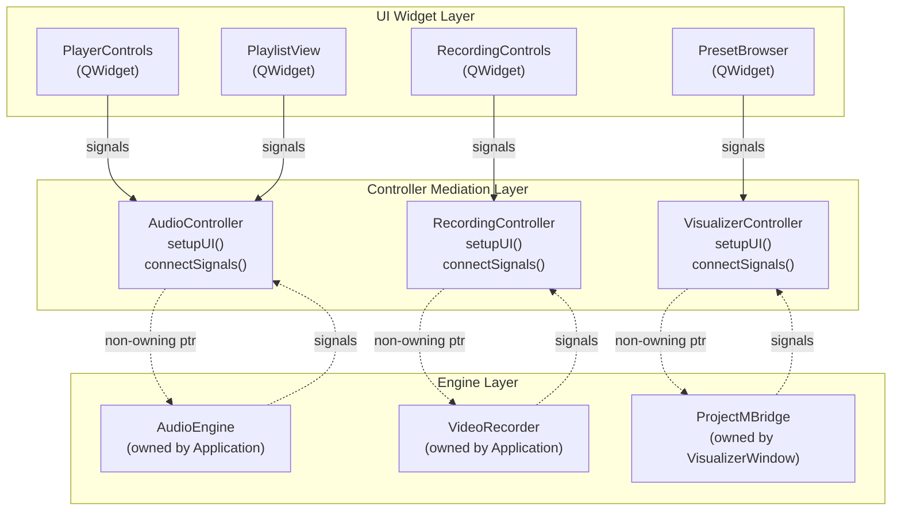
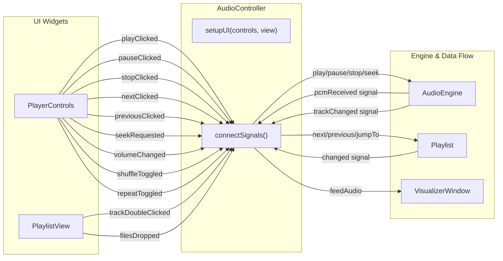
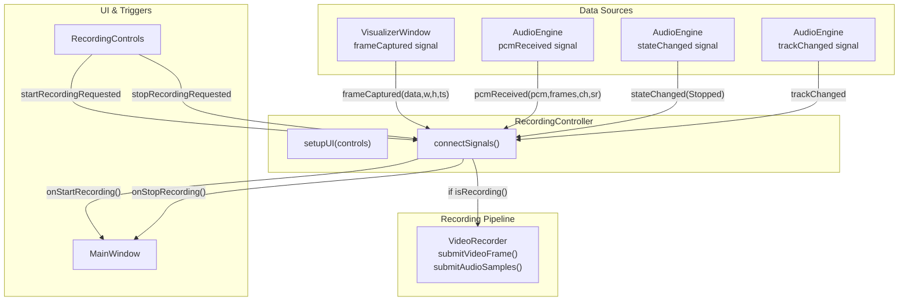
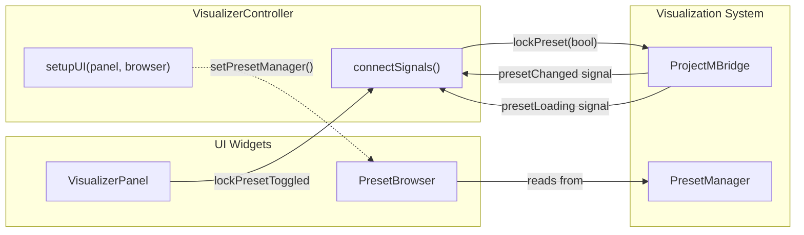
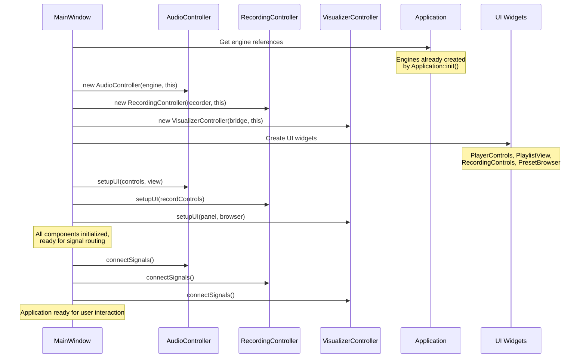

# Controller Layer

<details>
<summary>Relevant source files</summary>

The following files were used as context for generating this wiki page:

- [docs/ARCHITECTURE.md](docs/ARCHITECTURE.md)
- [src/ui/controllers/AudioController.cpp](src/ui/controllers/AudioController.cpp)
- [src/ui/controllers/RecordingController.cpp](src/ui/controllers/RecordingController.cpp)
- [src/ui/controllers/VisualizerController.cpp](src/ui/controllers/VisualizerController.cpp)

</details>


## Purpose and Scope

The Controller Layer implements a mediator pattern that decouples UI widgets from core engines. Controllers are responsible for signal routing, connecting user interactions to engine operations, and synchronizing state between the UI and backend systems. They hold non-owning pointers to engines (owned by `Application`) and configure UI widgets via standardized setup methods.

For information about the UI widgets themselves, see [MainWindow & Layout](#7.1). For configuration of user preferences, see [Settings Dialog](#7.3). For the Suno-specific controller, see [SunoController & UI](#8.2).

**Sources:** [docs/ARCHITECTURE.md:26-32](), [src/ui/controllers/AudioController.cpp](), [src/ui/controllers/RecordingController.cpp](), [src/ui/controllers/VisualizerController.cpp]()

---

## Controller Pattern Architecture

All controllers follow a consistent architectural pattern designed to prevent tight coupling between UI components and engine subsystems. This pattern ensures that UI widgets never directly access engines, and engines remain unaware of the UI layer.



**Diagram: Controller Mediation Pattern**

The pattern consists of three key components:

| Component | Responsibility | Ownership |
|-----------|---------------|-----------|
| **UI Widgets** | Display state, emit user interaction signals | Owned by `MainWindow` docks/panels |
| **Controllers** | Route signals, invoke engine methods, synchronize state | Owned by `MainWindow`, created during initialization |
| **Engines** | Perform actual work (audio, recording, visualization) | Owned by `Application` singleton |

**Sources:** [docs/ARCHITECTURE.md:26-32](), [src/ui/controllers/AudioController.cpp:12-22](), [src/ui/controllers/RecordingController.cpp:15-23]()

---

## Controller Interface

Each controller implements two primary methods that define its lifecycle:

### `setupUI()`

Configures UI widgets by passing them non-owning pointers to the engines they need to observe. This method is called during `MainWindow` initialization after all engines have been created.

**Example from AudioController:**
```cpp
void AudioController::setupUI(PlayerControls* controls, PlaylistView* view) {
    controls_ = controls;
    view_ = view;
    controls_->setAudioEngine(engine_);
    view_->setPlaylist(&engine_->playlist());
}
```

**Sources:** [src/ui/controllers/AudioController.cpp:16-22]()

### `connectSignals()`

Establishes all signal-slot connections between UI widgets and engines. This method is called after `setupUI()` to ensure all components are properly initialized before signal routing begins.

**Example from RecordingController:**
```cpp
void RecordingController::connectSignals() {
    connect(controls_, &RecordingControls::startRecordingRequested,
            [this](const QString& path) { window_->onStartRecording(path); });
    // ... additional connections
}
```

**Sources:** [src/ui/controllers/RecordingController.cpp:25-83]()

---

## AudioController

`AudioController` mediates between playback UI components (`PlayerControls`, `PlaylistView`) and the `AudioEngine`. It also feeds PCM data to the visualizer and manages playlist state synchronization.



**Diagram: AudioController Signal Routing**

### Key Responsibilities

| Signal Source | Target Action | Code Reference |
|--------------|---------------|----------------|
| `PlayerControls::playClicked` | `AudioEngine::play()` | [src/ui/controllers/AudioController.cpp:26-28]() |
| `PlayerControls::pauseClicked` | `AudioEngine::pause()` | [src/ui/controllers/AudioController.cpp:29-31]() |
| `PlayerControls::stopClicked` | `AudioEngine::stop()` | [src/ui/controllers/AudioController.cpp:32-34]() |
| `PlayerControls::nextClicked` | `Playlist::next()` | [src/ui/controllers/AudioController.cpp:35-37]() |
| `PlayerControls::previousClicked` | `Playlist::previous()` | [src/ui/controllers/AudioController.cpp:38-40]() |
| `PlayerControls::seekRequested` | `AudioEngine::seek()` | [src/ui/controllers/AudioController.cpp:41-43]() |
| `PlayerControls::volumeChanged` | `AudioEngine::setVolume()` | [src/ui/controllers/AudioController.cpp:44-46]() |
| `PlayerControls::shuffleToggled` | `Playlist::setShuffle()` | [src/ui/controllers/AudioController.cpp:47-49]() |
| `PlayerControls::repeatToggled` | `Playlist::setRepeatMode()` | [src/ui/controllers/AudioController.cpp:50-52]() |
| `PlaylistView::trackDoubleClicked` | `Playlist::jumpTo()` | [src/ui/controllers/AudioController.cpp:55-57]() |
| `PlaylistView::filesDropped` | `MainWindow::addToPlaylist()` | [src/ui/controllers/AudioController.cpp:58-64]() |
| `AudioEngine::pcmReceived` | `VisualizerWindow::feedAudio()` | [src/ui/controllers/AudioController.cpp:82-90]() |
| `Playlist::changed` | `PlayerControls::setControlsEnabled()` | [src/ui/controllers/AudioController.cpp:73-77]() |

### PCM Data Forwarding

The controller forwards PCM audio data from the engine to the visualizer window:

```cpp
engine_->pcmReceived.connect([this](const std::vector<f32>& pcm,
                                    u32 frames,
                                    u32 channels,
                                    u32 sampleRate) {
    if (!pcm.empty() && frames > 0) {
        window_->visualizerPanel()->visualizer()->feedAudio(
                pcm.data(), frames, channels, sampleRate);
    }
});
```

This connection is critical for real-time visualization, as it ensures audio samples flow directly from the decoder to projectM with minimal latency.

**Sources:** [src/ui/controllers/AudioController.cpp]()

---

## RecordingController

`RecordingController` manages the video recording pipeline, connecting frame capture from the `VisualizerWindow` and audio samples from the `AudioEngine` to the `VideoRecorder`. It also implements auto-recording features and automatic stop conditions.



**Diagram: RecordingController Data Flow**

### Key Responsibilities

| Signal Source | Condition | Action | Code Reference |
|--------------|-----------|--------|----------------|
| `RecordingControls::startRecordingRequested` | Always | `MainWindow::onStartRecording()` | [src/ui/controllers/RecordingController.cpp:26-28]() |
| `RecordingControls::stopRecordingRequested` | Always | `MainWindow::onStopRecording()` | [src/ui/controllers/RecordingController.cpp:30-32]() |
| `VisualizerWindow::frameCaptured` | If recording | `VideoRecorder::submitVideoFrame()` | [src/ui/controllers/RecordingController.cpp:36-45]() |
| `AudioEngine::pcmReceived` | If recording | `VideoRecorder::submitAudioSamples()` | [src/ui/controllers/RecordingController.cpp:48-57]() |
| `AudioEngine::trackChanged` | If recording | Auto-stop, then auto-start if enabled | [src/ui/controllers/RecordingController.cpp:60-74]() |
| `AudioEngine::stateChanged(Stopped)` | If recording | Auto-stop recording | [src/ui/controllers/RecordingController.cpp:77-82]() |

### Frame and Audio Submission Gating

The controller uses conditional checks to gate data submission based on recording state:

```cpp
connect(visualizer, &VisualizerWindow::frameCaptured, this,
        [this](std::vector<u8> data, u32 w, u32 h, i64 ts) {
            if (recorder_->isRecording()) {
                recorder_->submitVideoFrame(std::move(data), w, h, ts);
            }
        }, Qt::DirectConnection);
```

This prevents unnecessary frame copies and memory allocations when not recording. The `Qt::DirectConnection` ensures zero-latency submission from the OpenGL thread.

### Auto-Record on Track Change

When `CONFIG.recording().autoRecord` is enabled, the controller automatically starts recording new tracks after a 500ms delay:

```cpp
if (CONFIG.recording().autoRecord) {
    LOG_INFO("Auto-record enabled, starting recording for new track.");
    QTimer::singleShot(500, this, [this] {
        if (window_->audioEngine()->isPlaying()) {
            window_->onStartRecording("");
        }
    });
}
```

The delay allows the track to stabilize before recording begins.

**Sources:** [src/ui/controllers/RecordingController.cpp]()

---

## VisualizerController

`VisualizerController` manages the preset selection and visualization settings, connecting the `PresetBrowser` UI to the `ProjectMBridge` and handling preset lock state.



**Diagram: VisualizerController Connections**

### Key Responsibilities

| Signal Source | Action | Code Reference |
|--------------|--------|----------------|
| `VisualizerPanel::lockPresetToggled` | `ProjectMBridge::lockPreset()` | [src/ui/controllers/VisualizerController.cpp:27-29]() |
| `ProjectMBridge::presetChanged` | Log preset change | [src/ui/controllers/VisualizerController.cpp:32-34]() |

### Setup Phase

The controller connects the preset browser to the preset manager during initialization:

```cpp
void VisualizerController::setupUI(VisualizerPanel* panel,
                                   PresetBrowser* browser) {
    panel_ = panel;
    browser_ = browser;
    browser_->setPresetManager(&bridge_->presets());
}
```

This allows the browser to directly query preset lists without going through the controller for read-only operations.

**Sources:** [src/ui/controllers/VisualizerController.cpp]()

---

## SunoController

`SunoController` is documented in detail in [SunoController & UI](#8.2). It follows the same architectural pattern but includes additional responsibilities for API communication, database persistence, and download management. The controller owns a `SunoClient` and `SunoDatabase`, manages authentication state, and integrates downloaded tracks into the `AudioEngine` playlist.

**Sources:** [docs/ARCHITECTURE.md:31]()

---

## Controller Lifecycle

Controllers are instantiated and initialized by `MainWindow` during its constructor. The initialization follows a strict sequence to ensure all dependencies are available:

### Initialization Sequence



**Diagram: Controller Initialization Sequence**

### Ownership Model

| Component | Owner | Lifetime |
|-----------|-------|----------|
| `AudioController` | `MainWindow` | Entire application lifetime |
| `RecordingController` | `MainWindow` | Entire application lifetime |
| `VisualizerController` | `MainWindow` | Entire application lifetime |
| `SunoController` | `MainWindow` | Entire application lifetime |
| Engines (AudioEngine, VideoRecorder, etc.) | `Application` | Entire application lifetime |
| UI Widgets | `MainWindow` (via docks/panels) | Entire application lifetime |

Controllers use non-owning raw pointers (`AudioEngine*`, `VideoRecorder*`, etc.) to reference engines because:
1. Engines are guaranteed to outlive controllers (both owned by long-lived parents)
2. Controllers never transfer ownership
3. The pointer relationships are stable and immutable after initialization

**Sources:** [docs/ARCHITECTURE.md:9-32](), [src/ui/controllers/AudioController.cpp:12-14](), [src/ui/controllers/RecordingController.cpp:15-18](), [src/ui/controllers/VisualizerController.cpp:12-14]()

---

## Thread Safety Considerations

Controllers operate primarily on the Qt main thread, but they bridge data from multiple thread contexts:

| Data Source | Thread Context | Connection Type | Purpose |
|-------------|---------------|-----------------|---------|
| UI widget signals | Main thread | `Qt::AutoConnection` (direct) | Standard UI event handling |
| `AudioEngine::pcmReceived` | Audio thread | Custom signal-slot | PCM data forwarding |
| `VisualizerWindow::frameCaptured` | OpenGL thread | `Qt::DirectConnection` | Zero-latency frame submission |
| `VideoRecorder` operations | Recorder thread | Thread-safe queue | Asynchronous encoding |

The use of `Qt::DirectConnection` for frame capture is intentional—it ensures frames are submitted immediately without queueing, minimizing latency. Thread safety is maintained because the `VideoRecorder::submitVideoFrame()` method uses internal locking.

**Sources:** [src/ui/controllers/RecordingController.cpp:36-45](), [src/ui/controllers/AudioController.cpp:82-90]()