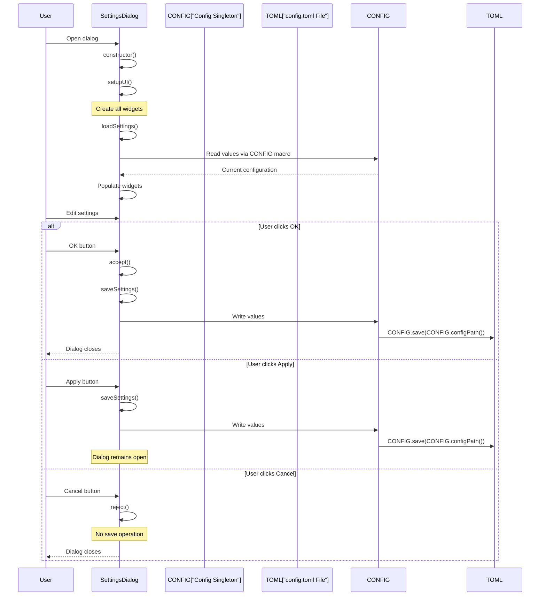

# Settings Dialog

<details>
<summary>Relevant source files</summary>

The following files were used as context for generating this wiki page:

- [README.md](README.md)
- [scripts/run_debug.sh](scripts/run_debug.sh)
- [src/ui/SettingsDialog.cpp](src/ui/SettingsDialog.cpp)
- [src/ui/SettingsDialog.hpp](src/ui/SettingsDialog.hpp)

</details>


## Purpose and Scope

The `SettingsDialog` provides a centralized modal interface for editing all application configuration options. It presents settings in a tabbed layout organized by functional area (General, Audio, Visualizer, Recording, Suno) and synchronizes changes with the `Config` singleton for persistence to `config.toml`. For information about the configuration system architecture and TOML persistence, see [Application & Config](#2.1). For information about how the dialog is launched from the main UI, see [MainWindow & Layout](#7.1).

Sources: [src/ui/SettingsDialog.hpp:1-69](), [src/ui/SettingsDialog.cpp:1-19]()

---

## Dialog Architecture

The `SettingsDialog` class extends `QDialog` and uses a `QTabWidget` to organize settings into five functional categories. Each tab contains form layouts with appropriate Qt widget types (spin boxes, combo boxes, checkboxes, line edits) for editing configuration values.

### Structural Overview

```mermaid
graph TB
    subgraph "SettingsDialog (QDialog)"
        TAB_WIDGET["QTabWidget*<br/>tabWidget_"]
        BUTTONS["Dialog Buttons<br/>OK / Cancel / Apply"]
        
        subgraph "General Tab"
            G_DEBUG["QCheckBox*<br/>debugCheck_"]
            G_THEME["QComboBox*<br/>themeCombo_"]
        end
        
        subgraph "Audio Tab"
            A_DEVICE["QComboBox*<br/>audioDeviceCombo_"]
            A_BUFFER["QSpinBox*<br/>bufferSizeSpin_"]
        end
        
        subgraph "Visualizer Tab"
            V_PRESET["QLineEdit*<br/>presetPathEdit_"]
            V_WIDTH["QSpinBox*<br/>vizWidthSpin_"]
            V_HEIGHT["QSpinBox*<br/>vizHeightSpin_"]
            V_FPS["QSpinBox*<br/>vizFpsSpin_"]
            V_BEAT["QDoubleSpinBox*<br/>beatSensitivitySpin_"]
            V_DURATION["QSpinBox*<br/>presetDurationSpin_"]
            V_AUTO["QCheckBox*<br/>autoRotateCheck_"]
            V_SHUFFLE["QCheckBox*<br/>shufflePresetsCheck_"]
            V_LOW["QCheckBox*<br/>lowResourceCheck_"]
        end
        
        subgraph "Recording Tab"
            R_DIR["QLineEdit*<br/>outputDirEdit_"]
            R_AUTO["QCheckBox*<br/>autoRecordCheck_"]
            R_CONTAINER["QComboBox*<br/>containerCombo_"]
            R_CODEC["QComboBox*<br/>videoCodecCombo_"]
            R_CRF["QSpinBox*<br/>crfSpin_"]
            R_PRESET["QComboBox*<br/>encoderPresetCombo_"]
        end
        
        subgraph "Suno Tab"
            S_TOKEN["QLineEdit*<br/>sunoTokenEdit_"]
            S_COOKIE["QLineEdit*<br/>sunoCookieEdit_"]
            S_PATH["QLineEdit*<br/>sunoDownloadPathEdit_"]
            S_AUTO["QCheckBox*<br/>sunoAutoDownloadCheck_"]
            S_LYRICS["QCheckBox*<br/>sunoSaveLyricsCheck_"]
        end
    end
    
    TAB_WIDGET --> G_DEBUG
    TAB_WIDGET --> A_DEVICE
    TAB_WIDGET --> V_PRESET
    TAB_WIDGET --> R_DIR
    TAB_WIDGET --> S_TOKEN
```



Sources: [src/ui/SettingsDialog.hpp:32-66](), [src/ui/SettingsDialog.cpp:21-219]()

---

## Settings Organization by Tab

### General Tab

| Setting | Widget Type | CONFIG Path | Range/Options | Notes |
|---------|-------------|-------------|---------------|-------|
| Debug | `QCheckBox` | `CONFIG.debug()` | boolean | Enables debug logging |
| Theme | `QComboBox` | `CONFIG.ui().theme` | "dark", "gruvbox", "nord" | UI color scheme |

Sources: [src/ui/SettingsDialog.cpp:26-37](), [src/ui/SettingsDialog.cpp:222-223](), [src/ui/SettingsDialog.cpp:262-263]()

### Audio Tab

| Setting | Widget Type | CONFIG Path | Range/Options | Notes |
|---------|-------------|-------------|---------------|-------|
| Device | `QComboBox` | `CONFIG.audio().device` | "default" | Audio output device |
| Buffer Size | `QSpinBox` | `CONFIG.audio().bufferSize` | 256-8192, step 256 | Audio buffer size in samples |

Sources: [src/ui/SettingsDialog.cpp:39-52](), [src/ui/SettingsDialog.cpp:225-227](), [src/ui/SettingsDialog.cpp:265-266]()

### Visualizer Tab

| Setting | Widget Type | CONFIG Path | Range/Options | Notes |
|---------|-------------|-------------|---------------|-------|
| Preset Path | `QLineEdit` + Browse | `CONFIG.visualizer().presetPath` | filesystem path | Directory containing `.milk` files |
| Resolution Width | `QSpinBox` | `CONFIG.visualizer().width` | 640-7680 | Visualization render width |
| Resolution Height | `QSpinBox` | `CONFIG.visualizer().height` | 480-4320 | Visualization render height |
| FPS | `QSpinBox` | `CONFIG.visualizer().fps` | 24-144 | Target frame rate |
| Beat Sensitivity | `QDoubleSpinBox` | `CONFIG.visualizer().beatSensitivity` | 0.1-5.0, step 0.1 | Audio beat detection threshold |
| Preset Duration | `QSpinBox` | `CONFIG.visualizer().presetDuration` | 5-300 seconds | Time before auto-rotation |
| Auto-rotate | `QCheckBox` | `CONFIG.visualizer().presetDuration > 0` | boolean | Enable automatic preset switching |
| Shuffle Presets | `QCheckBox` | `CONFIG.visualizer().shufflePresets` | boolean | Randomize preset order |
| Low Resource Mode | `QCheckBox` | `CONFIG.visualizer().lowResourceMode` | boolean | Render at half resolution |

Sources: [src/ui/SettingsDialog.cpp:54-106](), [src/ui/SettingsDialog.cpp:229-240](), [src/ui/SettingsDialog.cpp:268-276]()

### Recording Tab

| Setting | Widget Type | CONFIG Path | Range/Options | Notes |
|---------|-------------|-------------|---------------|-------|
| Output Directory | `QLineEdit` + Browse | `CONFIG.recording().outputDirectory` | filesystem path | Video output location |
| Auto-record | `QCheckBox` | `CONFIG.recording().autoRecord` | boolean | "Automagical mode" - record all tracks |
| Container | `QComboBox` | `CONFIG.recording().container` | "mp4", "mkv", "webm", "mov" | Video container format |
| Video Codec | `QComboBox` | `CONFIG.recording().video.codec` | "libx264", "libx265", "libvpx-vp9" | FFmpeg video encoder |
| CRF (Quality) | `QSpinBox` | `CONFIG.recording().video.crf` | 0-51 | 0=lossless, 18=high, 23=default, 51=worst |
| Encoder Preset | `QComboBox` | `CONFIG.recording().video.preset` | "ultrafast" to "veryslow" | Encoding speed/quality tradeoff |

Sources: [src/ui/SettingsDialog.cpp:108-157](), [src/ui/SettingsDialog.cpp:242-251](), [src/ui/SettingsDialog.cpp:278-285]()

### Suno Tab

| Setting | Widget Type | CONFIG Path | Range/Options | Notes |
|---------|-------------|-------------|---------------|-------|
| API Token | `QLineEdit` (password) | `CONFIG.suno().token` | string | Suno authentication token |
| Cookie | `QLineEdit` (password) | `CONFIG.suno().cookie` | string | Suno session cookie |
| Download Path | `QLineEdit` + Browse | `CONFIG.suno().downloadPath` | filesystem path | Local storage for Suno clips |
| Auto-download | `QCheckBox` | `CONFIG.suno().autoDownload` | boolean | Download synced tracks automatically |
| Save Lyrics | `QCheckBox` | `CONFIG.suno().saveLyrics` | boolean | Persist lyrics to database |

Sources: [src/ui/SettingsDialog.cpp:159-194](), [src/ui/SettingsDialog.cpp:253-258](), [src/ui/SettingsDialog.cpp:287-291]()

---

## Configuration Synchronization Flow

The dialog implements a bidirectional synchronization pattern with the `Config` singleton. Settings are loaded when the dialog opens and saved when the user confirms changes.

### Load/Save Data Flow



Sources: [src/ui/SettingsDialog.cpp:14-19](), [src/ui/SettingsDialog.cpp:221-259](), [src/ui/SettingsDialog.cpp:261-294](), [src/ui/SettingsDialog.cpp:296-303]()

---

## Implementation Details

### Dialog Initialization

The `SettingsDialog` constructor establishes the window properties and delegates to two initialization methods:

1. **`setupUI()`** [src/ui/SettingsDialog.cpp:21-219]() - Constructs the widget hierarchy, creates all form controls, and establishes signal connections for file browser buttons
2. **`loadSettings()`** [src/ui/SettingsDialog.cpp:221-259]() - Reads values from the `Config` singleton and populates all widget states

```cpp
SettingsDialog::SettingsDialog(QWidget* parent) : QDialog(parent) {
    setWindowTitle("Settings");
    setMinimumSize(500, 400);
    setupUI();
    loadSettings();
}
```

Sources: [src/ui/SettingsDialog.cpp:14-19]()

### Widget Configuration and Layout

Each tab uses a `QFormLayout` to organize label-widget pairs. Path selection widgets include a browse button that opens a `QFileDialog`:

```cpp
auto* presetPathLayout = new QHBoxLayout();
presetPathEdit_ = new QLineEdit();
presetPathLayout->addWidget(presetPathEdit_);
auto* browsePresetBtn = new QPushButton("...");
browsePresetBtn->setFixedWidth(30);
connect(browsePresetBtn, &QPushButton::clicked, this, [this] {
    QString dir = QFileDialog::getExistingDirectory(
            this, "Select Preset Directory", presetPathEdit_->text());
    if (!dir.isEmpty()) {
        presetPathEdit_->setText(dir);
    }
});
```

This pattern repeats for output directory [src/ui/SettingsDialog.cpp:112-125]() and Suno download path [src/ui/SettingsDialog.cpp:171-186]().

Sources: [src/ui/SettingsDialog.cpp:58-71]()

### Configuration Loading

The `loadSettings()` method reads from the `Config` singleton via the `CONFIG` macro and sets widget states. Values are converted from C++ types (std::string, std::filesystem::path) to Qt types (QString):

```cpp
void SettingsDialog::loadSettings() {
    debugCheck_->setChecked(CONFIG.debug());
    themeCombo_->setCurrentText(QString::fromStdString(CONFIG.ui().theme));
    
    audioDeviceCombo_->setCurrentText(
            QString::fromStdString(CONFIG.audio().device));
    bufferSizeSpin_->setValue(CONFIG.audio().bufferSize);
    
    presetPathEdit_->setText(
            QString::fromStdString(CONFIG.visualizer().presetPath.string()));
    // ... continues for all settings
}
```

Special handling exists for the auto-rotate checkbox: it derives its state from whether `presetDuration` is greater than zero [src/ui/SettingsDialog.cpp:238]().

Sources: [src/ui/SettingsDialog.cpp:221-259]()

### Configuration Saving

The `saveSettings()` method performs the inverse operation, reading widget states and writing to the `Config` singleton. After updating all values in memory, it triggers persistence to disk via `CONFIG.save(CONFIG.configPath())`:

```cpp
void SettingsDialog::saveSettings() {
    CONFIG.setDebug(debugCheck_->isChecked());
    CONFIG.ui().theme = themeCombo_->currentText().toStdString();
    
    CONFIG.audio().device = audioDeviceCombo_->currentText().toStdString();
    CONFIG.audio().bufferSize = bufferSizeSpin_->value();
    
    CONFIG.visualizer().presetPath = presetPathEdit_->text().toStdString();
    // ... continues for all settings
    
    CONFIG.save(CONFIG.configPath());  // Persist to config.toml
}
```

The auto-rotate logic is inverted during save: if the checkbox is unchecked, `presetDuration` is set to 0 to disable auto-rotation [src/ui/SettingsDialog.cpp:273-274]().

Sources: [src/ui/SettingsDialog.cpp:261-294]()

### Dialog Button Behavior

The dialog provides three actions with distinct behaviors:

| Button | Method | Behavior |
|--------|--------|----------|
| OK | `accept()` override | Calls `saveSettings()`, then `QDialog::accept()` to close with accepted state |
| Cancel | `reject()` override | Calls `QDialog::reject()` to close without saving |
| Apply | Connected to `saveSettings()` | Calls `saveSettings()` but leaves dialog open |

```cpp
void SettingsDialog::accept() {
    saveSettings();
    QDialog::accept();
}

void SettingsDialog::reject() {
    QDialog::reject();  // No save operation
}
```

The Apply button is connected directly to `saveSettings()` [src/ui/SettingsDialog.cpp:211-216](), allowing users to persist changes without closing the dialog.

Sources: [src/ui/SettingsDialog.cpp:296-303](), [src/ui/SettingsDialog.cpp:211-216]()

---

## Integration with Configuration System

The `SettingsDialog` accesses the `Config` singleton exclusively through the `CONFIG` macro, which provides thread-safe access to the global configuration instance. The dialog does not own or cache configuration data—it reads directly from `CONFIG` during `loadSettings()` and writes directly during `saveSettings()`.

### Configuration Persistence

When `CONFIG.save(CONFIG.configPath())` is invoked [src/ui/SettingsDialog.cpp:293](), the `Config` singleton serializes all settings to the TOML file located at `~/.config/chadvis-projectm-qt/config.toml` (or `$XDG_CONFIG_HOME/chadvis-projectm-qt/config.toml`). The configuration system uses dirty tracking to optimize writes, only persisting sections that have changed. For detailed information about the TOML persistence mechanism and configuration architecture, see [Application & Config](#2.1).

Sources: [src/ui/SettingsDialog.cpp:1-2](), [src/ui/SettingsDialog.cpp:293]()