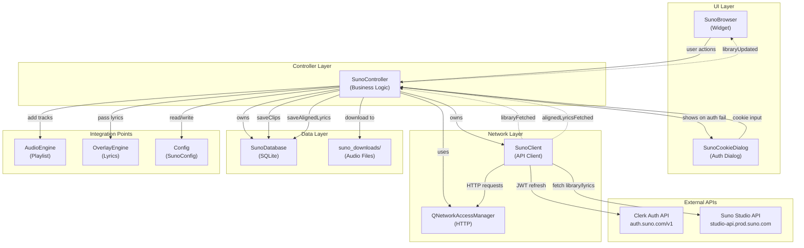
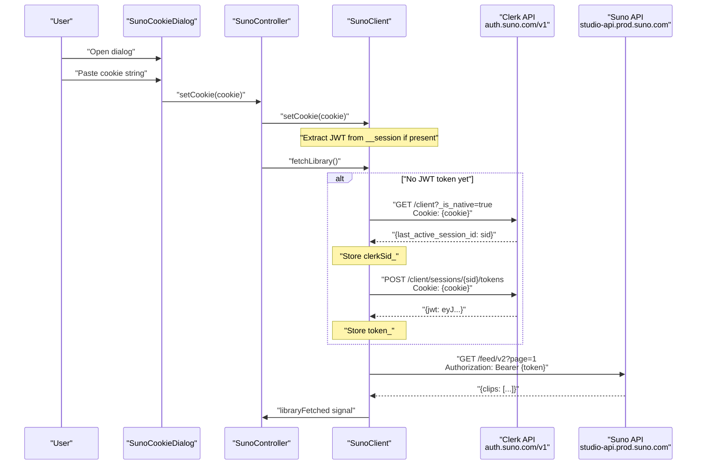
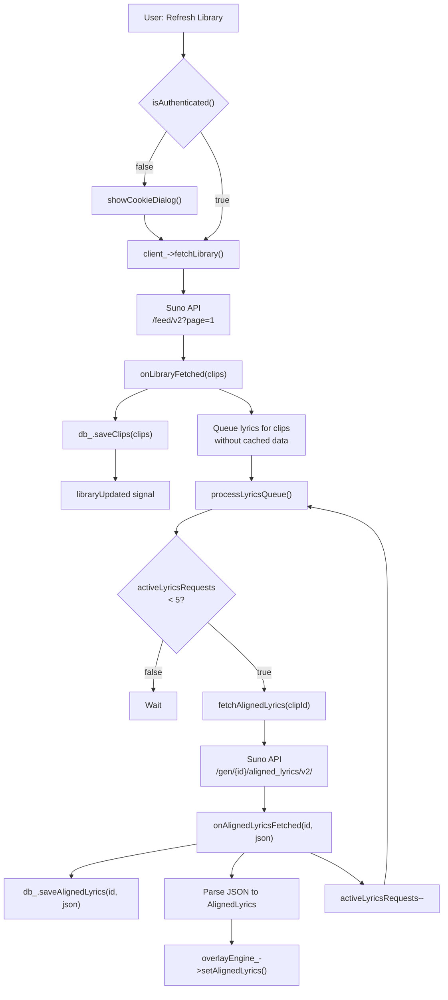
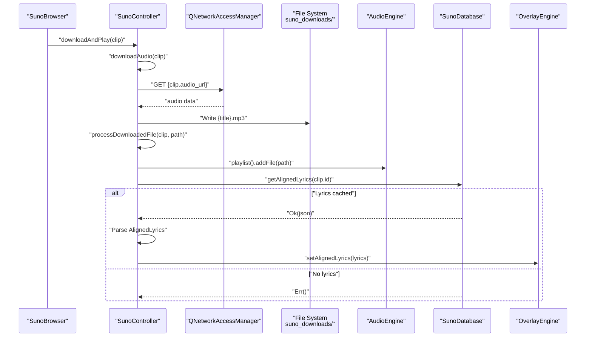

# Suno AI Integration

<details>
<summary>Relevant source files</summary>

The following files were used as context for generating this wiki page:

- [docs/suno_api_reference.md](docs/suno_api_reference.md)
- [src/suno/SunoClient.cpp](src/suno/SunoClient.cpp)
- [src/suno/SunoClient.hpp](src/suno/SunoClient.hpp)
- [src/ui/SunoCookieDialog.cpp](src/ui/SunoCookieDialog.cpp)
- [src/ui/controllers/SunoController.cpp](src/ui/controllers/SunoController.cpp)
- [src/ui/controllers/SunoController.hpp](src/ui/controllers/SunoController.hpp)

</details>


## Purpose & Scope

The Suno AI Integration module provides functionality to access and manage AI-generated music from the [Suno AI platform](https://suno.com). This system allows users to browse their Suno library, download generated tracks, and display synchronized lyrics as overlays during visualization. The integration includes API communication, local database caching, authentication management, and seamless connection to the application's audio playback and overlay systems.

For details on API communication and authentication mechanisms, see [SunoClient & API](#8.1). For controller orchestration and user interface components, see [SunoController & UI](#8.2). For audio playback integration, see [Audio System](#3). For lyrics display, see [Overlay System](#6).

## Architecture Overview

The Suno integration is organized into four architectural layers: Network Layer (API communication), Controller Layer (business logic), Data Layer (local persistence), and UI Layer (user interaction). The system maintains clear separation between these concerns while integrating with the application's core engines.



**Sources:** [src/ui/controllers/SunoController.hpp:1-74](), [src/suno/SunoClient.hpp:1-72](), [Diagram 4 from high-level architecture]()

## Core Components

### SunoClient

The `SunoClient` class implements the network interface to Suno AI APIs. It handles cookie-based authentication, JWT token refresh via the Clerk authentication service, and data fetching operations. The client uses Qt's `QNetworkAccessManager` for HTTP requests and emits signals for asynchronous result delivery.

**Key Methods:**
- `setToken()` / `setCookie()`: Configure authentication credentials ([src/suno/SunoClient.cpp:15-34]())
- `refreshAuthToken()`: Two-step process to obtain JWT from Clerk API ([src/suno/SunoClient.cpp:40-125]())
- `fetchLibrary()`: Retrieve clips from user's library ([src/suno/SunoClient.cpp:145-171]())
- `fetchAlignedLyrics()`: Get word-level synchronized lyrics ([src/suno/SunoClient.cpp:173-200]())

**Signals:**
- `libraryFetched`: Emits `std::vector<SunoClip>` when library data arrives
- `alignedLyricsFetched`: Emits clip ID and JSON string for lyrics
- `errorOccurred`: Emits error message on failures

**Sources:** [src/suno/SunoClient.hpp:1-72](), [src/suno/SunoClient.cpp:1-273]()

### SunoController

The `SunoController` orchestrates all Suno-related business logic, acting as the integration point between the network layer, persistence layer, and application engines. It manages library synchronization, download operations, lyrics processing, and provides a clean API for UI components.

**Key Responsibilities:**
- Authentication flow management ([src/ui/controllers/SunoController.cpp:76-87]())
- Library sync and database persistence ([src/ui/controllers/SunoController.cpp:89-101]())
- Asynchronous lyrics fetching with queue management ([src/ui/controllers/SunoController.cpp:103-111]())
- Audio file downloading to local directory ([src/ui/controllers/SunoController.cpp:167-198]())
- Integration with `AudioEngine` playlist and `OverlayEngine` lyrics ([src/ui/controllers/SunoController.cpp:202-210]())

**Signals:**
- `libraryUpdated`: Emits clips vector when library data changes
- `statusMessage`: Emits status/error messages for UI display

**Sources:** [src/ui/controllers/SunoController.hpp:1-74](), [src/ui/controllers/SunoController.cpp:1-213]()

### SunoDatabase

The `SunoDatabase` class provides SQLite-based local persistence for Suno clips and aligned lyrics. This enables offline browsing and caching of previously fetched data. The database schema includes:

| Table | Purpose |
|-------|---------|
| `clips` | Stores `SunoClip` metadata (id, title, audio_url, image_url, status, metadata) |
| `aligned_lyrics` | Stores word-level synchronized lyrics JSON |

**Sources:** [src/ui/controllers/SunoController.cpp:40-41](), [src/ui/controllers/SunoController.cpp:91](), [Diagram 4 from high-level architecture]()

### SunoCookieDialog

The `SunoCookieDialog` provides a user interface for authentication configuration. Since Suno AI does not offer a public API with standard OAuth flows, authentication requires extracting session cookies from a logged-in browser session. The dialog guides users through two methods:

1. **Network Tab Method (Reliable):** Extract cookies from browser DevTools Network tab
2. **Console Snippet Method (Quick):** Run JavaScript snippet to read `document.cookie`

The dialog includes a pre-written JavaScript snippet with copy functionality and a text area for pasting the extracted cookie string.

**Sources:** [src/ui/SunoCookieDialog.cpp:1-99]()

## Authentication Flow

Suno AI authentication uses a cookie-based approach with JWT token refresh via Clerk's authentication service. The flow involves two distinct steps: obtaining a session ID and exchanging it for a JWT bearer token.



**Authentication Steps:**

1. **Cookie Extraction:** User provides session cookie via `SunoCookieDialog` ([src/ui/SunoCookieDialog.cpp:87-92]())
2. **JWT Extraction:** `SunoClient::setCookie()` attempts to extract JWT from `__session` cookie value ([src/suno/SunoClient.cpp:22-34]())
3. **Session ID Retrieval:** If no JWT found, request Clerk API `/client` endpoint to get `last_active_session_id` ([src/suno/SunoClient.cpp:48-92]())
4. **Token Refresh:** POST to `/client/sessions/{sid}/tokens` to obtain JWT bearer token ([src/suno/SunoClient.cpp:94-125]())
5. **API Access:** Use JWT in `Authorization` header for all Suno API requests ([src/suno/SunoClient.cpp:127-143]())

**Token Lifecycle:**

The system automatically attempts token refresh when `token_` is empty but `cookie_` is present. On 401 errors, the token is cleared to trigger refresh on the next request ([src/suno/SunoClient.cpp:261-270]()).

**Sources:** [src/suno/SunoClient.cpp:40-125](), [src/suno/SunoClient.cpp:145-171](), [src/ui/SunoCookieDialog.cpp:10-97]()

## Library Sync & Data Flow

The library synchronization process fetches clips from the Suno API, persists them locally, and queues aligned lyrics fetching for clips that don't have cached lyrics data. The system uses a rate-limited queue to avoid overwhelming the API.



**Data Structures:**

| Type | Definition | Fields |
|------|------------|--------|
| `SunoClip` | Represents a generated music track | `id`, `title`, `audio_url`, `image_url`, `status`, `metadata` (prompt, tags, lyrics, type) |
| `AlignedLyrics` | Word-level synchronized lyrics | `songId`, `words` (vector of `AlignedWord`) |
| `AlignedWord` | Individual word with timing | `word`, `start_s`, `end_s`, `score` |

**Lyrics Queue Management:**

The controller maintains a `std::deque<std::string> lyricsQueue_` and tracks `activeLyricsRequests_` to limit concurrent requests to 5 ([src/ui/controllers/SunoController.cpp:103-111]()). This prevents rate limiting while ensuring efficient batch processing.

**Sources:** [src/ui/controllers/SunoController.cpp:60-66](), [src/ui/controllers/SunoController.cpp:89-120](), [src/suno/SunoClient.cpp:202-246]()

## Download & Playback Integration

When a user selects a clip for playback, the system downloads the audio file to a local directory, adds it to the `AudioEngine` playlist, and prepares aligned lyrics for overlay display.



**Download Process:**

1. **URL Request:** `downloadAudio()` creates a `QNetworkRequest` for `clip.audio_url` ([src/ui/controllers/SunoController.cpp:167-173]())
2. **File Write:** On completion, writes response data to `{downloadDir}/{title}.mp3` ([src/ui/controllers/SunoController.cpp:183-196]())
3. **Playlist Addition:** Calls `audioEngine_->playlist().addFile(path)` ([src/ui/controllers/SunoController.cpp:202]())
4. **Lyrics Lookup:** Queries database for cached aligned lyrics ([src/ui/controllers/SunoController.cpp:205-209]())
5. **Overlay Setup:** If lyrics exist, parses JSON and passes to `OverlayEngine` ([src/ui/controllers/SunoController.cpp:147]())

**Download Directory:**

The download location is configured via `SunoConfig::downloadPath` with a default of `{dataDir}/suno_downloads/` ([src/ui/controllers/SunoController.cpp:51-55]()).

**Sources:** [src/ui/controllers/SunoController.cpp:159-210]()

## Configuration

The Suno integration reads configuration from the `SunoConfig` structure within the global `CONFIG` singleton. Settings are persisted to `config.toml` and loaded on application startup.

**Configuration Fields:**

| Field | Type | Purpose |
|-------|------|---------|
| `token` | `std::string` | JWT bearer token (auto-refreshed) |
| `cookie` | `std::string` | Session cookie from browser |
| `downloadPath` | `fs::path` | Directory for downloaded audio files |

**Initialization Flow:**

```cpp
// From SunoController constructor
if (!CONFIG.suno().token.empty()) {
    client_->setToken(CONFIG.suno().token);
}
if (!CONFIG.suno().cookie.empty()) {
    client_->setCookie(CONFIG.suno().cookie);
}
```

**Persistence:**

When the user provides a cookie via `SunoCookieDialog`, the controller updates both the client and config:

```cpp
client_->setCookie(cookie);
CONFIG.suno().cookie = cookie;
CONFIG.save(CONFIG.configPath());
```

For detailed configuration system architecture, see [Application & Config](#2.1).

**Sources:** [src/ui/controllers/SunoController.cpp:43-55](), [src/ui/controllers/SunoController.cpp:79-84]()

## Integration Summary

The Suno AI Integration provides a complete feature module that extends the visualizer with AI-generated music capabilities. Key integration points:

| Component | Integration Point | Purpose |
|-----------|------------------|---------|
| `AudioEngine` | `playlist().addFile()` | Add downloaded tracks to playback queue |
| `OverlayEngine` | `setAlignedLyrics()` | Display synchronized lyrics during visualization |
| `Config` | `CONFIG.suno()` | Persist authentication and settings |
| `MainWindow` | `SunoController` lifecycle | Controller owned by main window |

The system maintains architectural independence through the controller pattern, with `SunoController` acting as the sole integration interface. UI components interact only with the controller, never directly with engines or clients.

**Sources:** [src/ui/controllers/SunoController.hpp:18-32](), [src/ui/controllers/SunoController.cpp:18-26](), [Diagram 4 from high-level architecture]()