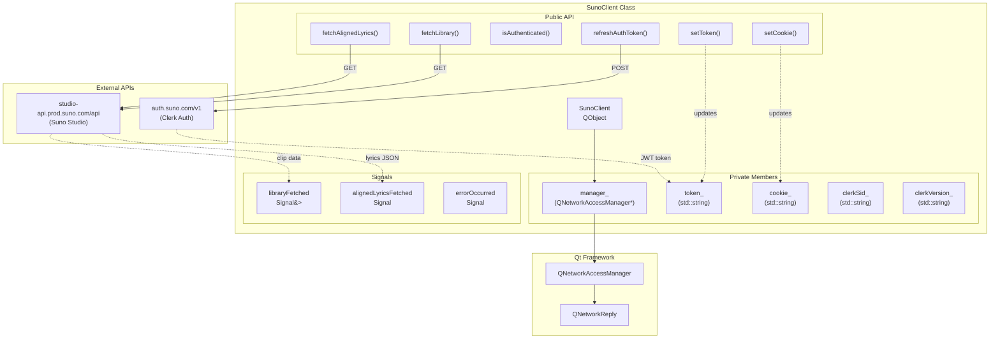
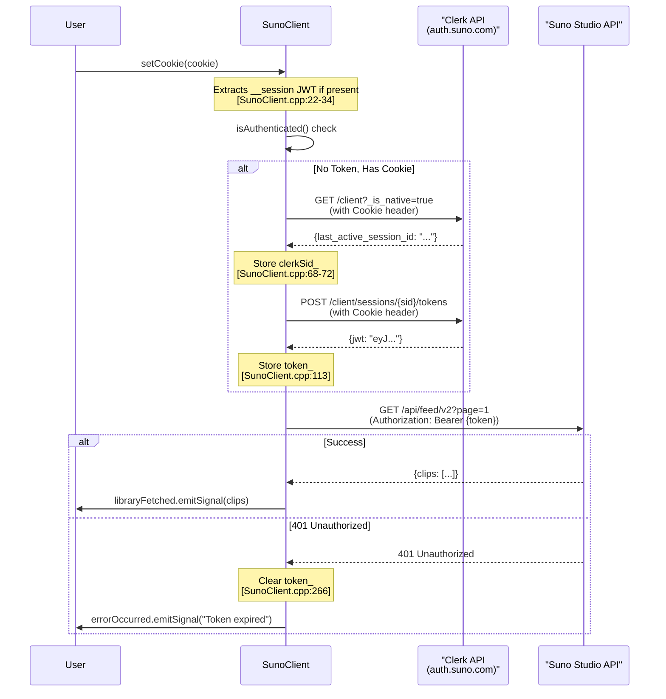
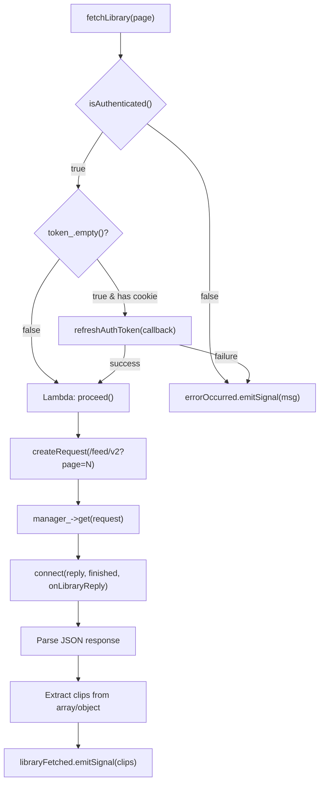
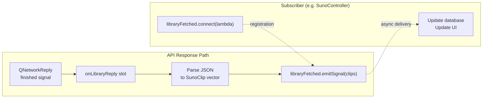

# SunoClient & API

<details>
<summary>Relevant source files</summary>

The following files were used as context for generating this wiki page:

- [docs/suno_api_reference.md](docs/suno_api_reference.md)
- [src/suno/SunoClient.cpp](src/suno/SunoClient.cpp)
- [src/suno/SunoClient.hpp](src/suno/SunoClient.hpp)
- [src/ui/SunoCookieDialog.cpp](src/ui/SunoCookieDialog.cpp)

</details>


## Purpose and Scope

This document covers the `SunoClient` class, which implements low-level HTTP communication with the Suno AI Studio API. It handles cookie-based authentication, JWT token refresh via the Clerk authentication service, library fetching, and lyrics retrieval. The client uses Qt's `QNetworkAccessManager` for asynchronous HTTP requests and emits signals for response handling.

For higher-level orchestration, database persistence, download management, and UI integration, see [SunoController & UI](#8.2).

---

## Class Overview

The `SunoClient` class provides a thin wrapper around Suno's unofficial REST API, encapsulating authentication workflows and data fetching operations. It operates asynchronously using Qt's signal/slot mechanism, allowing controllers to respond to API events without blocking.

### Key Responsibilities

| Responsibility | Implementation |
|---|---|
| **Authentication Management** | Stores session cookie and JWT token, refreshes tokens via Clerk API |
| **HTTP Communication** | Uses `QNetworkAccessManager` for GET/POST requests |
| **Data Fetching** | Retrieves library clips, aligned lyrics, and project data |
| **Error Handling** | Detects 401 errors, clears invalid tokens, emits error signals |
| **Signal Emission** | Notifies subscribers of fetch completions and errors |

**Sources:** [src/suno/SunoClient.hpp:1-72](), [src/suno/SunoClient.cpp:1-273]()

---

## Architecture and Dependencies

### Class Structure Diagram



**Sources:** [src/suno/SunoClient.hpp:18-69](), [src/suno/SunoClient.cpp:9-11]()

---

## Authentication System

### Two-Tier Authentication Flow

Suno's authentication uses a **cookie-based session** that provides access to the Clerk authentication API, which in turn issues JWT tokens for the Studio API. This two-step process is required because the Suno Studio API expects Bearer tokens, but users can only obtain session cookies from the web interface.

#### Authentication Flow Diagram



**Sources:** [src/suno/SunoClient.cpp:40-125](), [src/suno/SunoClient.cpp:261-270]()

### Cookie Management

The `setCookie()` method accepts a raw cookie string (typically containing `__client=...` and/or `__session=...`) and attempts to extract a JWT token if the `__session` value starts with `eyJ` (indicating a JWT):

```
Cookie format: "__client=eyJ...; __session=eyJ...; _ga=..."
If __session starts with "eyJ", extract as token_
```

**Implementation:** [src/suno/SunoClient.cpp:19-34]()

### Clerk API Token Refresh

The `refreshAuthToken()` method implements a two-step process:

1. **Step 1:** Fetch the Clerk Session ID (`clerkSid_`) by calling `/client?_is_native=true&_clerk_js_version={version}` with the cookie
2. **Step 2:** Use the session ID to POST to `/client/sessions/{sid}/tokens` and retrieve the JWT token

Both steps require the original session cookie in the `Cookie` header and a browser-like `User-Agent` to avoid detection.

**Implementation:** [src/suno/SunoClient.cpp:40-125]()

---

## API Methods

### Library Fetching

#### `fetchLibrary(int page)`

Retrieves the user's music library from the Suno Studio API feed endpoint. The method:

1. Checks authentication status via `isAuthenticated()`
2. Refreshes the token if needed (when `token_` is empty but `cookie_` exists)
3. Constructs a GET request to `/feed/v2?page={page}`
4. Emits `libraryFetched` signal with a `vector<SunoClip>` on success

##### Library Response Parsing

The API can return clips in three different JSON structures:

| Structure | Example | Extraction Logic |
|---|---|---|
| **Direct Array** | `[{...}, {...}]` | Use array directly |
| **Object with "clips"** | `{"clips": [{...}]}` | Extract `doc.object()["clips"]` |
| **Object with "project_clips"** | `{"project_clips": [{"clip": {...}}]}` | Extract nested `item.toObject()["clip"]` |

Each clip is parsed into a `SunoClip` struct with fields: `id`, `title`, `audio_url`, `image_url`, `status`, and nested `metadata` (prompt, tags, lyrics, type).

**Implementation:** [src/suno/SunoClient.cpp:145-171](), [src/suno/SunoClient.cpp:202-246]()

#### API Call Pattern Diagram



**Sources:** [src/suno/SunoClient.cpp:145-171](), [src/suno/SunoClient.cpp:202-246]()

### Aligned Lyrics Fetching

#### `fetchAlignedLyrics(const std::string& clipId)`

Retrieves time-aligned lyrics for a specific clip. The endpoint `/gen/{clipId}/aligned_lyrics/v2/` returns JSON with word-level timestamps for karaoke-style synchronization.

The method follows the same token refresh pattern as `fetchLibrary()` and emits `alignedLyricsFetched(clipId, jsonString)` on success. The raw JSON string is passed to subscribers for parsing.

**Implementation:** [src/suno/SunoClient.cpp:173-200]()

---

## Request Construction

The `createRequest()` helper method generates `QNetworkRequest` objects with proper authentication headers:

```
Headers:
- Authorization: Bearer {token_}  (if token exists)
- Cookie: {cookie_}                (if cookie exists)
- User-Agent: Mozilla/5.0 ...      (always)
```

This ensures all API calls include the necessary credentials. The `User-Agent` header is critical—Suno's API may reject requests without a browser-like signature.

**Implementation:** [src/suno/SunoClient.cpp:127-143]()

---

## Signal-Based Communication

### Signal Definitions

The client uses custom `Signal<T>` templates (see util/Signal.hpp) for type-safe, asynchronous event notification:

| Signal | Signature | Emitted When |
|---|---|---|
| `libraryFetched` | `Signal<const vector<SunoClip>&>` | Library data successfully parsed |
| `alignedLyricsFetched` | `Signal<string, string>` | Lyrics JSON fetched (clipId, json) |
| `errorOccurred` | `Signal<string>` | Network error or authentication failure |
| `projectsFetched` | `Signal<const vector<SunoProject>&>` | *(Skeleton implementation)* |

### Signal Emission Flow



**Sources:** [src/suno/SunoClient.hpp:48-51](), [src/suno/SunoClient.cpp:245]()

---

## Error Handling

### Network Error Processing

The `handleNetworkError()` method processes `QNetworkReply` errors:

1. **401 Unauthorized Detection:** Checks HTTP status code and clears `token_` to force refresh on next call
2. **Error Message Extraction:** Converts `QNetworkReply::errorString()` to std::string
3. **Signal Emission:** Emits `errorOccurred` signal with descriptive message
4. **Logging:** Writes error to application log via `LOG_ERROR` macro

#### Error Handling Logic

```
if (statusCode == 401) {
    message = "Unauthorized: Token expired or invalid"
    token_.clear()  // Force refresh on next API call
}
emit errorOccurred(message)
LOG_ERROR("SunoClient API Error: {}", message)
```

**Implementation:** [src/suno/SunoClient.cpp:261-270]()

### Callback-Based Error Propagation

The `refreshAuthToken()` method uses an optional callback parameter to report success/failure:

```cpp
refreshAuthToken([](bool success) {
    if (!success) {
        // Handle authentication failure
    }
});
```

This allows chained operations (e.g., refresh token → fetch library) to abort gracefully on authentication failure.

**Implementation:** [src/suno/SunoClient.cpp:40-45](), [src/suno/SunoClient.cpp:161-167]()

---

## API Endpoints Reference

### Clerk Authentication API

| Endpoint | Method | Purpose | Response |
|---|---|---|---|
| `/client?_is_native=true&_clerk_js_version={ver}` | GET | Retrieve session ID | `{response: {last_active_session_id: "..."}}` |
| `/client/sessions/{sid}/tokens` | POST | Exchange session for JWT | `{jwt: "eyJ..."}` |

**Base URL:** `https://auth.suno.com/v1`

### Suno Studio API

| Endpoint | Method | Purpose | Response |
|---|---|---|---|
| `/feed/v2?page={n}` | GET | Fetch library clips | Array of SunoClip objects or `{clips: [...]}` |
| `/gen/{clipId}/aligned_lyrics/v2/` | GET | Fetch time-aligned lyrics | JSON with word timestamps |

**Base URL:** `https://studio-api.prod.suno.com/api`

**Sources:** [src/suno/SunoClient.hpp:67-68](), [docs/suno_api_reference.md:1-29]()

---

## Integration with Qt Network Layer

### QNetworkAccessManager Lifecycle

The `SunoClient` owns a single `QNetworkAccessManager` instance created in the constructor:

```cpp
SunoClient::SunoClient(QObject* parent)
    : QObject(parent), manager_(new QNetworkAccessManager(this)) {}
```

Passing `this` as the parent ensures automatic cleanup when the `SunoClient` is destroyed. All network requests are issued through this manager instance.

### Asynchronous Reply Handling

Network replies are handled asynchronously using Qt's signal/slot mechanism:

1. Call `manager_->get()` or `manager_->post()` to initiate request
2. Connect reply's `finished` signal to a lambda or slot
3. Mark reply for deletion with `reply->deleteLater()` to prevent memory leaks
4. Process response data or errors in the connected handler

**Example Pattern:**
```cpp
QNetworkReply* reply = manager_->get(request);
connect(reply, &QNetworkReply::finished, this, [this, reply]() {
    reply->deleteLater();
    // Process response
});
```

**Sources:** [src/suno/SunoClient.cpp:9-11](), [src/suno/SunoClient.cpp:153-158]()

---

## Cookie Input UI

The `SunoCookieDialog` provides a user-friendly interface for obtaining session cookies from users. It displays two methods:

### Method 1: Network Tab (Reliable)
Instructions guide users to capture the full `Cookie` header from browser DevTools Network tab by filtering for `__clerk_api_version` requests.

### Method 2: Console Snippet (Quick)
Provides a JavaScript snippet that can be pasted into the browser console to extract `document.cookie`. This method may fail if cookies are marked `HttpOnly`.

The dialog includes a "Copy Snippet" button and a text area for pasting the captured cookie string.

**Implementation:** [src/ui/SunoCookieDialog.cpp:1-99]()

---

## Summary

The `SunoClient` class provides a clean abstraction over Suno's unofficial API, handling the complex two-tier authentication flow and providing type-safe signal-based communication for API responses. Key design principles include:

- **Asynchronous by Default:** All network operations use Qt's non-blocking signal/slot mechanism
- **Automatic Token Refresh:** Seamlessly obtains new JWT tokens when needed
- **Error Recovery:** Clears invalid tokens on 401 errors to trigger automatic refresh
- **Type Safety:** Uses `Signal<T>` templates and structured `SunoClip`/`SunoProject` types
- **Separation of Concerns:** Focuses solely on HTTP communication; persistence and orchestration handled by `SunoController`

**Sources:** [src/suno/SunoClient.hpp:1-72](), [src/suno/SunoClient.cpp:1-273]()