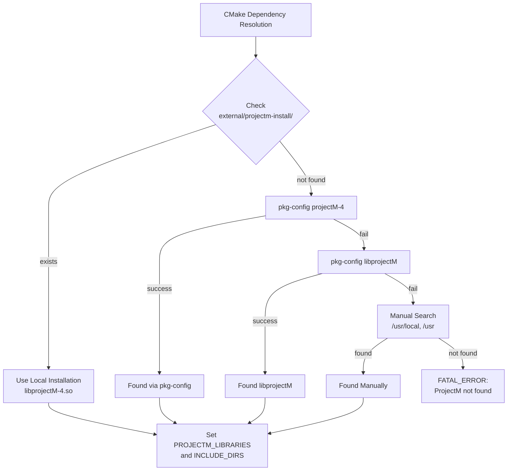
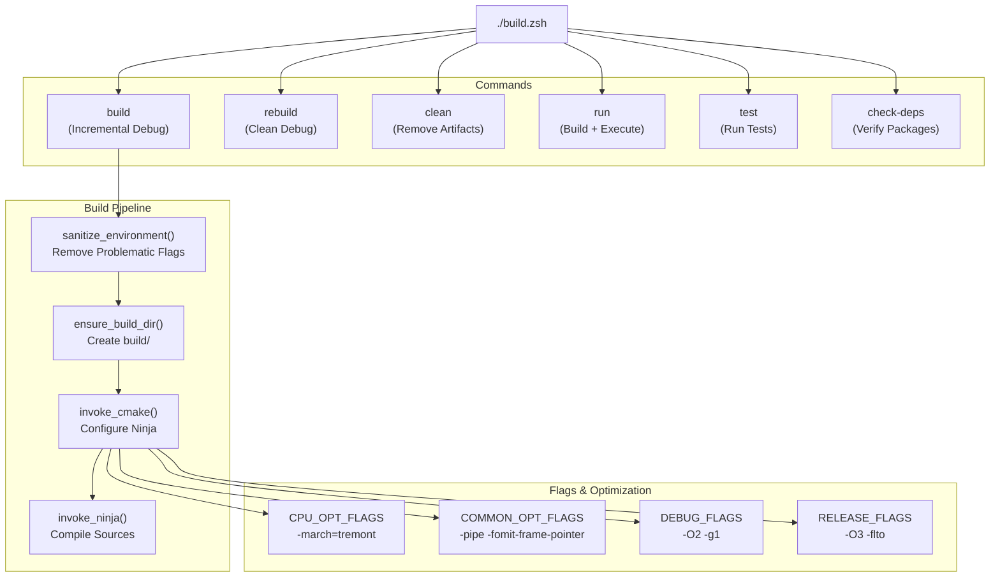
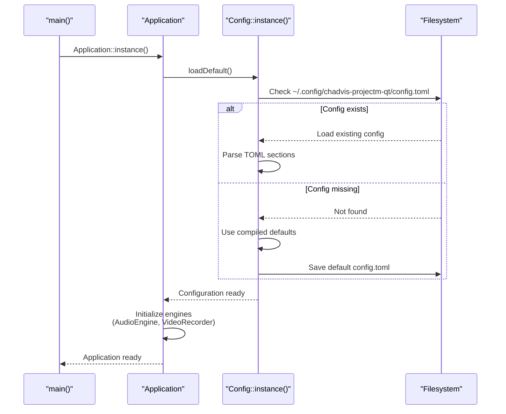

# Building & Running

<details>
<summary>Relevant source files</summary>

The following files were used as context for generating this wiki page:

- [.gitignore](.gitignore)
- [CMakeLists.txt](CMakeLists.txt)
- [build.zsh](build.zsh)
- [src/core/Config.hpp](src/core/Config.hpp)
- [src/overlay/OverlayRenderer.cpp](src/overlay/OverlayRenderer.cpp)

</details>


This page documents the build process, system requirements, and initial execution of the chadvis-projectm-qt application. This covers dependency installation, compilation using the build scripts, and basic invocation. For detailed configuration options, see [Application & Config](#2.1). For information about the CMake structure and module organization, see [Build System & Dependencies](#2.2).

---

## System Requirements

### Build Dependencies

The project requires the following tools and libraries to compile:

| Category | Package | Purpose |
|----------|---------|---------|
| Build Tools | CMake 3.20+ | Build system generator |
| | Ninja | Fast parallel build executor |
| | GCC/G++ | C++20 compiler |
| Qt6 | qt6-base | Core, Gui, Widgets |
| | qt6-multimedia | Audio playback |
| | qt6-svg | SVG icon support |
| Audio/Video | FFmpeg | libavcodec, libavformat, libavutil, libswscale, libswresample |
| | taglib | Audio metadata reading |
| Visualization | projectM v4 | Core visualization library |
| | GLEW | OpenGL extension loading |
| | glm | OpenGL mathematics |
| Utilities | spdlog | Structured logging |
| | fmt | String formatting |
| | tomlplusplus | TOML config parsing |

**Sources:** [CMakeLists.txt:59-69](), [build.zsh:158-179]()

### Runtime Requirements

At runtime, the application requires:
- OpenGL 3.3+ capable GPU and drivers
- Audio output device (ALSA/PulseAudio on Linux)
- Preset files (`.milk` format) in the configured preset directory
- Writable configuration directory at `~/.config/chadvis-projectm-qt/`

**Sources:** [CMakeLists.txt:60-69]()

---

## Dependency Installation

### Dependency Check

The build script includes a dependency verification command:

```bash
./build.zsh check-deps
```

This checks for all required packages using `pkg-config` and `command -v`, reporting missing dependencies with suggested installation commands.

**Sources:** [build.zsh:158-179]()

### ProjectM v4 Setup

The application specifically requires **projectM v4**, not v3. The CMake configuration searches in the following order:



**Diagram: ProjectM v4 Discovery Process**

The local installation path `external/projectm-install` allows using a custom-built version without system installation. This is useful if the system package manager doesn't provide projectM v4.

**Sources:** [CMakeLists.txt:71-108]()

---

## Build Process

### Build Script Overview

The `build.zsh` script provides a unified interface for all build operations:



**Diagram: Build Script Command Flow**

**Sources:** [build.zsh:1-213]()

### Standard Build Commands

#### Debug Build (Default)

```bash
./build.zsh build
```

Performs an incremental debug build:
- Build type: `Debug`
- Optimization: `-O2 -g1`
- Output: `build/chadvis-projectm-qt`

**Sources:** [build.zsh:129]()

#### Clean Rebuild

```bash
./build.zsh rebuild
```

Removes all artifacts from `build/` and performs a fresh debug build.

**Sources:** [build.zsh:131]()

#### Clean Build Directory

```bash
./build.zsh clean
```

Removes all generated files from `build/` and `build-release/` directories.

**Sources:** [build.zsh:134-140]()

### Build Flags and Optimization

The build script applies CPU-specific optimizations by default:

| Flag Category | Values | Purpose |
|---------------|--------|---------|
| CPU Architecture | `-march=tremont -mtune=tremont` | Intel N4500 optimization |
| SIMD | `-msse4.2 -mpopcnt -maes -mno-avx -mno-avx2` | Enable supported instructions |
| Common | `-pipe -fomit-frame-pointer -ffunction-sections -fdata-sections` | General optimization |
| Linker | `-Wl,--gc-sections -Wl,--as-needed` | Dead code elimination |

**Note:** The script includes `sanitize_environment()` which removes problematic flags like `-mno-direct-extern-access` that can cause linker errors.

**Sources:** [build.zsh:13-21](), [build.zsh:62-74]()

### CMake Configuration

The CMake configuration can be invoked directly:

```bash
cd build
cmake -G Ninja \
  -DCMAKE_BUILD_TYPE=Debug \
  -DCMAKE_CXX_STANDARD=20 \
  -DCMAKE_EXPORT_COMPILE_COMMANDS=ON \
  ..
```

Key CMake settings:

| Setting | Value | Description |
|---------|-------|-------------|
| `CMAKE_CXX_STANDARD` | 20 | C++20 required |
| `CMAKE_AUTOMOC` | ON | Qt MOC preprocessing |
| `CMAKE_AUTORCC` | ON | Qt resource compilation |
| `CMAKE_AUTOUIC` | ON | Qt UI file compilation |
| `CMAKE_EXPORT_COMPILE_COMMANDS` | ON | Generate `compile_commands.json` |

**Sources:** [CMakeLists.txt:27-40]()

---

## Running the Application

### Basic Execution

After building, run the application:

```bash
./build.zsh run
```

This automatically builds if the binary doesn't exist, then executes `build/chadvis-projectm-qt`.

**Sources:** [build.zsh:142-146]()

### Direct Invocation

You can also run the binary directly:

```bash
./build/chadvis-projectm-qt
```

### Command-Line Arguments

The application accepts optional command-line arguments (passed through the run command):

```bash
./build.zsh run [args...]
```

**Sources:** [build.zsh:145]()

---

## First Run Setup

### Configuration Directory

On first launch, the application creates its configuration directory:

```
~/.config/chadvis-projectm-qt/
├── config.toml          # Main configuration file
├── last_session.m3u     # Playlist persistence
├── preset_state.txt     # Favorites/blacklist
└── suno_library.db      # Suno integration data
```

The `Config` singleton loads `config.toml` via the `loadDefault()` method, which searches for the configuration in standard XDG locations.

**Sources:** [src/core/Config.hpp:108-117]()

### Configuration Initialization Flow



**Diagram: First Launch Configuration Flow**

**Sources:** [src/core/Config.hpp:115-117](), [CMakeLists.txt:273]()

### Required Resources

Before running, ensure:

1. **Preset Directory**: Configure `visualizer.preset_path` in `config.toml` to point to a directory containing `.milk` preset files
2. **Download Directory**: If using Suno integration, set `suno.download_path` for audio storage
3. **Recording Directory**: Set `recording.output_directory` for video output

Default paths are created automatically, but presets must be obtained separately (e.g., from the projectM preset packs).

**Sources:** [src/core/Config.hpp:14-106]()

---

## Build Artifacts

### Output Structure

```
build/
├── chadvis-projectm-qt       # Main executable
├── compile_commands.json     # Clangd/LSP database
├── CMakeCache.txt            # CMake configuration cache
├── CMakeFiles/               # CMake metadata
├── *.o                       # Compiled object files
├── moc_*.cpp                 # Qt MOC generated files
└── ui_*.h                    # Qt UI generated headers
```

**Sources:** [.gitignore:56-76](), [CMakeLists.txt:31]()

### Binary Information

After a successful build, the script displays binary information:

```
═══ Debug Build ═══
  │ Architecture: tremont
  │ Parallelism: 4 jobs
▸ Configuring CMake (Debug)...
▸ Building with Ninja (4 jobs)...
✓ Build complete
  │ Binary: /path/to/build/chadvis-projectm-qt
  │ Size: 8.2M
```

**Sources:** [build.zsh:108-123]()

---

## Troubleshooting

### Common Build Errors

| Error | Cause | Solution |
|-------|-------|----------|
| `ProjectM not found` | projectM v4 not installed | Install from AUR or build from source into `external/projectm-install` |
| `-mno-direct-extern-access` error | Incompatible compiler flags from system | Build script automatically removes; check `$CXXFLAGS` environment |
| `cannot find -lprojectM-4` | Linker flag formatting issue | CMake fixes `-l:projectM-4` to `-lprojectM-4` automatically |
| MOC errors | Headers with `Q_OBJECT` not in source list | Verify all Qt headers are listed in CMakeLists.txt source variables |

**Sources:** [CMakeLists.txt:1-9](), [CMakeLists.txt:104-108](), [build.zsh:62-74]()

### Missing Dependencies

Run the dependency checker to identify missing packages:

```bash
./build.zsh check-deps
```

Output format:
```
✓ cmake
✓ qt6-base
✗ Missing: projectm ffmpeg
    sudo pacman -S projectm ffmpeg
```

**Sources:** [build.zsh:158-179]()

### Runtime Issues

If the application fails to start:

1. **OpenGL errors**: Verify GPU driver supports OpenGL 3.3+
2. **Config errors**: Check `~/.config/chadvis-projectm-qt/config.toml` is valid TOML
3. **Preset loading**: Ensure `visualizer.preset_path` points to valid `.milk` files
4. **Library loading**: If using local projectM, verify `LD_LIBRARY_PATH` includes `external/projectm-install/lib`

**Sources:** [CMakeLists.txt:79-81]()

---

## Installation

### System-Wide Installation

To install the binary and resources system-wide:

```bash
cd build
sudo cmake --install .
```

This installs:
- Binary: `/usr/local/bin/chadvis-projectm-qt`
- Config templates: `/usr/local/share/chadvis-projectm-qt/config/`
- Desktop entry: `/usr/local/share/applications/chadvis-projectm-qt.desktop`
- Icon: `/usr/local/share/icons/hicolor/scalable/apps/chadvis-projectm-qt.svg`

**Sources:** [CMakeLists.txt:272-276]()

### Packaging

The project includes CPack configuration for creating distribution packages:

```bash
cd build
cpack
```

Generates a package named `chadvis-projectm-qt-1.0.0` with appropriate metadata.

**Sources:** [CMakeLists.txt:278-281]()