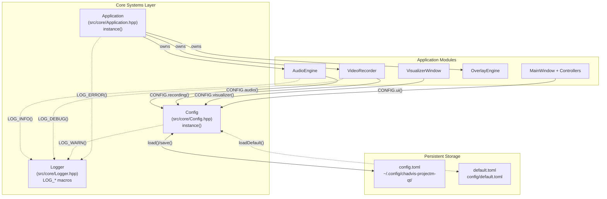
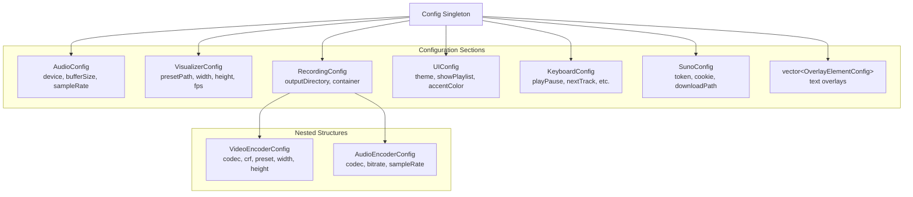
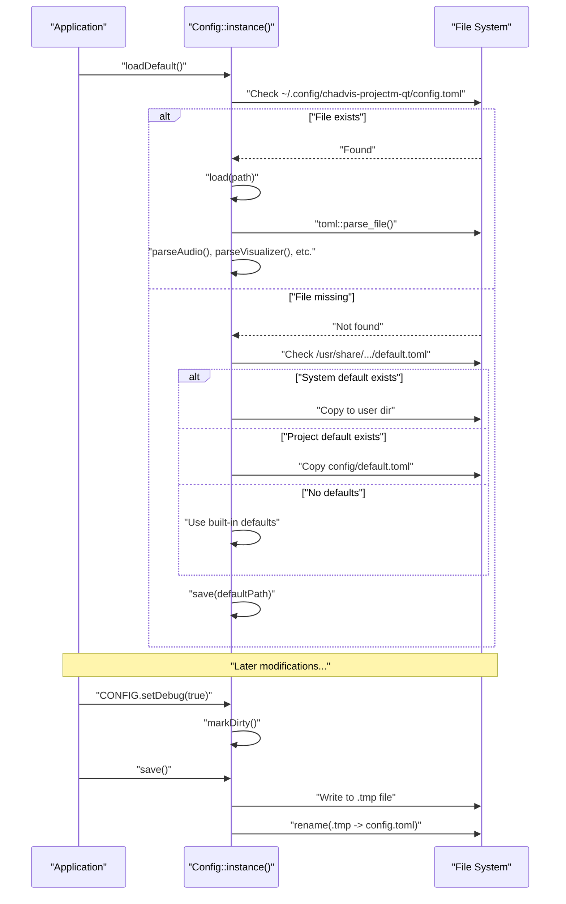
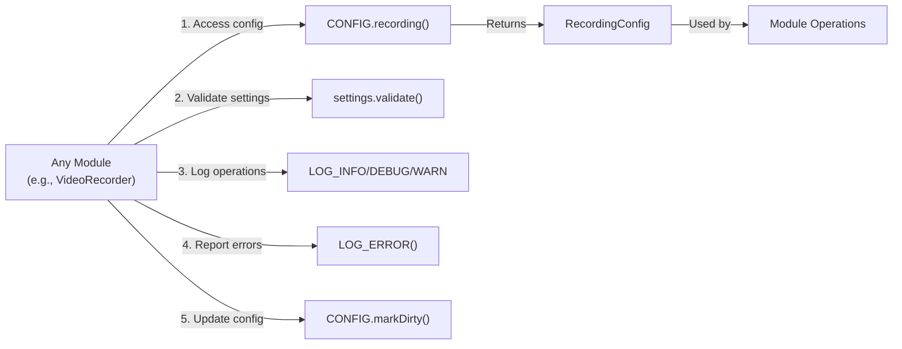

# Core Systems

<details>
<summary>Relevant source files</summary>

The following files were used as context for generating this wiki page:

- [AGENTS.md](AGENTS.md)
- [src/core/Config.cpp](src/core/Config.cpp)
- [src/recorder/VideoRecorder.cpp](src/recorder/VideoRecorder.cpp)

</details>


## Purpose and Scope

This document provides an overview of the foundational infrastructure layer that underpins the entire chadvis-projectm-qt application. These core systems—the **Application singleton**, **Config system**, and **Logger**—are designed to be universally accessible and provide cross-cutting concerns such as application lifecycle management, persistent configuration, and diagnostic output.

For detailed implementation information about the Application singleton and Config system internals, see [Application & Config](#2.1). For information about build system configuration and dependency management, see [Build System & Dependencies](#2.2).

---

## System Overview

The core systems form a foundational layer that all other modules depend on. They are implemented as singletons to provide global access without explicit dependency injection, following a pragmatic approach to managing cross-cutting concerns in a desktop application.

### Core Components

| Component | Primary Class | Access Pattern | Purpose |
|-----------|---------------|----------------|---------|
| **Application** | `Application` | `Application::instance()` | Singleton entry point; owns and orchestrates all engines (audio, video, overlay) |
| **Config** | `Config` | `CONFIG` macro | Thread-safe TOML-based configuration with dirty tracking and atomic saves |
| **Logger** | N/A (macro-based) | `LOG_INFO()`, `LOG_DEBUG()`, etc. | Structured diagnostic output with multiple severity levels |

---

## Architecture Diagram



**Sources:** [src/core/Config.cpp:1-460](), [AGENTS.md:80-86]()

---

## Application Singleton

The `Application` class serves as the single entry point and orchestrator for the entire application. It follows the singleton pattern and is responsible for:

- **Lifecycle management**: Initialization, event loop execution, and shutdown
- **Engine ownership**: Owns instances of `AudioEngine`, `VideoRecorder`, and `OverlayEngine`
- **Cross-engine coordination**: Routes signals between engines and UI components
- **Resource cleanup**: Ensures proper shutdown order and resource deallocation

Access pattern:
```cpp
Application& app = Application::instance();
```

The Application is constructed once in `main()` and destroyed upon application exit. Other components obtain references to engines through the Application singleton when needed.

**Sources:** [AGENTS.md:80-86]()

---

## Config System Architecture

The Config system provides centralized, persistent application settings with the following characteristics:

### Design Features

- **Singleton pattern**: Single global instance accessed via `CONFIG` macro
- **Thread-safe**: All operations protected by `std::mutex`
- **Dirty tracking**: Optimizes file writes by tracking modifications
- **Atomic saves**: Uses temporary file + rename for safe persistence
- **TOML format**: Human-readable configuration files
- **Type-safe sections**: Separate structs for each configuration domain

### Configuration Sections



**Sources:** [src/core/Config.cpp:173-329]()

### File Operations Flow



**Sources:** [src/core/Config.cpp:82-141](), [src/core/Config.cpp:143-171]()

### Access Pattern

The `CONFIG` macro provides global access without explicit dependency injection:

```cpp
// Reading configuration
u32 bufferSize = CONFIG.audio().bufferSize;
fs::path presetPath = CONFIG.visualizer().presetPath;

// Modifying configuration
CONFIG.setDebug(true);
CONFIG.addOverlayElement(overlayConfig);

// Persistence
auto result = CONFIG.save();
if (!result) {
    LOG_ERROR("Failed to save config: {}", result.error().message);
}
```

This approach trades compile-time dependency tracking for runtime convenience, which is appropriate for global configuration that virtually all modules need to access.

**Sources:** [AGENTS.md:80](), [src/core/Config.cpp:47-50]()

---

## Logger System

The Logger provides structured diagnostic output through a set of convenience macros. It is designed for simplicity and zero-overhead when logging is disabled.

### Logging Levels

| Macro | Level | Use Case |
|-------|-------|----------|
| `LOG_TRACE()` | Trace | Fine-grained debugging (hot paths) |
| `LOG_DEBUG()` | Debug | Development diagnostics |
| `LOG_INFO()` | Info | Normal operational messages |
| `LOG_WARN()` | Warn | Recoverable errors or unusual conditions |
| `LOG_ERROR()` | Error | Serious failures requiring attention |

### Usage Pattern

```cpp
LOG_INFO("Config loaded from: {}", path.string());
LOG_DEBUG("FFmpeg initialized successfully");
LOG_WARN("Audio codec not found: {}, skipping audio", codecName);
LOG_ERROR("Failed to create output context: {}", errorMsg);
```

The logger uses `spdlog` internally and supports format-string style arguments for type-safe message construction. All logging operations are thread-safe.

**Sources:** [AGENTS.md:68-69](), [src/core/Config.cpp:73](), [src/core/Config.cpp:199]()

---

## Integration with Application Modules

The core systems are designed to be universally accessible and provide services to all application modules without requiring explicit dependency injection.

### Typical Usage Pattern



**Sources:** [src/recorder/VideoRecorder.cpp:2-3](), [src/recorder/VideoRecorder.cpp:68-70]()

### Example: VideoRecorder Integration

The `VideoRecorder` demonstrates typical core system usage:

1. **Configuration access**: [src/recorder/VideoRecorder.cpp:68-70]()
   - Calls `EncoderSettings::fromConfig()` which internally uses `CONFIG.recording()`
   
2. **Logging operations**: [src/recorder/VideoRecorder.cpp:63](), [src/recorder/VideoRecorder.cpp:106-108]()
   - Logs start/stop events and statistics
   
3. **Error reporting**: [src/recorder/VideoRecorder.cpp:542-544]()
   - Uses `LOG_WARN()` for recoverable errors during encoding

This pattern is replicated across all major modules: `AudioEngine`, `VisualizerWindow`, `ProjectMBridge`, `OverlayEngine`, and UI controllers.

**Sources:** [src/recorder/VideoRecorder.cpp:1-639]()

---

## File Structure and Locations

### Source Files

| Path | Purpose |
|------|---------|
| `src/core/Application.hpp` | Application singleton declaration |
| `src/core/Application.cpp` | Application implementation and engine ownership |
| `src/core/Config.hpp` | Config singleton declaration and section structs |
| `src/core/Config.cpp` | TOML parsing, serialization, and file I/O |
| `src/core/Logger.hpp` | Logger macros and initialization |

### Configuration Files

| Path | Purpose |
|------|---------|
| `~/.config/chadvis-projectm-qt/config.toml` | User configuration (runtime) |
| `/usr/share/chadvis-projectm-qt/config/default.toml` | System-wide default (installed) |
| `config/default.toml` | Project default (source tree) |

The Config system implements a fallback chain: user config → system default → project default → built-in defaults. This ensures the application can always run even without any configuration files present.

**Sources:** [src/core/Config.cpp:82-141]()

---

## Thread Safety Considerations

Both `Application` and `Config` singletons are thread-safe:

- **Config**: All public methods acquire `std::lock_guard<std::mutex>` on `mutex_` [src/core/Config.cpp:53]()
- **Logger**: Thread-safety provided by underlying `spdlog` implementation
- **Application**: Engine access is single-threaded (main thread only), but engines themselves may spawn worker threads

The `CONFIG` macro is safe to call from any thread, but modifications should generally be made from the main thread to avoid race conditions in UI updates.

**Sources:** [src/core/Config.cpp:53](), [src/core/Config.cpp:144](), [src/core/Config.cpp:439]()

---

## Error Handling

All core systems use the `Result<T>` type for fallible operations:

```cpp
Result<void> Config::load(const fs::path& path);
Result<void> Config::save(const fs::path& path) const;
```

Errors are logged immediately using the Logger, and then propagated to callers for handling:

```cpp
if (auto result = CONFIG.save(path); !result) {
    LOG_WARN("Failed to save config: {}", result.error().message);
    // Handle error...
}
```

This pattern is consistent across the entire codebase and avoids the use of exceptions.

**Sources:** [src/core/Config.cpp:52-80](), [src/core/Config.cpp:143-171](), [AGENTS.md:54-65]()