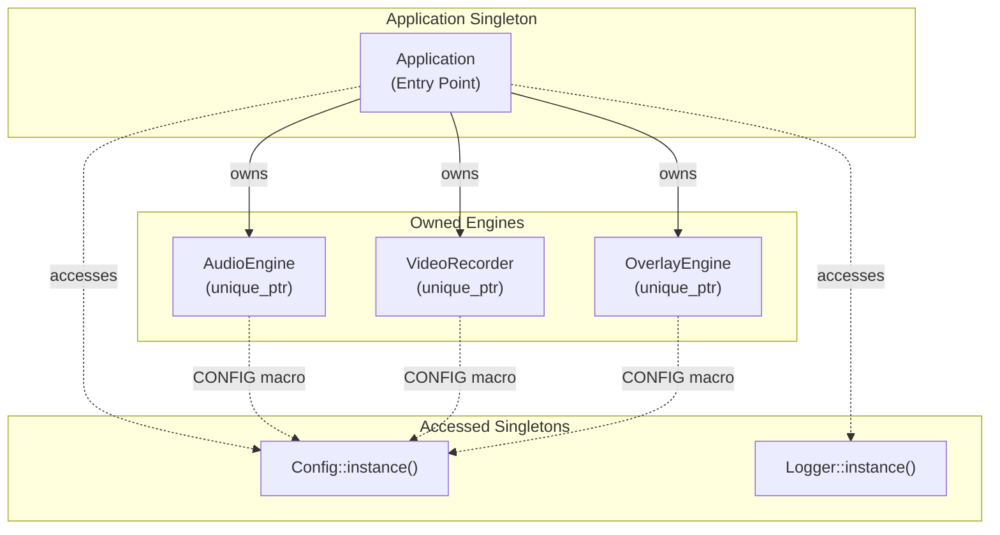
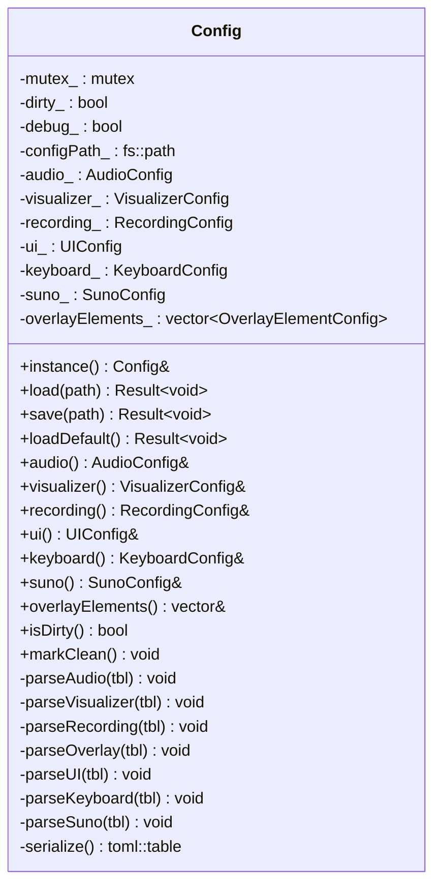
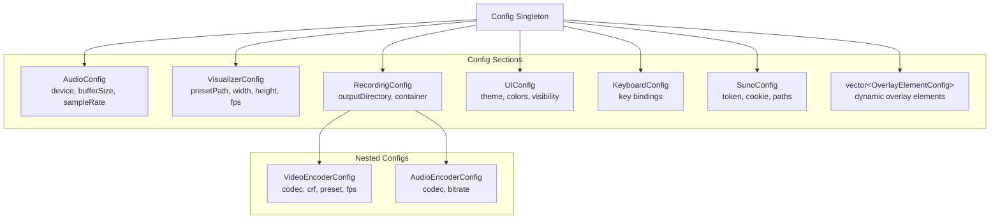
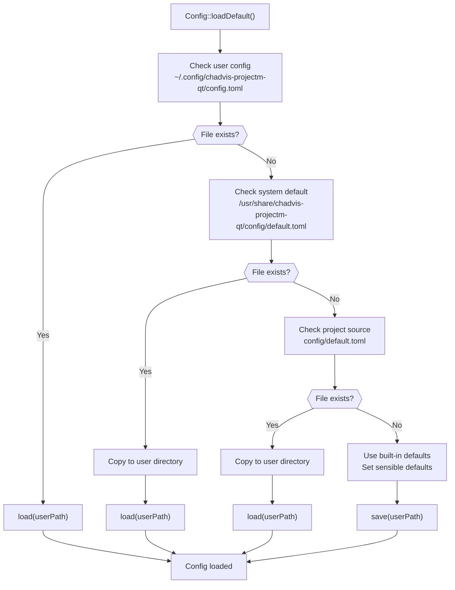

# Application & Config

<details>
<summary>Relevant source files</summary>

The following files were used as context for generating this wiki page:

- [CMakeLists.txt](CMakeLists.txt)
- [src/core/Config.cpp](src/core/Config.cpp)
- [src/core/Config.hpp](src/core/Config.hpp)
- [src/recorder/VideoRecorder.cpp](src/recorder/VideoRecorder.cpp)

</details>


## Purpose and Scope

This document covers the **core application infrastructure**: the `Application` singleton that serves as the entry point and engine owner, and the `Config` system that provides TOML-based configuration management with global access. These two components form the foundation of the codebase's architecture.

For information about the build system and dependencies, see [Build System & Dependencies](#2.2). For details about the Logger system, see [Overview](#2) (Core Systems section).

**Sources:** [CMakeLists.txt:119-126](), [src/core/Config.hpp:1-237](), [src/core/Config.cpp:1-460]()

---

## Application Singleton

The `Application` class serves as the **main entry point** and **ownership root** for all engine subsystems. It follows the singleton pattern to ensure a single application instance exists throughout the program lifecycle.

### Ownership Model

According to the high-level architecture (Diagram 1), the Application singleton owns:
- `AudioEngine` - handles audio playback and analysis
- `VideoRecorder` - manages video recording
- `OverlayEngine` - text overlay rendering

The Application also accesses (but does not own):
- `Config` singleton - configuration data
- `Logger` singleton - diagnostic output

This ownership model ensures clear resource management: when the Application is destroyed, all engines are properly cleaned up in reverse dependency order.

**Diagram: Application Ownership Structure**



**Sources:** [CMakeLists.txt:124-125]()

---

## Config System Architecture

The `Config` class implements a **thread-safe singleton** that manages all application settings using the **toml++** library for TOML file parsing and serialization.

### Singleton Pattern

The Config singleton is accessed via a static method and a convenience macro:

```cpp
// Direct access
Config& cfg = Config::instance();

// Via macro (used throughout codebase)
const auto& vizConfig = CONFIG.visualizer();
```

The `CONFIG` macro is defined in [src/core/Config.hpp:234]() as:
```cpp
#define CONFIG vc::Config::instance()
```

This macro provides global access without requiring dependency injection, simplifying code that needs to read configuration values.

### Thread Safety

All Config methods use a `std::mutex` to ensure thread-safe access. The mutex is declared as [src/core/Config.hpp:230]():
```cpp
mutable std::mutex mutex_;
```

Lock guards protect critical sections in:
- `load()` [src/core/Config.cpp:53]()
- `save()` [src/core/Config.cpp:144]()
- `addOverlayElement()` [src/core/Config.cpp:439]()
- `removeOverlayElement()` [src/core/Config.cpp:445]()

### Dirty Tracking

The Config system implements dirty tracking to optimize saves. When any mutable accessor is called, `markDirty()` is invoked [src/core/Config.hpp:202-204]():

```cpp
void markDirty() { dirty_ = true; }
```

This allows the application to check `isDirty()` [src/core/Config.hpp:193-198]() before performing potentially expensive file writes.

**Diagram: Config Class Structure**



**Sources:** [src/core/Config.hpp:109-231](), [src/core/Config.cpp:47-50]()

---

## Configuration Sections

The Config system organizes settings into logical sections, each represented by a dedicated struct. All sections are defined in [src/core/Config.hpp:14-107]().

### Section Overview

| Section | Struct | Purpose | Key Settings |
|---------|--------|---------|--------------|
| Audio | `AudioConfig` | Audio backend configuration | device, bufferSize, sampleRate |
| Visualizer | `VisualizerConfig` | Visualization rendering | presetPath, width, height, fps, beatSensitivity |
| Recording | `RecordingConfig` | Video recording settings | outputDirectory, container, nested video/audio configs |
| UI | `UIConfig` | User interface preferences | theme, showPlaylist, backgroundColor, accentColor |
| Keyboard | `KeyboardConfig` | Keyboard shortcuts | playPause, nextTrack, toggleRecord, etc. |
| Suno | `SunoConfig` | Suno AI integration | token, cookie, downloadPath, autoDownload |
| Overlay | `vector<OverlayElementConfig>` | Text overlay elements | Dynamic list of overlay configurations |

### Nested Configuration

The `RecordingConfig` contains nested encoder configurations [src/core/Config.hpp:46-54]():

```cpp
struct RecordingConfig {
    bool enabled{true};
    bool autoRecord{false};
    fs::path outputDirectory;
    std::string defaultFilename{"chadvis-projectm-qt_{date}_{time}"};
    std::string container{"mp4"};
    VideoEncoderConfig video;  // Nested
    AudioEncoderConfig audio;  // Nested
};
```

This nesting mirrors the TOML file structure:
```toml
[recording]
enabled = true
output_directory = "~/Videos/ChadVis"

[recording.video]
codec = "libx264"
crf = 23
width = 1920
height = 1080

[recording.audio]
codec = "aac"
bitrate = 192
```

**Diagram: Configuration Section Hierarchy**



**Sources:** [src/core/Config.hpp:14-107](), [src/core/Config.cpp:173-329]()

---

## File Locations and Loading

### Configuration File Paths

The Config system searches for configuration files in multiple locations, with a defined fallback order:

1. **User Config Directory:** `~/.config/chadvis-projectm-qt/config.toml`
2. **System Installation:** `/usr/share/chadvis-projectm-qt/config/default.toml`
3. **Project Source Tree:** `config/default.toml` (development)

The `loadDefault()` method implements this search order [src/core/Config.cpp:82-141]().

### Load Process

**Diagram: Configuration Loading Flow**



**Sources:** [src/core/Config.cpp:82-141]()

### Path Expansion

The Config system supports `~` expansion for home directory paths [src/core/Config.cpp:35-43]():

```cpp
fs::path expandPath(std::string_view path) {
    std::string p(path);
    if (p.starts_with("~/")) {
        if (const char* home = std::getenv("HOME")) {
            p = std::string(home) + p.substr(1);
        }
    }
    return fs::path(p);
}
```

This allows users to write portable paths in TOML files:
```toml
output_directory = "~/Videos/ChadVis"
```

### TOML Parsing

The `load()` method uses toml++ to parse configuration files [src/core/Config.cpp:52-80]():

```cpp
Result<void> Config::load(const fs::path& path) {
    std::lock_guard lock(mutex_);
    
    try {
        auto tbl = toml::parse_file(path.string());
        configPath_ = path;
        
        // Parse each section
        parseAudio(tbl);
        parseVisualizer(tbl);
        parseRecording(tbl);
        parseOverlay(tbl);
        parseUI(tbl);
        parseKeyboard(tbl);
        parseSuno(tbl);
        
        dirty_ = false;
        return Result<void>::ok();
    } catch (const toml::parse_error& err) {
        return Result<void>::err(std::string("Config parse error: ") + err.what());
    }
}
```

Each `parse*()` method extracts values from the TOML table with defaults for missing keys. For example, `parseAudio()` [src/core/Config.cpp:173-179]():

```cpp
void Config::parseAudio(const toml::table& tbl) {
    if (auto audio = tbl["audio"].as_table()) {
        audio_.device = get(*audio, "device", std::string("default"));
        audio_.bufferSize = get(*audio, "buffer_size", 2048u);
        audio_.sampleRate = get(*audio, "sample_rate", 44100u);
    }
}
```

**Sources:** [src/core/Config.cpp:52-80](), [src/core/Config.cpp:173-329]()

---

## Atomic File Saving

The Config system implements **atomic writes** to prevent corruption from partial writes or crashes [src/core/Config.cpp:143-171]():

### Save Process

1. Serialize configuration to `toml::table` [src/core/Config.cpp:331-436]()
2. Write to temporary file: `config.toml.tmp`
3. Atomically rename temp file to actual path
4. Filesystem ensures atomicity of rename operation

**Diagram: Atomic Save Process**

```mermaid
sequenceDiagram
    participant App as Application
    participant Cfg as Config
    participant FS as Filesystem
    
    App->>Cfg: save(path)
    activate Cfg
    
    Cfg->>Cfg: serialize() → toml::table
    Note over Cfg: Convert all config sections<br/>to TOML representation
    
    Cfg->>FS: open(path + ".tmp")
    FS-->>Cfg: temp file handle
    
    Cfg->>FS: write(toml::table)
    Note over FS: Write complete config<br/>to temporary file
    
    Cfg->>FS: fs::rename(temp, path)
    Note over FS: Atomic operation<br/>replaces old config
    
    FS-->>Cfg: success
    deactivate Cfg
    Cfg-->>App: Result::ok()
```



The key code [src/core/Config.cpp:149-164]():

```cpp
// Atomic write: write to temp file, then rename
fs::path tempPath = path;
tempPath += ".tmp";

{
    std::ofstream file(tempPath);
    if (!file) {
        return Result<void>::err("Failed to open temp config file for writing");
    }
    file << tbl;
}

// Rename is atomic on most filesystems
fs::rename(tempPath, path);
```

**Sources:** [src/core/Config.cpp:143-171]()

---

## Global Access Pattern

The codebase uses the `CONFIG` macro extensively to access configuration without explicit dependency injection.

### Usage Examples

From [src/recorder/VideoRecorder.cpp:68]():
```cpp
Result<void> VideoRecorder::start(const fs::path& outputPath) {
    auto settings = EncoderSettings::fromConfig();  // Uses CONFIG internally
    settings.outputPath = outputPath;
    return start(settings);
}
```

Modules read configuration directly:
```cpp
// Read visualizer settings
u32 width = CONFIG.visualizer().width;
u32 height = CONFIG.visualizer().height;
u32 fps = CONFIG.visualizer().fps;

// Read recording settings
fs::path outputDir = CONFIG.recording().outputDirectory;
```

Modify settings and mark dirty:
```cpp
// Mutable access automatically marks dirty
CONFIG.visualizer().fps = 60;
CONFIG.recording().autoRecord = true;

// Check if save needed
if (CONFIG.isDirty()) {
    CONFIG.save(CONFIG.configPath());
    CONFIG.markClean();
}
```

### Configuration Section Accessors

The Config class provides both const and mutable accessors for each section [src/core/Config.hpp:133-177]():

```cpp
// Const accessors (read-only, no dirty marking)
const AudioConfig& audio() const { return audio_; }
const VisualizerConfig& visualizer() const { return visualizer_; }

// Mutable accessors (mark dirty on access)
AudioConfig& audio() { markDirty(); return audio_; }
VisualizerConfig& visualizer() { markDirty(); return visualizer_; }
```

This design automatically tracks modifications without requiring explicit dirty flag management.

**Sources:** [src/core/Config.hpp:133-177](), [src/core/Config.hpp:234](), [src/recorder/VideoRecorder.cpp:67-71]()

---

## Configuration Validation

Individual config sections implement validation where needed. For example, the visualizer config clamps values to safe ranges [src/core/Config.cpp:187-203]():

```cpp
visualizer_.width = std::clamp(get(*viz, "width", 1280u), 320u, 7680u);
visualizer_.height = std::clamp(get(*viz, "height", 720u), 200u, 4320u);
visualizer_.fps = std::clamp(get(*viz, "fps", 30u), 10u, 240u);
visualizer_.beatSensitivity = std::clamp(get(*viz, "beat_sensitivity", 1.0f), 0.1f, 10.0f);
```

The recording config ensures FFmpeg-compatible dimensions (must be even) [src/core/Config.cpp:228-236]():

```cpp
u32 w = std::clamp(get(*video, "width", 1280u), 320u, 7680u);
if (w % 2 != 0) w++;  // FFmpeg H.264 likes even dimensions
recording_.video.width = w;

u32 h = std::clamp(get(*video, "height", 720u), 200u, 4320u);
if (h % 2 != 0) h++;
recording_.video.height = h;
```

**Sources:** [src/core/Config.cpp:181-248]()

---

## Dependencies

The Config system depends on:

| Dependency | Purpose | CMake Reference |
|------------|---------|-----------------|
| toml++ | TOML parsing and serialization | [CMakeLists.txt:66]() |
| filesystem | Path operations and file I/O | C++17 standard library |
| mutex | Thread-safe access | C++11 standard library |

The toml++ library is discovered via pkg-config:
```cmake
pkg_check_modules(TOMLPP REQUIRED tomlplusplus)
```

**Sources:** [CMakeLists.txt:66](), [src/core/Config.hpp:5]()