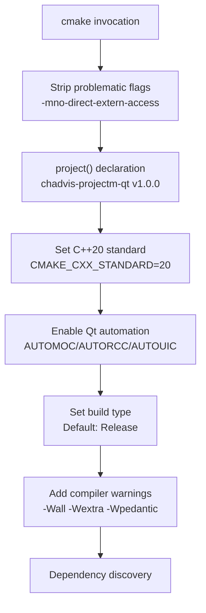
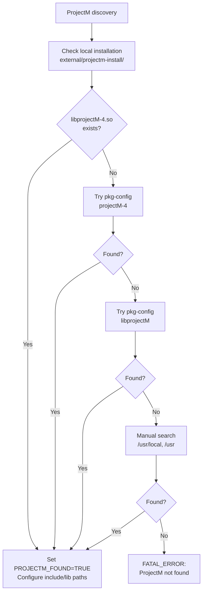
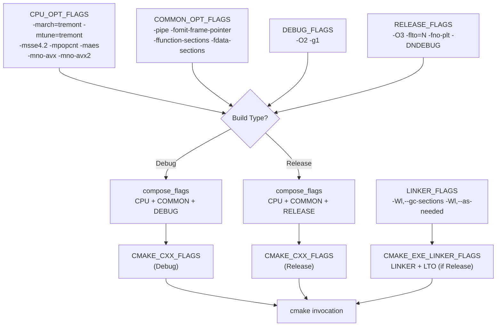
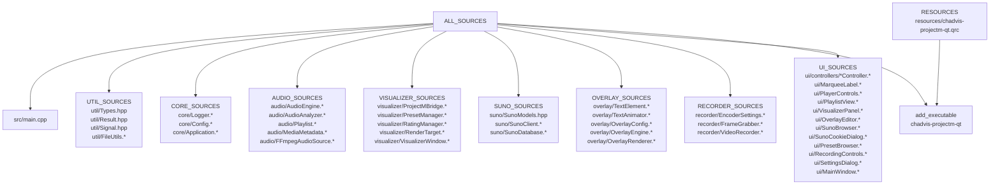
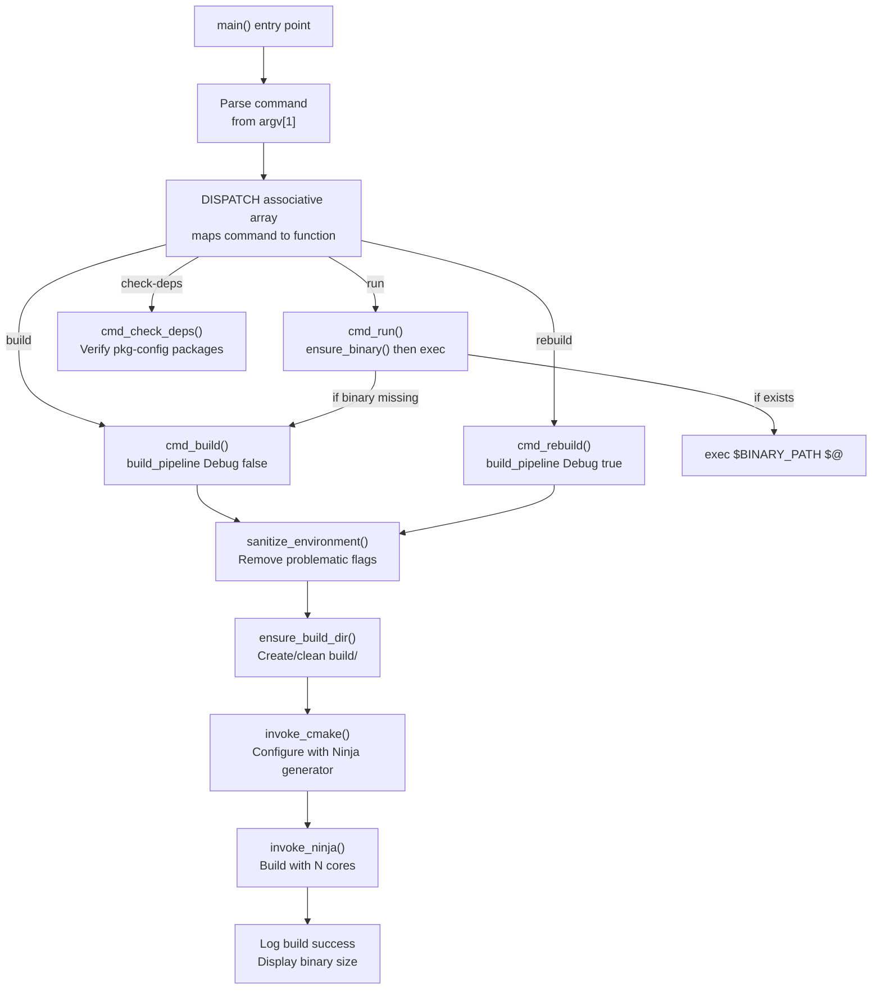

# Build System & Dependencies

<details>
<summary>Relevant source files</summary>

The following files were used as context for generating this wiki page:

- [.gitignore](.gitignore)
- [CMakeLists.txt](CMakeLists.txt)
- [build.zsh](build.zsh)
- [src/core/Config.hpp](src/core/Config.hpp)
- [src/overlay/OverlayRenderer.cpp](src/overlay/OverlayRenderer.cpp)

</details>


This document describes the CMake-based build system for chadvis-projectm-qt, including dependency discovery mechanisms, compiler flag management, source file organization, and the convenience build script. The build system targets C++20 with Qt6 and projectM v4 as primary dependencies.

For information about the Application singleton and Config system that loads at runtime, see [Application & Config](#2.1). For details on how individual systems are implemented, refer to their respective sections: [Audio System](#3), [Visualization System](#4), [Recording System](#5).

---

## Build Tools & Requirements

The project uses CMake 3.20+ as its build system generator with Ninja as the recommended backend. The build configuration enforces C++20 standard compliance and enables Qt's meta-object compiler (MOC), resource compiler (RCC), and UI compiler (UIC) automation.

**Required Tools:**
- CMake 3.20 or higher
- Ninja build system (recommended) or Make
- GCC/G++ with C++20 support
- pkg-config for dependency discovery

**Core Dependencies:**
- **Qt6** (6.x): Core, Gui, Widgets, Multimedia, OpenGLWidgets, Svg, Network, Sql
- **projectM v4**: Visualization library (local build or system package)
- **FFmpeg**: libavcodec, libavformat, libavutil, libswscale, libswresample
- **spdlog**: Logging framework
- **fmt**: String formatting
- **taglib**: Audio metadata parsing
- **tomlplusplus**: TOML configuration parsing
- **GLEW**: OpenGL extension wrangler
- **glm**: OpenGL mathematics library

Sources: [CMakeLists.txt:1-31](), [build.zsh:158-179]()

---

## CMake Configuration Structure

### Build Type & Compiler Standards

The CMake configuration sets C++20 as the required standard and defaults to Release build type if not specified. It explicitly removes problematic compiler flags that cause build failures on certain systems.

```cmake
# Key configuration settings
CMAKE_CXX_STANDARD = 20
CMAKE_CXX_STANDARD_REQUIRED = ON
CMAKE_EXPORT_COMPILE_COMMANDS = ON (for IDE support)
CMAKE_AUTOMOC = ON (Qt MOC automation)
CMAKE_AUTORCC = ON (Qt resource compilation)
CMAKE_AUTOUIC = ON (Qt UI file compilation)
```

The build system strips the `-mno-direct-extern-access` flag from all compiler flag variables to prevent compatibility issues with certain toolchains. This sanitization happens at [CMakeLists.txt:4-9]() before the project definition.

**Diagram: CMake Configuration Flow**



Sources: [CMakeLists.txt:1-51]()

---

## Dependency Discovery Mechanisms

The build system uses a two-tiered approach to locate dependencies: pkg-config for most libraries, with manual fallback search paths for projectM v4.

### Qt6 Dependencies

Qt6 packages are discovered using CMake's native `find_package()` mechanism with the `REQUIRED` flag. The following Qt6 modules are linked:

| Qt6 Module | Purpose |
|------------|---------|
| `Qt6::Core` | Foundation classes, event loop, signals/slots |
| `Qt6::Gui` | Window system integration, OpenGL context |
| `Qt6::Widgets` | UI widget classes |
| `Qt6::Multimedia` | Audio playback (QMediaPlayer, QAudioBufferOutput) |
| `Qt6::OpenGLWidgets` | OpenGL rendering widgets |
| `Qt6::Svg` | SVG icon support |
| `Qt6::Network` | HTTP client for Suno API (QNetworkAccessManager) |
| `Qt6::Sql` | SQLite database for Suno local storage |

Sources: [CMakeLists.txt:60](), [CMakeLists.txt:247-255]()

### Pkg-config Dependencies

Most external libraries are discovered via pkg-config, which provides compiler include paths and linker flags:

```cmake
pkg_check_modules(SPDLOG REQUIRED spdlog)
pkg_check_modules(FMT REQUIRED fmt)
pkg_check_modules(TAGLIB REQUIRED taglib)
pkg_check_modules(TOMLPP REQUIRED tomlplusplus)
pkg_check_modules(GLEW REQUIRED glew)
pkg_check_modules(FFMPEG REQUIRED libavcodec libavformat libavutil libswscale libswresample)
```

These modules populate variables like `${SPDLOG_INCLUDE_DIRS}` and `${SPDLOG_LIBRARIES}` that are used in `target_include_directories()` and `target_link_libraries()` respectively.

Sources: [CMakeLists.txt:63-69]()

### ProjectM v4 Discovery Strategy

ProjectM v4 uses a three-tier discovery strategy due to its frequent unavailability in system package repositories:

**Diagram: ProjectM Discovery Flow**



The local installation path at `${CMAKE_SOURCE_DIR}/external/projectm-install` is checked first. If found, the build system sets `CMAKE_INSTALL_RPATH` to ensure the binary can locate the shared library at runtime:

```cmake
set(PROJECTM_LOCAL_DIR "${CMAKE_SOURCE_DIR}/external/projectm-install")
set(PROJECTM_INCLUDE_DIRS "${PROJECTM_LOCAL_DIR}/include")
set(PROJECTM_LIBRARIES "${PROJECTM_LOCAL_DIR}/lib/libprojectM-4.so")
set(CMAKE_INSTALL_RPATH "${PROJECTM_LOCAL_DIR}/lib")
set(CMAKE_BUILD_WITH_INSTALL_RPATH TRUE)
```

The manual search uses `find_path()` for headers and `find_library()` for the shared object:

```cmake
find_path(PROJECTM_INCLUDE_DIRS projectM-4/projectM.h
    HINTS /usr/local/include /usr/include
)
find_library(PROJECTM_LIBRARIES projectM-4
    HINTS /usr/local/lib /usr/lib
)
```

A bug fix at [CMakeLists.txt:105-108]() corrects pkg-config's erroneous `-l:projectM-4` linker flag to the correct `-lprojectM-4` format.

Sources: [CMakeLists.txt:71-108]()

---

## Compiler Flags & Optimizations

### CMakeLists.txt Compiler Flags

The CMake configuration applies warning flags to all build types and optimization flags specific to Debug/Release configurations:

| Flag Category | Flags | Purpose |
|---------------|-------|---------|
| **Warnings** | `-Wall -Wextra -Wpedantic` | Enable comprehensive warnings |
| **Warning Suppression** | `-Wno-unused-parameter` | Suppress unused parameter warnings |
| **Debug Flags** | `-g3 -O0` | Full debug symbols, no optimization |
| **Release Flags** | `-O3 -march=native` | Maximum optimization, CPU-specific tuning |

The `-march=native` flag enables CPU-specific optimizations for the build machine. This is overridden by the build.zsh script for explicit architecture targeting.

Sources: [CMakeLists.txt:48-57]()

### build.zsh Optimization Strategy

The `build.zsh` script provides a more sophisticated flag composition system optimized for Intel N4500 (Tremont microarchitecture):

**Diagram: Flag Composition in build.zsh**



**CPU-Specific Flags** (Intel N4500/Tremont):
- `-march=tremont -mtune=tremont`: Target Tremont microarchitecture
- `-msse4.2 -mpopcnt -maes`: Enable available instruction sets
- `-mno-avx -mno-avx2`: Explicitly disable unavailable instructions

**Optimization Flags**:
- `-pipe`: Use pipes instead of temporary files between compilation stages
- `-fomit-frame-pointer`: Omit frame pointer for performance
- `-ffunction-sections -fdata-sections`: Enable dead code elimination
- `-flto=N`: Link-time optimization with N parallel jobs (Release only)
- `-fno-plt`: Avoid PLT indirection for performance

**Linker Flags**:
- `-Wl,--gc-sections`: Remove unused sections
- `-Wl,--as-needed`: Only link actually used libraries

The script sanitizes environment variables to remove problematic flags before invoking CMake:

```zsh
remove_problematic_flags() {
    local -a bad=("-mno-direct-extern-access" "-fcf-protection" "-fstack-clash-protection")
    # Remove from input string
}
```

Sources: [build.zsh:13-43](), [build.zsh:62-74](), [build.zsh:84-101]()

---

## Source File Organization

The CMake configuration organizes source files into logical modules, with explicit listing of both `.cpp` implementation files and `.hpp` header files. Headers must be listed explicitly to enable CMake's `AUTOMOC` to generate meta-object code for Qt classes containing `Q_OBJECT` macros.

**Diagram: Source Module Organization**



### Module Mapping to Systems

| CMake Variable | Module Purpose | Related Wiki Section |
|----------------|----------------|----------------------|
| `UTIL_SOURCES` | Type definitions, Result<T> error handling, signal system, file utilities | [Architecture & Design Patterns](#1.1) |
| `CORE_SOURCES` | Logger, Config singleton, Application singleton | [Application & Config](#2.1) |
| `AUDIO_SOURCES` | Audio playback, decoding, spectrum analysis, playlist management | [Audio System](#3) |
| `VISUALIZER_SOURCES` | projectM integration, preset management, OpenGL window, render targets | [Visualization System](#4) |
| `SUNO_SOURCES` | Suno AI API client, data models, SQLite database | [Suno AI Integration](#8) |
| `OVERLAY_SOURCES` | Text rendering, animations, overlay composition | [Overlay System](#6) |
| `RECORDER_SOURCES` | FFmpeg encoding, frame capture, video output | [Recording System](#5) |
| `UI_SOURCES` | Qt widgets, controllers, main window, dialogs | [User Interface](#7) |

The wildcard pattern `.*` in the diagram represents both `.hpp` and `.cpp` files. Each module is self-contained, with headers listed explicitly to enable AUTOMOC processing.

Sources: [CMakeLists.txt:111-227]()

---

## Build Script (build.zsh)

The `build.zsh` script provides a high-level interface to the CMake/Ninja build system with additional features for development workflow.

### Available Commands

| Command | Function | Description |
|---------|----------|-------------|
| `build` | `cmd_build()` | Incremental debug build |
| `rebuild` | `cmd_rebuild()` | Clean debug build |
| `clean` | `cmd_clean()` | Remove all build artifacts |
| `run [args]` | `cmd_run()` | Build if needed, then execute binary with arguments |
| `test` | `cmd_test()` | Run unit and integration test suites |
| `check-deps` | `cmd_check_deps()` | Verify all required packages are installed |
| `help` | `cmd_help()` | Display command reference |

**Diagram: Build Script Execution Flow**



### Key Implementation Details

**Command Dispatch** at [build.zsh:196-209]():
```zsh
typeset -A DISPATCH=(
    [build]=cmd_build
    [rebuild]=cmd_rebuild
    [clean]=cmd_clean
    [run]=cmd_run
    [test]=cmd_test
    [check-deps]=cmd_check_deps
)
```

**Build Pipeline** at [build.zsh:108-123]():
```zsh
build_pipeline() {
    local build_type="$1" clean_first="${2:-false}"
    sanitize_environment
    ensure_build_dir "$clean_first"
    invoke_cmake "$build_type"
    invoke_ninja "$N4500_CORES"
}
```

**Dependency Checking** at [build.zsh:158-179]():
The `check-deps` command verifies both command-line tools (`cmd:` prefix) and pkg-config packages (`pkg:` prefix):

```zsh
local -a deps=(
    "cmd:cmake:cmake" "cmd:ninja:ninja" "cmd:g++:gcc"
    "pkg:Qt6Core:qt6-base" "pkg:Qt6Widgets:qt6-base"
    "pkg:libprojectM-4:projectm" "pkg:libavcodec:ffmpeg"
    # ... more dependencies
)
```

Missing packages are reported with a suggested `pacman` installation command (Arch Linux package manager).

Sources: [build.zsh:1-213]()

---

## Target Configuration & Installation

### Include Directories

The executable target includes directories from all dependencies:

```cmake
target_include_directories(chadvis-projectm-qt PRIVATE
    ${CMAKE_SOURCE_DIR}/src           # Project source root
    ${SPDLOG_INCLUDE_DIRS}
    ${FMT_INCLUDE_DIRS}
    ${TAGLIB_INCLUDE_DIRS}
    ${TOMLPP_INCLUDE_DIRS}
    ${GLEW_INCLUDE_DIRS}
    ${GLM_INCLUDE_DIRS}
    ${FFMPEG_INCLUDE_DIRS}
    ${PROJECTM_INCLUDE_DIRS}
)
```

The `${CMAKE_SOURCE_DIR}/src` entry enables include paths like `#include "core/Logger.hpp"` without relative path traversal.

Sources: [CMakeLists.txt:235-245]()

### Linker Configuration

The target links against Qt6 modules, external libraries, and OpenGL:

```cmake
target_link_libraries(chadvis-projectm-qt PRIVATE
    Qt6::Core Qt6::Gui Qt6::Widgets Qt6::Multimedia
    Qt6::OpenGLWidgets Qt6::Svg Qt6::Network Qt6::Sql
    ${SPDLOG_LIBRARIES}
    ${FMT_LIBRARIES}
    ${TAGLIB_LIBRARIES}
    ${GLEW_LIBRARIES}
    ${FFMPEG_LIBRARIES}
    projectM-4
    projectM-4-playlist
    OpenGL
)
```

Note that `projectM-4` and `projectM-4-playlist` are linked directly by name rather than through the `${PROJECTM_LIBRARIES}` variable due to the custom discovery logic.

Sources: [CMakeLists.txt:247-264]()

### Installation Targets

The build system defines installation rules for system-wide deployment:

| Target | Destination | Purpose |
|--------|-------------|---------|
| `chadvis-projectm-qt` | `bin/` | Main executable binary |
| `config/` directory | `share/chadvis-projectm-qt/config/` | Default configuration templates |
| `chadvis-projectm-qt.desktop` | `share/applications/` | Desktop environment integration |
| `chadvis-projectm-qt.svg` | `share/icons/hicolor/scalable/apps/` | Application icon |

Installation is performed via:
```bash
cmake --install build --prefix /usr/local
```

Sources: [CMakeLists.txt:272-276]()

---

## CPack Packaging

The build system includes CPack configuration for generating distribution packages:

```cmake
set(CPACK_PACKAGE_NAME "chadvis-projectm-qt")
set(CPACK_PACKAGE_VERSION ${PROJECT_VERSION})
set(CPACK_PACKAGE_DESCRIPTION_SUMMARY "Qt6 projectM v4 visualizer with modern C++20")
include(CPack)
```

This enables package generation with:
```bash
cd build
cpack -G DEB  # Debian package
cpack -G RPM  # RPM package
cpack -G TGZ  # Tarball
```

Sources: [CMakeLists.txt:278-281]()