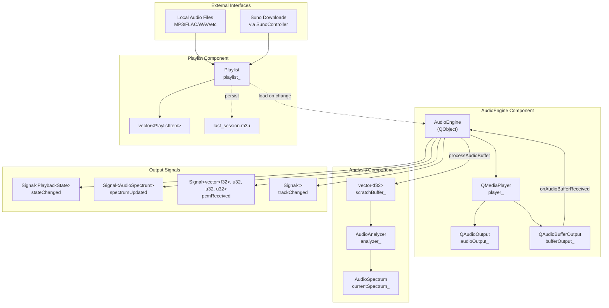
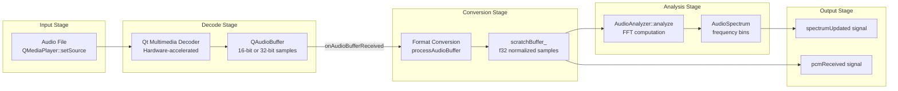
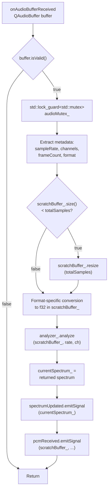
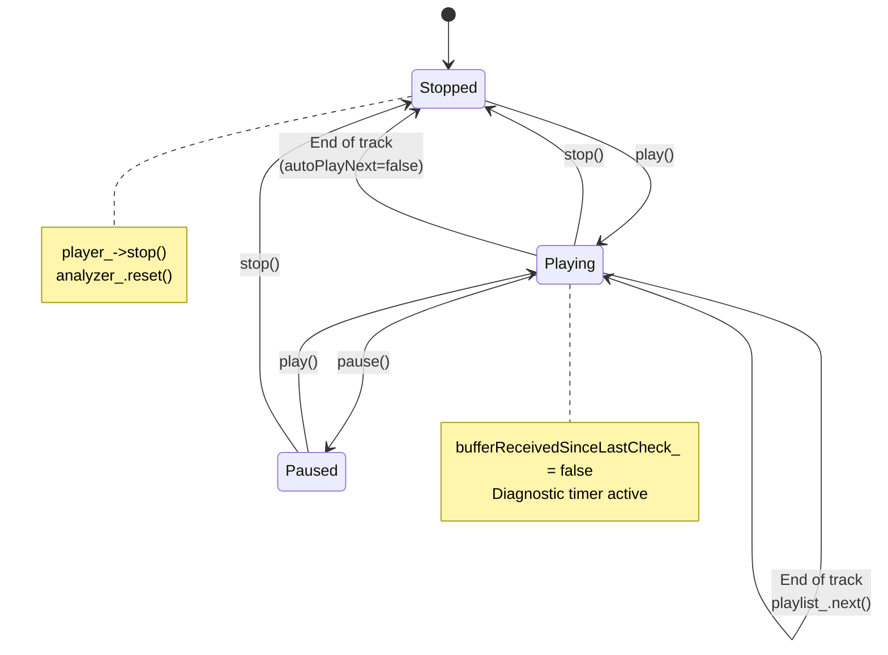
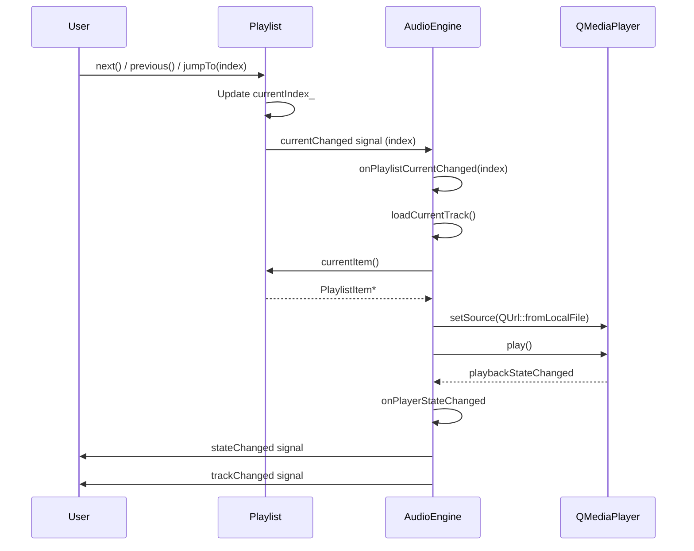
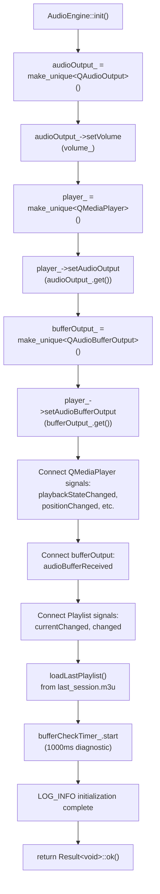
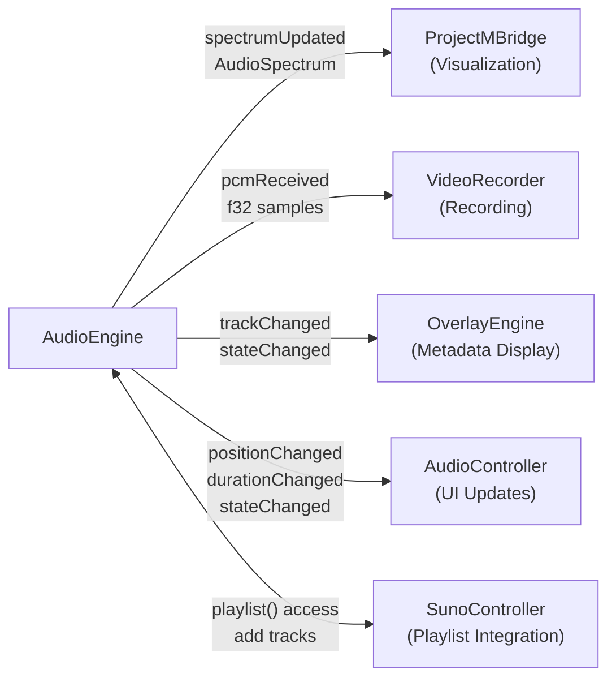
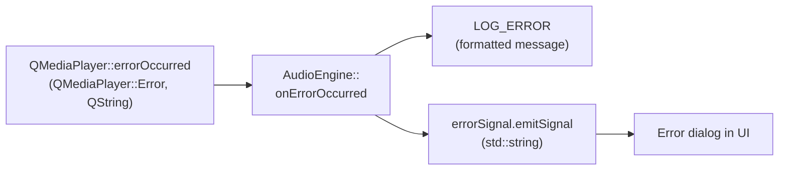

# Audio System

<details>
<summary>Relevant source files</summary>

The following files were used as context for generating this wiki page:

- [AGENTS.md](AGENTS.md)
- [src/audio/AudioEngine.cpp](src/audio/AudioEngine.cpp)
- [src/audio/AudioEngine.hpp](src/audio/AudioEngine.hpp)

</details>


## Purpose and Scope

The Audio System handles all aspects of audio playback, decoding, analysis, and track management in chadvis-projectm-qt. It serves as the audio data source for the visualization pipeline, providing real-time PCM samples and spectrum data to projectM. This document covers the architecture of the audio subsystem, the buffer processing pipeline, and integration points with other systems.

For detailed implementation of the main audio engine, see [AudioEngine](#3.1). For playlist functionality and M3U file handling, see [Playlist Management](#3.2). For how audio data drives visualizations, see [Visualization System](#4).

---

## System Architecture

The Audio System consists of three primary components working in concert: `AudioEngine` for playback orchestration, `AudioAnalyzer` for frequency spectrum extraction, and `Playlist` for track management. The system is designed around Qt's Multimedia framework with custom signal routing to provide zero-copy audio data to visualization and recording subsystems.



**Sources:** [src/audio/AudioEngine.hpp:1-127](), [src/audio/AudioEngine.cpp:1-279]()

---

## Component Responsibilities

| Component | Primary Responsibilities | Key Types |
|-----------|-------------------------|-----------|
| `AudioEngine` | Playback orchestration, volume control, seeking, signal emission | `PlaybackState`, `Duration` |
| `AudioAnalyzer` | FFT-based frequency analysis, beat detection | `AudioSpectrum` |
| `Playlist` | Track queue management, M3U I/O, shuffle/repeat modes | `PlaylistItem` |
| `QMediaPlayer` | Hardware-accelerated decoding via Qt Multimedia | Qt-owned |
| `QAudioBufferOutput` | Real-time PCM buffer capture for analysis | Qt-owned |

**Sources:** [src/audio/AudioEngine.hpp:26-127](), [AGENTS.md:80-86]()

---

## Audio Processing Pipeline

The audio processing pipeline transforms compressed audio files into frequency spectrum data for visualization. This happens in real-time during playback with minimal latency.



**Sources:** [src/audio/AudioEngine.cpp:191-274]()

---

## Buffer Processing Details

The `processAudioBuffer` method performs zero-allocation audio processing by reusing a pre-allocated `scratchBuffer_`. This method handles multiple sample formats from Qt Multimedia and normalizes them to `f32` values in the range [-1.0, 1.0].

### Sample Format Conversion

| Input Format | Source Type | Conversion Formula | Code Location |
|--------------|-------------|-------------------|---------------|
| `QAudioFormat::Float` | `f32*` | Direct copy (no conversion) | [src/audio/AudioEngine.cpp:250-252]() |
| `QAudioFormat::Int16` | `i16*` | `sample / 32768.0f` | [src/audio/AudioEngine.cpp:254-257]() |
| `QAudioFormat::Int32` | `i32*` | `sample / 2147483648.0f` | [src/audio/AudioEngine.cpp:258-263]() |

### Processing Flow



**Sources:** [src/audio/AudioEngine.cpp:232-274]()

---

## Playback State Management

The `AudioEngine` maintains a simplified three-state model mapped from Qt's `QMediaPlayer::PlaybackState`. State transitions trigger signal emissions that update the UI and visualization systems.

### State Diagram



**Sources:** [src/audio/AudioEngine.cpp:147-166](), [src/audio/AudioEngine.cpp:182-189]()

---

## Signal Interface

The `AudioEngine` exposes a signal-based API for reactive integration with UI and visualization components. All signals are instances of the custom `vc::Signal<T>` template, which provides type-safe callback registration without Qt's meta-object overhead for non-QObject classes.

### Signal Types

| Signal | Type Signature | Emission Trigger | Primary Consumer |
|--------|----------------|------------------|------------------|
| `stateChanged` | `Signal<PlaybackState>` | `onPlayerStateChanged` | UI controllers, overlay engine |
| `positionChanged` | `Signal<Duration>` | `onPositionChanged` (from QMediaPlayer) | Progress bar, time display |
| `durationChanged` | `Signal<Duration>` | `onDurationChanged` (from QMediaPlayer) | Progress bar total time |
| `spectrumUpdated` | `Signal<const AudioSpectrum&>` | After `analyzer_.analyze()` | ProjectMBridge visualization |
| `pcmReceived` | `Signal<const vector<f32>&, u32, u32, u32>` | After buffer conversion | VideoRecorder (if recording) |
| `trackChanged` | `Signal<>` | `onPlaylistCurrentChanged` | Metadata display, overlay |
| `errorSignal` | `Signal<std::string>` | `onErrorOccurred` | Error dialog, logging |

**Sources:** [src/audio/AudioEngine.hpp:76-83](), [src/audio/AudioEngine.cpp:32-57]()

---

## Playlist Integration

The `AudioEngine` owns a `Playlist` instance that manages the track queue. When the playlist's current item changes, the engine automatically loads and plays the new track. Playlist state persists to `last_session.m3u` in the config directory for session continuity.

### Track Loading Sequence



**Sources:** [src/audio/AudioEngine.cpp:59-62](), [src/audio/AudioEngine.cpp:199-213]()

---

## Initialization Sequence

The `AudioEngine::init()` method sets up the Qt Multimedia pipeline and connects all internal signal handlers. This method returns a `Result<void>` to propagate initialization errors.



**Sources:** [src/audio/AudioEngine.cpp:19-81]()

---

## Thread Safety

The `AudioEngine` processes audio buffers on Qt's multimedia thread and emits signals that may be consumed by the visualization thread. A `std::mutex audioMutex_` protects shared state accessed from multiple threads.

### Protected Resources

| Resource | Type | Protected Operations | Access Pattern |
|----------|------|---------------------|----------------|
| `scratchBuffer_` | `std::vector<f32>` | Resize, write, read | Write in `processAudioBuffer`, read in `currentPCM()` |
| `currentSpectrum_` | `AudioSpectrum` | Write after analysis, read | Write in `processAudioBuffer`, read in `currentSpectrum()` |
| `analyzer_` internal state | `AudioAnalyzer` | FFT computation | Write in `processAudioBuffer`, read in `currentPCM()` |

**Sources:** [src/audio/AudioEngine.hpp:123](), [src/audio/AudioEngine.cpp:236](), [src/audio/AudioEngine.cpp:67-73]()

---

## Diagnostic Features

The audio system includes a diagnostic timer that checks whether audio buffers are being received during playback. This helps identify issues with `QAudioBufferOutput` functionality, which can fail silently on some platforms.

### Buffer Reception Monitoring

The `bufferCheckTimer_` runs every 1000ms while the engine is active. If the engine is in the `Playing` state but no buffers have been received since the last check, a warning is logged. This diagnostic proved essential during development when Qt Multimedia's buffer output failed without error messages.

```cpp
// Diagnostic pattern from src/audio/AudioEngine.cpp:68-76
connect(&bufferCheckTimer_, &QTimer::timeout, this, [this]() {
    if (state_ == PlaybackState::Playing && !bufferReceivedSinceLastCheck_) {
        LOG_WARN("AudioEngine: No audio buffers received in last 1000ms - "
                 "QAudioBufferOutput may not be working");
    }
    bufferReceivedSinceLastCheck_ = false;
});
```

**Sources:** [src/audio/AudioEngine.cpp:68-77](), [src/audio/AudioEngine.cpp:191-193]()

---

## Integration Points

The Audio System interfaces with several other subsystems to provide a cohesive playback and visualization experience.

### Downstream Consumers



**Sources:** [src/audio/AudioEngine.hpp:76-83](), [AGENTS.md:80-86]()

---

## Configuration

The Audio System reads configuration from the `AudioConfig` section of the global `CONFIG` singleton. Settings are persisted to `config.toml` in the user's config directory.

### Audio Configuration Parameters

| Parameter | Type | Purpose | Default |
|-----------|------|---------|---------|
| `volume` | `f32` | Initial playback volume (0.0-1.0) | 1.0 |
| `autoPlayNext` | `bool` | Automatically play next track on track end | `true` |
| `lastPlaylistPath` | `std::string` | Path to `last_session.m3u` | `~/.config/.../last_session.m3u` |

**Sources:** [src/audio/AudioEngine.cpp:215-230](), [AGENTS.md:80]()

---

## Error Handling

All initialization operations return `Result<void>` types to propagate errors without exceptions. Runtime errors from Qt Multimedia are captured via the `QMediaPlayer::errorOccurred` signal and converted to `std::string` messages emitted through the `errorSignal` signal.

### Error Flow



**Sources:** [src/audio/AudioEngine.cpp:176-180](), [AGENTS.md:54-65]()