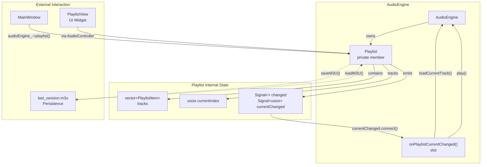
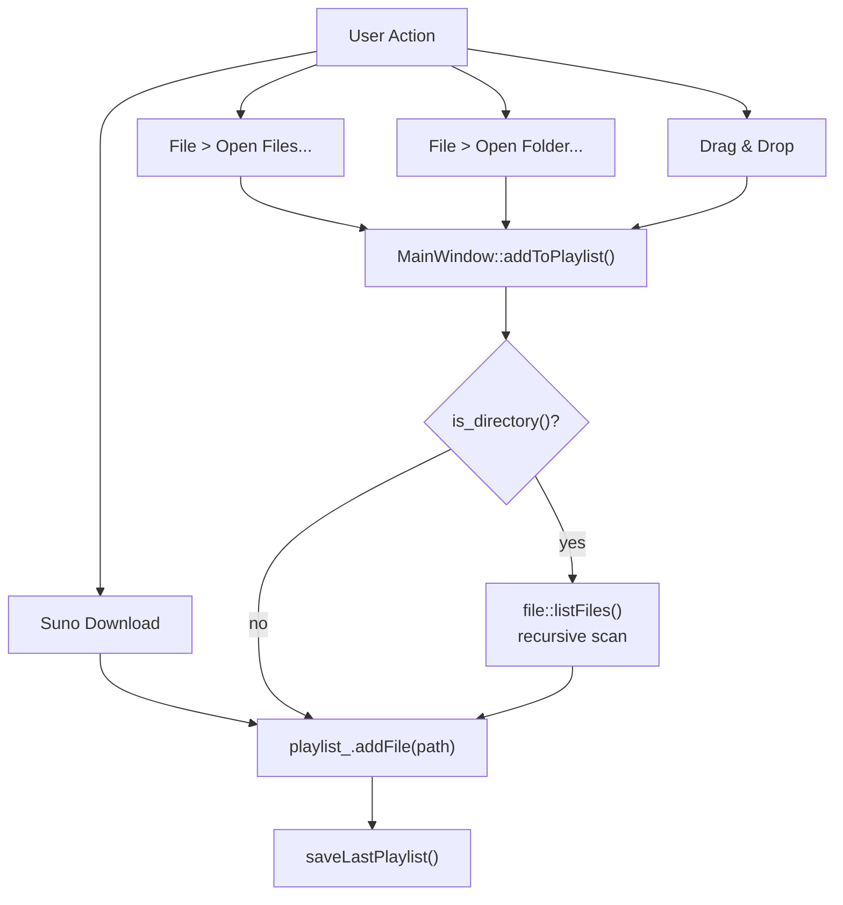
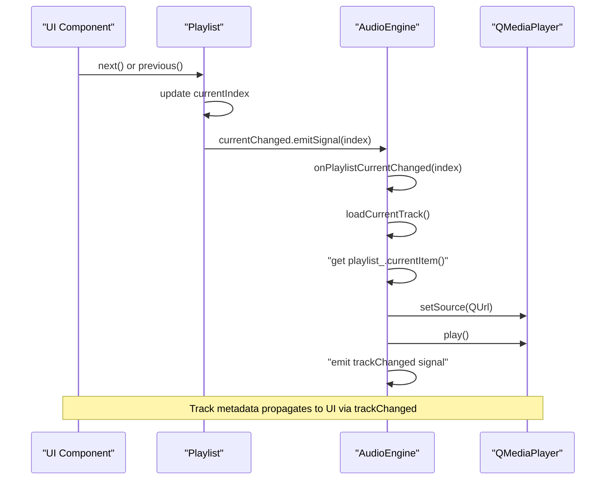
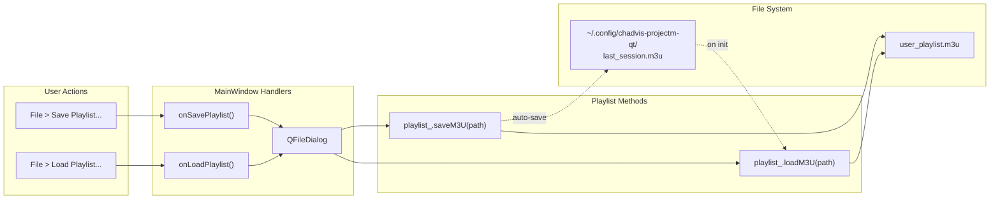

# Playlist Management

<details>
<summary>Relevant source files</summary>

The following files were used as context for generating this wiki page:

- [src/audio/AudioEngine.cpp](src/audio/AudioEngine.cpp)
- [src/audio/AudioEngine.hpp](src/audio/AudioEngine.hpp)
- [src/ui/MainWindow.cpp](src/ui/MainWindow.cpp)
- [src/ui/MainWindow.hpp](src/ui/MainWindow.hpp)

</details>


## Purpose and Scope

This document describes the playlist management system in chadvis-projectm-qt, which handles track organization, navigation, and persistence. The `Playlist` class maintains an ordered collection of audio tracks, supports M3U playlist files, and provides session continuity through automatic state restoration.

For information about audio playback and decoding, see [AudioEngine](#3.1). For UI components that display and interact with the playlist, see [Controller Layer](#7.2).

**Sources:** [src/audio/AudioEngine.hpp:58-63](), [src/audio/AudioEngine.cpp:215-230]()

---

## Architecture Overview

The playlist system is embedded within the `AudioEngine` as a core component. It uses a signal-based architecture to notify the engine when track selection changes, triggering automatic track loading and playback.

### Core Components

| Component | Type | Purpose |
|-----------|------|---------|
| `Playlist` | Class | Manages track collection, navigation, and persistence |
| `PlaylistItem` | Struct | Represents individual track with path and metadata |
| `AudioEngine::playlist_` | Member | Playlist instance owned by AudioEngine |
| `AudioEngine::onPlaylistCurrentChanged()` | Slot | Responds to track changes by loading and playing |

**Diagram: Playlist Component Architecture**



**Sources:** [src/audio/AudioEngine.hpp:109](), [src/audio/AudioEngine.cpp:59-62](), [src/audio/AudioEngine.cpp:199-203]()

---

## PlaylistItem Structure

Each track in the playlist is represented by a `PlaylistItem` structure containing the file path and metadata.

### PlaylistItem Fields

```cpp
struct PlaylistItem {
    fs::path path;           // Absolute path to audio file
    TrackMetadata metadata;  // Title, artist, album, duration, etc.
};
```

The `TrackMetadata` structure provides display information that can be extracted from file tags or derived from the filename. The metadata is used for:
- Window title updates ([src/ui/MainWindow.cpp:288-298]())
- Overlay engine text display ([src/ui/MainWindow.cpp:255-261]())
- UI playlist display

**Sources:** [src/audio/AudioEngine.cpp:206-213](), [src/ui/MainWindow.cpp:257-258](), [src/ui/MainWindow.cpp:290-291]()

---

## Track Management

### Adding Tracks

Tracks can be added to the playlist through multiple pathways:

**Diagram: Track Addition Flow**



**Adding Individual Files**

```cpp
// MainWindow.cpp:300-306
void MainWindow::addToPlaylist(const fs::path& path) {
    if (fs::is_directory(path)) {
        for (const auto& f : file::listFiles(path, file::audioExtensions, true))
            audioEngine_->playlist().addFile(f);
    } else
        audioEngine_->playlist().addFile(path);
}
```

When a directory is added, the system recursively scans for audio files with supported extensions (mp3, flac, ogg, opus, wav, m4a, aac).

**Sources:** [src/ui/MainWindow.cpp:300-311](), [src/ui/MainWindow.cpp:364-383](), [src/ui/MainWindow.cpp:453-468]()

### Auto-save on Changes

Every modification to the playlist triggers the `changed` signal, which is connected to `saveLastPlaylist()`. This ensures the session is continuously persisted.

```cpp
// AudioEngine.cpp:62
playlist_.changed.connect([this] { saveLastPlaylist(); });
```

**Sources:** [src/audio/AudioEngine.cpp:62](), [src/audio/AudioEngine.cpp:226-230]()

---

## Navigation and Playback Control

The playlist provides methods for sequential and random access to tracks. Navigation automatically triggers track loading and playback through the signal mechanism.

### Navigation Methods

| Method | Description | Returns |
|--------|-------------|---------|
| `next()` | Advance to next track | `bool` - true if successful |
| `previous()` | Go to previous track | `bool` - true if successful |
| `jumpTo(usize index)` | Jump to specific index | `void` |
| `currentItem()` | Get current track item | `const PlaylistItem*` |
| `currentIndex()` | Get current track index | `usize` |
| `empty()` | Check if playlist is empty | `bool` |

**Diagram: Navigation Signal Flow**



**Sources:** [src/ui/MainWindow.cpp:158-164](), [src/audio/AudioEngine.cpp:59-61](), [src/audio/AudioEngine.cpp:199-203]()

### Auto-play on Track End

When a track finishes playing, the `AudioEngine` automatically advances to the next track if `autoPlayNext_` is enabled:

```cpp
// AudioEngine.cpp:182-189
void AudioEngine::onMediaStatusChanged(QMediaPlayer::MediaStatus status) {
    if (status == QMediaPlayer::EndOfMedia && autoPlayNext_) {
        LOG_DEBUG("Track ended, playing next");
        if (!playlist_.next()) {
            stop();
        }
    }
}
```

**Sources:** [src/audio/AudioEngine.cpp:182-189]()

### Initial Playback

When `play()` is called on an empty player state, the engine automatically loads the first track:

```cpp
// AudioEngine.cpp:89-92
if (!playlist_.currentItem() && !playlist_.empty()) {
    playlist_.jumpTo(0);
    LOG_INFO("Jumped to first playlist item");
}
```

**Sources:** [src/audio/AudioEngine.cpp:83-109]()

---

## M3U Persistence

The playlist system supports the M3U playlist format for both import/export and session restoration. M3U files are plain-text playlists containing file paths, one per line.

### M3U Operations

**Diagram: M3U File Lifecycle**



**Save Playlist Dialog**

```cpp
// MainWindow.cpp:385-395
void MainWindow::onSavePlaylist() {
    QString path = QFileDialog::getSaveFileName(
        this, "Save Playlist", QDir::homePath(),
        "M3U Playlist (*.m3u)", nullptr,
        QFileDialog::DontUseNativeDialog);
    if (!path.isEmpty())
        audioEngine_->playlist().saveM3U(path.toStdString());
}
```

**Load Playlist Dialog**

```cpp
// MainWindow.cpp:397-407
void MainWindow::onLoadPlaylist() {
    QString path = QFileDialog::getOpenFileName(
        this, "Load Playlist", QDir::homePath(),
        "M3U Playlist (*.m3u *.m3u8)", nullptr,
        QFileDialog::DontUseNativeDialog);
    if (!path.isEmpty())
        audioEngine_->playlist().loadM3U(path.toStdString());
}
```

**Sources:** [src/ui/MainWindow.cpp:385-407](), [src/ui/MainWindow.cpp:138-140]()

---

## Session Restoration

The playlist automatically saves and restores state between application sessions using a dedicated `last_session.m3u` file.

### Automatic Session Management

**Session Save Location**

```cpp
// AudioEngine.cpp:226-230
void AudioEngine::saveLastPlaylist() {
    auto path = file::configDir() / "last_session.m3u";
    file::ensureDir(path.parent_path());
    playlist_.saveM3U(path);
}
```

The configuration directory is typically `~/.config/chadvis-projectm-qt/` on Linux systems.

**Session Restore on Init**

```cpp
// AudioEngine.cpp:215-224
void AudioEngine::loadLastPlaylist() {
    auto path = file::configDir() / "last_session.m3u";
    if (fs::exists(path)) {
        LOG_INFO("Loading last session playlist...");
        playlist_.loadM3U(path);
        // Note: Current index restoration not yet implemented
    }
}
```

The session restoration is called during `AudioEngine::init()` ([src/audio/AudioEngine.cpp:65]()), ensuring the previous session's playlist is available immediately on startup.

**Trigger Points for Auto-save**

The playlist is automatically saved when:
1. **Any track is added** - via the `changed` signal connection ([src/audio/AudioEngine.cpp:62]())
2. **Application closes** - MainWindow saves config, triggering final save ([src/ui/MainWindow.cpp:439]())

**Sources:** [src/audio/AudioEngine.cpp:64-65](), [src/audio/AudioEngine.cpp:215-230]()

---

## Shuffle and Repeat Modes

The purpose section mentions shuffle and repeat modes as features of the playlist system. While the specific implementation details are not visible in the provided code files, these modes would typically be implemented as:

- **Shuffle Mode**: Randomize track order or select next track randomly
- **Repeat Modes**: All (loop playlist), One (loop current track), None

These modes would be controlled through configuration flags and would affect the behavior of `next()` and the auto-play logic in `onMediaStatusChanged()`.

**Sources:** Purpose statement from table of contents

---

## Integration with UI

### MainWindow Menu Actions

The playlist is accessible through the File menu with keyboard shortcuts:

| Action | Shortcut | Handler |
|--------|----------|---------|
| Open Files... | Ctrl+O | `onOpenFiles()` |
| Open Folder... | Ctrl+Shift+O | `onOpenFolder()` |
| Save Playlist... | - | `onSavePlaylist()` |
| Load Playlist... | - | `onLoadPlaylist()` |

**Playback menu actions** also directly access the playlist:

```cpp
// MainWindow.cpp:158-164
playbackMenu->addAction("&Next", this,
    [this] { audioEngine_->playlist().next(); },
    QKeySequence(Qt::Key_N));
playbackMenu->addAction("&Previous", this,
    [this] { audioEngine_->playlist().previous(); },
    QKeySequence(Qt::Key_P));
```

**Sources:** [src/ui/MainWindow.cpp:128-164](), [src/ui/MainWindow.cpp:138-140]()

### PlaylistView Widget

The `PlaylistView` widget provides visual representation of the playlist. It is configured by the `AudioController` through the controller pattern:

```cpp
// MainWindow.cpp:101-104, 123
playlistView_ = new PlaylistView(this);
// ... later ...
audioController_->setupUI(playerControls_, playlistView_);
```

The `PlaylistView` is displayed in the right tools dock under the "Playlist" tab.

**Sources:** [src/ui/MainWindow.cpp:101-104](), [src/ui/MainWindow.cpp:123]()

### Drag-and-Drop Support

The main window accepts file drops and adds them to the playlist:

```cpp
// MainWindow.cpp:457-468
void MainWindow::dropEvent(QDropEvent* event) {
    QStringList paths;
    for (const auto& url : event->mimeData()->urls())
        if (url.isLocalFile())
            paths.append(url.toLocalFile());
    if (!paths.isEmpty()) {
        for (const auto& p : paths)
            addToPlaylist(fs::path(p.toStdString()));
        statusBar()->showMessage(
            QString("Added %1 files to playlist").arg(paths.size()));
    }
}
```

**Sources:** [src/ui/MainWindow.cpp:40](), [src/ui/MainWindow.cpp:453-468]()

---

## Summary

The playlist management system provides:

1. **Centralized Track Management** - Single `Playlist` instance owned by `AudioEngine`
2. **Signal-Based Integration** - Automatic track loading via `currentChanged` signal
3. **Persistent State** - Auto-save to `last_session.m3u` with session restoration
4. **M3U Import/Export** - Standard playlist file format support
5. **Navigation API** - `next()`, `previous()`, `jumpTo()` methods
6. **UI Integration** - Menu actions, drag-drop, and dedicated `PlaylistView` widget

The architecture ensures that playlist changes immediately propagate to the audio engine and UI components through the signal system, maintaining synchronization across the application.

**Sources:** [src/audio/AudioEngine.hpp:58-63](), [src/audio/AudioEngine.cpp:59-65](), [src/ui/MainWindow.cpp:300-311]()