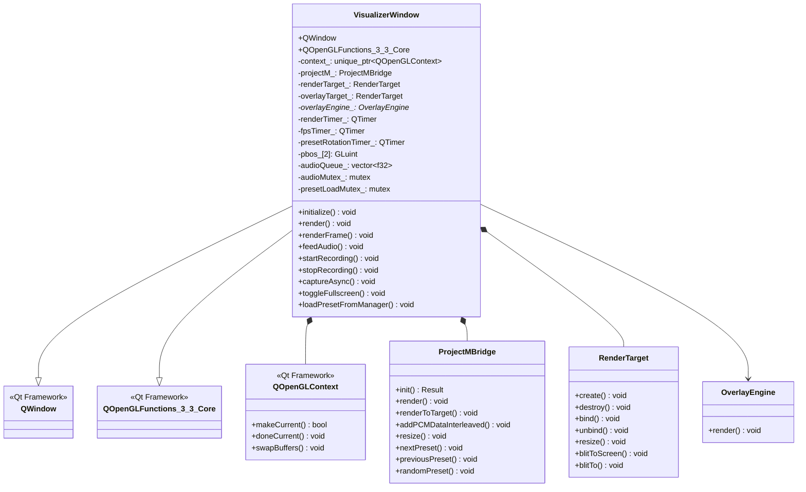
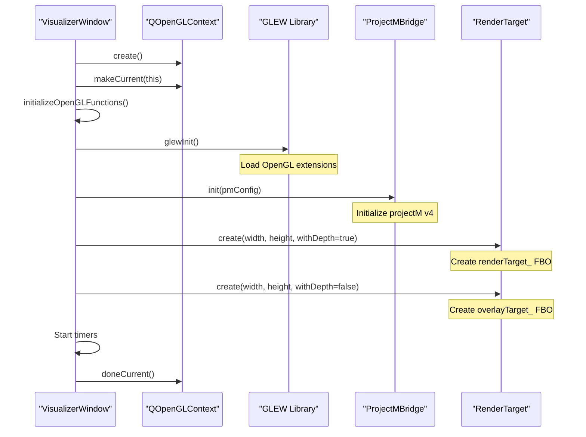
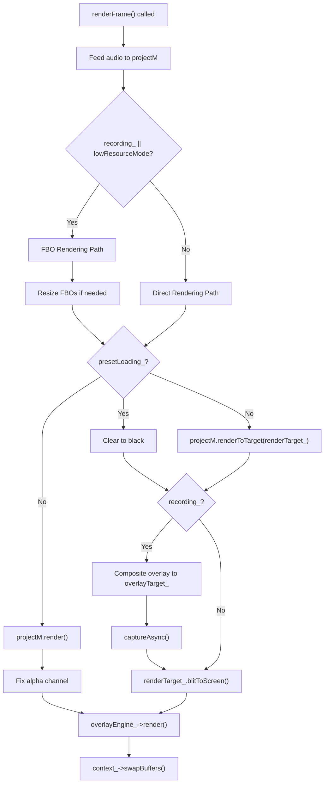
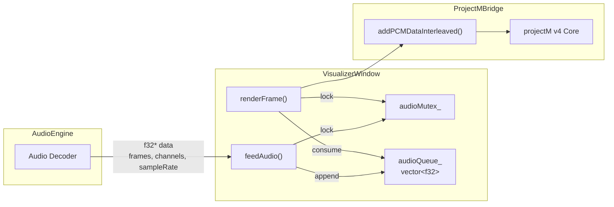
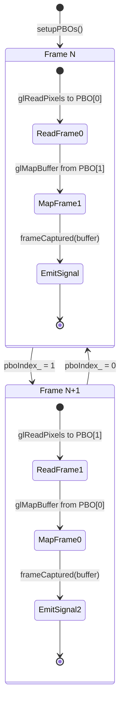
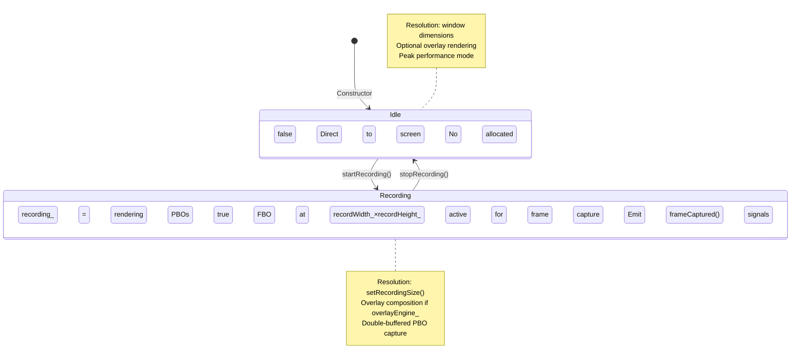
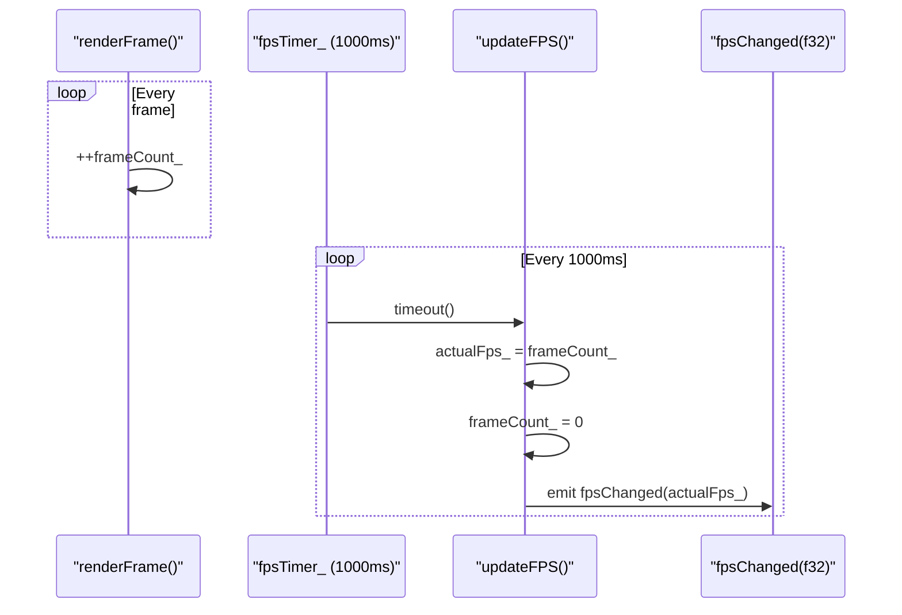
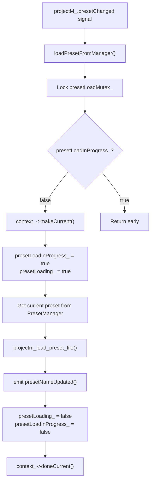

# VisualizerWindow

<details>
<summary>Relevant source files</summary>

The following files were used as context for generating this wiki page:

- [src/visualizer/VisualizerWindow.cpp](src/visualizer/VisualizerWindow.cpp)
- [src/visualizer/VisualizerWindow.hpp](src/visualizer/VisualizerWindow.hpp)

</details>


## Purpose and Scope

The `VisualizerWindow` class is the primary rendering surface for projectM v4 visualizations. It is a `QWindow`-based component that manages a custom OpenGL 3.3 Core Profile context, implements the core rendering loop, and handles frame capture for video recording. This class serves as the integration point between the audio pipeline, projectM rendering engine, overlay system, and recording system.

For projectM API integration details, see [ProjectM Integration](#4.2). For preset management functionality, see [Preset Management](#4.3). For the recording pipeline that consumes captured frames, see [VideoRecorder](#5.1).

**Sources:** [src/visualizer/VisualizerWindow.hpp:1-125](), [src/visualizer/VisualizerWindow.cpp:1-426]()

---

## Class Structure and Dependencies

The `VisualizerWindow` class inherits from both `QWindow` (for windowing functionality) and `QOpenGLFunctions_3_3_Core` (for OpenGL API access). It owns a `ProjectMBridge` instance and manages multiple rendering targets.



**Sources:** [src/visualizer/VisualizerWindow.hpp:23-124](), [src/visualizer/VisualizerWindow.cpp:14-32]()

---

## OpenGL Context Initialization

The window creates a custom OpenGL context with specific requirements for projectM v4 compatibility. The context uses OpenGL 3.3 Core Profile with double buffering, vertical synchronization, 4x multisampling, and a 24-bit depth buffer.

### Context Configuration

| Parameter | Value | Purpose |
|-----------|-------|---------|
| OpenGL Version | 3.3 | Core Profile minimum for projectM v4 |
| Swap Behavior | Double Buffer | Smooth frame presentation |
| Swap Interval | 1 | Enable V-Sync |
| Samples | 4 | 4x MSAA for edge smoothing |
| Alpha Buffer | 0 | No alpha channel (opaque window) |
| Depth Buffer | 24 bits | Required for projectM depth testing |

The initialization sequence follows this flow:



**Sources:** [src/visualizer/VisualizerWindow.cpp:14-32](), [src/visualizer/VisualizerWindow.cpp:63-114]()

---

## Rendering Pipeline

The rendering system operates on a timer-driven loop with two distinct rendering paths: **direct-to-screen** for peak performance and **FBO-based** for recording or low-resource mode.

### Rendering Modes



**Sources:** [src/visualizer/VisualizerWindow.cpp:133-237]()

### Direct Rendering Path

When not recording and not in low-resource mode, projectM renders directly to the screen framebuffer. This path achieves maximum performance by avoiding intermediate FBO copies.

Key steps in [src/visualizer/VisualizerWindow.cpp:215-234]():
1. Call `projectM_.resetViewport(w, h)` to set viewport
2. Execute `projectM_.render()` to draw directly to default framebuffer
3. Fix alpha channel to prevent compositor issues (projectM leaves alpha at 0)
4. Render overlays on top via `overlayEngine_->render(w, h)`

### FBO-Based Rendering Path

When recording or in low-resource mode, rendering occurs at a potentially different resolution using FBOs. This enables resolution-independent capture and performance optimization.

Key steps in [src/visualizer/VisualizerWindow.cpp:168-214]():
1. Determine target resolution (recording resolution or downscaled for low-resource)
2. Resize `renderTarget_` and projectM if dimensions changed
3. Render projectM to `renderTarget_` FBO via `projectM_.renderToTarget()`
4. If recording:
   - Composite overlay to `overlayTarget_` FBO
   - Capture frame via double-buffered PBOs
   - Emit `frameCaptured()` signal with pixel data
5. Blit `renderTarget_` back to screen at window resolution

**Sources:** [src/visualizer/VisualizerWindow.cpp:133-237]()

---

## Audio Integration

The audio feeding mechanism uses a mutex-protected queue to buffer PCM samples from the audio engine. Audio data flows from `AudioEngine` to `VisualizerWindow` to `ProjectMBridge`.

### Audio Queue Architecture



### Audio Feeding Process

The `feedAudio()` method accepts interleaved PCM float data and appends it to the internal queue:

**Method signature from [src/visualizer/VisualizerWindow.cpp:290-300]():**
```cpp
void feedAudio(const f32* data, u32 frames, u32 channels, u32 sampleRate)
```

The render loop consumes audio at a rate matching the target FPS:
- Calculates frames needed: `(audioSampleRate_ + targetFps_ - 1) / targetFps_`
- Feeds minimum of available and needed frames to projectM
- Removes consumed frames from queue

This design decouples audio production from rendering, preventing buffer underruns while maintaining synchronization.

**Sources:** [src/visualizer/VisualizerWindow.cpp:290-300](), [src/visualizer/VisualizerWindow.cpp:152-166](), [src/visualizer/VisualizerWindow.hpp:116-118]()

---

## Frame Capture System

The frame capture system uses **double-buffered Pixel Buffer Objects (PBOs)** for asynchronous, zero-copy GPU-to-CPU transfer. This technique allows the GPU to continue rendering while previous frames are transferred, minimizing performance impact.

### PBO Double-Buffering



### Capture Implementation

The `captureAsync()` method implements the double-buffering logic in [src/visualizer/VisualizerWindow.cpp:258-288]():

| Step | Operation | Buffer | Purpose |
|------|-----------|--------|---------|
| 1 | `glReadPixels(..., nullptr)` | `pbos_[pboIndex_]` | Initiate async transfer from FBO |
| 2 | `glMapBuffer(GL_READ_ONLY)` | `pbos_[nextIndex]` | Map previously filled buffer |
| 3 | `std::vector<u8> buffer(ptr, ...)` | CPU memory | Copy to movable vector |
| 4 | `glUnmapBuffer()` | `pbos_[nextIndex]` | Release PBO |
| 5 | `emit frameCaptured(std::move(buffer), ...)` | Signal | Pass ownership to VideoRecorder |

The `pboAvailable_` flag prevents mapping on the first frame before any PBO has been filled.

### PBO Lifecycle Management

**Setup:** [src/visualizer/VisualizerWindow.cpp:239-250]()
- Generates two PBO handles via `glGenBuffers(2, pbos_)`
- Allocates GPU memory: `glBufferData(GL_PIXEL_PACK_BUFFER, size, nullptr, GL_STREAM_READ)`
- Size calculated as `recordWidth_ * recordHeight_ * 4` (RGBA)

**Teardown:** [src/visualizer/VisualizerWindow.cpp:252-256]()
- Deletes PBO handles via `glDeleteBuffers(2, pbos_)`
- Called in destructor and when stopping recording

**Sources:** [src/visualizer/VisualizerWindow.cpp:239-288](), [src/visualizer/VisualizerWindow.hpp:99-106]()

---

## Recording Mode Management

Recording mode switches the rendering pipeline from direct-to-screen to FBO-based capture at a specified resolution. This mode is toggled via `startRecording()` and `stopRecording()` methods.

### Recording State Transitions



### Recording Initialization

The `startRecording()` method in [src/visualizer/VisualizerWindow.cpp:316-325]():
1. Sets `recording_ = true` flag
2. Acquires OpenGL context
3. Resizes FBOs to recording resolution (`recordWidth_` × `recordHeight_`)
4. Calls `projectM_.resize()` to match projectM output
5. Calls `setupPBOs()` to allocate capture buffers

### Recording Teardown

The `stopRecording()` method in [src/visualizer/VisualizerWindow.cpp:327-334]():
1. Sets `recording_ = false` flag
2. Acquires OpenGL context
3. Calls `destroyPBOs()` to release GPU memory
4. Next `renderFrame()` will resize FBOs back to window dimensions

### Signal Emission

During recording, the window emits two signals per frame:
- `frameReady()`: Emitted immediately after capture starts ([line 206]())
- `frameCaptured(std::vector<u8>, u32, u32, i64)`: Emitted when PBO data is mapped ([lines 276-282]())

The `VideoRecorder` connects to `frameCaptured()` to receive pixel data with timestamp.

**Sources:** [src/visualizer/VisualizerWindow.cpp:316-334](), [src/visualizer/VisualizerWindow.hpp:52-61]()

---

## Input Handling

The window processes keyboard and mouse events for visualization control, implementing both configurable keyboard shortcuts and hardcoded fallbacks.

### Keyboard Shortcuts

The `keyPressEvent()` handler in [src/visualizer/VisualizerWindow.cpp:398-417]() maps keys to actions:

| Key | Action | Method Called |
|-----|--------|---------------|
| Configured `toggleFullscreen` or F11 | Toggle fullscreen | `toggleFullscreen()` |
| Configured `nextPreset` or Right Arrow | Next preset | `projectM_.nextPreset()` |
| Configured `prevPreset` or Left Arrow | Previous preset | `projectM_.previousPreset()` |
| R | Random preset | `projectM_.randomPreset()` |
| L | Lock/unlock preset | `projectM_.lockPreset(!locked)` |
| Escape (in fullscreen) | Exit fullscreen | `toggleFullscreen()` |

The keyboard configuration is read from `CONFIG.keyboard()` which provides user-customizable key bindings.

### Mouse Input

Double-clicking with the left mouse button toggles fullscreen mode via `mouseDoubleClickEvent()` in [src/visualizer/VisualizerWindow.cpp:419-423]().

**Sources:** [src/visualizer/VisualizerWindow.cpp:398-423](), [src/visualizer/VisualizerWindow.hpp:71-72]()

---

## Fullscreen Support

Fullscreen functionality preserves the normal window geometry for seamless transitions. The implementation uses Qt's built-in fullscreen API with custom geometry management.

### Fullscreen Toggle Logic

The `toggleFullscreen()` method in [src/visualizer/VisualizerWindow.cpp:336-349]():

**Entering Fullscreen:**
1. Store current geometry in `normalGeometry_`
2. Get primary screen geometry via `QGuiApplication::primaryScreen()->geometry()`
3. Call `setGeometry(screen->geometry())`
4. Call `showFullScreen()`
5. Set `fullscreen_ = true`

**Exiting Fullscreen:**
1. Call `showNormal()`
2. Restore saved geometry via `setGeometry(normalGeometry_)`
3. Set `fullscreen_ = false`

This approach ensures the window returns to its exact previous position and size when exiting fullscreen, rather than using Qt's default behavior.

**Sources:** [src/visualizer/VisualizerWindow.cpp:336-349](), [src/visualizer/VisualizerWindow.hpp:113-114]()

---

## FPS Tracking and Performance Monitoring

The window maintains real-time FPS statistics by counting frames and emitting updates every second.

### FPS Measurement System



The FPS calculation is simple and accurate:
- Increment `frameCount_` at the end of each `renderFrame()` call ([line 236]())
- Every 1000ms, the `updateFPS()` slot ([lines 351-355]()) captures `frameCount_` as `actualFps_`
- Reset `frameCount_` to 0
- Emit `fpsChanged(actualFps_)` signal for UI updates

This measurement reflects actual rendering performance, accounting for V-Sync limits, frame drops, and system load.

**Sources:** [src/visualizer/VisualizerWindow.cpp:351-355](), [src/visualizer/VisualizerWindow.cpp:236](), [src/visualizer/VisualizerWindow.hpp:108-110]()

---

## Preset Loading and Synchronization

Preset loading is protected by a mutex to prevent concurrent loads, which can crash projectM v4. The loading mechanism integrates with the `PresetManager` via signals.

### Preset Loading Flow



### Synchronization Mechanism

The `loadPresetFromManager()` method in [src/visualizer/VisualizerWindow.cpp:357-382]() implements critical section protection:

1. Acquire `presetLoadMutex_` via `std::lock_guard`
2. Check `presetLoadInProgress_` flag and return if set
3. Set flag to `true` to block concurrent loads
4. Acquire OpenGL context (required for projectM API calls)
5. Get current preset from `projectM_.presets().current()`
6. Call raw projectM C API: `projectm_load_preset_file(handle, path, smooth=false)`
7. Emit `presetNameUpdated()` signal for UI updates
8. Clear flags and release context

The `presetLoading_` flag is also used during rendering to display a black screen instead of rendering during preset transitions.

**Sources:** [src/visualizer/VisualizerWindow.cpp:357-382](), [src/visualizer/VisualizerWindow.cpp:87-90](), [src/visualizer/VisualizerWindow.hpp:120-121]()

---

## Configuration Integration

The window reads configuration from the global `CONFIG` singleton and provides an `updateSettings()` method to apply changes at runtime.

### Configuration Usage

| Config Section | Member | Usage |
|----------------|--------|-------|
| `CONFIG.visualizer().fps` | Target frame rate | `setRenderRate()`, projectM initialization |
| `CONFIG.visualizer().beatSensitivity` | Beat detection | `projectM_.setBeatSensitivity()` |
| `CONFIG.visualizer().presetPath` | Preset directory | `ProjectMConfig.presetPath` |
| `CONFIG.visualizer().presetDuration` | Auto-rotation interval | `presetRotationTimer_.setInterval()` |
| `CONFIG.visualizer().transitionDuration` | Preset blending time | `ProjectMConfig.transitionDuration` |
| `CONFIG.visualizer().shufflePresets` | Random vs sequential | `projectM_.setShuffleEnabled()` |
| `CONFIG.visualizer().lowResourceMode` | Performance mode | Rendering path selection |
| `CONFIG.keyboard()` | Key bindings | Input event mapping |

### Runtime Configuration Updates

The `updateSettings()` method in [src/visualizer/VisualizerWindow.cpp:384-396]() applies configuration changes without recreating the window:

1. Update render rate via `setRenderRate()`
2. Update projectM beat sensitivity
3. Enable/disable shuffle mode
4. Reconfigure preset rotation timer
5. Restart timer if preset duration > 0

This method is called by `VisualizerController` when the user saves settings via `SettingsDialog`.

**Sources:** [src/visualizer/VisualizerWindow.cpp:384-396](), [src/visualizer/VisualizerWindow.cpp:75-85](), [src/visualizer/VisualizerWindow.hpp:47]()

---

## Thread Safety Considerations

The `VisualizerWindow` manages concurrency carefully, particularly around OpenGL context usage and shared data structures.

### Synchronization Points

| Resource | Protection | Reason |
|----------|------------|--------|
| `audioQueue_` | `audioMutex_` | Accessed by both audio thread and render thread |
| OpenGL context | `makeCurrent()/doneCurrent()` | OpenGL is not thread-safe |
| Preset loading | `presetLoadMutex_` + `presetLoadInProgress_` | Prevent concurrent projectM API calls |

### Context Thread Affinity

All OpenGL operations must occur on the main thread after calling `context_->makeCurrent(this)`. The destructor carefully ensures cleanup happens with a valid current context:

```cpp
if (context_ && context_->makeCurrent(this)) {
    destroyPBOs();
    projectM_.shutdown();
    renderTarget_.destroy();
    overlayTarget_.destroy();
    context_->doneCurrent();
}
```

This pattern is repeated in all methods that interact with OpenGL resources.

**Sources:** [src/visualizer/VisualizerWindow.cpp:34-42](), [src/visualizer/VisualizerWindow.hpp:116-121]()

---

## Signal Emissions

The window emits Qt signals to communicate state changes and frame availability to other components:

| Signal | Parameters | Purpose | Typical Receiver |
|--------|-----------|---------|------------------|
| `presetNameUpdated` | `QString name` | Current preset name | UI status bar |
| `frameReady` | None | Frame capture initiated | Frame timing sync |
| `frameCaptured` | `vector<u8> data`<br/>`u32 width, height`<br/>`i64 timestamp` | Frame pixels available | `VideoRecorder` |
| `fpsChanged` | `f32 actualFps` | Measured FPS | UI FPS display |

The `frameCaptured()` signal uses move semantics (`std::move(buffer)`) to transfer ownership of the pixel data without copying, essential for 1920×1080×4 = 8MB buffers at 60 FPS.

**Sources:** [src/visualizer/VisualizerWindow.hpp:26-33](), [src/visualizer/VisualizerWindow.cpp:276-282]()