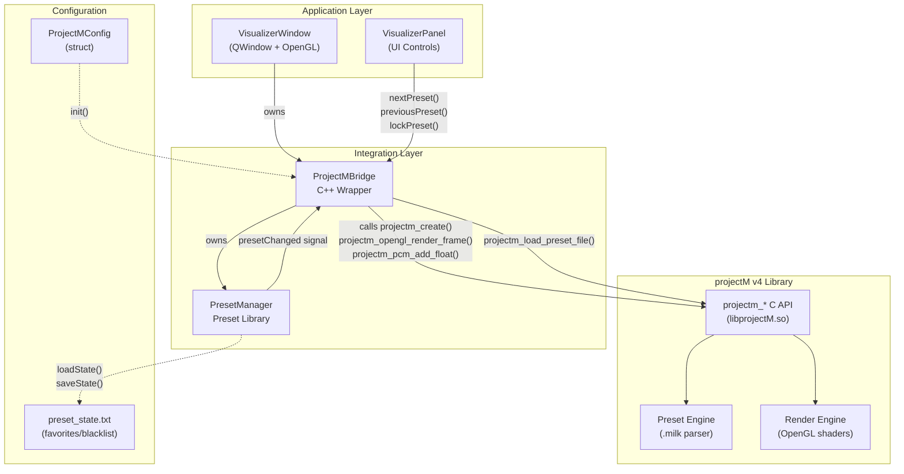
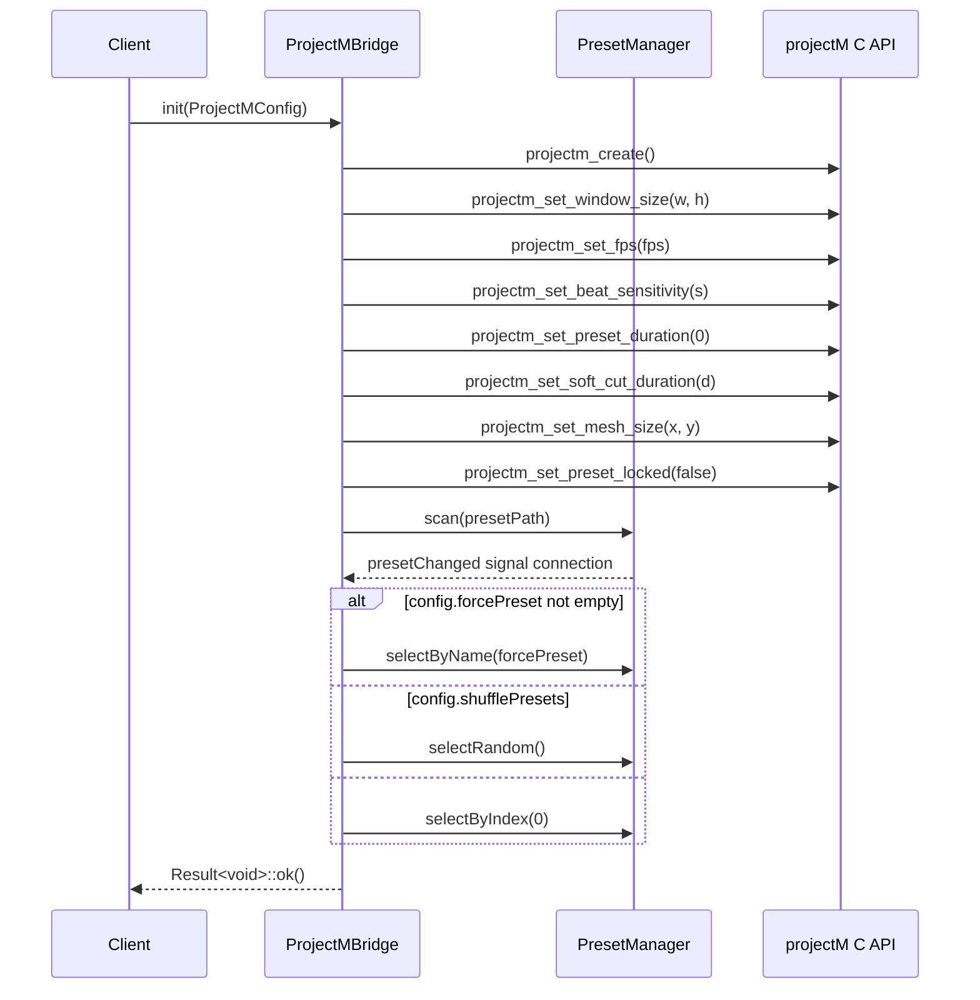
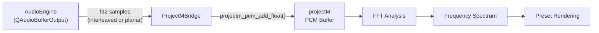
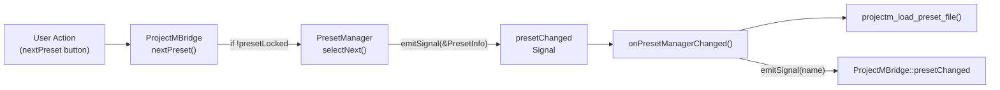
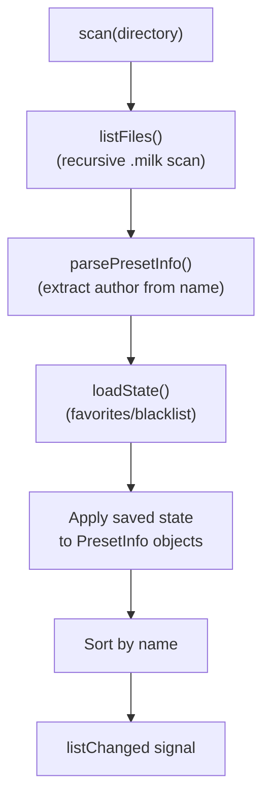
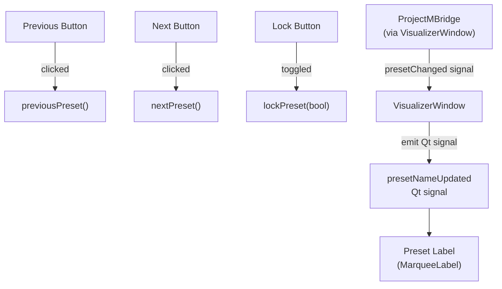

# ProjectM Integration

<details>
<summary>Relevant source files</summary>

The following files were used as context for generating this wiki page:

- [src/ui/VisualizerPanel.cpp](src/ui/VisualizerPanel.cpp)
- [src/visualizer/PresetManager.cpp](src/visualizer/PresetManager.cpp)
- [src/visualizer/PresetManager.hpp](src/visualizer/PresetManager.hpp)
- [src/visualizer/ProjectMBridge.cpp](src/visualizer/ProjectMBridge.cpp)

</details>


This document describes how chadvis-projectm-qt integrates with the [projectM v4 library](https://github.com/projectM-visualizer/projectm), a real-time music visualization engine. The integration is implemented through the `ProjectMBridge` wrapper class, which encapsulates the projectM C API and coordinates with the `PresetManager` for preset handling.

For information about the rendering context and OpenGL setup, see [VisualizerWindow](#4.1). For preset browsing UI, see [Preset Management](#4.3).

---

## Architecture Overview

The projectM integration follows a **wrapper pattern** where `ProjectMBridge` encapsulates the native projectM C API (`projectm_*` functions) and provides a C++ interface with ownership semantics, error handling via `Result<T>`, and signal-based communication.



**Sources:** [src/visualizer/ProjectMBridge.cpp:1-170](), [src/visualizer/PresetManager.hpp:1-109]()

---

## ProjectMBridge Class

`ProjectMBridge` is the primary integration point with projectM v4. It manages the lifecycle of the native `projectm` handle and provides methods for initialization, audio feeding, rendering, and preset control.

### Core Responsibilities

| Responsibility | Methods | Description |
|----------------|---------|-------------|
| **Lifecycle** | `init()`, `shutdown()` | Creates/destroys projectM instance |
| **Audio Input** | `addPCMData()`, `addPCMDataInterleaved()` | Feeds PCM samples to projectM for analysis |
| **Rendering** | `render()`, `renderToTarget()` | Triggers OpenGL rendering |
| **Preset Control** | `nextPreset()`, `previousPreset()`, `randomPreset()`, `lockPreset()` | Navigates preset library |
| **Configuration** | `resize()`, `setFPS()`, `setBeatSensitivity()` | Runtime parameter adjustment |

**Sources:** [src/visualizer/ProjectMBridge.cpp:1-170]()

### Initialization

The `init()` method creates the projectM instance and configures it according to the `ProjectMConfig` struct:



**Key configuration parameters:**

- `width`, `height`: Rendering resolution [src/visualizer/ProjectMBridge.cpp:17-18]()
- `fps`: Target frame rate (typically 60) [src/visualizer/ProjectMBridge.cpp:26]()
- `beatSensitivity`: Controls visual response to audio beats [src/visualizer/ProjectMBridge.cpp:27]()
- `transitionDuration`: Smooth transition time between presets [src/visualizer/ProjectMBridge.cpp:29]()
- `meshX`, `meshY`: Resolution of the render mesh grid [src/visualizer/ProjectMBridge.cpp:30]()
- `presetDuration`: Set to `0` for manual preset changes only [src/visualizer/ProjectMBridge.cpp:28]()

**Sources:** [src/visualizer/ProjectMBridge.cpp:14-54]()

### Audio Data Flow

ProjectMBridge accepts PCM audio data in float32 format and forwards it to projectM's internal audio analysis engine:



Two methods are provided for different PCM layouts:

- **`addPCMData(const f32* data, u32 samples, u32 channels)`** - Planar or interleaved samples [src/visualizer/ProjectMBridge.cpp:81-88]()
- **`addPCMDataInterleaved(const f32* data, u32 frames, u32 channels)`** - Explicitly interleaved [src/visualizer/ProjectMBridge.cpp:90-99]()

Both methods map mono (`channels == 1`) to `PROJECTM_MONO` and stereo to `PROJECTM_STEREO`.

**Sources:** [src/visualizer/ProjectMBridge.cpp:81-99]()

### Rendering API

ProjectMBridge provides two rendering modes:

#### Direct Rendering
```cpp
void render();  // Renders to current OpenGL context
```
Calls `projectm_opengl_render_frame()` assuming the caller has already set up the OpenGL context and viewport. Used by `VisualizerWindow` during normal display. [src/visualizer/ProjectMBridge.cpp:64-68]()

#### Render-to-Target
```cpp
void renderToTarget(RenderTarget& target);
```
Binds an FBO, sets the viewport, renders, and unbinds. Automatically handles resolution mismatches by calling `resize()` if needed. Used for off-screen recording. [src/visualizer/ProjectMBridge.cpp:70-79]()

**Sources:** [src/visualizer/ProjectMBridge.cpp:64-79]()

---

## PresetManager Integration

`ProjectMBridge` owns a `PresetManager` instance that handles the preset library. The integration is **signal-based**: when `PresetManager` changes the current preset, it emits a `presetChanged` signal, which `ProjectMBridge` handles by loading the preset file into projectM.

### Signal Flow



**Connection established during init:**
```cpp
presets_.presetChanged.connect(
    [this](const PresetInfo* p) { onPresetManagerChanged(p); });
```
[src/visualizer/ProjectMBridge.cpp:33-34]()

**Handler implementation:**
```cpp
void ProjectMBridge::onPresetManagerChanged(const PresetInfo* preset) {
    if (!preset || !projectM_)
        return;
    presetChanged.emitSignal(preset->name);
}
```
The actual preset loading happens asynchronously via `loadPreset()`. [src/visualizer/ProjectMBridge.cpp:164-168]()

**Sources:** [src/visualizer/ProjectMBridge.cpp:33-34](), [src/visualizer/ProjectMBridge.cpp:164-168]()

### Preset Navigation Modes

ProjectMBridge delegates all preset selection logic to PresetManager and respects the `presetLocked_` flag:

| Method | Behavior | Respects Lock | Source |
|--------|----------|---------------|--------|
| `nextPreset()` | Advances to next preset (or random if shuffle enabled) | Yes | [src/visualizer/ProjectMBridge.cpp:134-141]() |
| `previousPreset()` | Goes back in history or wraps around | Yes | [src/visualizer/ProjectMBridge.cpp:143-147]() |
| `randomPreset()` | Selects random preset from active pool | Yes | [src/visualizer/ProjectMBridge.cpp:149-152]() |
| `loadPreset(path)` | Directly loads a specific preset file | No | [src/visualizer/ProjectMBridge.cpp:127-132]() |

When shuffle is enabled (`shuffleEnabled_` set during init), `nextPreset()` delegates to `PresetManager::selectRandom()` instead of sequential navigation. [src/visualizer/ProjectMBridge.cpp:137-140]()

**Sources:** [src/visualizer/ProjectMBridge.cpp:134-152]()

---

## PresetManager Details

`PresetManager` is a standalone component that scans, filters, and navigates a library of `.milk` preset files. It maintains state independently of projectM.

### Preset Scanning



The scanner uses `file::listFiles()` with `file::presetExtensions` to recursively find all `.milk` files. Each file becomes a `PresetInfo` struct:

```cpp
struct PresetInfo {
    fs::path path;
    std::string name;      // Stem of filename
    std::string author;    // Parsed from "Author - Name" pattern
    std::string category;  // Relative folder path
    bool favorite{false};
    bool blacklisted{false};
    u32 playCount{0};
};
```
[src/visualizer/PresetManager.hpp:14-22]()

**Sources:** [src/visualizer/PresetManager.cpp:12-71](), [src/visualizer/PresetManager.hpp:14-22]()

### Selection Algorithms

PresetManager implements multiple selection strategies:

#### Sequential Navigation with History
- `selectNext()` and `selectPrevious()` maintain a history stack (max 100 entries) [src/visualizer/PresetManager.cpp:252-324]()
- When moving forward beyond history, wraps to next in list
- Skips blacklisted presets and duplicates with same name
- History allows non-destructive back/forward navigation

#### Random Selection
- `selectRandom()` uses `std::mt19937` RNG [src/visualizer/PresetManager.cpp:235-250]()
- Only selects from `activePresets()` (excludes blacklisted)
- Seeds from `std::random_device` [src/visualizer/PresetManager.hpp:106]()

#### Name-Based Selection
`selectByName()` implements a **three-tier matching strategy**:
1. **Exact match** (case-sensitive) [src/visualizer/PresetManager.cpp:169-175]()
2. **Partial match** (substring search) [src/visualizer/PresetManager.cpp:178-190]()
3. **Case-insensitive partial match** [src/visualizer/PresetManager.cpp:193-214]()

This supports command-line args like `--preset "Rovastar"` matching "Rovastar - Purple Neon Sphere".

**Pending preset mechanism:** If `selectByName()` is called before scanning completes, the name is stored in `pendingPresetName_` and applied after scan finishes. [src/visualizer/PresetManager.cpp:161-166]()

**Sources:** [src/visualizer/PresetManager.cpp:125-324]()

### State Persistence

PresetManager saves favorites and blacklist to `preset_state.txt` in the config directory:

**File format:**
```
[favorites]
preset_name_1
preset_name_2

[blacklist]
preset_name_3
```

The state is **name-based** (not path-based) to remain valid across directory restructuring. State is loaded during scan and saved during shutdown.

- `loadState()` called by `ProjectMBridge::init()` [src/visualizer/ProjectMBridge.cpp:38]()
- `saveState()` called by `ProjectMBridge::shutdown()` [src/visualizer/ProjectMBridge.cpp:58]()

**Sources:** [src/visualizer/PresetManager.cpp:414-464]()

---

## Configuration Parameters

The `ProjectMConfig` struct (defined in the visualizer config section) controls initialization:

| Parameter | Type | Purpose | Default Location |
|-----------|------|---------|------------------|
| `width`, `height` | `u32` | Rendering resolution | Window size |
| `fps` | `u32` | Target frame rate | 60 |
| `beatSensitivity` | `f32` | Beat detection threshold | 1.0 |
| `transitionDuration` | `f32` | Preset crossfade time (seconds) | 3.0 |
| `meshX`, `meshY` | `u32` | Render mesh resolution | 48x32 |
| `presetPath` | `fs::path` | Directory to scan for .milk files | `/usr/share/projectM/presets` |
| `useDefaultPreset` | `bool` | Skip preset loading (use built-in) | `false` |
| `forcePreset` | `string` | Force specific preset by name | Empty |
| `shufflePresets` | `bool` | Random preset selection | `false` |

**Sources:** [src/visualizer/ProjectMBridge.cpp:14-54]()

---

## Runtime Operations

### Resize Handling

When the window resizes, `ProjectMBridge::resize()` is called, which updates projectM's internal resolution state:

```cpp
void ProjectMBridge::resize(u32 width, u32 height) {
    if (!projectM_ || (width == width_ && height == height_))
        return;
    width_ = width;
    height_ = height;
    projectm_set_window_size(projectM_, width_, height_);
}
```
[src/visualizer/ProjectMBridge.cpp:101-107]()

The check prevents redundant updates. `resetViewport()` additionally calls `glViewport()` for immediate effect. [src/visualizer/ProjectMBridge.cpp:109-116]()

**Sources:** [src/visualizer/ProjectMBridge.cpp:101-116]()

### Dynamic Configuration

Runtime parameters can be adjusted without reinitialization:

- `setFPS(u32 fps)` - Updates target frame rate [src/visualizer/ProjectMBridge.cpp:118-121]()
- `setBeatSensitivity(f32 s)` - Adjusts beat detection [src/visualizer/ProjectMBridge.cpp:122-125]()

**Sources:** [src/visualizer/ProjectMBridge.cpp:118-125]()

---

## UI Integration Example

`VisualizerPanel` demonstrates how UI components interact with `ProjectMBridge`:



**Button connections:**
```cpp
connect(nextPresetButton_, &QPushButton::clicked, this, [this] {
    visualizerWindow_->projectM().nextPreset();
});
```
[src/ui/VisualizerPanel.cpp:66-81]()

**Preset name updates:**
The signal chain is: `ProjectMBridge::presetChanged` → `VisualizerWindow::presetNameUpdated` → `VisualizerPanel::updatePresetName()` → `MarqueeLabel::setText()` [src/ui/VisualizerPanel.cpp:128-145]()

**Sources:** [src/ui/VisualizerPanel.cpp:49-145]()

---

## Error Handling

ProjectMBridge uses `Result<void>` for initialization:

```cpp
Result<void> ProjectMBridge::init(const ProjectMConfig& config) {
    // ...
    projectM_ = projectm_create();
    if (!projectM_)
        return Result<void>::err("Failed to create ProjectM instance");
    // ...
    return Result<void>::ok();
}
```
[src/visualizer/ProjectMBridge.cpp:14-54]()

Runtime operations use **null checks** rather than returning Results:
```cpp
void ProjectMBridge::render() {
    if (!projectM_)
        return;
    projectm_opengl_render_frame(projectM_);
}
```
[src/visualizer/ProjectMBridge.cpp:64-68]()

This pattern assumes that after successful initialization, the `projectM_` handle remains valid until `shutdown()`.

**Sources:** [src/visualizer/ProjectMBridge.cpp:14-68]()

---

## Thread Safety

ProjectMBridge is **not thread-safe**. All methods must be called from the same thread that owns the OpenGL context (typically the main/GUI thread). The projectM C API itself is not thread-safe, and OpenGL calls must occur on the context thread.

Audio data feeding (`addPCMData()`) is called from the audio thread via signals/slots in Qt, which automatically marshals the call to the correct thread.

**Sources:** [src/visualizer/ProjectMBridge.cpp:1-170]()