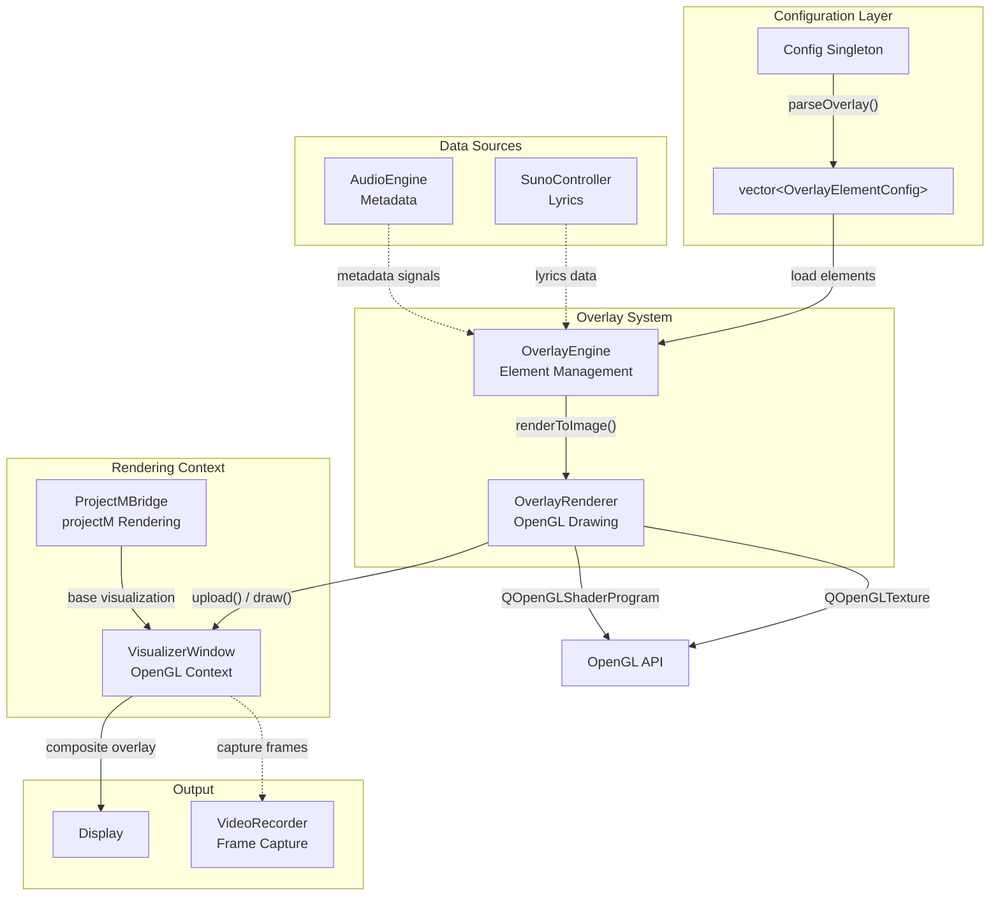
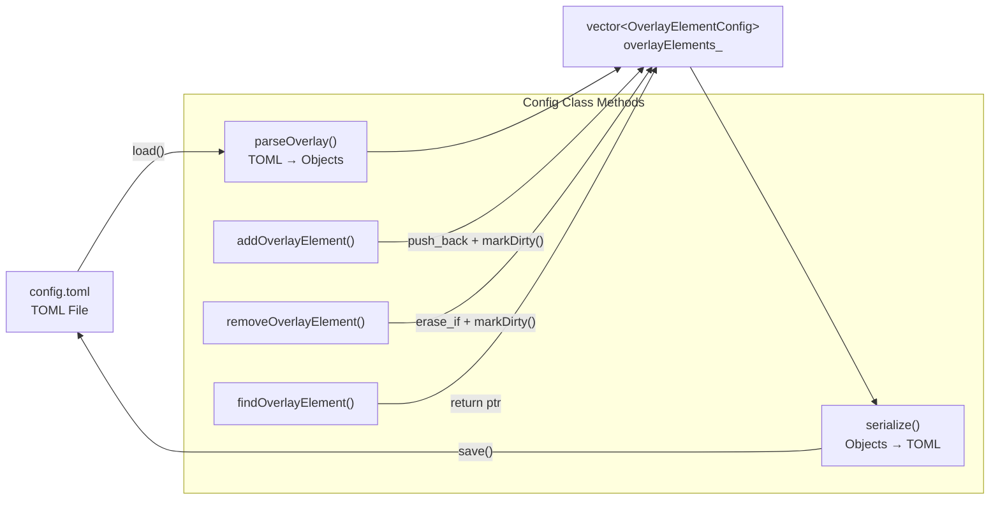
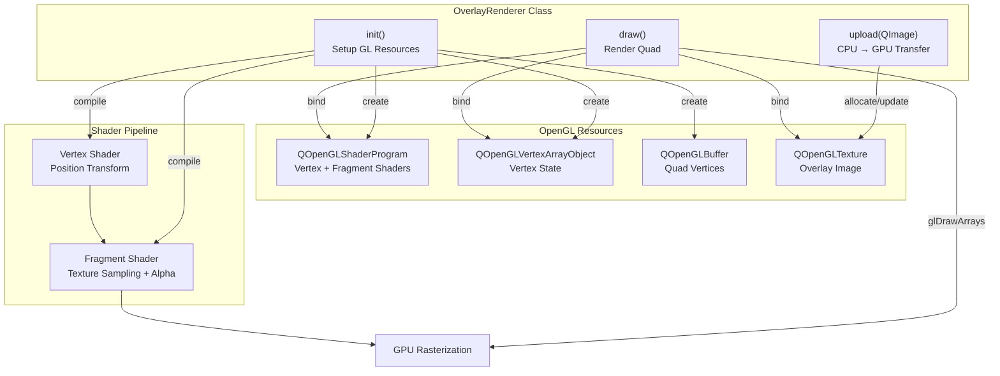
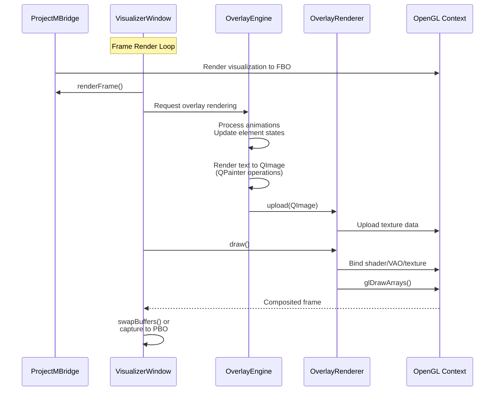
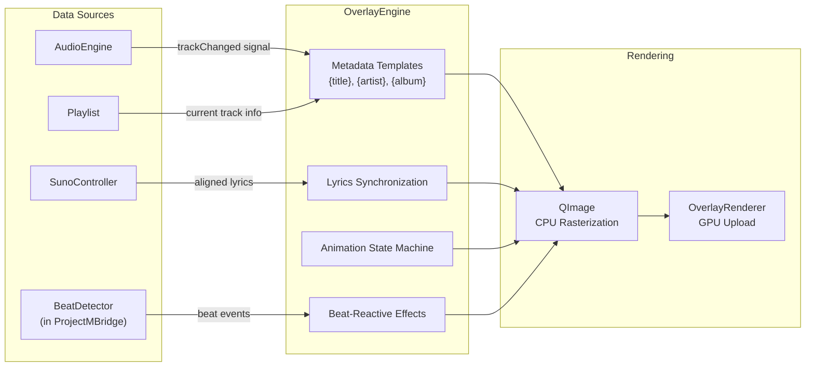

# Overlay System

<details>
<summary>Relevant source files</summary>

The following files were used as context for generating this wiki page:

- [src/core/Config.cpp](src/core/Config.cpp)
- [src/overlay/OverlayRenderer.hpp](src/overlay/OverlayRenderer.hpp)
- [src/recorder/VideoRecorder.cpp](src/recorder/VideoRecorder.cpp)

</details>


## Purpose and Scope

The Overlay System provides text rendering capabilities that composite over projectM visualizations. It manages overlay elements (text labels, metadata, lyrics) and renders them using OpenGL with support for animations, positioning, and beat-reactive effects. The system consists of two primary components: `OverlayEngine` for high-level element management and `OverlayRenderer` for low-level OpenGL drawing operations.

For information about the visualization rendering pipeline that overlays are composited onto, see [Visualization System](#4). For UI controls to edit overlay configurations, see [Settings Dialog](#7.3).

**Sources:** Diagram 1 (High-Level System Architecture), Diagram 2 (Audio-Visual-Recording Pipeline)

## System Architecture

The Overlay System follows a two-layer design separating business logic from rendering implementation:



**Architecture Diagram: Overlay System Component Structure**

The `OverlayEngine` owns the business logic for managing overlay elements, handling animations, and responding to audio/metadata events. The `OverlayRenderer` encapsulates all OpenGL state (shaders, VAOs, VBOs, textures) and provides a clean interface for uploading CPU-rendered images and drawing them as textured quads.

**Sources:** [src/overlay/OverlayRenderer.hpp:1-44](), Diagram 1 (Overall System Architecture), Diagram 2 (Audio-Visual-Recording Pipeline)

## Overlay Element Configuration

Overlay elements are configured via TOML and stored as `OverlayElementConfig` objects. The `Config` singleton manages a vector of these configurations, which are loaded at startup and can be modified at runtime.

### Configuration Structure

| Property | Type | Purpose | Default |
|----------|------|---------|---------|
| `id` | `string` | Unique identifier for the element | `"element"` |
| `text` | `string` | Text content or template (e.g., `"{title}"`) | `""` |
| `position` | `Vec2` | Normalized screen coordinates (0.0-1.0) | `{0.0, 0.0}` |
| `fontSize` | `u32` | Font size in points | `32` |
| `color` | `Color` | Text color (hex or named) | `#FFFFFF` |
| `opacity` | `f32` | Alpha transparency (0.0-1.0) | `1.0` |
| `animation` | `string` | Animation type (`"none"`, `"fade"`, `"slide"`, `"pulse"`) | `"none"` |
| `animationSpeed` | `f32` | Animation speed multiplier | `1.0` |
| `anchor` | `string` | Text alignment (`"left"`, `"center"`, `"right"`) | `"left"` |
| `visible` | `bool` | Element visibility | `true` |

### TOML Example

```toml
[[overlay.elements]]
id = "title"
text = "{title}"
position = { x = 0.05, y = 0.95 }
font_size = 48
color = "#00FF88"
opacity = 0.9
animation = "fade"
anchor = "left"
visible = true

[[overlay.elements]]
id = "artist"
text = "{artist}"
position = { x = 0.05, y = 0.90 }
font_size = 32
color = "#FFFFFF"
opacity = 0.8
```

**Sources:** [src/core/Config.cpp:250-286](), [src/core/Config.cpp:385-404]()

## Configuration Parsing and Serialization

The `Config` class provides methods for loading and persisting overlay configurations:



**Diagram: Configuration Management Flow**

### Parsing Logic

The `parseOverlay()` method iterates through the `[[overlay.elements]]` array in the TOML configuration:

1. Clears the existing `overlayElements_` vector
2. Iterates through each element in the TOML array
3. Extracts primitive properties using the templated `get()` helper
4. Parses the `position` table into a `Vec2` using `parseVec2()`
5. Converts color strings to `Color` objects via `Color::fromHex()`
6. Appends the constructed `OverlayElementConfig` to the vector

**Sources:** [src/core/Config.cpp:250-286]()

### Serialization Logic

The `serialize()` method constructs the TOML representation:

1. Creates a `toml::array` to hold element tables
2. For each element in `overlayElements_`, builds a `toml::table` with:
   - All scalar properties
   - A nested position table with `x` and `y` fields
   - Color converted to hex string via `Color::toHex()`
3. Inserts the array into the root table under `overlay.elements`

**Sources:** [src/core/Config.cpp:385-404]()

### Runtime Modification

The `Config` class provides thread-safe methods for runtime modifications:

- **`addOverlayElement(OverlayElementConfig elem)`**: Appends a new element to the vector and marks the configuration as dirty
- **`removeOverlayElement(const std::string& id)`**: Removes elements matching the given ID using `std::erase_if` and marks dirty
- **`findOverlayElement(const std::string& id)`**: Returns a non-owning pointer to the element with the matching ID, or `nullptr`

All modification methods acquire a `std::lock_guard` on the internal `mutex_` for thread safety, and call `markDirty()` to ensure changes are persisted on the next save.

**Sources:** [src/core/Config.cpp:438-458]()

## OverlayRenderer Implementation

The `OverlayRenderer` class manages all OpenGL state required for rendering overlay textures as fullscreen or positioned quads.



**Diagram: OverlayRenderer OpenGL Resource Management**

### Initialization Sequence

The `init()` method must be called with an active OpenGL context:

1. **Shader Compilation**: Creates and compiles vertex and fragment shaders for textured quad rendering
2. **VAO Setup**: Allocates a Vertex Array Object to store vertex attribute configuration
3. **VBO Setup**: Allocates a Vertex Buffer Object and uploads fullscreen quad geometry (typically NDC coordinates for a quad covering the viewport)
4. **Texture Preparation**: Prepares the texture object (actual allocation happens during `upload()`)
5. **State Caching**: Sets `initialized_ = true` to prevent re-initialization

**Sources:** [src/overlay/OverlayRenderer.hpp:22-24]()

### Texture Upload Pipeline

The `upload(const QImage& image)` method transfers CPU-rendered overlay images to GPU memory:

1. Converts the `QImage` to a GL-compatible format (typically RGBA8)
2. Allocates or reallocates the `QOpenGLTexture` if dimensions have changed
3. Uploads pixel data using `QOpenGLTexture::setData()`
4. Sets texture parameters (filtering, wrapping) for smooth rendering

This method is called by the `OverlayEngine` after CPU-side text rendering is complete.

**Sources:** [src/overlay/OverlayRenderer.hpp:25-26]()

### Drawing Operation

The `draw()` method renders the uploaded texture:

1. **Shader Binding**: Activates the overlay shader program
2. **Uniform Setup**: Sets any necessary uniforms (e.g., opacity modulation)
3. **Texture Binding**: Binds the overlay texture to a sampler unit
4. **VAO Binding**: Activates the vertex array containing quad geometry
5. **Draw Call**: Issues `glDrawArrays(GL_TRIANGLE_STRIP, 0, 4)` or equivalent
6. **State Cleanup**: Unbinds resources to avoid state leakage

The renderer uses alpha blending to composite the overlay over the projectM visualization, typically with `glBlendFunc(GL_SRC_ALPHA, GL_ONE_MINUS_SRC_ALPHA)`.

**Sources:** [src/overlay/OverlayRenderer.hpp:28-29]()

## Integration with Visualization Pipeline

The Overlay System integrates at the final stage of the rendering pipeline, after projectM has rendered the base visualization:



**Diagram: Overlay Rendering Sequence in Frame Loop**

The `VisualizerWindow` orchestrates the rendering:

1. ProjectM renders the base visualization to the default framebuffer or an FBO
2. The `OverlayEngine` is invoked to generate the current overlay state
3. Text elements are rasterized to a `QImage` using `QPainter` (CPU-side)
4. The `OverlayRenderer` uploads this image as a texture
5. The renderer draws a textured quad with alpha blending enabled
6. The final composited frame is either displayed or captured for recording

**Sources:** Diagram 2 (Audio-Visual-Recording Pipeline), [src/overlay/OverlayRenderer.hpp:1-44]()

## Data Source Integration

The Overlay System receives dynamic content from multiple sources:



**Diagram: Overlay Data Flow from Multiple Sources**

### Metadata Substitution

The `OverlayEngine` performs template variable substitution in overlay element text:

- `{title}` → Current track title
- `{artist}` → Track artist
- `{album}` → Album name
- `{duration}` → Track length
- `{position}` → Current playback position

These values are populated from the `AudioEngine` via signals like `trackChanged` or by querying the current `Playlist` state.

**Sources:** Diagram 1 (Overall System Architecture), Diagram 4 (Suno Integration Architecture)

### Lyrics Display

When a Suno AI track with aligned lyrics is playing:

1. The `SunoController` fetches aligned lyrics via `SunoClient::fetchAlignedLyrics()`
2. Lyrics are passed to the `OverlayEngine` with timestamp information
3. The engine synchronizes lyric line display with playback position
4. Optionally applies fade-in/fade-out animations for lyric transitions

**Sources:** Diagram 4 (Suno Integration Architecture)

### Beat-Reactive Effects

The Overlay System can respond to beat detection events from projectM:

- **Pulse Animation**: Scales text or increases opacity on beat
- **Color Shift**: Temporarily adjusts text color based on beat intensity
- **Shake Effect**: Applies small random displacement on strong beats

These effects are configurable per overlay element and respect the `animation` and `animationSpeed` configuration fields.

**Sources:** Table of Contents (page 6.1 description)

## Recording Integration

When video recording is active, the composited overlay is included in the captured frames:

1. The `VisualizerWindow` renders the complete scene (visualization + overlay)
2. If recording is enabled, the window captures the framebuffer via PBOs
3. The `FrameGrabber` queues the frame data
4. The `VideoRecorder` encoding thread processes frames with overlays intact

This ensures that recorded videos include all overlay elements exactly as displayed.

**Sources:** [src/recorder/VideoRecorder.cpp:113-128](), Diagram 2 (Audio-Visual-Recording Pipeline)

## Performance Considerations

### CPU-Side Rendering

Text rasterization using `QPainter` is performed on the CPU. To minimize overhead:

- Only re-render overlay elements when their content or state changes
- Cache rendered glyphs when possible
- Use dirty flags to avoid redundant rasterization

### GPU Upload Optimization

The `OverlayRenderer` optimizes texture uploads:

- Reuses the same `QOpenGLTexture` object when dimensions are unchanged
- Uses `QOpenGLTexture::setData()` for direct pixel transfer
- Avoids unnecessary texture allocations by checking current size

### Rendering Cost

Overlay rendering adds minimal GPU cost:

- Single fullscreen quad with alpha blending (typically <0.1ms per frame)
- Shader is trivial (vertex passthrough + texture sampling)
- No geometry processing or complex fragment operations

**Sources:** [src/overlay/OverlayRenderer.hpp:25-29]()

## Thread Safety

The Overlay System operates within the render thread context:

- Configuration access is protected by `Config::mutex_` for thread-safe reads/writes
- The `OverlayEngine` is designed to be invoked from the render thread only
- The `OverlayRenderer` maintains no shared state and assumes single-threaded OpenGL access
- Configuration modifications from UI threads are synchronized via the `Config` singleton

**Sources:** [src/core/Config.cpp:438-458]()