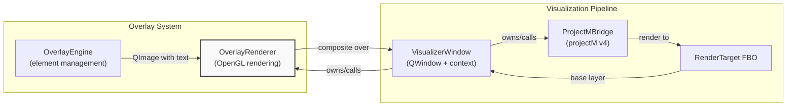
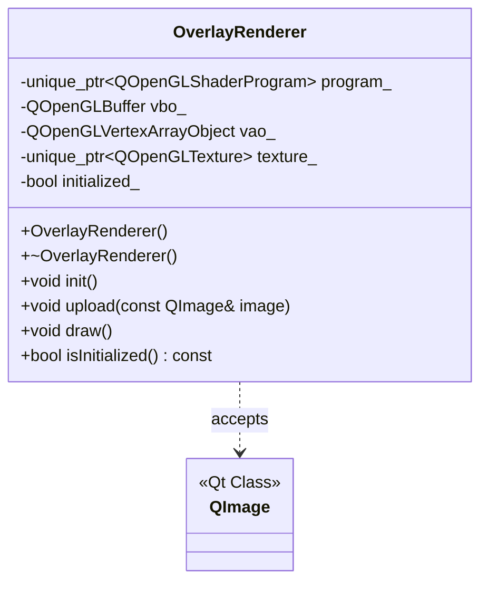
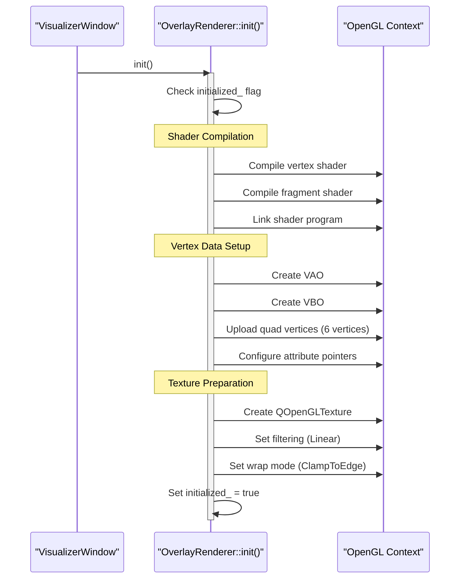
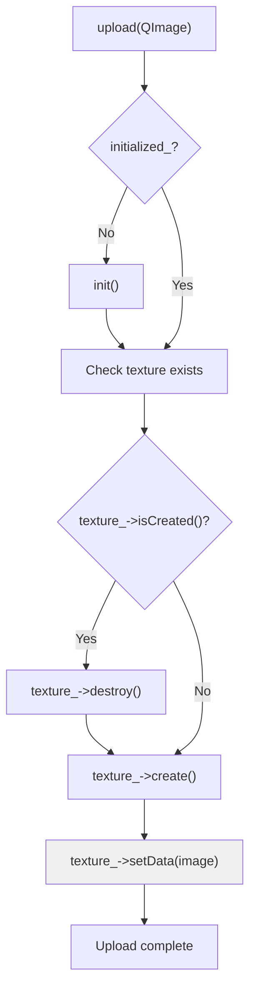
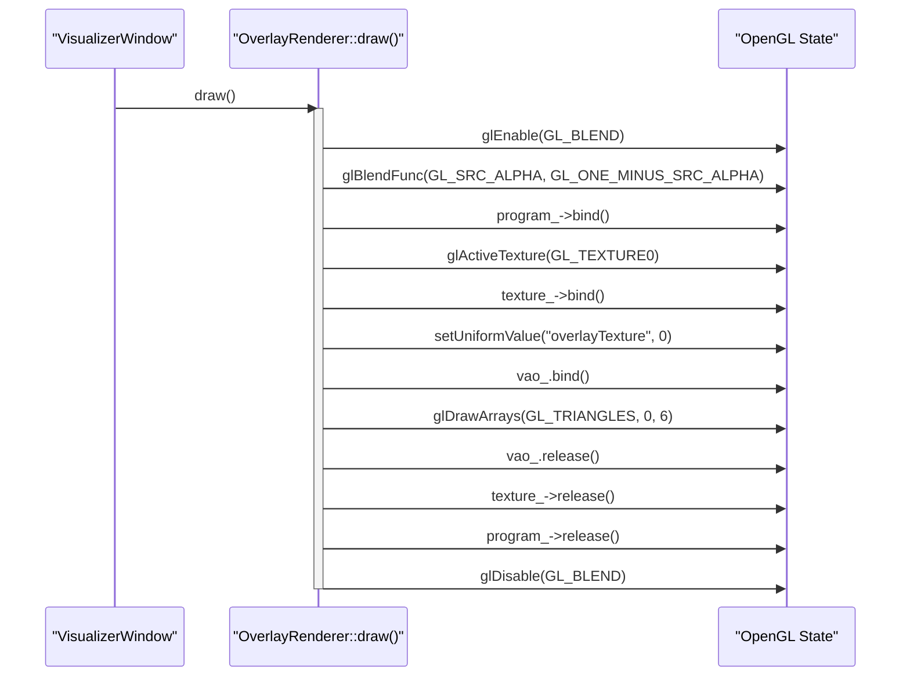
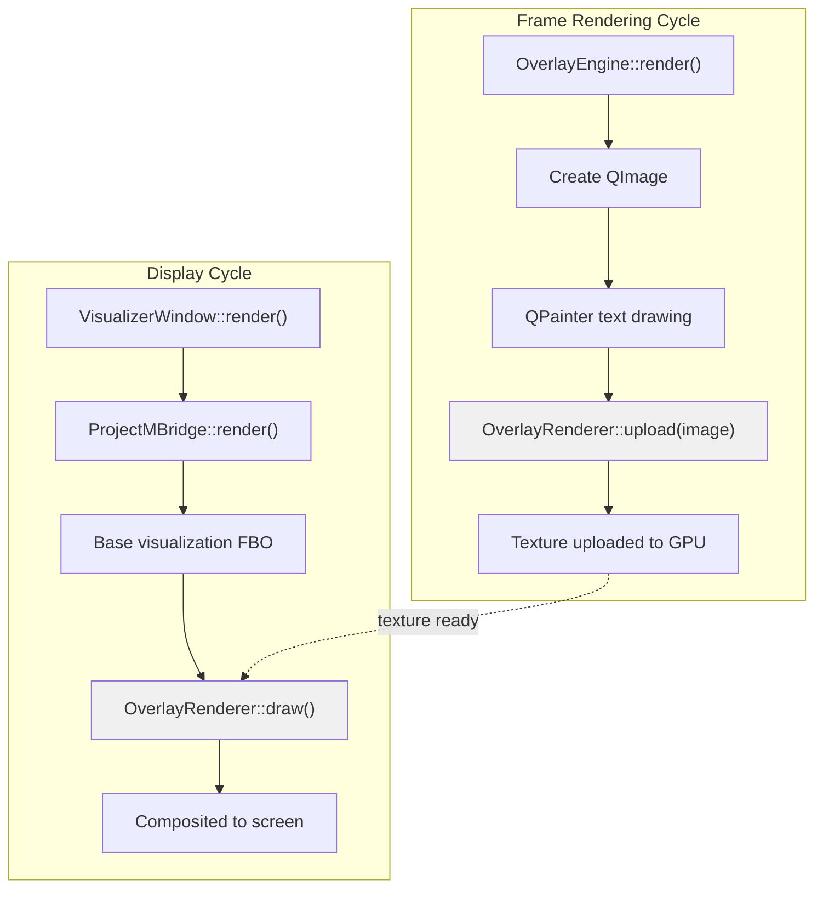

# OverlayRenderer

<details>
<summary>Relevant source files</summary>

The following files were used as context for generating this wiki page:

- [.gitignore](.gitignore)
- [build.zsh](build.zsh)
- [src/overlay/OverlayRenderer.cpp](src/overlay/OverlayRenderer.cpp)
- [src/overlay/OverlayRenderer.hpp](src/overlay/OverlayRenderer.hpp)

</details>


## Purpose and Scope

`OverlayRenderer` is the low-level OpenGL rendering component of the Overlay System responsible for drawing text overlays on top of projectM visualizations. It handles shader compilation, vertex buffer management, texture uploading, and alpha-blended rendering of CPU-generated images to the screen. This class is intentionally separated from overlay element logic to isolate OpenGL-specific code.

For information about overlay element management, animations, and metadata display, see [OverlayEngine & Elements](#6.1). For the broader visualization rendering pipeline, see [VisualizerWindow](#4.1).

**Sources:** [src/overlay/OverlayRenderer.hpp:1-44](), [src/overlay/OverlayRenderer.cpp:1-6]()

---

## Architecture Overview

`OverlayRenderer` operates as a stateful OpenGL context component within the visualization rendering pipeline. It receives `QImage` objects containing pre-rendered text from `OverlayEngine` and composites them over the projectM output using alpha blending.

### System Integration



**Diagram: OverlayRenderer in Rendering Pipeline**

**Sources:** [src/overlay/OverlayRenderer.hpp:1-44](), Diagram 1 from system architecture

---

## Class Structure and Members

The `OverlayRenderer` class encapsulates all OpenGL resources needed for overlay rendering. It uses Qt's OpenGL wrapper classes to manage lifecycle and ensure proper cleanup.

### Member Variables

| Member | Type | Purpose |
|--------|------|---------|
| `program_` | `std::unique_ptr<QOpenGLShaderProgram>` | Compiled shader program linking vertex and fragment shaders |
| `vbo_` | `QOpenGLBuffer` | Vertex Buffer Object storing quad geometry (positions + UVs) |
| `vao_` | `QOpenGLVertexArrayObject` | Vertex Array Object capturing vertex attribute configuration |
| `texture_` | `std::unique_ptr<QOpenGLTexture>` | 2D texture holding the uploaded overlay image |
| `initialized_` | `bool` | Flag preventing redundant initialization |

**Sources:** [src/overlay/OverlayRenderer.hpp:36-42]()

### Public Interface



**Diagram: OverlayRenderer Class Structure**

**Sources:** [src/overlay/OverlayRenderer.hpp:17-44]()

---

## OpenGL Resource Initialization

The `init()` method performs one-time setup of all OpenGL resources. It must be called with an active OpenGL context (ensured by `VisualizerWindow`). The method is idempotent—repeated calls are safely ignored via the `initialized_` flag.

### Initialization Sequence



**Diagram: OpenGL Initialization Flow**

**Sources:** [src/overlay/OverlayRenderer.cpp:9-94]()

### Fullscreen Quad Geometry

The renderer uses a fullscreen quad composed of two triangles covering normalized device coordinates (NDC) from `[-1, 1]`:

| Vertex | Position (x, y) | TexCoord (u, v) | Triangle |
|--------|-----------------|-----------------|----------|
| 0 | (-1.0, 1.0) | (0.0, 0.0) | 1 (top-left) |
| 1 | (-1.0, -1.0) | (0.0, 1.0) | 1 (bottom-left) |
| 2 | (1.0, -1.0) | (1.0, 1.0) | 1 (bottom-right) |
| 3 | (-1.0, 1.0) | (0.0, 0.0) | 2 (top-left) |
| 4 | (1.0, -1.0) | (1.0, 1.0) | 2 (bottom-right) |
| 5 | (1.0, 1.0) | (1.0, 0.0) | 2 (top-right) |

This geometry is stored in the VBO with interleaved attributes: `[x, y, u, v]` per vertex. The VAO captures the attribute layout, binding location 0 to position and location 1 to texture coordinates.

**Sources:** [src/overlay/OverlayRenderer.cpp:56-84]()

---

## Shader Pipeline

`OverlayRenderer` uses a minimal shader pipeline designed for efficient texture sampling and alpha blending. Both shaders are written in GLSL 3.30 core profile.

### Vertex Shader

The vertex shader performs a simple passthrough operation, mapping NDC positions directly to `gl_Position` and forwarding texture coordinates to the fragment shader:

```glsl
#version 330 core
layout (location = 0) in vec2 position;
layout (location = 1) in vec2 texCoord;
out vec2 TexCoord;
void main() {
    gl_Position = vec4(position, 0.0, 1.0);
    TexCoord = texCoord;
}
```

**Sources:** [src/overlay/OverlayRenderer.cpp:19-28]()

### Fragment Shader

The fragment shader samples the overlay texture and discards fully transparent pixels to avoid unnecessary blending operations:

```glsl
#version 330 core
in vec2 TexCoord;
out vec4 color;
uniform sampler2D overlayTexture;
void main() {
    vec4 texColor = texture(overlayTexture, TexCoord);
    if (texColor.a == 0.0) discard;
    color = texColor;
}
```

The `discard` statement optimizes performance by avoiding blending for transparent regions, which is especially important when overlays only cover portions of the screen.

**Sources:** [src/overlay/OverlayRenderer.cpp:30-40]()

### Shader Compilation Error Handling

Shader compilation errors are logged via the `Logger` system. The `init()` method checks each compilation and linking step, emitting error messages with shader logs if failures occur:

**Sources:** [src/overlay/OverlayRenderer.cpp:42-54]()

---

## Texture Upload Process

The `upload()` method transfers a CPU-side `QImage` to GPU memory. This is called whenever `OverlayEngine` produces a new frame with updated text.

### Upload Flow



**Diagram: Texture Upload Process**

The implementation recreates the texture on every upload to ensure proper sizing and format matching. While this could be optimized to check for size changes, the current approach prioritizes simplicity and correctness.

**Sources:** [src/overlay/OverlayRenderer.cpp:96-108]()

---

## Rendering Execution

The `draw()` method executes the actual OpenGL rendering commands. It is called by `VisualizerWindow` after projectM has rendered its visualization, ensuring overlays appear on top.

### Draw Sequence



**Diagram: Draw Call Execution**

**Sources:** [src/overlay/OverlayRenderer.cpp:110-134]()

### Alpha Blending Configuration

The renderer uses standard alpha blending with the blend function:

```
finalColor = srcColor * srcAlpha + dstColor * (1 - srcAlpha)
```

This is configured via `glBlendFunc(GL_SRC_ALPHA, GL_ONE_MINUS_SRC_ALPHA)` and enables proper compositing of semi-transparent text over the visualization. Blending is explicitly enabled at the start of `draw()` and disabled at the end to avoid affecting other rendering operations.

**Sources:** [src/overlay/OverlayRenderer.cpp:114-115, 133]()

---

## State Management

`OverlayRenderer` follows a strict state management pattern to ensure OpenGL context safety:

### Initialization Guard

The `initialized_` flag prevents redundant initialization. The `upload()` method calls `init()` automatically if needed, ensuring lazy initialization:

**Sources:** [src/overlay/OverlayRenderer.cpp:10-11, 97-98]()

### Context Assumptions

The class assumes:
1. An active OpenGL context exists (provided by `VisualizerWindow`)
2. GLEW has been initialized before first use (comment at [src/overlay/OverlayRenderer.cpp:13]())
3. The context remains current throughout object lifetime

### Resource Cleanup

Qt's RAII wrappers (`QOpenGLBuffer`, `QOpenGLVertexArrayObject`) and `std::unique_ptr` ensure automatic cleanup when the `OverlayRenderer` is destroyed. Explicit `destroy()` calls are only needed when recreating textures.

**Sources:** [src/overlay/OverlayRenderer.hpp:36-42](), [src/overlay/OverlayRenderer.cpp:6-7]()

---

## Integration with OverlayEngine

While `OverlayRenderer` handles OpenGL details, `OverlayEngine` manages the higher-level concerns of text layout, animations, and metadata formatting. The collaboration pattern is:



**Diagram: OverlayEngine and OverlayRenderer Collaboration**

This separation allows `OverlayEngine` to use Qt's high-level `QPainter` API for text rendering while `OverlayRenderer` focuses purely on efficient GPU texture compositing.

**Sources:** [src/overlay/OverlayRenderer.hpp:2-3](), Diagram 2 from system architecture

---

## Performance Characteristics

### Optimization Strategies

| Technique | Implementation | Benefit |
|-----------|----------------|---------|
| **Lazy Initialization** | `init()` called on first use | Avoids setup if overlays disabled |
| **Fullscreen Quad** | 6 vertices, no index buffer | Minimal geometry overhead |
| **Alpha Discard** | `discard` in fragment shader | Skips blending for transparent pixels |
| **ClampToEdge** | Texture wrap mode | Prevents edge artifacts |
| **Linear Filtering** | Texture min/mag filter | Smooth text scaling |

**Sources:** [src/overlay/OverlayRenderer.cpp:9-94, 110-134]()

### Potential Bottlenecks

1. **Texture Recreation**: `upload()` destroys and recreates the texture on every call. This could be optimized to only recreate when dimensions change.
2. **CPU→GPU Transfer**: Texture upload bandwidth depends on image size and format. Typically not a bottleneck for text overlays.
3. **Overdraw**: Fullscreen quad is always drawn, even if overlay is small. Future optimization could use scissor testing.

**Sources:** [src/overlay/OverlayRenderer.cpp:96-108]()

---

## Dependencies

`OverlayRenderer` depends on the following Qt OpenGL modules:

- `QOpenGLShaderProgram` - Shader compilation and program linking
- `QOpenGLBuffer` - Vertex buffer object wrapper
- `QOpenGLVertexArrayObject` - VAO wrapper for attribute state
- `QOpenGLTexture` - Texture object wrapper
- `QImage` - CPU-side image format for upload

The implementation requires OpenGL 3.3 core profile or later for VAO support.

**Sources:** [src/overlay/OverlayRenderer.hpp:5-11]()

---

## Error Handling

Errors are handled at two levels:

### Initialization Errors

Shader compilation and linking errors are logged via `LOG_ERROR()` but do not throw exceptions. The application continues running with potentially broken overlays. Failure indicators:
- Empty `program_` pointer
- Shader compilation log messages in console

**Sources:** [src/overlay/OverlayRenderer.cpp:42-54]()

### Runtime Safety

The `draw()` method guards against uninitialized state:
```cpp
if (!initialized_ || !program_)
    return;
```

This prevents crashes if `init()` failed or was never called.

**Sources:** [src/overlay/OverlayRenderer.cpp:111-112]()