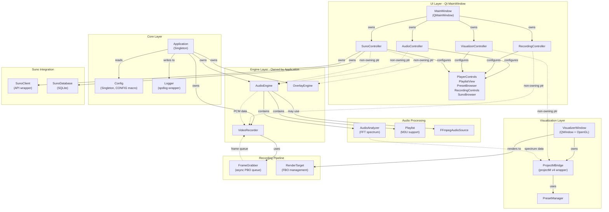
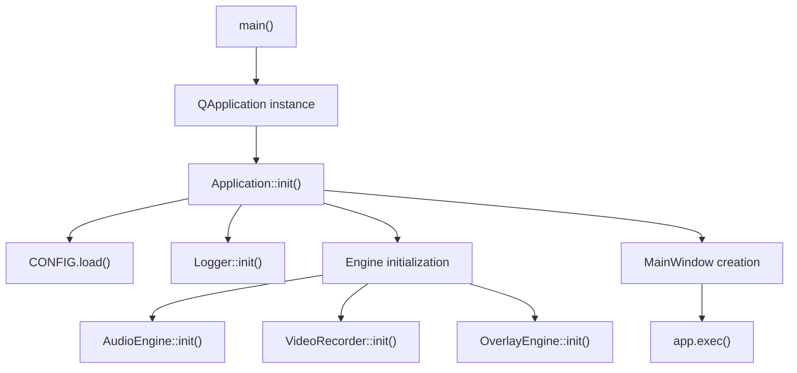
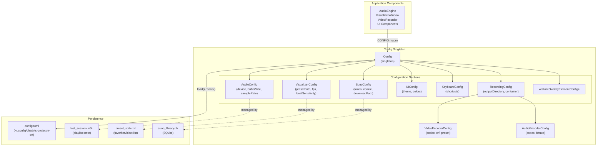

# Overview

<details>
<summary>Relevant source files</summary>

The following files were used as context for generating this wiki page:

- [AGENTS.md](AGENTS.md)
- [CMakeLists.txt](CMakeLists.txt)
- [src/core/Config.hpp](src/core/Config.hpp)

</details>


This page provides a comprehensive introduction to **chadvis-projectm-qt**, covering its purpose, architecture, technology stack, and core systems. For detailed information on specific subsystems, refer to the linked pages throughout this document.

---

## Project Description

**chadvis-projectm-qt** is a modern C++20/Qt6 audio visualizer application that integrates the projectM v4 library for real-time music visualization. The application combines audio playback, spectrum analysis, dynamic preset-based visualizations, text overlays, and high-quality video recording into a unified desktop experience.

**Key Features:**
- **Audio Playback:** Multi-format support (MP3, FLAC, WAV, etc.) via Qt Multimedia and FFmpeg decoding
- **Real-Time Visualization:** projectM v4-powered preset rendering with FFT-driven audio reactivity
- **Video Recording:** FFmpeg-based encoder capturing audio and video streams to MP4/MKV
- **Text Overlays:** Dynamic text elements with animations and beat-reactive effects
- **AI Music Integration:** Suno AI API client for generating, browsing, and playing AI-composed music
- **Preset Management:** Browsing, favorites, blacklisting, and history navigation for .milk presets
- **Playlist System:** M3U playlist support with shuffle, repeat, and session persistence

For build instructions and dependency setup, see [Building & Running](#1.2). For architecture patterns and design principles, see [Architecture & Design Patterns](#1.1).

**Sources:** [CMakeLists.txt:27-28](), [AGENTS.md:1-4](), [AGENTS.md:79-86]()

---

## Technology Stack

The application is built on modern C++ and Qt6, leveraging several mature libraries for multimedia processing:

| Component | Technology | Purpose |
|-----------|-----------|---------|
| **Language** | C++20 | Modern features (concepts, designated initializers, `std::span`) |
| **UI Framework** | Qt6 | Core, Gui, Widgets, Multimedia, OpenGLWidgets, Network, Sql |
| **Visualization** | projectM v4 | Milkdrop preset rendering engine |
| **Audio Decoding** | Qt Multimedia + FFmpeg | Multi-format audio support and PCM extraction |
| **Video Encoding** | FFmpeg (libavcodec) | MP4/MKV encoding with configurable codecs |
| **Configuration** | toml++  | TOML parsing for persistent settings |
| **Logging** | spdlog + fmt | Structured diagnostic output |
| **Metadata** | TagLib | Audio file tag extraction |
| **OpenGL** | GLEW + GLM | Graphics pipeline and math utilities |
| **Database** | Qt SQL (SQLite) | Suno library caching |

**Build System:** CMake 3.20+ with Ninja generator. The project uses pkg-config for dependency discovery with fallback manual search paths for locally-built libraries (e.g., projectM v4).

**Sources:** [CMakeLists.txt:59-69](), [CMakeLists.txt:73-102](), [AGENTS.md:34-35]()

---

## System Architecture

The application follows a **Singleton-Engine-Controller** pattern where the `Application` singleton owns all engines (audio, recording, overlay), and UI controllers mediate between widgets and engines using non-owning pointers.

### High-Level Component Architecture



**Key Architectural Principles:**

1. **Ownership:** `Application` owns all engines as `std::unique_ptr` members. UI controllers hold raw non-owning pointers.
2. **Configuration:** The `CONFIG` macro provides global access to the `Config` singleton, which loads/saves TOML configuration.
3. **Threading:** Audio decoding and video encoding run in dedicated threads. Visualization rendering uses Qt's event loop.
4. **Signal Routing:** Controllers implement `connectSignals()` methods to wire UI widget signals to engine slots, avoiding direct coupling.

**Sources:** [CMakeLists.txt:119-227](), [src/core/Config.hpp:109-231](), [AGENTS.md:79-86]()

---

## Core Data Flow Pipeline

The following diagram illustrates the complete data flow from audio input through visualization to final output (display and optional recording):

```mermaid
flowchart LR
    subgraph Input["Input Sources"]
        Files["Audio Files<br/>(MP3/FLAC/WAV)"]
        Suno["Suno API<br/>(Generated Music)"]
    end
    
    subgraph AudioProcessing["Audio Processing"]
        AE["AudioEngine"]
        FFSrc["FFmpegAudioSource<br/>(decode to PCM)"]
        QBuf["QAudioBufferOutput<br/>(Qt Multimedia)"]
        AA["AudioAnalyzer<br/>(FFT → spectrum)"]
    end
    
    subgraph Visualization["Visualization Pipeline"]
        PMB["ProjectMBridge<br/>(projectM_renderFrame)"]
        VW["VisualizerWindow<br/>(OpenGL context)"]
        FBO["RenderTarget<br/>(Framebuffer Object)"]
        PBO["PBO double-buffer<br/>(async readback)"]
    end
    
    subgraph OverlayComp["Overlay Composition"]
        OE["OverlayEngine<br/>(element management)"]
        OR["OverlayRenderer<br/>(OpenGL text quads)"]
    end
    
    subgraph Output["Output Destinations"]
        Screen["Display Output"]
        VR["VideoRecorder<br/>(FFmpeg encoder thread)"]
        File["MP4/MKV File"]
    end
    
    Files --> AE
    Suno --> AE
    
    AE -->|"decode via"| FFSrc
    AE -->|"or use"| QBuf
    
    FFSrc -->|"PCM f32[]"| AA
    QBuf -->|"PCM f32[]"| AA
    
    AA -->|"AudioSpectrum<br/>(frequency bins)"| PMB
    
    PMB -->|"projectM_renderFrame"| FBO
    FBO -->|"glReadPixels async"| PBO
    
    FBO --> VW
    VW -->|"composite"| OE
    OE -->|"render text"| OR
    OR --> Screen
    
    PBO -.->|"if recording"| VR
    FFSrc -.->|"PCM f32[]<br/>if recording"| VR
    VR --> File
```



**Pipeline Stages:**

1. **Audio Input:** Files decoded by `FFmpegAudioSource` or `QMediaPlayer` → PCM float samples
2. **Analysis:** `AudioAnalyzer::analyze()` computes FFT → `AudioSpectrum` (frequency bins)
3. **Visualization:** `ProjectMBridge::renderFrame()` feeds spectrum to projectM → renders to FBO
4. **Capture:** `RenderTarget` uses double-buffered PBOs for zero-copy async frame readback
5. **Overlay:** `OverlayEngine` manages text elements, `OverlayRenderer` draws them with OpenGL
6. **Output:** Final frame goes to display; if recording, frames queue to `VideoRecorder` encoder thread
7. **Encoding:** `VideoRecorder` muxes video frames + audio PCM → MP4/MKV via FFmpeg

**Sources:** [CMakeLists.txt:128-139](), [CMakeLists.txt:141-152](), [CMakeLists.txt:175-182]()

---

## Module Organization

The codebase is organized into logical subsystems, each with dedicated source files. The `CMakeLists.txt` defines module groupings for clarity:

| Module | Files | Responsibilities |
|--------|-------|------------------|
| **Util** | `Types.hpp`, `Result.hpp`, `Signal.hpp`, `FileUtils.*` | Type aliases, error handling, lightweight signals, file operations |
| **Core** | `Logger.*`, `Config.*`, `Application.*` | Logging, TOML configuration, singleton entry point |
| **Audio** | `AudioEngine.*`, `AudioAnalyzer.*`, `Playlist.*`, `MediaMetadata.*`, `FFmpegAudioSource.*` | Playback, spectrum analysis, playlist management, metadata extraction, FFmpeg decoding |
| **Visualizer** | `ProjectMBridge.*`, `PresetManager.*`, `RatingManager.*`, `RenderTarget.*`, `VisualizerWindow.*` | projectM wrapper, preset scanning/navigation, favorites/blacklist, FBO management, OpenGL window |
| **Suno** | `SunoModels.hpp`, `SunoClient.*`, `SunoDatabase.*` | API models, HTTP client, SQLite persistence |
| **Overlay** | `TextElement.*`, `TextAnimator.*`, `OverlayConfig.*`, `OverlayEngine.*`, `OverlayRenderer.*` | Text element definitions, animation logic, configuration, engine orchestration, OpenGL rendering |
| **Recorder** | `EncoderSettings.*`, `FrameGrabber.*`, `VideoRecorder.*` | Codec configuration, async frame queue, FFmpeg encoding thread |
| **UI** | `controllers/*`, `MarqueeLabel.*`, `PlayerControls.*`, `PlaylistView.*`, `VisualizerPanel.*`, `OverlayEditor.*`, `SunoBrowser.*`, `SunoCookieDialog.*`, `PresetBrowser.*`, `RecordingControls.*`, `SettingsDialog.*`, `MainWindow.*` | Signal routing controllers, custom widgets, main window |

**Headers Included in CMake:** The build system explicitly lists all headers to ensure `AUTOMOC` processes Qt `Q_OBJECT` declarations correctly.

**Sources:** [CMakeLists.txt:110-227]()

---

## Application Entry Point

The application lifecycle begins in `src/main.cpp`, which instantiates the `Application` singleton and initializes all subsystems:

### Initialization Sequence



**Startup Flow:**

1. `main()` creates `QApplication` and calls `Application::init()`
2. `Application::init()` loads configuration from `~/.config/chadvis-projectm-qt/config.toml` via `CONFIG.load()`
3. Logger initializes with settings from `CONFIG.debug()`
4. Engines are created: `audioEngine_`, `videoRecorder_`, `overlayEngine_`
5. `MainWindow` is constructed, which creates controllers and UI widgets
6. Controllers call `setupUI()` to configure widgets and `connectSignals()` to wire events
7. Event loop starts with `app.exec()`

The `Application` singleton provides global access to engines via `Application::instance()` methods. Controllers obtain non-owning pointers during construction.

**Sources:** [CMakeLists.txt:218](), [AGENTS.md:79-86]()

---

## Configuration System

Configuration uses a **singleton pattern with TOML persistence**. The `Config` class provides thread-safe access via the `CONFIG` macro and implements dirty tracking for optimized saves.

### Configuration Structure



**Usage Pattern:**

```cpp
// Access configuration anywhere in the codebase
auto fps = CONFIG.visualizer().fps;
CONFIG.recording().outputDirectory = "/path/to/videos";
CONFIG.save(CONFIG.configPath()); // Persist changes
```

**Key Features:**

- **Global Access:** The `CONFIG` macro expands to `vc::Config::instance()`
- **Dirty Tracking:** Mutable accessors call `markDirty()` to trigger auto-save checks
- **Thread Safety:** Internal `std::mutex` protects concurrent access
- **Nested Structures:** `RecordingConfig` contains `VideoEncoderConfig` and `AudioEncoderConfig`, mirroring UI organization
- **Typed Accessors:** Const and non-const overloads for section structs

**Sources:** [src/core/Config.hpp:1-236](), [AGENTS.md:79-86]()

---

## Threading Architecture

The application uses a **hybrid threading model** to balance responsiveness and performance:

| Thread | Purpose | Components |
|--------|---------|------------|
| **Main (Qt Event Loop)** | UI updates, user input, OpenGL rendering | `MainWindow`, `VisualizerWindow`, controllers, widgets |
| **Audio Decode Thread** | FFmpeg decoding (if used) | `FFmpegAudioSource` worker |
| **Qt Multimedia Thread** | Native audio decoding | `QMediaPlayer` / `QAudioBufferOutput` |
| **Video Encode Thread** | FFmpeg muxing and encoding | `VideoRecorder::encodeLoop()` |
| **Frame Capture (async)** | PBO readback via `glFenceSync` | `FrameGrabber::captureFrame()` |

**Synchronization Mechanisms:**

- **Spectrum Data:** `AudioAnalyzer` computes FFT on audio thread, emits `spectrumUpdated()` signal to update `ProjectMBridge` on main thread
- **Frame Queue:** `FrameGrabber` enqueues frames; `VideoRecorder` dequeues on encode thread with `std::condition_variable`
- **Config Access:** `std::mutex` guards `Config` singleton reads/writes
- **Signal/Slot:** Qt's queued connections handle cross-thread communication

**Performance Considerations:**

- **Zero-Copy Capture:** PBOs enable GPU-side frame readback without blocking the render loop
- **Pre-allocated Buffers:** `AudioAnalyzer` maintains a `scratchBuffer_` to avoid allocations in hot paths
- **Lock-Free Where Possible:** `Signal<T>` template uses `std::function` vector with minimal locking

**Sources:** [AGENTS.md:90-95](), [CMakeLists.txt:175-182]()

---

## Error Handling Strategy

The project uses **no exceptions**; all fallible operations return `vc::Result<T>`, a lightweight error monad:

```cpp
template <typename T>
class Result {
public:
    static Result ok(T value);
    static Result err(std::string message);
    
    bool isOk() const;
    bool isErr() const;
    const T& value() const;
    const std::string& error() const;
};
```

**Macros for Propagation:**

- `TRY(result)`: Early return if `result.isErr()`
- `TRY_VOID(result)`: Early return for `Result<void>`

**Example Usage:**

```cpp
Result<void> VideoRecorder::init(const EncoderSettings& settings) {
    auto codecResult = findCodec(settings.videoCodec);
    TRY(codecResult); // Propagates error up
    
    codec_ = codecResult.value();
    return Result<void>::ok();
}
```

**Benefits:**

- Forces explicit error handling at call sites
- No hidden control flow (unlike exceptions)
- Compile-time enforcement via `[[nodiscard]]`

**Sources:** [AGENTS.md:54-65](), [AGENTS.md:100-103]()

---

## Summary

**chadvis-projectm-qt** is a comprehensive audio visualization platform built on modern C++ and Qt6 principles. Its architecture separates concerns into well-defined modules (audio, visualization, recording, overlay, UI, Suno integration), connected by a singleton-engine-controller pattern. Data flows from audio input through spectrum analysis and projectM rendering to display and optional recording, with all configuration managed via a centralized TOML-based system.

For deeper exploration:
- **Architecture details:** See [Architecture & Design Patterns](#1.1)
- **Build instructions:** See [Building & Running](#1.2)
- **Audio system:** See [Audio System](#3)
- **Visualization:** See [Visualization System](#4)
- **Recording:** See [Recording System](#5)
- **UI implementation:** See [User Interface](#7)
- **Suno integration:** See [Suno AI Integration](#8)

**Sources:** [CMakeLists.txt:1-282](), [src/core/Config.hpp:1-236](), [AGENTS.md:1-113]()