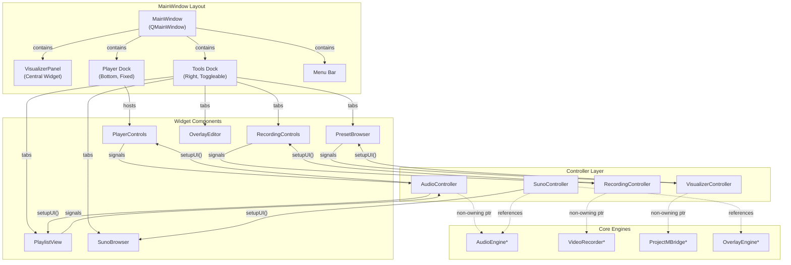
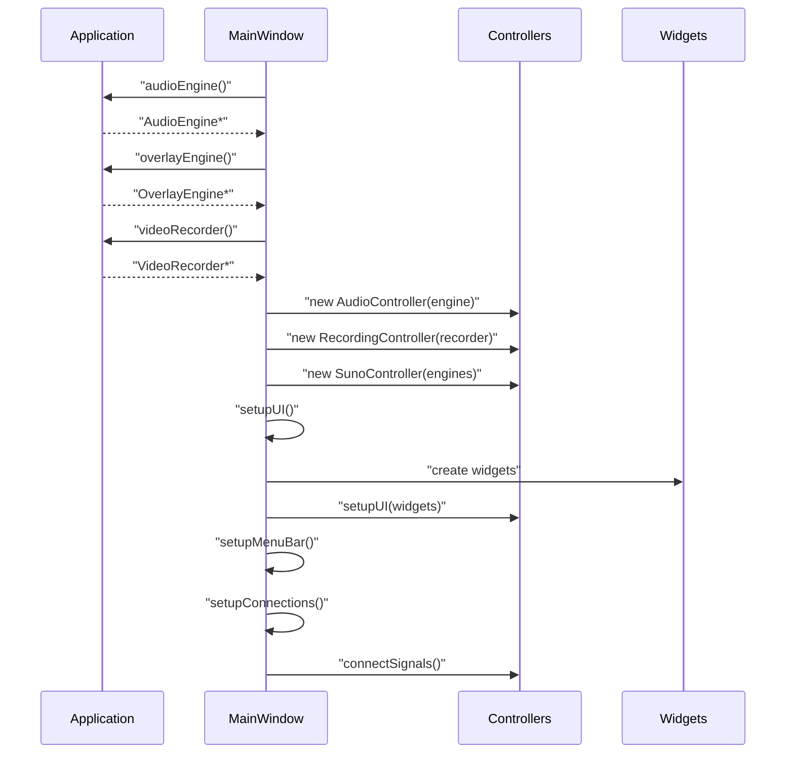
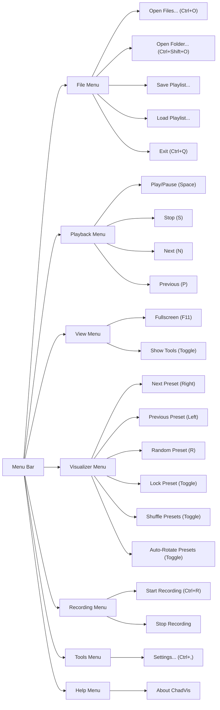
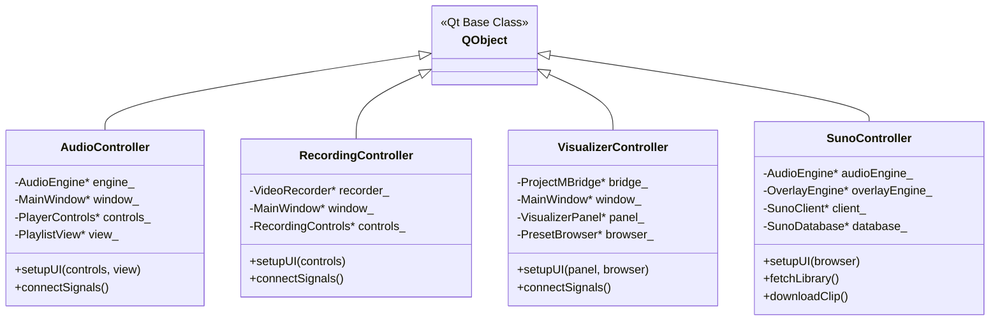
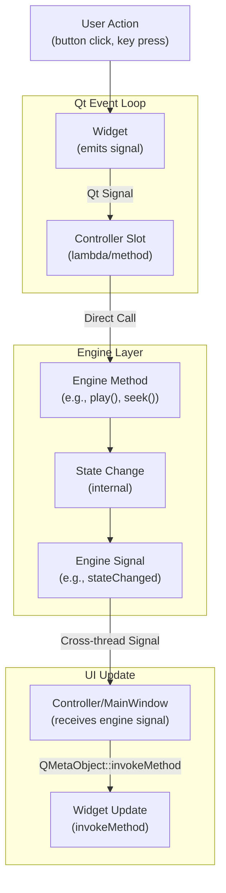

# User Interface

<details>
<summary>Relevant source files</summary>

The following files were used as context for generating this wiki page:

- [docs/ARCHITECTURE.md](docs/ARCHITECTURE.md)
- [src/ui/MainWindow.cpp](src/ui/MainWindow.cpp)
- [src/ui/MainWindow.hpp](src/ui/MainWindow.hpp)
- [src/ui/controllers/AudioController.cpp](src/ui/controllers/AudioController.cpp)
- [src/ui/controllers/RecordingController.cpp](src/ui/controllers/RecordingController.cpp)
- [src/ui/controllers/VisualizerController.cpp](src/ui/controllers/VisualizerController.cpp)

</details>


## Purpose and Scope

This document describes the Qt-based user interface layer of chadvis-projectm-qt, including the main window structure, controller pattern implementation, widget components, and signal routing architecture. The UI layer provides the graphical interface for all user interactions with the audio playback, visualization, recording, and Suno AI features.

For information about the underlying audio playback system, see [Audio System](#3). For visualization rendering details, see [Visualization System](#4). For recording functionality, see [Recording System](#5). For Suno AI integration specifics, see [Suno AI Integration](#8). For configuration management, see [Application & Config](#2.1).

---

## Architecture Overview

The user interface follows a **controller pattern** that separates presentation (widgets) from business logic (controllers) and data (engines). Controllers act as mediators between UI widgets and core engines, holding non-owning pointers to engines owned by the `Application` singleton.



**Diagram: UI Architecture and Component Relationships**

Sources: [src/ui/MainWindow.hpp:36-115](), [src/ui/MainWindow.cpp:36-126](), [docs/ARCHITECTURE.md:26-32]()

---

## MainWindow Structure

The `MainWindow` class ([src/ui/MainWindow.hpp:36-115]()) serves as the top-level orchestrator for the entire UI. It is a `QMainWindow` subclass that manages layout, docks, menus, and controller initialization.

### Initialization Sequence

The constructor follows this initialization order:

1. **Engine Retrieval**: Obtains non-owning pointers to engines from `Application` singleton ([src/ui/MainWindow.cpp:42-51]())
2. **Controller Construction**: Creates controller instances with engine pointers ([src/ui/MainWindow.cpp:55-65]())
3. **UI Setup**: Creates and arranges widget hierarchy ([src/ui/MainWindow.cpp:61]())
4. **Menu Bar Creation**: Configures application menus ([src/ui/MainWindow.cpp:62]())
5. **Signal Connection**: Establishes all signal/slot connections ([src/ui/MainWindow.cpp:67]())
6. **Update Timer**: Starts 16ms timer for overlay updates ([src/ui/MainWindow.cpp:68]())



**Diagram: MainWindow Initialization Sequence**

Sources: [src/ui/MainWindow.cpp:36-71]()

### Layout Components

| Component | Type | Location | Features |
|-----------|------|----------|----------|
| **Central Widget** | `VisualizerPanel` | Center | Hosts `VisualizerWindow` with OpenGL context |
| **Player Dock** | `QDockWidget` | Bottom | Fixed position, no drag handles |
| **Tools Dock** | `QDockWidget` | Right | Toggleable via View menu, contains tabbed interface |
| **Status Bar** | `QStatusBar` | Bottom | Displays messages and recording status |
| **Menu Bar** | `QMenuBar` | Top | File, Playback, View, Visualizer, Recording, Tools, Help |

The player dock is configured with `NoDockWidgetFeatures` and an empty title bar widget to create a seamless, fixed control panel ([src/ui/MainWindow.cpp:95-99]()):

```cpp
auto* controlsDock = new QDockWidget("Player", this);
controlsDock->setWidget(playerControls_);
controlsDock->setFeatures(QDockWidget::NoDockWidgetFeatures);
controlsDock->setTitleBarWidget(new QWidget());
```

The tools dock hosts a `QTabWidget` containing five tabs: Playlist, Presets, Recording, Overlay, and Suno ([src/ui/MainWindow.cpp:103-121]()). Visibility is controlled by the View menu and persisted in the configuration.

Sources: [src/ui/MainWindow.cpp:89-126]()

### Menu Bar Structure



**Diagram: Menu Bar Organization and Keyboard Shortcuts**

Sources: [src/ui/MainWindow.cpp:128-246]()

---

## Controller Pattern

Controllers implement a **mediator pattern** that decouples UI widgets from core engines. Each controller:

1. Holds **non-owning pointers** to engines (owned by `Application`)
2. Provides `setupUI()` methods to configure widget references
3. Implements `connectSignals()` to establish signal/slot connections
4. Routes user actions to engine methods
5. Updates widgets in response to engine state changes

### Controller Class Hierarchy



**Diagram: Controller Class Structure**

Sources: [src/ui/MainWindow.hpp:96-100](), [src/ui/controllers/AudioController.cpp:12-14](), [src/ui/controllers/RecordingController.cpp:15-18](), [src/ui/controllers/VisualizerController.cpp:12-15]()

### AudioController

The `AudioController` ([src/ui/controllers/AudioController.cpp:12-93]()) manages the audio playback UI components:

**Key Responsibilities:**
- Binds `PlayerControls` and `PlaylistView` to `AudioEngine`
- Routes playback commands (play, pause, stop, seek, volume)
- Handles playlist navigation and file drops
- Forwards PCM data to visualizer for rendering

**Signal Connections:**

| Widget Signal | Engine Action |
|---------------|---------------|
| `PlayerControls::playClicked` | `AudioEngine::play()` |
| `PlayerControls::pauseClicked` | `AudioEngine::pause()` |
| `PlayerControls::stopClicked` | `AudioEngine::stop()` |
| `PlayerControls::nextClicked` | `Playlist::next()` |
| `PlayerControls::previousClicked` | `Playlist::previous()` |
| `PlayerControls::seekRequested` | `AudioEngine::seek()` |
| `PlayerControls::volumeChanged` | `AudioEngine::setVolume()` |
| `PlaylistView::trackDoubleClicked` | `Playlist::jumpTo()` |
| `PlaylistView::filesDropped` | `MainWindow::addToPlaylist()` |

The controller also forwards PCM audio data from `AudioEngine` to the visualizer ([src/ui/controllers/AudioController.cpp:82-90]()):

```cpp
engine_->pcmReceived.connect([this](const std::vector<f32>& pcm,
                                    u32 frames,
                                    u32 channels,
                                    u32 sampleRate) {
    if (!pcm.empty() && frames > 0) {
        window_->visualizerPanel()->visualizer()->feedAudio(
                pcm.data(), frames, channels, sampleRate);
    }
});
```

Sources: [src/ui/controllers/AudioController.cpp:1-93]()

### RecordingController

The `RecordingController` ([src/ui/controllers/RecordingController.cpp:15-85]()) coordinates video recording operations:

**Key Responsibilities:**
- Connects `RecordingControls` to `VideoRecorder`
- Forwards captured frames from `VisualizerWindow` to encoder
- Submits audio samples from `AudioEngine` to encoder
- Implements auto-stop on track change
- Implements auto-record feature when configured

**Critical Connections:**

The controller uses `Qt::DirectConnection` for frame submission to avoid queueing delays ([src/ui/controllers/RecordingController.cpp:35-45]()):

```cpp
connect(visualizer,
        &VisualizerWindow::frameCaptured,
        this,
        [this](std::vector<u8> data, u32 w, u32 h, i64 ts) {
            if (recorder_->isRecording()) {
                recorder_->submitVideoFrame(std::move(data), w, h, ts);
            }
        },
        Qt::DirectConnection);
```

**Auto-Stop/Auto-Record Logic:**

| Trigger | Action |
|---------|--------|
| `AudioEngine::trackChanged` | Stop recording, optionally start new recording after 500ms delay |
| `AudioEngine::stateChanged` (→ Stopped) | Stop recording immediately |

Sources: [src/ui/controllers/RecordingController.cpp:1-85]()

### VisualizerController

The `VisualizerController` ([src/ui/controllers/VisualizerController.cpp:12-41]()) manages visualization settings and preset selection:

**Key Responsibilities:**
- Connects `PresetBrowser` to `PresetManager`
- Handles preset lock toggle from `VisualizerPanel`
- Listens to `ProjectMBridge` preset change notifications

This controller is the simplest, as most visualizer interaction is handled directly by keyboard input in `VisualizerWindow`.

Sources: [src/ui/controllers/VisualizerController.cpp:1-41]()

### SunoController

The `SunoController` is documented in detail in [Suno AI Integration](#8). It orchestrates API communication, database persistence, and integration with audio/overlay engines.

---

## Widget Components

Widgets are Qt-based UI components that handle user input and display. They emit signals that controllers translate into engine actions.

### Widget Overview Table

| Widget Class | Location | Purpose | Key Signals |
|--------------|----------|---------|-------------|
| **PlayerControls** | Bottom Dock | Playback control panel | `playClicked`, `pauseClicked`, `stopClicked`, `seekRequested`, `volumeChanged` |
| **PlaylistView** | Tools Dock Tab 1 | Track list display | `trackDoubleClicked`, `filesDropped` |
| **PresetBrowser** | Tools Dock Tab 2 | Preset selection interface | Preset selection (handled by controller) |
| **RecordingControls** | Tools Dock Tab 3 | Recording start/stop/settings | `startRecordingRequested`, `stopRecordingRequested` |
| **OverlayEditor** | Tools Dock Tab 4 | Text overlay configuration | `overlayChanged` |
| **SunoBrowser** | Tools Dock Tab 5 | Suno library interface | See [Suno AI Integration](#8) |
| **VisualizerPanel** | Central Widget | Embeds `VisualizerWindow` | `lockPresetToggled` |

Sources: [src/ui/MainWindow.cpp:94-114]()

### PlayerControls

The `PlayerControls` widget displays playback state and provides transport controls. It receives state updates from `AudioEngine` and emits signals when buttons are clicked or sliders are moved.

**State Management:**
- Receives `AudioEngine*` pointer via `setAudioEngine()` ([src/ui/MainWindow.cpp:123]())
- Subscribes to `AudioEngine` signals for state updates
- Enables/disables controls based on playlist state

Sources: [src/ui/MainWindow.cpp:94-96](), [src/ui/controllers/AudioController.cpp:16-22]()

### PlaylistView

The `PlaylistView` displays the current playlist with track metadata. It accepts file drops for adding new tracks and supports double-click to play.

**Features:**
- Receives `Playlist*` pointer via `setPlaylist()` ([src/ui/controllers/AudioController.cpp:21]())
- Drag-and-drop support for audio files and folders
- Current track highlighting
- Metadata display (title, artist, duration)

Sources: [src/ui/MainWindow.cpp:101](), [src/ui/controllers/AudioController.cpp:54-64]()

### OverlayEditor

The `OverlayEditor` allows configuration of text overlay elements. It directly references `OverlayEngine` to read and modify overlay configuration ([src/ui/MainWindow.cpp:109-111]()):

```cpp
overlayEditor_ = new OverlayEditor();
overlayEditor_->setOverlayEngine(overlayEngine_);
```

Changes are persisted via `OverlayEngine::config().saveToAppConfig()` ([src/ui/MainWindow.cpp:271-273]()).

Sources: [src/ui/MainWindow.cpp:109-111](), [src/ui/MainWindow.cpp:271-273]()

---

## Signal Flow Architecture

The signal flow follows a unidirectional pattern: **Widget → Controller → Engine → State Update → Widget**.



**Diagram: Signal Flow from User Action to UI Update**

### Thread-Safe Signal Handling

Since engines operate on separate threads (audio thread, recorder thread), `MainWindow` uses `QMetaObject::invokeMethod` to marshal updates back to the UI thread ([src/ui/MainWindow.cpp:255-261]()):

```cpp
audioEngine_->trackChanged.connect([this] {
    QMetaObject::invokeMethod(this, [this] {
        if (const auto* item = audioEngine_->playlist().currentItem()) {
            overlayEngine_->updateMetadata(item->metadata);
            updateWindowTitle();
        }
    });
});
```

This ensures all Qt widget operations occur on the main thread, preventing race conditions.

Sources: [src/ui/MainWindow.cpp:248-274]()

### Update Loop

The `MainWindow` runs a 16ms (≈60 FPS) timer for continuous updates ([src/ui/MainWindow.cpp:276-286]()):

```cpp
void MainWindow::onUpdateLoop() {
    overlayEngine_->update(0.016f);
    const auto& spectrum = audioEngine_->currentSpectrum();
    if (spectrum.beatDetected)
        overlayEngine_->onBeat(spectrum.beatIntensity);
}
```

This loop:
- Updates overlay animations
- Processes beat detection for reactive text effects

Sources: [src/ui/MainWindow.cpp:276-286]()

---

## Dialogs

### SettingsDialog

The `SettingsDialog` provides a tabbed interface for editing all application configuration. It is documented in detail in [Settings Dialog](#7.3).

### File Dialogs

The application uses `QFileDialog` with `DontUseNativeDialog` option for consistency across platforms:

**File Selection Dialogs:**

| Operation | Method | Filters |
|-----------|--------|---------|
| **Open Audio Files** | `QFileDialog::ExistingFiles` | `*.mp3 *.flac *.ogg *.opus *.wav *.m4a *.aac` |
| **Open Folder** | `QFileDialog::Directory` | N/A |
| **Save Playlist** | `QFileDialog::getSaveFileName` | `*.m3u` |
| **Load Playlist** | `QFileDialog::getOpenFileName` | `*.m3u *.m3u8` |

All dialogs start in `QDir::homePath()` ([src/ui/MainWindow.cpp:364-407]()).

Sources: [src/ui/MainWindow.cpp:364-407]()

### Message Boxes

The application uses `QMessageBox` for:
- **Recording confirmation**: When closing with active recording ([src/ui/MainWindow.cpp:427-437]())
- **Recording errors**: When encoder initialization fails ([src/ui/MainWindow.cpp:334-337]())
- **About dialog**: Version and credits ([src/ui/MainWindow.cpp:417-424]())

Sources: [src/ui/MainWindow.cpp:334-337](), [src/ui/MainWindow.cpp:417-437]()

---

## Event Handling

### Keyboard Events

`MainWindow` overrides `keyPressEvent()` to handle global keyboard shortcuts ([src/ui/MainWindow.cpp:443-451]()):

```cpp
void MainWindow::keyPressEvent(QKeyEvent* event) {
    switch (event->key()) {
    case Qt::Key_Space:
        audioEngine_->togglePlayPause();
        break;
    default:
        QMainWindow::keyPressEvent(event);
    }
}
```

Additional keyboard handling occurs in `VisualizerWindow` for preset navigation. See [VisualizerWindow](#4.1) for details.

Sources: [src/ui/MainWindow.cpp:443-451]()

### Drag and Drop

The main window accepts file drops for adding to playlist ([src/ui/MainWindow.cpp:453-468]()):

1. `dragEnterEvent()`: Accepts drop if MIME data contains URLs
2. `dropEvent()`: Filters for local files and calls `addToPlaylist()`

Dropped directories are recursively scanned for audio files using `file::listFiles()` ([src/ui/MainWindow.cpp:300-311]()).

Sources: [src/ui/MainWindow.cpp:300-311](), [src/ui/MainWindow.cpp:453-468]()

### Close Event

The `closeEvent()` override ([src/ui/MainWindow.cpp:426-441]()) implements:
- **Recording check**: Prompts user to confirm stopping active recording
- **Config persistence**: Calls `CONFIG.save()` to persist settings
- **Graceful shutdown**: Allows event to proceed or cancels based on user choice

Sources: [src/ui/MainWindow.cpp:426-441]()

---

## Window Title Management

The window title dynamically reflects application state ([src/ui/MainWindow.cpp:288-298]()):

| State | Title Format |
|-------|--------------|
| **Idle** | `ChadVis` |
| **Playing** | `{Artist} - {Title} \| ChadVis` |
| **Recording** | `⏺ {Artist} - {Title} \| ChadVis` |

The title is updated on:
- Track changes ([src/ui/MainWindow.cpp:255-262]())
- Recording start/stop ([src/ui/MainWindow.cpp:339](), [src/ui/MainWindow.cpp:349]())

Sources: [src/ui/MainWindow.cpp:288-298]()

---

## Status Bar Messages

The status bar provides user feedback for operations:

| Message Type | Example | Trigger |
|--------------|---------|---------|
| **Ready State** | `"Ready. I use Arch btw."` | Application start |
| **Recording Started** | `"Recording started: /path/to/output.mp4"` | `startRecording()` |
| **Recording Stopped** | `"Recording stopped"` | `stopRecording()` |
| **Files Added** | `"Added 5 files to playlist"` | Drag and drop |

Sources: [src/ui/MainWindow.cpp:70](), [src/ui/MainWindow.cpp:340-342](), [src/ui/MainWindow.cpp:350](), [src/ui/MainWindow.cpp:465-466]()

---

## Configuration Integration

UI state is persisted via the `CONFIG` singleton:

**Persisted Settings:**

| Setting | Config Path | Usage |
|---------|-------------|-------|
| **Tools Dock Visibility** | `CONFIG.ui().showPresets`, `CONFIG.ui().showPlaylist` | Restored on startup |
| **Preset Shuffle** | `CONFIG.visualizer().shufflePresets` | Menu checkable action state |
| **Auto-Rotate Duration** | `CONFIG.visualizer().presetDuration` | Menu checkable action state |
| **Window Geometry** | (Not currently persisted) | Defaults to 1400x900 |

Configuration is saved on application exit via `closeEvent()` ([src/ui/MainWindow.cpp:439]()).

Sources: [src/ui/MainWindow.cpp:125-126](), [src/ui/MainWindow.cpp:215-227](), [src/ui/MainWindow.cpp:439]()