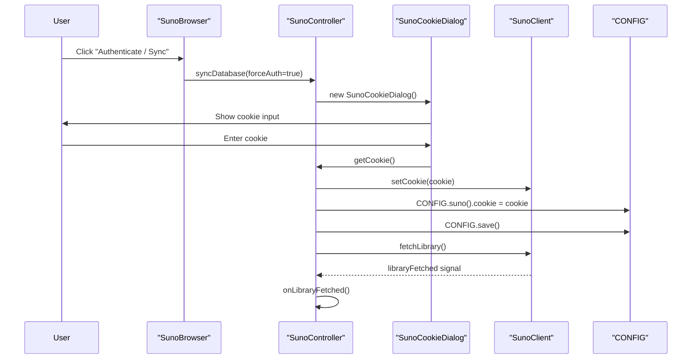
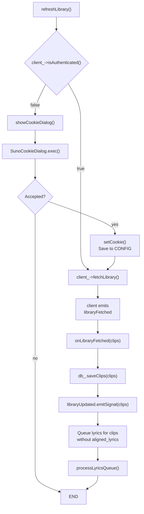
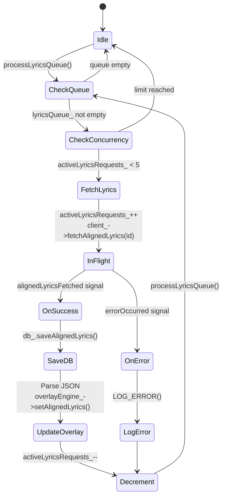
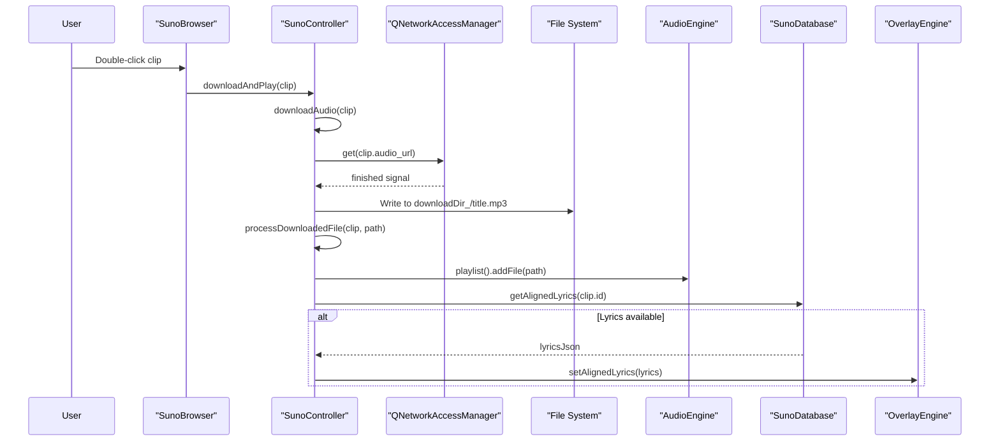
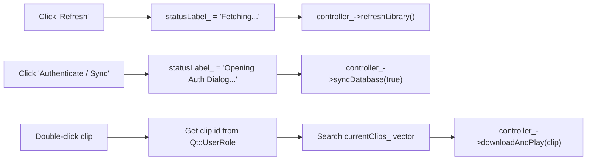
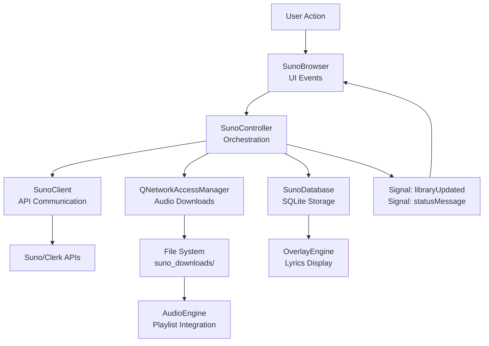

# SunoController & UI

<details>
<summary>Relevant source files</summary>

The following files were used as context for generating this wiki page:

- [src/ui/SunoBrowser.cpp](src/ui/SunoBrowser.cpp)
- [src/ui/SunoBrowser.hpp](src/ui/SunoBrowser.hpp)
- [src/ui/controllers/SunoController.cpp](src/ui/controllers/SunoController.cpp)
- [src/ui/controllers/SunoController.hpp](src/ui/controllers/SunoController.hpp)

</details>


## Purpose and Scope

This document covers the **SunoController** business logic layer and **SunoBrowser** UI widget, which together provide the user-facing interface for Suno AI music integration. The controller orchestrates library syncing, clip downloading, lyrics fetching, and integration with the main application's audio and overlay systems.

For low-level API communication details, see [SunoClient & API](#8.1). For general Suno integration architecture, see [Suno AI Integration](#8).

---

## Overview

The Suno integration UI follows the application's controller pattern:

- **SunoController** acts as the orchestration layer, coordinating between `SunoClient`, `SunoDatabase`, `AudioEngine`, and `OverlayEngine`
- **SunoBrowser** provides the Qt widget interface for browsing and selecting clips
- **SunoCookieDialog** handles authentication when needed

The controller manages the complete lifecycle: authentication → library fetch → database persistence → lyrics download → audio download → playlist integration.

**Sources:** [src/ui/controllers/SunoController.hpp:1-74](), [src/ui/SunoBrowser.hpp:1-46]()

---

## SunoController Architecture

### Class Structure and Dependencies

```mermaid
graph TB
    subgraph "SunoController [QObject]"
        CTRL[SunoController]
        CLIENT[unique_ptr&lt;SunoClient&gt;]
        DB[SunoDatabase db_]
        NM[QNetworkAccessManager*]
        QUEUE[deque&lt;string&gt; lyricsQueue_]
    end
    
    subgraph "Non-Owning References"
        AE[AudioEngine*<br/>audioEngine_]
        OE[OverlayEngine*<br/>overlayEngine_]
        MW[MainWindow*<br/>window_]
    end
    
    subgraph "UI Components"
        BROWSER[SunoBrowser]
        COOKIE[SunoCookieDialog]
    end
    
    subgraph "Signals"
        LIB_SIG["Signal&lt;vector&lt;SunoClip&gt;&amp;&gt;<br/>libraryUpdated"]
        STATUS_SIG["Signal&lt;string&amp;&gt;<br/>statusMessage"]
    end
    
    subgraph "File System"
        DOWNLOAD_DIR["downloadDir_<br/>CONFIG.suno().downloadPath"]
    end
    
    CTRL --> CLIENT
    CTRL --> DB
    CTRL --> NM
    CTRL --> QUEUE
    
    CTRL -.->|"non-owning"| AE
    CTRL -.->|"non-owning"| OE
    CTRL -.->|"non-owning"| MW
    
    CTRL -->|"emits"| LIB_SIG
    CTRL -->|"emits"| STATUS_SIG
    
    BROWSER -->|"calls methods"| CTRL
    BROWSER -->|"listens to"| LIB_SIG
    BROWSER -->|"listens to"| STATUS_SIG
    
    CTRL -->|"shows on auth"| COOKIE
    
    CTRL -->|"downloads to"| DOWNLOAD_DIR
    CTRL -->|"adds tracks"| AE
    CTRL -->|"passes lyrics"| OE
    
    CLIENT -.->|"signals"| CTRL
```



**Sources:** [src/ui/controllers/SunoController.hpp:26-73](), [src/ui/controllers/SunoController.cpp:18-56]()

### Constructor Initialization

The `SunoController` constructor performs extensive initialization:

| Component | Initialization |
|-----------|----------------|
| **SunoClient** | Created as `unique_ptr`, signals connected to controller slots |
| **SunoDatabase** | Initialized with path `dataDir()/suno_library.db` |
| **QNetworkAccessManager** | Created for HTTP downloads (separate from SunoClient's manager) |
| **Download Directory** | Read from `CONFIG.suno().downloadPath`, defaults to `dataDir()/suno_downloads` |
| **Authentication** | Token and cookie loaded from `CONFIG.suno()` and passed to client |

**Signal Connections:**
- `client_->libraryFetched` → `onLibraryFetched()`
- `client_->alignedLyricsFetched` → `onAlignedLyricsFetched()`
- `client_->errorOccurred` → `onError()`

**Sources:** [src/ui/controllers/SunoController.cpp:18-56]()

---

## Authentication and Library Sync

### Authentication Flow



The authentication flow is triggered in two scenarios:
1. **User-initiated:** Clicking "Authenticate / Sync" button calls `syncDatabase(forceAuth=true)`
2. **Auto-triggered:** Calling `refreshLibrary()` when `!client_->isAuthenticated()` shows the dialog

**Sources:** [src/ui/controllers/SunoController.cpp:60-87]()

### Library Sync Workflow



**Key Methods:**

- **`refreshLibrary()`** [src/ui/controllers/SunoController.cpp:60-66]() - Entry point, checks authentication
- **`syncDatabase(bool forceAuth)`** [src/ui/controllers/SunoController.cpp:68-74]() - Wrapper that optionally forces auth dialog
- **`showCookieDialog()`** [src/ui/controllers/SunoController.cpp:76-87]() - Displays modal dialog, saves cookie to config
- **`onLibraryFetched()`** [src/ui/controllers/SunoController.cpp:89-101]() - Saves clips to database, queues lyrics

**Sources:** [src/ui/controllers/SunoController.cpp:60-101]()

---

## Lyrics Fetching with Queue Management

### Concurrency Control

The controller implements a queue-based system to fetch aligned lyrics with a **concurrency limit of 5 requests**:



**Implementation Details:**

| Component | Purpose |
|-----------|---------|
| `lyricsQueue_` | `std::deque<std::string>` of clip IDs needing lyrics |
| `activeLyricsRequests_` | Counter for in-flight requests (max 5) |
| `processLyricsQueue()` | Starts new requests while under limit |
| `onAlignedLyricsFetched()` | Handles success, decrements counter, processes queue |
| `onError()` | Handles failure, decrements counter, processes queue |

**Sources:** [src/ui/controllers/SunoController.cpp:103-149]()

### Lyrics Processing

When lyrics arrive, the controller:

1. **Decrements the active request counter** and processes more from queue
2. **Saves raw JSON to database** via `db_.saveAlignedLyrics(clipId, json)`
3. **Parses the JSON** to extract aligned words with timestamps
4. **Passes to OverlayEngine** via `overlayEngine_->setAlignedLyrics(lyrics)`

The JSON parsing handles two formats:
- **Array format:** Direct array of word objects
- **Object format:** `{"words": [...]}` or `{"aligned_words": [...]}`

Each word object is parsed into an `AlignedWord` struct:

```cpp
w.word = obj["word"].toString()
w.start_s = obj["start_s"].toDouble(obj["start"].toDouble())
w.end_s = obj["end_s"].toDouble(obj["end"].toDouble())
w.score = obj["p_align"].toDouble(obj["score"].toDouble())
```

**Sources:** [src/ui/controllers/SunoController.cpp:113-149]()

---

## Download and Playlist Integration

### Download Flow



**File Path Generation:**

The controller constructs the download path as:
```cpp
QString fileName = QString::fromStdString(clip.title).replace(" ", "_") + ".mp3";
fs::path filePath = downloadDir_ / fileName.toStdString();
```

This replaces spaces with underscores and appends `.mp3` extension.

**Sources:** [src/ui/controllers/SunoController.cpp:159-210]()

### Post-Download Integration

After successful download, `processDownloadedFile()` [src/ui/controllers/SunoController.cpp:200-210]():

1. **Adds file to playlist** via `audioEngine_->playlist().addFile(path)`
2. **Checks for cached lyrics** via `db_.getAlignedLyrics(clip.id)`
3. **Loads lyrics if available** (TODO comment suggests overlay integration)

This creates a seamless experience where downloaded tracks are immediately playable with synchronized lyrics.

**Sources:** [src/ui/controllers/SunoController.cpp:200-210]()

---

## SunoBrowser Widget

### UI Layout Structure

```mermaid
graph TB
    subgraph "SunoBrowser [QWidget]"
        LAYOUT[QVBoxLayout]
        
        subgraph "Top Bar [QHBoxLayout]"
            SEARCH[QLineEdit searchEdit_<br/>'Search Suno...']
            REFRESH[QPushButton refreshBtn_<br/>'Refresh']
            SYNC[QPushButton syncBtn_<br/>'Authenticate / Sync']
        end
        
        LIST[QListWidget clipList_<br/>Displays SunoClip titles]
        STATUS[QLabel statusLabel_<br/>'Arch Linux (btw)']
    end
    
    LAYOUT --> SEARCH
    LAYOUT --> REFRESH
    LAYOUT --> SYNC
    LAYOUT --> LIST
    LAYOUT --> STATUS
```

**Widget Inventory:**

| Widget | Type | Purpose |
|--------|------|---------|
| `searchEdit_` | `QLineEdit` | Search box (placeholder only, not implemented) |
| `refreshBtn_` | `QPushButton` | Triggers `controller_->refreshLibrary()` |
| `syncBtn_` | `QPushButton` | Triggers `controller_->syncDatabase(true)` |
| `clipList_` | `QListWidget` | Displays clip titles, stores clip ID in `Qt::UserRole` |
| `statusLabel_` | `QLabel` | Shows status messages (default: "Arch Linux (btw)") |

**Sources:** [src/ui/SunoBrowser.cpp:26-57]()

### Signal Connections

#### Button Connections

```cpp
connect(refreshBtn_, &QPushButton::clicked, this, &SunoBrowser::onRefreshClicked);
connect(syncBtn_, &QPushButton::clicked, this, &SunoBrowser::onSyncClicked);
connect(clipList_, &QListWidget::itemDoubleClicked, this, &SunoBrowser::onItemDoubleClicked);
```

**Sources:** [src/ui/SunoBrowser.cpp:48-56]()

#### Controller Signal Connections

The browser connects to controller signals using lambda wrappers with `QMetaObject::invokeMethod()` for thread safety:

```cpp
controller_->libraryUpdated.connect([this](const auto& clips) {
    QMetaObject::invokeMethod(this, [this, clips] { updateList(clips); });
});

controller_->statusMessage.connect([this](const auto& msg) {
    QMetaObject::invokeMethod(this, [this, msg] {
        statusLabel_->setText(QString::fromStdString(msg));
    });
});
```

The `QMetaObject::invokeMethod()` wrapper ensures UI updates happen on the main thread, even if signals are emitted from worker threads.

**Sources:** [src/ui/SunoBrowser.cpp:13-21]()

### User Interactions



**Slot Implementations:**

- **`onRefreshClicked()`** [src/ui/SunoBrowser.cpp:59-62]() - Updates status, calls `refreshLibrary()`
- **`onSyncClicked()`** [src/ui/SunoBrowser.cpp:64-67]() - Updates status, calls `syncDatabase(true)`
- **`onItemDoubleClicked()`** [src/ui/SunoBrowser.cpp:80-88]() - Matches item to clip by ID, triggers download

**Sources:** [src/ui/SunoBrowser.cpp:59-88]()

### List Population

The `updateList()` slot is called when the controller emits `libraryUpdated`:

```cpp
void SunoBrowser::updateList(const std::vector<SunoClip>& clips) {
    currentClips_ = clips;
    clipList_->clear();
    for (const auto& clip : clips) {
        auto* item = new QListWidgetItem(QString::fromStdString(clip.title));
        item->setData(Qt::UserRole, QString::fromStdString(clip.id));
        clipList_->addItem(item);
    }
    statusLabel_->setText(QString("Found %1 clips").arg(clips.size()));
}
```

**Key Details:**
- Stores the full clip vector in `currentClips_` for lookup during double-click
- Each `QListWidgetItem` displays the title but stores the clip ID in `Qt::UserRole`
- Status label shows the clip count

**Sources:** [src/ui/SunoBrowser.cpp:69-78]()

---

## Integration with Main Application

### Controller Initialization

The `SunoController` is instantiated by `MainWindow` and passed to `SunoBrowser`:

```cpp
// In MainWindow or similar context:
auto* sunoController = new SunoController(audioEngine_, overlayEngine_, this);
auto* sunoBrowser = new SunoBrowser(sunoController);
```

The controller receives non-owning pointers to:
- **AudioEngine** - For adding downloaded tracks to playlist
- **OverlayEngine** - For passing aligned lyrics
- **MainWindow** - For showing dialogs (though currently uses `new` directly)

**Sources:** [src/ui/controllers/SunoController.cpp:18-26]()

### Data Flow Summary



**Sources:** [src/ui/controllers/SunoController.cpp:1-212](), [src/ui/SunoBrowser.cpp:1-91]()

---

## Error Handling

### Error Flow

Errors from `SunoClient` are routed through the controller's `onError()` slot:

```cpp
void SunoController::onError(const std::string& message) {
    activeLyricsRequests_ = std::max(0, activeLyricsRequests_ - 1);
    processLyricsQueue();
    
    LOG_ERROR("SunoController: {}", message);
    statusMessage.emitSignal(message);
}
```

**Error Handling Steps:**
1. Decrement the active lyrics request counter (if applicable)
2. Process more from the lyrics queue
3. Log the error via `LOG_ERROR`
4. Emit `statusMessage` signal to update UI

The browser receives this via its connected signal and displays the error in `statusLabel_`.

**Sources:** [src/ui/controllers/SunoController.cpp:151-157]()

### Download Failure Handling

Download failures are logged but do not show in the UI status label:

```cpp
if (reply->error() != QNetworkReply::NoError) {
    LOG_ERROR("SunoController: Download failed: {}", 
              reply->errorString().toStdString());
    return;
}
```

File write failures are also logged:

```cpp
if (!file.open(QIODevice::WriteOnly)) {
    LOG_ERROR("SunoController: Failed to open file for writing: {}", 
              filePath.string());
}
```

**Sources:** [src/ui/controllers/SunoController.cpp:177-196]()

---

## Configuration Dependencies

The controller reads from `CONFIG.suno()`:

| Config Field | Default | Usage |
|--------------|---------|-------|
| `token` | empty | JWT token for API authentication |
| `cookie` | empty | Session cookie (written by dialog) |
| `downloadPath` | `dataDir()/suno_downloads` | Where to save audio files |

The `showCookieDialog()` method writes the cookie back to config and saves:

```cpp
CONFIG.suno().cookie = cookie;
CONFIG.save(CONFIG.configPath());
```

**Sources:** [src/ui/controllers/SunoController.cpp:44-56](), [src/ui/controllers/SunoController.cpp:82-83]()