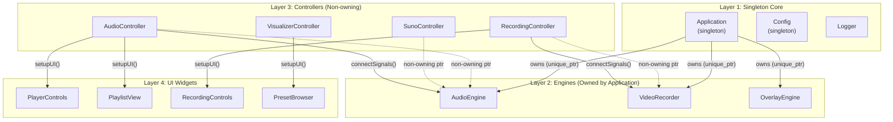
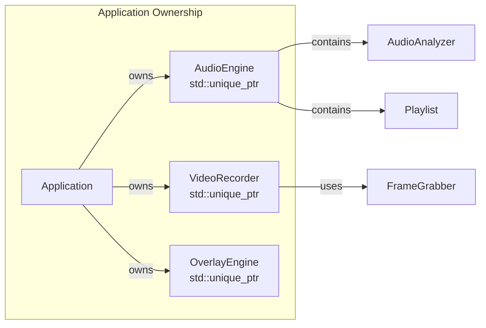
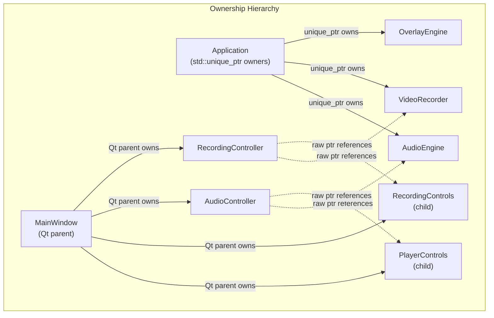
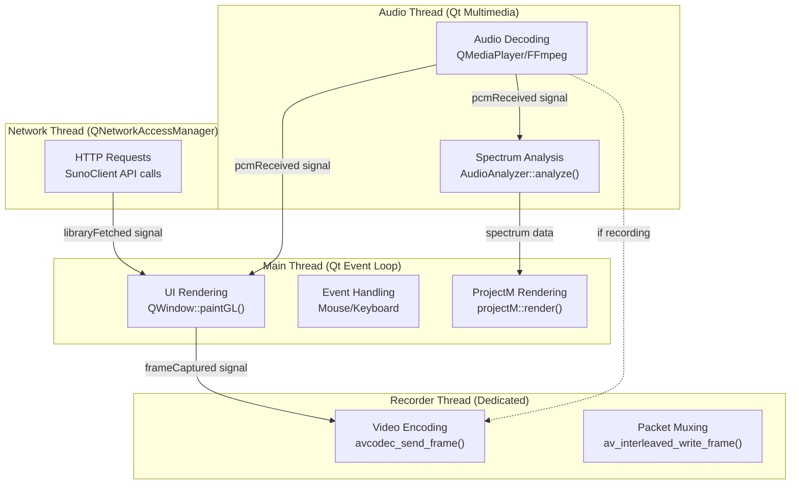
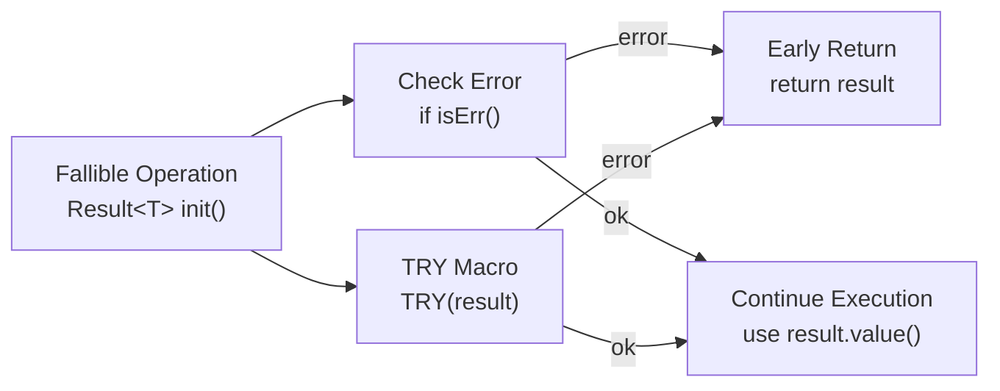
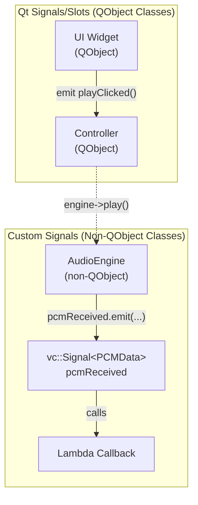
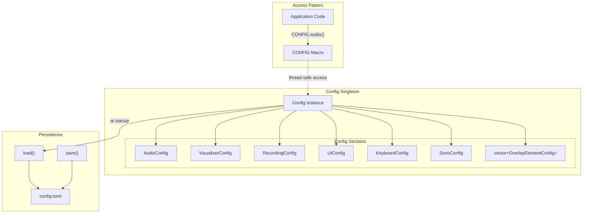

# Architecture & Design Patterns

<details>
<summary>Relevant source files</summary>

The following files were used as context for generating this wiki page:

- [AGENTS.md](AGENTS.md)
- [docs/ARCHITECTURE.md](docs/ARCHITECTURE.md)
- [src/ui/controllers/AudioController.cpp](src/ui/controllers/AudioController.cpp)
- [src/ui/controllers/RecordingController.cpp](src/ui/controllers/RecordingController.cpp)
- [src/ui/controllers/VisualizerController.cpp](src/ui/controllers/VisualizerController.cpp)

</details>


## Purpose and Scope

This document describes the fundamental architectural patterns and design principles used throughout the chadvis-projectm-qt codebase. It covers the **Singleton-Engine-Controller** pattern, ownership semantics, threading model, error handling approach using `Result<T>`, and communication patterns via signals. 

For information about specific subsystems (audio, visualization, recording, UI, etc.), see their respective sections: [Audio System](#3), [Visualization System](#4), [Recording System](#5), [User Interface](#7). For details on the build system and project structure, see [Build System & Dependencies](#2.2).

---

## Core Design Pattern: Singleton-Engine-Controller

The application follows a three-layer architecture that separates concerns between application lifecycle, business logic, and user interface.



**Sources:** [src/core/Application.hpp](), [src/ui/controllers/AudioController.cpp:12-22](), [src/ui/controllers/RecordingController.cpp:15-23](), [docs/ARCHITECTURE.md:9-31]()

### Layer 1: Singleton Core

The `Application` class serves as the single entry point and supreme owner of all core engines. It is accessible globally via the `APP` macro.

| Singleton | Purpose | Access Pattern |
|-----------|---------|----------------|
| `Application` | Owns engines, manages lifecycle | `APP` macro |
| `Config` | TOML-based settings, thread-safe | `CONFIG` macro |
| `Logger` | Diagnostic output via spdlog | `LOG_*` macros |

The singleton pattern is used here to ensure:
- **Single ownership** of expensive resources (audio devices, OpenGL contexts, FFmpeg encoders)
- **Global access** without explicit dependency injection
- **Guaranteed initialization order** during startup

**Sources:** [src/core/Application.hpp](), [docs/ARCHITECTURE.md:9-13](), [AGENTS.md:80]()

### Layer 2: Engines (Business Logic)

Engines handle heavy lifting and are owned exclusively by `Application` via `std::unique_ptr`. They expose their functionality through public methods and emit signals for state changes.



**Key engines:**
- **`AudioEngine`**: Manages `QMediaPlayer`, FFmpeg decoding, `AudioAnalyzer` for spectrum data, and `Playlist` for track management
- **`VideoRecorder`**: Asynchronous FFmpeg encoder running in dedicated thread
- **`OverlayEngine`**: Text rendering engine that composites metadata/lyrics over visualizations

**Sources:** [docs/ARCHITECTURE.md:15-19](), [AGENTS.md:81-82]()

### Layer 3: Controllers (Signal Routing)

Controllers mediate between UI widgets and engines. They hold **non-owning raw pointers** to engines (which are owned by `Application`) and configure UI widgets via two key methods:

```cpp
// Pattern implemented by all controllers
class SomeController : public QObject {
public:
    void setupUI(Widget* widget);      // Configure widget references
    void connectSignals();              // Establish signal/slot bindings
private:
    Engine* engine_;                    // Non-owning pointer
    Widget* widget_;                    // Non-owning pointer
};
```

**Example from AudioController:**

[src/ui/controllers/AudioController.cpp:16-22]() - The `setupUI()` method configures widget references:
```cpp
void AudioController::setupUI(PlayerControls* controls, PlaylistView* view) {
    controls_ = controls;
    view_ = view;
    controls_->setAudioEngine(engine_);
    view_->setPlaylist(&engine_->playlist());
}
```

[src/ui/controllers/AudioController.cpp:24-53]() - The `connectSignals()` method establishes all signal/slot bindings between widgets and the engine.

**Sources:** [src/ui/controllers/AudioController.cpp](), [src/ui/controllers/RecordingController.cpp](), [docs/ARCHITECTURE.md:26-31]()

---

## Ownership Model

The codebase enforces strict ownership semantics to prevent memory leaks and use-after-free bugs.

### Ownership Rules

| Pattern | Usage | Example |
|---------|-------|---------|
| `std::unique_ptr<T>` | Exclusive ownership of non-Qt objects | Engines owned by `Application` |
| Qt parent-child | QObjects owned by parent | Widgets owned by `MainWindow` |
| Raw pointers | Non-owning references | Controllers referencing engines |
| `std::shared_ptr<T>` | **Avoided** unless truly shared | Not used in core architecture |



### Lifetime Guarantees

The architecture provides clear lifetime guarantees:

1. **Engines outlive controllers**: `Application` owns engines and destroys them only during shutdown, after all UI components
2. **Widgets outlive signal connections**: Qt parent-child ownership ensures widgets exist as long as their parent window
3. **No circular ownership**: Controllers never own engines, preventing reference cycles

**Example from RecordingController:**

[src/ui/controllers/RecordingController.cpp:15-18]() shows the constructor accepting raw pointers:
```cpp
RecordingController::RecordingController(VideoRecorder* recorder,
                                         MainWindow* window)
    : QObject(nullptr), recorder_(recorder), window_(window) {
}
```

The raw pointers are safe because:
- `recorder_` is owned by `Application` (outlives the controller)
- `window_` is the parent of the controller (outlives the controller)

**Sources:** [docs/ARCHITECTURE.md:60](), [AGENTS.md:36](), [src/ui/controllers/RecordingController.cpp:15-18]()

---

## Threading Architecture

The application uses multiple threads to prevent blocking the UI during expensive operations.



### Thread Communication

| From Thread | To Thread | Mechanism | Example |
|-------------|-----------|-----------|---------|
| Audio → Main | Main | Qt signals (queued) | `AudioEngine::trackChanged` |
| Audio → Main | Main | Custom signals | `AudioEngine::pcmReceived` |
| Main → Recorder | Recorder | Direct submission | `VideoRecorder::submitVideoFrame()` |
| Network → Main | Main | Qt signals (queued) | `SunoClient::libraryFetched` |

**Thread-safety considerations:**

[src/ui/controllers/RecordingController.cpp:35-45]() shows `Qt::DirectConnection` used for frame capture to avoid copying frame data:
```cpp
connect(visualizer, &VisualizerWindow::frameCaptured, this,
    [this](std::vector<u8> data, u32 w, u32 h, i64 ts) {
        if (recorder_->isRecording()) {
            recorder_->submitVideoFrame(std::move(data), w, h, ts);
        }
    },
    Qt::DirectConnection);  // Direct call, no queuing
```

[src/ui/controllers/RecordingController.cpp:48-57]() uses custom signal with lambda callback:
```cpp
window_->audioEngine()->pcmReceived.connect(
    [this](const std::vector<f32>& pcm, u32 frames, u32 channels, u32 sampleRate) {
        if (recorder_->isRecording()) {
            recorder_->submitAudioSamples(pcm.data(), frames, channels, sampleRate);
        }
    });
```

**Sources:** [docs/ARCHITECTURE.md:33-39](), [src/ui/controllers/RecordingController.cpp:35-57](), [AGENTS.md:86]()

---

## Error Handling: Result<T> Pattern

The codebase uses **no exceptions**. All fallible operations return `vc::Result<T>`, a Rust-inspired sum type.

### Result<T> API

```cpp
// Definition (conceptual)
template<typename T>
class Result {
public:
    static Result<T> ok(T value);
    static Result<T> err(std::string message);
    
    bool isOk() const;
    bool isErr() const;
    T value() const;                    // Returns value or throws in debug
    const std::string& error() const;   // Returns error message
};
```

### Usage Patterns

**Pattern 1: Check and early return**
```cpp
Result<void> init() {
    if (failed) {
        return Result<void>::err("Detailed error message");
    }
    return Result<void>::ok();
}
```

**Pattern 2: TRY macro for chaining**
```cpp
auto result = doSomething();
TRY(result);  // Returns error if result.isErr()
// Continue if ok...
```

**Pattern 3: Value extraction**
```cpp
auto result = getConfig();
if (result.isOk()) {
    Config cfg = result.value();
    // Use cfg...
}
```

### Error Propagation



### Best Practices

From [AGENTS.md:100-103]():
- Use `[[nodiscard]]` for functions returning `Result`
- Provide descriptive error messages in `Result::err()`
- Use the `TRY()` macro for chaining fallible operations

**Sources:** [AGENTS.md:54-65](), [AGENTS.md:100-103](), [src/util/Result.hpp]()

---

## Communication Patterns

The application uses two complementary signaling mechanisms depending on whether the sender is a `QObject`.

### Pattern Comparison

| Pattern | Used For | Advantages | Example |
|---------|----------|------------|---------|
| Qt signals/slots | QObject communication | Thread-safe queuing, inspector support | `PlayerControls::playClicked` |
| `vc::Signal<T>` | Non-QObject classes | Lightweight, template-based | `AudioEngine::pcmReceived` |



### Qt Signals Example

[src/ui/controllers/AudioController.cpp:26-34]() shows Qt signal/slot connections:
```cpp
connect(controls_, &PlayerControls::playClicked, [this] {
    engine_->play();
});
connect(controls_, &PlayerControls::pauseClicked, [this] {
    engine_->pause();
});
```

### Custom Signal Example

[src/ui/controllers/AudioController.cpp:82-90]() shows `vc::Signal` usage:
```cpp
engine_->pcmReceived.connect([this](const std::vector<f32>& pcm,
                                    u32 frames,
                                    u32 channels,
                                    u32 sampleRate) {
    if (!pcm.empty() && frames > 0) {
        window_->visualizerPanel()->visualizer()->feedAudio(
            pcm.data(), frames, channels, sampleRate);
    }
});
```

### Automatic Track Change Handling

[src/ui/controllers/RecordingController.cpp:60-74]() demonstrates reactive signal handling:
```cpp
// Auto-stop recording on track change
window_->audioEngine()->trackChanged.connect([this] {
    if (recorder_->isRecording()) {
        LOG_INFO("Track changed, stopping recording.");
        window_->onStopRecording();
    }
    
    if (CONFIG.recording().autoRecord) {
        LOG_INFO("Auto-record enabled, starting recording for new track.");
        QTimer::singleShot(500, this, [this] {
            if (window_->audioEngine()->isPlaying()) {
                window_->onStartRecording("");
            }
        });
    }
});
```

**Sources:** [AGENTS.md:86](), [src/ui/controllers/AudioController.cpp:26-90](), [src/ui/controllers/RecordingController.cpp:60-74]()

---

## Configuration Architecture

The `Config` singleton provides centralized, thread-safe access to application settings with TOML persistence.



### Access Patterns

**Global macro access:**
```cpp
// Anywhere in the codebase
if (CONFIG.recording().autoRecord) {
    startRecording();
}
```

**Section accessors:**
- `CONFIG.audio()` → `AudioConfig`
- `CONFIG.visualizer()` → `VisualizerConfig`
- `CONFIG.recording()` → `RecordingConfig`
- `CONFIG.ui()` → `UIConfig`
- `CONFIG.keyboard()` → `KeyboardConfig`
- `CONFIG.suno()` → `SunoConfig`
- `CONFIG.overlays()` → `vector<OverlayElementConfig>`

### Thread Safety

The `Config` singleton implements internal locking to allow safe concurrent access from multiple threads (main, audio, recorder, network). Read operations acquire shared locks, write operations acquire exclusive locks.

### Dirty Tracking

The config system tracks whether settings have been modified and only writes to disk when necessary, optimizing I/O operations.

**Example usage from RecordingController:**

[src/ui/controllers/RecordingController.cpp:66]() accesses recording configuration:
```cpp
if (CONFIG.recording().autoRecord) {
    // ...
}
```

**Sources:** [AGENTS.md:80](), [docs/ARCHITECTURE.md:9-13](), [src/ui/controllers/RecordingController.cpp:66]()

---

## Summary

The architectural patterns in chadvis-projectm-qt prioritize:

| Principle | Implementation |
|-----------|----------------|
| **Clear ownership** | Singleton owns engines via `unique_ptr`, controllers use non-owning pointers |
| **Separation of concerns** | Three-layer architecture (core → engines → controllers → UI) |
| **Thread safety** | Dedicated threads for audio, recording, network; signals for communication |
| **Reliability** | No exceptions, `Result<T>` for error handling |
| **Testability** | Controllers mediate between UI and engines, enabling unit testing |
| **Performance** | Direct connections for hot paths (frame capture), zero-copy operations |

This architecture enables the application to handle real-time audio processing, OpenGL rendering, and FFmpeg encoding without blocking the UI or causing resource contention.

**Sources:** [docs/ARCHITECTURE.md](), [AGENTS.md:78-113](), [src/ui/controllers/AudioController.cpp](), [src/ui/controllers/RecordingController.cpp](), [src/ui/controllers/VisualizerController.cpp]()