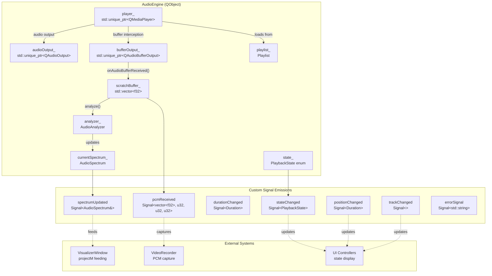
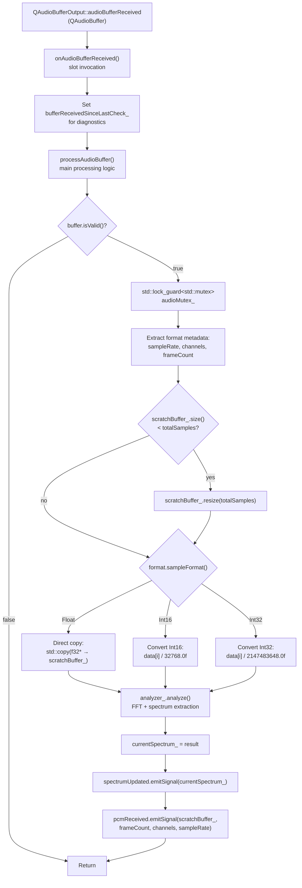

# AudioEngine

<details>
<summary>Relevant source files</summary>

The following files were used as context for generating this wiki page:

- [src/audio/AudioEngine.cpp](src/audio/AudioEngine.cpp)
- [src/audio/AudioEngine.hpp](src/audio/AudioEngine.hpp)

</details>


The `AudioEngine` class is the core audio playback and processing component that orchestrates audio decoding, playback, spectrum analysis, and data capture for visualization. It wraps Qt Multimedia's `QMediaPlayer` and `QAudioOutput` for playback, uses `QAudioBufferOutput` to intercept decoded audio buffers, and feeds them to an `AudioAnalyzer` for real-time spectrum analysis. The engine emits custom signals for state changes, position updates, and audio data that drive the visualization and recording pipelines.

For playlist management details, see [Playlist Management](#3.2). For visualization integration, see [ProjectM Integration](#4.2).

Sources: [src/audio/AudioEngine.hpp:1-127](), [src/audio/AudioEngine.cpp:1-279]()

---

## Architecture Overview

The `AudioEngine` integrates multiple Qt Multimedia components with custom audio analysis and playlist management. It owns a `QMediaPlayer` for decoding, a `QAudioOutput` for playback routing, and a `QAudioBufferOutput` for intercepting decoded buffers. Each incoming buffer is processed through `AudioAnalyzer` for FFT-based spectrum extraction, then emitted via custom `Signal<>` templates for consumption by the visualizer and recorder.



**Component Relationships:**

| Component | Type | Purpose |
|-----------|------|---------|
| `player_` | `QMediaPlayer` | Decodes audio files, manages playback state |
| `audioOutput_` | `QAudioOutput` | Routes decoded audio to OS audio device |
| `bufferOutput_` | `QAudioBufferOutput` | Intercepts decoded buffers for analysis |
| `playlist_` | `Playlist` | Manages track list, navigation, persistence |
| `analyzer_` | `AudioAnalyzer` | Performs FFT, generates spectrum data |
| `scratchBuffer_` | `std::vector<f32>` | Zero-allocation reusable buffer for conversions |
| `currentSpectrum_` | `AudioSpectrum` | Latest spectrum analysis result |

Sources: [src/audio/AudioEngine.hpp:26-124](), [src/audio/AudioEngine.cpp:12-81]()

---

## Initialization

The `init()` method initializes all Qt Multimedia components, establishes signal/slot connections, loads the last session playlist, and starts diagnostic timers. It returns a `Result<void>` type for error handling consistency.

**Initialization Sequence:**

1. **Create Audio Output**: Instantiates `QAudioOutput` with configured volume
2. **Create Media Player**: Instantiates `QMediaPlayer`, connects it to audio output
3. **Create Buffer Output**: Instantiates `QAudioBufferOutput` for buffer interception
4. **Connect Qt Signals**: Binds 8 Qt signals to corresponding slots
5. **Connect Playlist Signals**: Binds custom `Signal<>` emissions from `Playlist`
6. **Load Last Session**: Restores playlist from `~/.config/chadvis-projectm-qt/last_session.m3u`
7. **Start Diagnostic Timer**: 1-second interval to detect buffer starvation

```mermaid
sequenceDiagram
    participant Client
    participant AudioEngine
    participant QMediaPlayer
    participant QAudioOutput
    participant QAudioBufferOutput
    participant Playlist
    
    Client->>AudioEngine: init()
    AudioEngine->>QAudioOutput: new QAudioOutput()
    AudioEngine->>QAudioOutput: setVolume(volume_)
    AudioEngine->>QMediaPlayer: new QMediaPlayer()
    AudioEngine->>QMediaPlayer: setAudioOutput(audioOutput_)
    AudioEngine->>QAudioBufferOutput: new QAudioBufferOutput()
    AudioEngine->>QMediaPlayer: setAudioBufferOutput(bufferOutput_)
    AudioEngine->>QMediaPlayer: connect signals (8 connections)
    AudioEngine->>QAudioBufferOutput: connect(audioBufferReceived)
    AudioEngine->>Playlist: connect(currentChanged, changed)
    AudioEngine->>AudioEngine: loadLastPlaylist()
    AudioEngine->>AudioEngine: bufferCheckTimer_.start(1000)
    AudioEngine-->>Client: Result&lt;void&gt;::ok()
```

Sources: [src/audio/AudioEngine.cpp:19-81]()

---

## Playback Control

The engine exposes standard playback methods that wrap `QMediaPlayer` operations while managing playlist navigation and state synchronization.

**Public Playback API:**

| Method | Implementation | Notes |
|--------|---------------|-------|
| `play()` | Calls `player_->play()` | Auto-loads first track if none selected |
| `pause()` | Calls `player_->pause()` | Retains playback position |
| `stop()` | Calls `player_->stop()`, resets `analyzer_` | Clears audio buffers |
| `togglePlayPause()` | Conditional `play()`/`pause()` based on `state_` | Idempotent toggle |
| `seek(Duration)` | Calls `player_->setPosition(ms)` | Position in milliseconds |
| `setVolume(f32)` | Clamps to [0.0, 1.0], applies to `audioOutput_` | Volume normalization |

The `play()` method implements auto-loading logic to handle empty sources:

```
play() logic:
1. If no current playlist item but playlist not empty → jump to index 0
2. If player source is empty but playlist has current item → loadCurrentTrack()
3. If source still empty → log warning and return
4. Call player_->play()
```

Sources: [src/audio/AudioEngine.cpp:83-145](), [src/audio/AudioEngine.hpp:35-56]()

---

## Audio Buffer Processing Pipeline

The core audio processing occurs in `processAudioBuffer()`, which is triggered by Qt's `audioBufferReceived` signal. This method converts arbitrary `QAudioBuffer` formats to normalized float samples, feeds them to the analyzer, and emits results.



**Format Conversion Details:**

The engine supports three `QAudioFormat::SampleFormat` types with appropriate normalization:

- **Float**: Direct copy, already normalized to [-1.0, 1.0]
- **Int16**: Divide by 32768.0 to normalize signed 16-bit range
- **Int32**: Divide by 2147483648.0 to normalize signed 32-bit range

The `scratchBuffer_` is a reusable allocation that grows on-demand but never shrinks, minimizing allocator pressure during playback.

Sources: [src/audio/AudioEngine.cpp:232-274](), [src/audio/AudioEngine.cpp:191-197]()

---

## Signal Emission System

`AudioEngine` uses a custom `Signal<Args...>` template for type-safe, decoupled event emission. This pattern avoids Qt's `QObject` inheritance requirements for signals and allows C++-style functional binding.

**Available Signals:**

| Signal | Type Signature | Emitted When | Primary Consumers |
|--------|---------------|--------------|-------------------|
| `stateChanged` | `Signal<PlaybackState>` | `QMediaPlayer::playbackStateChanged` | UI controllers, visualizer |
| `positionChanged` | `Signal<Duration>` | `QMediaPlayer::positionChanged` | Player controls, seek bar |
| `durationChanged` | `Signal<Duration>` | `QMediaPlayer::durationChanged` | Player controls, total time display |
| `spectrumUpdated` | `Signal<const AudioSpectrum&>` | After `analyzer_.analyze()` | ProjectMBridge, visualizer |
| `pcmReceived` | `Signal<const vector<f32>&, u32, u32, u32>` | After buffer conversion | VideoRecorder (audio track) |
| `trackChanged` | `Signal<>` | Playlist navigation | Overlay metadata update |
| `errorSignal` | `Signal<std::string>` | `QMediaPlayer::errorOccurred` | UI error display |

**Qt Signal → Custom Signal Forwarding:**

The engine connects Qt's signals to private slots, which then emit custom signals:

```
QMediaPlayer::playbackStateChanged
  → onPlayerStateChanged(QMediaPlayer::PlaybackState)
    → state_ = convertToPlaybackState(state)
    → stateChanged.emitSignal(state_)
```

This forwarding pattern decouples Qt's type system from internal signal consumers and allows multiple subscribers without Qt object overhead.

Sources: [src/audio/AudioEngine.hpp:75-83](), [src/audio/AudioEngine.cpp:147-189]()

---

## Playlist Integration

The engine owns a `Playlist` instance and connects to its custom signals for automatic track loading and playlist persistence.

**Playlist Signal Bindings:**

```cpp
// src/audio/AudioEngine.cpp:60-62
playlist_.currentChanged.connect(
    [this](usize index) { onPlaylistCurrentChanged(index); });
playlist_.changed.connect([this] { saveLastPlaylist(); });
```

**Automatic Track Loading:**

When `playlist_.currentChanged` fires, the engine:

1. Calls `loadCurrentTrack()` to update `QMediaPlayer::setSource()`
2. Emits `trackChanged` signal for UI/overlay updates
3. Calls `play()` to start playback immediately

This creates a seamless navigation experience where users can use playlist controls and playback begins instantly.

**Persistent Playlist State:**

The engine saves the playlist to `~/.config/chadvis-projectm-qt/last_session.m3u` whenever the playlist changes. On initialization, it loads this file via `loadLastPlaylist()`, restoring the previous session's track list.

Sources: [src/audio/AudioEngine.cpp:199-230](), [src/audio/AudioEngine.hpp:57-63]()

---

## Thread Safety

Audio buffer processing occurs on Qt's audio I/O thread, while UI interactions and state queries happen on the main thread. The engine protects shared audio data with a `std::mutex`.

**Protected Data:**

- `currentSpectrum_`: Latest spectrum analysis result
- `scratchBuffer_`: Temporary PCM conversion buffer (accessed during processing)
- `analyzer_.pcmData()`: Cached PCM data in analyzer

**Locking Strategy:**

```cpp
// src/audio/AudioEngine.cpp:236
void AudioEngine::processAudioBuffer(const QAudioBuffer& buffer) {
    // ...
    std::lock_guard lock(audioMutex_);
    // All spectrum/PCM access happens within this scope
}

// src/audio/AudioEngine.hpp:66-73
AudioSpectrum currentSpectrum() const {
    std::lock_guard lock(audioMutex_);
    return currentSpectrum_; // Copy by value
}
```

The engine returns copies of spectrum/PCM data rather than references, ensuring callers never hold pointers to mutating data structures.

Sources: [src/audio/AudioEngine.hpp:123](), [src/audio/AudioEngine.cpp:236](), [src/audio/AudioEngine.hpp:66-73]()

---

## Diagnostic Systems

The engine implements a diagnostic timer to detect audio buffer starvation, a common issue when `QAudioBufferOutput` fails to produce buffers.

**Buffer Starvation Detection:**

```cpp
// src/audio/AudioEngine.cpp:68-77
connect(&bufferCheckTimer_, &QTimer::timeout, this, [this]() {
    if (state_ == PlaybackState::Playing &&
        !bufferReceivedSinceLastCheck_) {
        LOG_WARN("AudioEngine: No audio buffers received in last 1000ms - "
                 "QAudioBufferOutput may not be working");
    }
    bufferReceivedSinceLastCheck_ = false;
});
bufferCheckTimer_.start(1000);
```

Every second, the timer checks if `bufferReceivedSinceLastCheck_` was set. The flag is set in `onAudioBufferReceived()` and also reset when playback starts. If playback is active but no buffers arrived, it logs a warning.

**Additional Logging:**

The engine logs diagnostic information at key points:

- Initialization completion
- Play/pause/stop invocations
- Player state transitions with old/new state values
- Track loading with filename
- Buffer reception with validity and frame count

Sources: [src/audio/AudioEngine.cpp:68-77](), [src/audio/AudioEngine.cpp:191-197]()

---

## State Management

The engine maintains a simplified `PlaybackState` enum that maps from Qt's tri-state model:

```cpp
enum class PlaybackState { Stopped, Playing, Paused };
```

**State Transition Logic:**

```
QMediaPlayer::StoppedState  → PlaybackState::Stopped
QMediaPlayer::PlayingState  → PlaybackState::Playing
QMediaPlayer::PausedState   → PlaybackState::Paused
```

The `state_` member is updated in `onPlayerStateChanged()` and exposed via `state()` getter and `isPlaying()` convenience method. The `stateChanged` signal notifies subscribers of transitions.

**End-of-Media Handling:**

```cpp
// src/audio/AudioEngine.cpp:182-189
void AudioEngine::onMediaStatusChanged(QMediaPlayer::MediaStatus status) {
    if (status == QMediaPlayer::EndOfMedia && autoPlayNext_) {
        LOG_DEBUG("Track ended, playing next");
        if (!playlist_.next()) {
            stop();
        }
    }
}
```

When a track ends, the engine automatically advances to the next track if `autoPlayNext_` is enabled. If `playlist_.next()` returns false (end of playlist), it stops playback.

Sources: [src/audio/AudioEngine.hpp:24](), [src/audio/AudioEngine.cpp:147-189]()

---

## API Reference

**Core Methods:**

| Method | Signature | Description |
|--------|-----------|-------------|
| `init()` | `Result<void>` | Initialize Qt components, load last playlist |
| `play()` | `void` | Start playback, auto-load track if needed |
| `pause()` | `void` | Pause playback at current position |
| `stop()` | `void` | Stop playback, reset analyzer state |
| `togglePlayPause()` | `void` | Toggle between playing and paused states |
| `seek()` | `void seek(Duration)` | Seek to absolute position |
| `setVolume()` | `void setVolume(f32)` | Set volume in range [0.0, 1.0] |

**State Queries:**

| Method | Return Type | Description |
|--------|-------------|-------------|
| `state()` | `PlaybackState` | Current playback state |
| `position()` | `Duration` | Current playback position in milliseconds |
| `duration()` | `Duration` | Total track duration in milliseconds |
| `volume()` | `f32` | Current volume [0.0, 1.0] |
| `isPlaying()` | `bool` | Convenience check for `state_ == Playing` |

**Data Access:**

| Method | Return Type | Description |
|--------|-------------|-------------|
| `playlist()` | `Playlist&` | Mutable reference to playlist |
| `currentSpectrum()` | `AudioSpectrum` | Thread-safe copy of latest spectrum |
| `currentPCM()` | `std::vector<f32>` | Thread-safe copy of latest PCM data |

Sources: [src/audio/AudioEngine.hpp:26-83]()